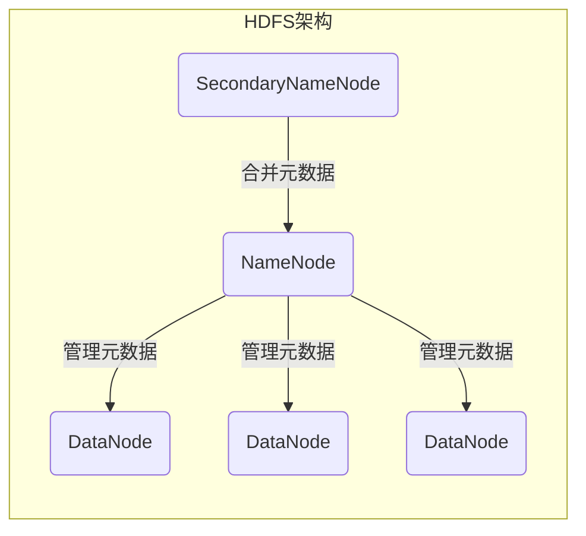
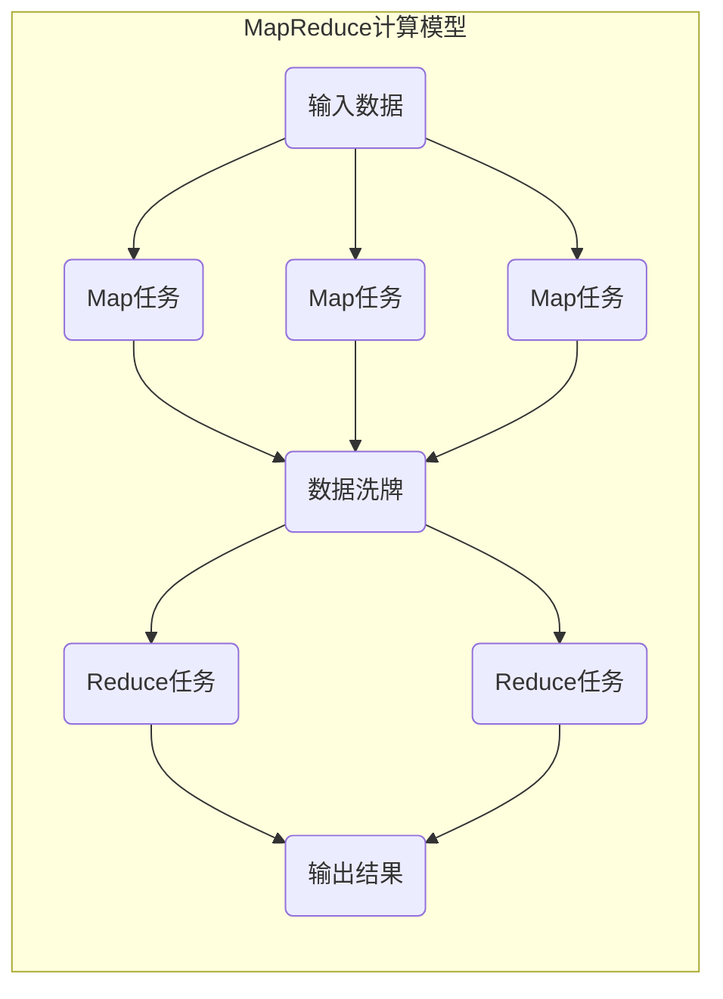
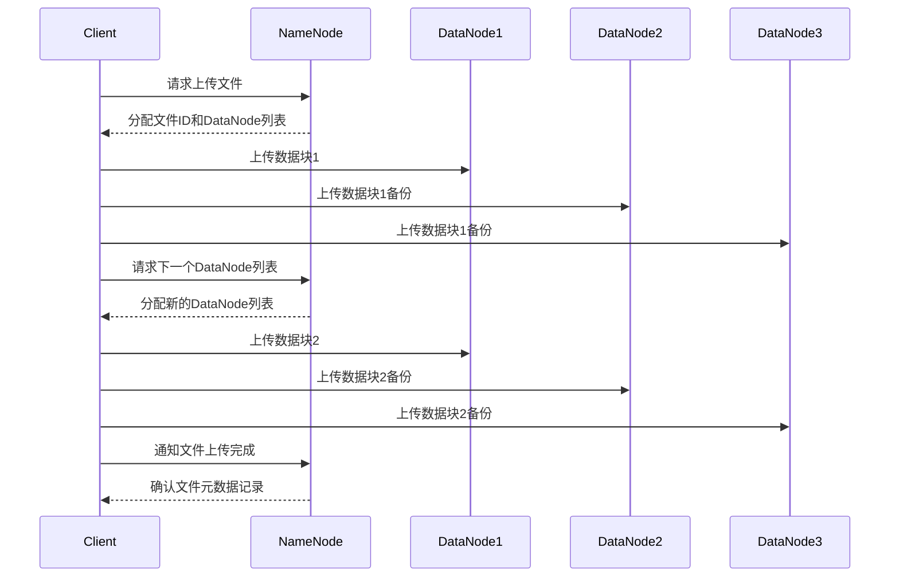
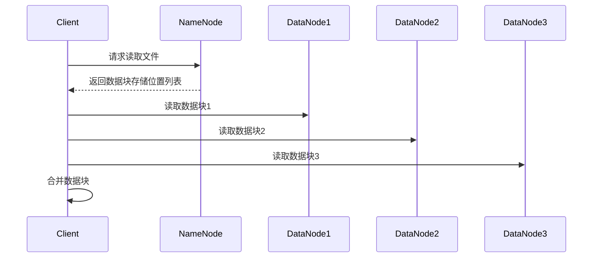
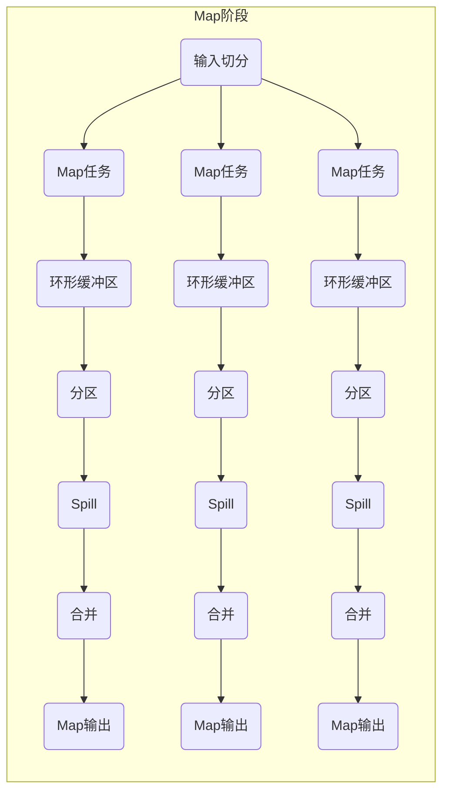
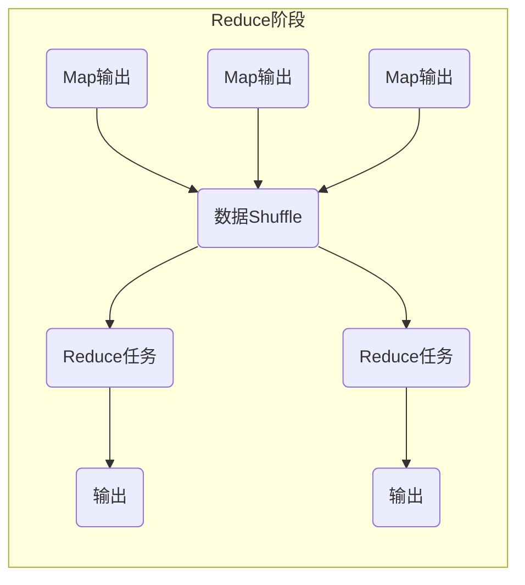

# 【AI大数据计算原理与代码实例讲解】Hadoop

## 1.背景介绍

### 1.1 大数据时代的到来
在当今时代,数据已经成为了一种新的资源和战略资产。随着互联网、物联网、移动互联网等新兴技术的快速发展,海量的结构化和非结构化数据不断涌现,这些大规模的数据集合被统称为"大数据"。大数据时代的到来,给传统的数据处理和存储带来了巨大的挑战。

### 1.2 大数据的特点
大数据具有以下几个主要特点:

- 数据量大(Volume):大数据集合往往有数TB、PB甚至EB级别的海量数据。
- 种类繁多(Variety):大数据不仅包括结构化数据,还包括半结构化和非结构化数据,如文本、图像、音视频等。
- 获取速度快(Velocity):大数据的产生、传输和处理速度非常快。
- 价值密度低(Value):大数据中有价值的数据比例较低,需要从繁杂的数据中提取有价值的信息。

### 1.3 大数据处理的挑战
面对大数据,传统的数据处理方式已经不再适用,主要存在以下挑战:

- 数据存储:海量数据需要廉价、可扩展的存储方案。
- 数据处理:需要分布式并行计算框架,高效处理海量数据。
- 数据分析:需要新的分析模型和算法,从大数据中挖掘有价值的信息。

## 2.核心概念与联系

### 2.1 Hadoop概述
Hadoop是一个开源的分布式系统基础架构,最初由Apache软件基金会所开发。它是解决大数据处理的核心平台和操作系统,能够可靠、高效地存储和处理海量数据。

Hadoop主要由以下两个核心组件构成:

1. **HDFS**(Hadoop Distributed File System):一个高度容错的分布式文件系统,用于存储大数据。
2. **MapReduce**:一种分布式数据处理模型和执行框架,用于并行处理大数据集。

### 2.2 HDFS架构
HDFS的架构主要包括以下几个组件:

- **NameNode**(名称节点):管理文件系统的命名空间和客户端对文件的访问操作。
- **DataNode**(数据节点):存储实际的数据块,并执行数据块的读写操作。
- **SecondaryNameNode**(辅助名称节点):定期合并命名空间镜像和编辑日志,防止文件系统元数据过多。

HDFS采用主从架构,NameNode作为主节点管理文件系统元数据,DataNode作为从节点存储实际数据。文件会按块(Block)的形式存储在多个DataNode上,以提供数据冗余备份和容错能力。

### 2.3 MapReduce计算模型
MapReduce是Hadoop的核心计算模型,它将大数据处理过程分为两个阶段:Map(映射)和Reduce(归约)。

1. **Map阶段**:输入数据被划分为多个数据块,并行处理由用户编写的Mapper函数,生成中间结果。
2. **Reduce阶段**:对Map阶段的输出进行汇总,由用户编写的Reducer函数对中间结果进行合并,得到最终结果。

MapReduce的设计思想是"把大问题分解成小问题,然后把小问题的结果合并起来"。它通过大规模的并行计算,能够高效地处理海量数据。

## 3.核心算法原理具体操作步骤

### 3.1 HDFS文件读写流程

#### 3.1.1 文件写入流程
1. 客户端向NameNode请求上传文件,NameNode检查目标文件是否已存在。
2. NameNode为文件在HDFS上分配一个新的文件ID,并确定存储该文件块的DataNode节点列表。
3. 客户端按块大小(默认128MB)将文件切分成一个或多个数据块,并按顺序上传到DataNode列表中。
4. 当一个数据块传输完成,客户端再向NameNode请求下一个数据块的存储DataNode列表,重复该过程直到全部数据块传输完毕。
5. 当所有数据块传输完成后,客户端通知NameNode文件传输已完成,NameNode则完成文件元数据的记录。

#### 3.1.2 文件读取流程
1. 客户端向NameNode请求读取文件,NameNode查询元数据,获取文件对应的数据块存储位置列表。
2. NameNode根据副本位置信息,选择一个最近的DataNode为客户端读取数据。
3. 客户端直接从指定的DataNode读取数据块,并在本地进行数据块合并。
4. 如果某个数据块读取失败,客户端会从其他DataNode重新读取该数据块的副本。

### 3.2 MapReduce执行流程

#### 3.2.1 Map阶段
1. **输入切分(Input Split)**: 输入数据集被划分为多个数据块,称为输入切分(Input Split)。
2. **Map任务调度**: MapReduce框架根据输入切分的数量,启动并行运行相应数量的Map任务进程。
3. **Map函数执行**: 每个Map任务进程将输入切分的数据传递给用户编写的Map函数进行处理,生成中间结果。
4. **环形缓冲区(Circular Buffer)**: Map函数的输出被暂存在内存的环形缓冲区中。
5. **分区(Partition)**: 根据分区函数(Partition Function),对Map输出的键值对进行分区,将属于同一个分区的数据存储在同一个节点上。
6. **Spill**: 当环形缓冲区达到一定阈值时,就会将数据写入本地磁盘,生成一个溢写(Spill)文件。
7. **合并(Merge)**: 在Map端对每个Spill文件进行按键排序和合并操作,生成最终的Map输出文件。

#### 3.2.2 Reduce阶段
1. **Shuffle阶段**: Map输出结果通过网络传输到Reduce任务所在的节点,并进行分区、排序和合并操作。
2. **Reduce任务调度**: MapReduce框架根据分区数量启动相应数量的Reduce任务进程。
3. **Reduce函数执行**: 每个Reduce任务进程将Shuffle后的数据传递给用户编写的Reduce函数进行处理,生成最终输出结果。
4. **输出写入**: Reduce函数的输出被写入HDFS或其他存储系统。

## 4.数学模型和公式详细讲解举例说明

在Hadoop中,一些核心算法和概念涉及到数学模型和公式,下面将详细讲解几个重要的公式。

### 4.1 HDFS数据块放置策略

HDFS采用数据块复制存储策略,以提供数据冗余和容错能力。数据块的放置遵循以下原则:

1. 将第一个副本放置在上传文件的DataNode所在节点。
2. 将第二个副本放置在不同的机架上的另一个DataNode。
3. 将第三个副本放置在与第二个副本不同的机架上的DataNode。

这种策略可以在单个机架发生故障时,仍能从其他机架读取数据。数据块副本数量可以根据配置进行调整,默认为3个副本。

假设有N个数据块,每个数据块有R个副本,集群有X个机架,每个机架有Y个DataNode,那么数据块副本在机架上的分布可以用下面的公式表示:

$$
\begin{cases}
\text{在同一机架上的副本数} \leq \lfloor \frac{R}{X} \rfloor \\
\text{在不同机架上的副本数} \geq R - \lfloor \frac{R}{X} \rfloor \times (X-1) \\
\text{每个机架上的副本数} \leq \lfloor \frac{R}{X} \rfloor + 1
\end{cases}
$$

例如,如果N=1000,R=3,X=5,Y=20,那么:

- 在同一机架上最多有1个副本: $\lfloor \frac{3}{5} \rfloor = 0$
- 至少有2个副本分布在不同机架上: $3 - 0 \times (5-1) = 2$
- 每个机架最多有1个副本: $\lfloor \frac{3}{5} \rfloor + 1 = 1$

### 4.2 MapReduce任务调度

MapReduce任务调度器需要合理分配Map和Reduce任务到集群中的节点上运行,以实现负载均