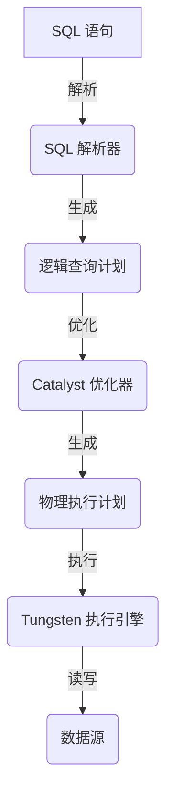
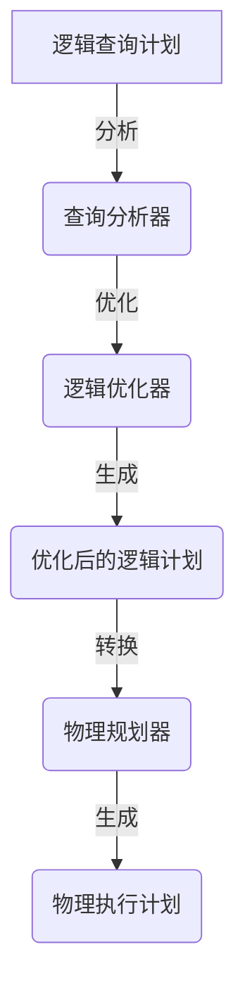
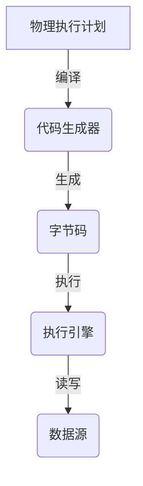

# 【AI大数据计算原理与代码实例讲解】Spark SQL

## 1. 背景介绍

### 1.1 大数据时代的到来

在当今时代,数据已经成为了一种新的战略资源。随着互联网、物联网、移动互联网等新兴技术的快速发展,数据的产生速度和规模都呈现出了爆炸式的增长。传统的数据处理方式已经无法满足现代大数据应用的需求。因此,大数据技术应运而生,旨在高效地存储、管理和分析海量的结构化、半结构化和非结构化数据。

### 1.2 Apache Spark 项目

Apache Spark 是一个开源的大数据处理框架,由加州伯克利分校的AMPLab(现为RISELab)研发。它于2014年成为Apache软件基金会的顶级项目,并迅速成为大数据处理领域的事实标准。Spark 提供了一种统一的计算模型,可以用于批处理、流处理、机器学习和图计算等多种应用场景。

### 1.3 Spark SQL 介绍

Spark SQL 是 Apache Spark 项目中的一个模块,它为结构化数据处理提供了一种高性能、可扩展的解决方案。Spark SQL 支持使用 SQL 语言或者 Spark 的 Dataset/DataFrame API 来查询数据,并且可以无缝地与 Spark 的其他模块(如 Spark Streaming、MLlib 等)进行集成。

## 2. 核心概念与联系

### 2.1 Spark 核心概念

#### 2.1.1 RDD (Resilient Distributed Dataset)

RDD 是 Spark 的核心抽象,它代表一个不可变、分区的记录集合。RDD 可以从外部数据源(如 HDFS、HBase、Kafka 等)创建,也可以通过对现有 RDD 进行转换操作而产生新的 RDD。RDD 支持两种类型的操作:转换操作(Transformation)和动作操作(Action)。

#### 2.1.2 Spark 执行模型

Spark 采用了延迟计算(Lazy Evaluation)的设计理念。当你对 RDD 进行转换操作时,Spark 只是记录下这些操作的指令,并不会立即执行。只有当你对 RDD 执行动作操作时,Spark 才会真正地执行这些转换操作,并计算出结果。

#### 2.1.3 Spark 部署模式

Spark 支持三种部署模式:本地模式(Local Mode)、集群模式(Cluster Mode)和客户端模式(Client Mode)。本地模式通常用于开发和测试,而集群模式和客户端模式则适用于生产环境。

### 2.2 Spark SQL 核心概念

#### 2.2.1 DataFrame

DataFrame 是 Spark SQL 中的核心概念,它是一种分布式的、不可变的数据集合。DataFrame 以行和列的形式组织数据,类似于关系型数据库中的表格。它提供了一种高效、统一的方式来处理结构化和半结构化数据。

#### 2.2.2 Dataset

Dataset 是 Spark 2.0 引入的新概念,它是 DataFrame 的扩展。与 DataFrame 不同的是,Dataset 是一个强类型的对象集合,可以提供更好的编译时类型安全性和更高的运行时效率。

#### 2.2.3 Catalyst 优化器

Catalyst 优化器是 Spark SQL 的查询优化器,它负责将逻辑查询计划转换为高效的物理执行计划。Catalyst 优化器使用了多种优化技术,如谓词下推、投影剪裁、连接重排序等,以提高查询性能。

#### 2.2.4 Tungsten 执行引擎

Tungsten 执行引擎是 Spark SQL 的执行引擎,它负责高效地执行物理执行计划。Tungsten 引擎采用了多种优化技术,如整体代码生成、内存管理优化、CPU 向量化等,以提高执行效率。

### 2.3 Spark SQL 与 Spark 核心概念的关系

Spark SQL 建立在 Spark 核心概念之上,它利用了 RDD 的分布式计算能力,并在此基础上提供了更高级的抽象和优化。DataFrame 和 Dataset 实际上都是基于 RDD 实现的,它们提供了更加结构化的数据视图和更丰富的操作接口。同时,Spark SQL 也可以与 Spark 的其他模块(如 Spark Streaming、MLlib 等)进行无缝集成,形成一个强大的大数据处理平台。

## 3. 核心算法原理具体操作步骤

### 3.1 Spark SQL 架构概览

Spark SQL 的架构主要包括以下几个核心组件:

1. **SQL 解析器(Parser)**: 将 SQL 语句解析为抽象语法树(AST)。
2. **Catalyst 优化器**: 将逻辑查询计划转换为高效的物理执行计划。
3. **Tungsten 执行引擎**: 高效地执行物理执行计划。
4. **数据源(Data Source)**: 支持读写各种格式的数据,如 Parquet、ORC、JSON 等。

下面是 Spark SQL 的工作流程:

### 3.2 Catalyst 优化器

Catalyst 优化器是 Spark SQL 的核心组件之一,它负责将逻辑查询计划转换为高效的物理执行计划。Catalyst 优化器采用了多种优化技术,包括:

1. **谓词下推(Predicate Pushdown)**: 将过滤条件尽可能地下推到数据源,以减少需要处理的数据量。
2. **投影剪裁(Projection Pruning)**: 只读取查询所需的列,避免不必要的数据读取。
3. **连接重排序(Join Reorder)**: 根据成本模型重新排序连接顺序,以提高查询效率。
4. **常量折叠(Constant Folding)**: 将常量表达式预先计算,以减少运行时的计算开销。
5. **代码生成(Code Generation)**: 将部分计算逻辑编译为字节码,以提高执行效率。

Catalyst 优化器的工作流程如下:

### 3.3 Tungsten 执行引擎

Tungsten 执行引擎是 Spark SQL 的另一个核心组件,它负责高效地执行物理执行计划。Tungsten 引擎采用了多种优化技术,包括:

1. **整体代码生成(Whole-Stage Code Generation)**: 将整个查询阶段编译为高效的字节码,以提高执行效率。
2. **内存管理优化(Memory Management Optimization)**: 优化内存管理策略,减少内存开销和垃圾回收开销。
3. **CPU 向量化(CPU Vectorization)**: 利用现代 CPU 的 SIMD 指令集,对数据进行向量化计算。
4. **缓存优化(Cache Optimization)**: 通过缓存中间结果,减少重复计算。

Tungsten 执行引擎的工作流程如下:

## 4. 数学模型和公式详细讲解举例说明

在 Spark SQL 中,有一些常见的数学模型和公式,用于支持各种数据分析和机器学习任务。下面我们将详细介绍其中的几个重要模型和公式。

### 4.1 线性回归模型

线性回归是一种常见的监督学习算法,用于建立自变量和因变量之间的线性关系。线性回归模型的数学表达式如下:

$$y = \beta_0 + \beta_1 x_1 + \beta_2 x_2 + \cdots + \beta_n x_n + \epsilon$$

其中:

- $y$ 是因变量
- $x_1, x_2, \cdots, x_n$ 是自变量
- $\beta_0, \beta_1, \cdots, \beta_n$ 是回归系数
- $\epsilon$ 是随机误差项

线性回归的目标是找到最佳的回归系数 $\beta$,使得预测值 $\hat{y}$ 与实际值 $y$ 之间的差异最小化。通常采用最小二乘法来估计回归系数。

在 Spark MLlib 中,可以使用 `LinearRegression` 算法来训练线性回归模型。

### 4.2 逻辑回归模型

逻辑回归是一种常见的分类算法,用于预测二元变量的概率。逻辑回归模型的数学表达式如下:

$$\log \left( \frac{p}{1-p} \right) = \beta_0 + \beta_1 x_1 + \beta_2 x_2 + \cdots + \beta_n x_n$$

其中:

- $p$ 是事件发生的概率
- $x_1, x_2, \cdots, x_n$ 是自变量
- $\beta_0, \beta_1, \cdots, \beta_n$ 是回归系数

通过对上式进行变形,可以得到事件发生的概率:

$$p = \frac{1}{1 + e^{-(\beta_0 + \beta_1 x_1 + \beta_2 x_2 + \cdots + \beta_n x_n)}}$$

逻辑回归的目标是找到最佳的回归系数 $\beta$,使得预测概率与实际概率之间的差异最小化。通常采用最大似然估计法来估计回归系数。

在 Spark MLlib 中,可以使用 `LogisticRegression` 算法来训练逻辑回归模型。

### 4.3 决策树模型

决策树是一种常见的分类和回归算法,它通过构建一个树状结构来表示数据的决策过程。决策树模型的构建过程可以概括为以下步骤:

1. 选择最优特征,根据该特征的不同取值将数据集划分为多个子集。
2. 对每个子集重复步骤 1,构建子树。
3. 直到满足终止条件,生成叶节点。

决策树的构建算法通常采用信息增益或基尼系数作为特征选择的标准。信息增益的计算公式如下:

$$\text{Gain}(D, a) = \text{Entropy}(D) - \sum_{v \in \text{Values}(a)} \frac{|D^v|}{|D|} \text{Entropy}(D^v)$$

其中:

- $D$ 是当前数据集
- $a$ 是特征
- $\text{Values}(a)$ 是特征 $a$ 的所有可能取值
- $D^v$ 是根据特征 $a$ 取值 $v$ 划分的子集
- $\text{Entropy}(S)$ 是数据集 $S$ 的信息熵,计算公式为 $\text{Entropy}(S) = -\sum_{i=1}^c p_i \log_2 p_i$,其中 $c$ 是类别数,$ p_i$ 是第 $i$ 类的概率

在 Spark MLlib 中,可以使用 `DecisionTreeClassifier` 和 `DecisionTreeRegressor` 算法来训练决策树模型。

### 4.4 聚类模型

聚类是一种常见的无监督学习算法,它的目标是将数据集划分为多个簇,使得同一簇内的数据相似度高,不同簇之间的数据相似度低。常见的聚类算法包括 K-Means、层次聚类、DBSCAN 等。

以 K-Means 算法为例,它的目标是找到 $K$ 个簇中心,使得所有数据点到最近簇中心的距离之和最小化。K-Means 算法的迭代过程如下:

1. 随机选择 $K$ 个初始簇中心。
2. 对每个数据点,计算它到各个簇中心的距离,将它分配到最近的簇。
3. 对每个簇,重新计算簇中心,即簇内所有数据点的均值。
4. 重复步骤 2 和 3,直到簇中心不再发生变化。

K-Means 算法的目标函数如下:

$$J = \sum_{i=1}^K \sum_{x \in C_i} \left\Vert x - \mu_i \right\Vert