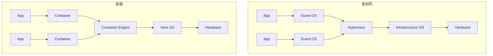
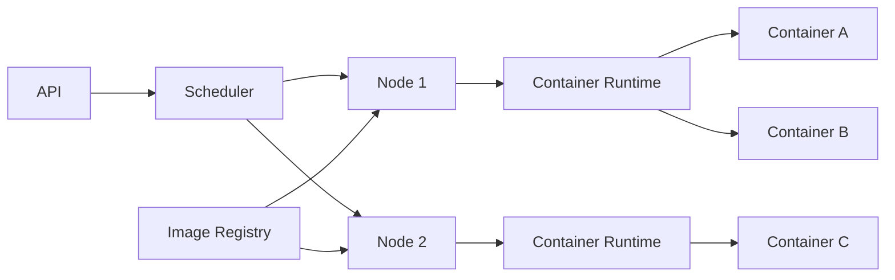
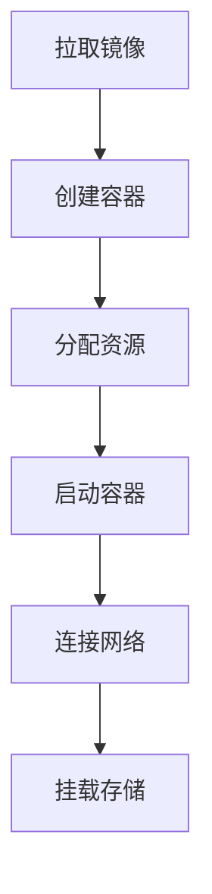
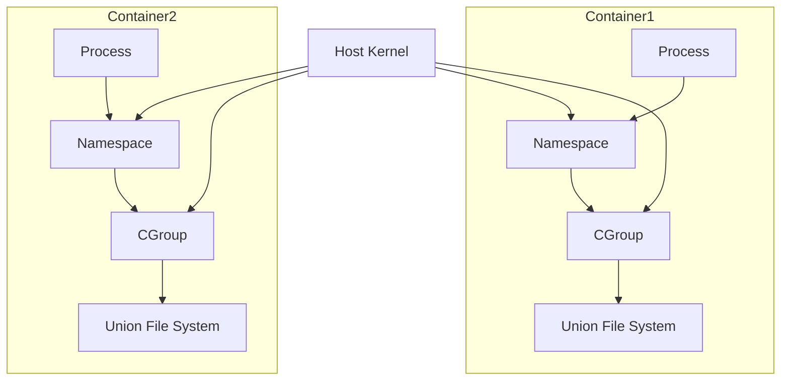

# 【AI大数据计算原理与代码实例讲解】容器

## 1. 背景介绍

### 1.1 容器技术的兴起

在当今快速发展的软件开发和部署领域,容器技术已经成为了一个不可或缺的重要角色。容器化为应用程序提供了一个独立、可移植的运行环境,使得应用能够在不同的系统平台上无缝迁移和部署。随着微服务架构和DevOps实践的普及,容器技术更是大放异彩,成为了实现应用快速交付和弹性伸缩的关键支撑。

### 1.2 容器在AI大数据领域的应用价值

在人工智能和大数据领域,容器技术同样扮演着至关重要的角色。AI和大数据应用通常对计算资源和环境有着特殊的要求,例如GPU加速、特定版本的库和框架等。容器能够将这些复杂的依赖打包到一个独立的运行环境中,使得AI和大数据应用能够快速部署和迁移,避免了环境不一致导致的问题。此外,容器还能够实现资源隔离和动态调度,提高了资源利用效率和系统稳定性。

### 1.3 本文的主要内容和目标

本文将深入探讨容器技术在AI大数据计算领域的原理和应用。我们将从容器的核心概念出发,分析其与虚拟化、进程隔离等技术的联系和区别。接着,我们将详细讲解容器的核心算法原理和关键实现步骤,并结合数学模型和代码实例进行说明。此外,本文还将介绍容器在实际AI大数据项目中的应用场景和最佳实践,并推荐一些常用的容器工具和资源。最后,我们将展望容器技术在AI大数据领域的未来发展趋势和面临的挑战。

## 2. 核心概念与联系

### 2.1 容器的定义和特点

容器是一种轻量级的虚拟化技术,它通过对进程进行隔离和资源限制,提供了一个独立的运行环境。与传统的虚拟机不同,容器不需要模拟完整的操作系统,而是与宿主机共享内核,因此启动速度更快,资源占用更少。每个容器都有自己的文件系统、网络配置、进程空间等,互相之间相互隔离,但又能够通过定义的接口进行通信。

### 2.2 容器与虚拟化技术的区别

容器与传统的虚拟化技术(如虚拟机)有着本质的区别。虚拟机通过模拟完整的硬件环境和操作系统,实现了更强的隔离性,但也带来了更大的资源开销。而容器则是在操作系统层面实现隔离,不需要模拟硬件,因此更加轻量级。下图展示了容器与虚拟机的架构区别:



### 2.3 容器与进程隔离技术的关系

容器的实现离不开操作系统内核提供的进程隔离技术。Linux内核提供了多种机制,如Namespace、Cgroups等,用于实现进程的资源隔离和限制。容器引擎通过调用这些内核机制,实现了容器的创建、管理和销毁。因此,容器可以看作是进程隔离技术的一种应用和封装。

## 3. 核心算法原理具体操作步骤

### 3.1 容器引擎的架构设计

容器引擎是容器技术的核心,负责管理容器的生命周期和资源调度。一个典型的容器引擎通常包括以下几个关键组件:

1. 容器运行时(Container Runtime):负责创建和运行容器,与内核交互,实现容器的启动、停止、删除等操作。
2. 镜像管理(Image Management):负责管理容器镜像,包括镜像的构建、存储、分发等。
3. 网络管理(Network Management):负责配置容器的网络,实现容器间的通信和与外部网络的连接。
4. 存储管理(Storage Management):负责管理容器的持久化存储,包括数据卷的创建、挂载等。
5. 调度管理(Scheduling Management):负责根据容器的资源需求和约束条件,将容器动态调度到合适的节点上运行。

下图展示了一个简化的容器引擎架构:



### 3.2 容器创建与启动流程

创建并启动一个容器通常需要以下几个步骤:

1. 拉取镜像:从镜像仓库中拉取需要运行的容器镜像到本地。
2. 创建容器:根据镜像和指定的参数(如网络、存储、环境变量等)创建一个新的容器。
3. 分配资源:为容器分配必要的系统资源,如CPU、内存、网络等。
4. 启动容器:启动容器内的应用进程,使其进入运行状态。
5. 连接网络:将容器连接到指定的网络,实现与其他容器或外部网络的通信。
6. 挂载存储:将宿主机的文件系统或数据卷挂载到容器内,实现数据持久化。

下图展示了一个简化的容器创建与启动流程:



### 3.3 容器资源隔离与限制

容器的一个重要特性是资源隔离与限制,即每个容器都有自己独立的资源空间,且可以对其进行限制和控制。这主要通过以下几个Linux内核机制实现:

1. Namespace:通过Namespace技术,可以为每个容器创建独立的进程、网络、文件系统等资源视图,实现容器间的隔离。
2. Cgroups:通过Cgroups技术,可以对容器的CPU、内存、磁盘I/O等资源进行限制和控制,防止单个容器占用过多资源。
3. Union File System:通过Union File System技术,可以为容器提供一个独立的文件系统视图,同时实现镜像的分层和复用。

下图展示了容器资源隔离与限制的原理:



## 4. 数学模型和公式详细讲解举例说明

### 4.1 资源调度的数学模型

容器引擎中的资源调度问题可以抽象为一个多维度装箱问题(Multi-dimensional Bin Packing Problem)。假设有 $n$ 个容器 $C_1, C_2, ..., C_n$,每个容器 $C_i$ 有 $m$ 种资源需求 $r_{i1}, r_{i2}, ..., r_{im}$(如CPU、内存等)。同时,有 $k$ 个节点 $N_1, N_2, ..., N_k$,每个节点 $N_j$ 有 $m$ 种资源容量 $c_{j1}, c_{j2}, ..., c_{jm}$。目标是找到一个容器到节点的映射 $f: C \rightarrow N$,使得:

1. 每个容器都被分配到一个节点上,即 $\forall i \in [1, n], \exists j \in [1, k], f(C_i) = N_j$。
2. 每个节点上的容器资源需求之和不超过节点的资源容量,即 $\forall j \in [1, k], \forall l \in [1, m], \sum_{i: f(C_i) = N_j} r_{il} \leq c_{jl}$。
3. 某个目标函数(如节点数量、负载均衡度等)达到最优。

常见的资源调度算法有贪心算法、启发式算法(如最佳适应算法)、整数规划等。例如,最佳适应算法的基本思想是:对于每个待调度的容器,选择当前资源利用率最高且能满足其资源需求的节点进行分配。

### 4.2 容器网络的数学模型

容器网络可以抽象为一个有向图 $G = (V, E)$,其中 $V$ 表示容器节点的集合,$E$ 表示容器间的连接关系。每个容器节点 $v_i \in V$ 有一个唯一的IP地址 $ip_i$,每条边 $e_{ij} \in E$ 表示容器 $v_i$ 和 $v_j$ 之间的网络连接。

容器网络的一个重要问题是IP地址的分配和管理。常见的IP分配策略有:

1. 固定IP:为每个容器预先分配一个固定的IP地址,缺点是IP地址空间利用率低,灵活性差。
2. 动态IP:根据容器的创建和销毁动态分配和回收IP地址,提高了IP地址的利用率,但需要维护IP地址与容器的映射关系。
3. 网络地址转换(NAT):通过端口映射的方式,将多个容器的网络流量映射到同一个宿主机IP,减少了IP地址的消耗,但增加了网络性能开销。

例如,在动态IP分配策略中,可以使用如下公式计算容器的IP地址:

$ip_i = base\_ip + offset_i$

其中,$base\_ip$ 表示容器网络的起始IP地址,$offset_i$ 表示容器 $i$ 的IP地址偏移量,可以根据容器的创建顺序或哈希值等方式计算得到。

## 5. 项目实践:代码实例和详细解释说明

下面以Python为例,演示如何使用Docker SDK创建和管理容器。

### 5.1 安装Docker SDK

首先,需要安装Docker SDK for Python:

```bash
pip install docker
```

### 5.2 连接Docker守护进程

```python
import docker

client = docker.from_env()
```

`from_env()`方法会自动从环境变量中读取Docker守护进程的连接信息。

### 5.3 拉取镜像

```python
image = client.images.pull("ubuntu:latest")
```

`pull()`方法会从Docker Hub拉取指定的镜像。

### 5.4 创建容器

```python
container = client.containers.create(
    image=image.id,
    command="/bin/bash",
    tty=True,
    name="mycontainer"
)
```

`create()`方法根据指定的镜像创建一个新的容器,可以指定容器的启动命令、是否分配伪终端、容器名称等参数。

### 5.5 启动容器

```python
container.start()
```

`start()`方法启动一个已经创建的容器。

### 5.6 执行容器命令

```python
exit_code, output = container.exec_run(cmd="ls -l", tty=True)
print(output.decode())
```

`exec_run()`方法在容器内执行指定的命令,返回命令的退出码和输出结果。

### 5.7 停止容器

```python
container.stop()
```

`stop()`方法停止一个运行中的容器。

### 5.8 删除容器

```python
container.remove()
```

`remove()`方法删除一个已经停止的容器。

## 6. 实际应用场景

### 6.1 机器学习模型训练

在机器学习领域,数据科学家们通常需要使用不同的框架、库和工具进行模型训练和评