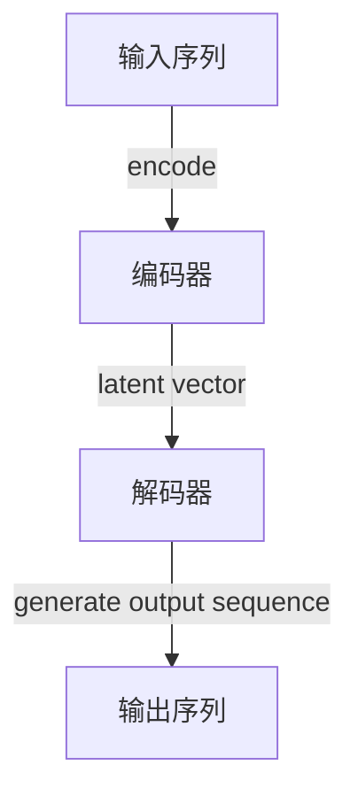
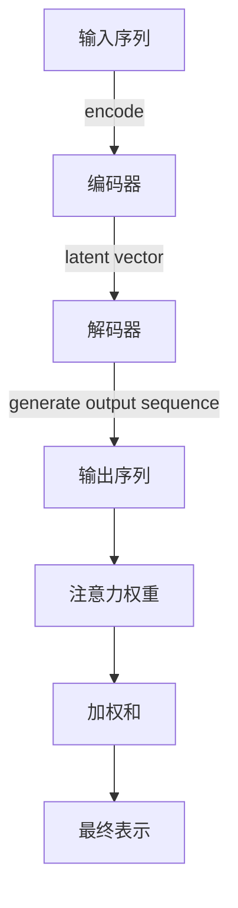

## 1.背景介绍

随着人工智能技术的不断发展，自然语言处理（NLP）已成为一个热门研究领域。在这个背景下，LangChain作为一个开源的、功能强大的工具链，为开发者和研究人员提供了构建复杂NLP应用程序所需的各种组件和工具。本文将重点介绍LangChain中的一个关键组件——ConversationSummaryMemory，并探讨其在对话式AI系统中的作用和实现方式。

## 2.核心概念与联系

在讨论ConversationSummaryMemory之前，我们需要了解几个相关概念：

- **对话状态跟踪（Dialogue State Tracking）**：这是对话管理系统中的一项任务，用于记录和管理会话中发生的一切。
- **上下文（Context）**：在对话中，上下文指的是到目前为止所交换的所有信息和意图。
- **记忆（Memory）**：在对话管理系统中，记忆是指存储和检索对话相关信息的能力。

ConversationSummaryMemory是一种特殊的记忆机制，它专注于生成对话的摘要，以便于系统能够更好地理解用户的意图和提供更准确的回应。这种记忆机制与传统的基于键值存储的记忆不同，因为它提供了对对话历史的语义表示。

## 3.核心算法原理具体操作步骤

ConversationSummaryMemory的核心算法涉及以下几个步骤：

1. **输入处理（Input Processing）**：接收对话输入，这可以是文本、语音或其他形式的信息。
2. **对话历史构建（Dialogue History Construction）**：从当前输入和其他相关数据中提取关键信息，构建对话历史。
3. **摘要生成（Summarization）**：使用NLP技术对对话历史进行摘要，以产生一个简明扼要的描述。
4. **记忆更新（Memory Update）**：将生成的摘要存储在记忆中，以便于未来的对话管理。
5. **输出生成（Output Generation）**：根据记忆中的摘要和当前输入生成回应。

## 4.数学模型和公式详细讲解举例说明

在实现ConversationSummaryMemory的过程中，可能会涉及到一些数学模型，例如：

- **序列到序列（Seq2Seq）模型**：这是一种常用于文本生成和摘要任务的神经网络架构。它包括编码器和解码器两个部分，其中编码器将输入序列编码成一个固定大小的向量，解码器则从这个向量中解码出输出序列。

以一个简化的Seq2Seq模型为例，其工作流程可以表示为：



- **注意力机制（Attention Mechanism）**：这是一种让模型在生成每个输出元素时都能访问所有输入元素的技术。这有助于提高摘要的准确性和流畅性。

一个简化的注意力机制示意图如下：



## 5.项目实践：代码实例和详细解释说明

以下是一个简化的ConversationSummaryMemory实现示例，使用Python语言和LangChain库：

```python
from langchain import ConversationSummaryMemory, MemoryBuffer

# 初始化记忆
memory = ConversationSummaryMemory()
buffer = MemoryBuffer()

# 对话历史构建
input_message = \"用户：你好！\"
output_summary = memory.add_and_summarize([input_message], buffer)
print(f\"生成的摘要：{output_summary}\")

# 更新记忆
input_message = \"用户：我想要一个天气预报。\"
output_summary = memory.add_and_summarize([input_message], buffer)
print(f\"生成的摘要：{output_summary}\")
```

在这个示例中，我们首先初始化了一个ConversationSummaryMemory对象和一个MemoryBuffer对象。然后，我们将输入消息添加到对话历史中，并生成一个简明的摘要。最后，我们将这个摘要添加到记忆中，以便于未来的对话管理。

## 6.实际应用场景

ConversationSummaryMemory在实际应用中的主要场景包括但不限于：

- **聊天机器人**：在构建聊天机器人时，ConversationSummaryMemory可以帮助机器人更好地理解用户的意图，提供更准确的回应。
- **虚拟助手**：在虚拟助手系统中，ConversationSummaryMemory可以用来跟踪用户的需求和偏好，以提供个性化的服务。
- **客户支持系统**：在客户支持系统中，ConversationSummaryMemory可以帮助客服人员更快地了解客户的问题，并提供合适的解决方案。

## 7.工具和资源推荐

以下是一些有用的资源和工具：

- **LangChain官方文档**：[https://python.langchain.com/](https://python.langchain.com/)
- **NLP研究论文和预印本**：arXiv（[https://arxiv.org/corr/）](https://arxiv.org/corr/%EF%BC%89)
- **对话管理系统的GitHub仓库**：[https://github.com/search?q=dialogue\\_system&type=repositories](https://github.com/search?q=dialogue_system&type=repositories)

## 8.总结：未来发展趋势与挑战

随着NLP技术的不断发展，ConversationSummaryMemory作为一种关键的对话管理组件，将在未来的AI系统中发挥越来越重要的作用。然而，这一领域也面临着一些挑战，例如如何提高摘要的质量、如何处理多语言对话以及如何确保系统的可扩展性等。为了克服这些挑战，研究人员和开发者需要不断创新和优化现有的技术和方法。

## 9.附录：常见问题与解答

### 常见问题1：什么是ConversationSummaryMemory？
**答**：ConversationSummaryMemory是一种用于生成对话摘要的NLP组件，它可以帮助AI系统更好地理解用户的意图和提供更准确的回应。

### 常见问题2：如何实现ConversationSummaryMemory？
**答**：可以通过以下步骤实现ConversationSummaryMemory：输入处理、对话历史构建、摘要生成、记忆更新和输出生成。在这个过程中，可能会涉及到一些数学模型，例如Seq2Seq模型和注意力机制。

### 常见问题3：ConversationSummaryMemory有哪些实际应用场景？
**答**：ConversationSummaryMemory的实际应用场景包括聊天机器人、虚拟助手和客户支持系统等。

### 作者：禅与计算机程序设计艺术 / Zen and the Art of Computer Programming
