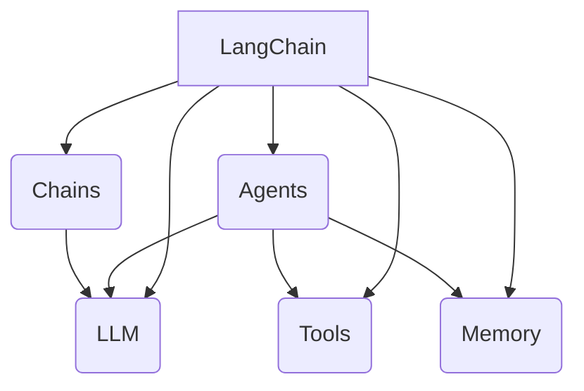

# 【LangChain编程：从入门到实践】LangChain核心概念和模块

## 1.背景介绍

### 1.1 人工智能的崛起

在过去几十年里，人工智能(AI)技术取得了长足的进步,并逐渐渗透到我们生活的方方面面。从语音助手到自动驾驶汽车,从医疗诊断到金融风险管理,AI的应用范围越来越广泛。然而,构建一个成功的AI系统并非易事,它需要集成多种技术,如自然语言处理(NLP)、计算机视觉、机器学习等。

### 1.2 LangChain的诞生

为了简化AI系统的开发过程,LangChain应运而生。作为一个开源的Python库,LangChain旨在帮助开发者快速构建基于大型语言模型(LLM)的应用程序。它提供了一系列模块和工具,使开发者能够轻松地集成LLM,并将其与其他AI技术(如检索、知识库等)相结合,从而创建强大的智能系统。

### 1.3 LangChain的优势

LangChain的主要优势在于其模块化设计和可扩展性。它将AI系统的不同组件(如LLM、检索器、数据加载器等)抽象为可组合的模块,使开发者能够灵活地组合和定制这些模块,以满足特定的应用需求。此外,LangChain还提供了一系列实用工具,如代理、内存等,进一步增强了系统的功能和性能。

## 2.核心概念与联系

### 2.1 LLM(大型语言模型)

LangChain的核心是LLM(Large Language Model),它是一种基于深度学习的自然语言处理模型,能够理解和生成人类语言。常见的LLM包括GPT-3、BERT、XLNet等。LangChain支持多种LLM供开发者选择,如OpenAI的GPT-3、Anthropic的Claude等。

### 2.2 Agents(智能代理)

Agents是LangChain中的一个重要概念,它将LLM与其他组件(如工具、内存等)结合起来,形成一个智能代理,能够执行复杂的任务。Agents可以根据任务的需求,选择适当的工具和策略,并将结果返回给用户。

### 2.3 Tools(工具)

Tools是LangChain中的另一个核心概念,它代表了各种可用于完成特定任务的功能模块。例如,Wikipedia API可用于查询维基百科,Python REPL可用于执行Python代码,等等。Agents可以灵活地调用和组合这些工具,以完成复杂的任务。

### 2.4 Chains(链)

Chains是LangChain中的一种控制流程,它将多个LLM调用串联起来,形成一个处理流程。通过链式调用,开发者可以将复杂的任务分解为多个子任务,并按顺序执行,从而提高系统的可维护性和可扩展性。

### 2.5 Memory(内存)

Memory是LangChain中的另一个重要概念,它用于存储和管理代理在执行任务过程中产生的中间状态和结果。通过内存,代理可以记住之前的交互和计算结果,从而更好地理解和处理后续的任务。

### 2.6 Mermaid流程图



上图展示了LangChain中各个核心概念之间的关系。LangChain作为一个框架,集成了LLM、Agents、Tools、Chains和Memory等模块。Agents将LLM与其他组件结合,形成智能代理;Tools提供各种功能模块;Chains控制LLM的调用流程;Memory管理代理的状态和结果。这些概念相互协作,共同构建了强大的AI系统。

## 3.核心算法原理具体操作步骤

### 3.1 LLM的工作原理

LLM(大型语言模型)是LangChain的核心,它基于自注意力机制和transformer架构,能够捕捉输入序列中的长程依赖关系,从而更好地理解和生成自然语言。

LLM的训练过程通常包括以下步骤:

1. **数据预处理**: 从大量的文本数据(如网页、书籍、论文等)中提取出有用的语料,并进行清洗和标准化处理。

2. **词嵌入**: 将每个单词映射为一个向量表示,这些向量捕捉了单词在语义空间中的位置和关系。

3. **模型训练**: 使用大量的文本数据,通过自监督学习的方式训练transformer模型,优化模型参数,使其能够捕捉输入序列中的模式和规律。

4. **微调**: 在特定任务上进一步微调模型参数,使模型更好地适应该任务的需求。

在推理阶段,LLM将输入的文本序列编码为向量表示,然后通过transformer模型进行处理,最终输出一个概率分布,表示下一个单词或标记的可能性。通过采样或贪婪搜索等策略,LLM可以生成连贯的自然语言输出。

### 3.2 Agents的工作流程

Agents是LangChain中的一个关键组件,它将LLM与其他模块(如工具、内存等)结合起来,形成一个智能代理,能够执行复杂的任务。Agents的工作流程通常包括以下步骤:

1. **任务分析**: 代理首先分析输入的任务,并将其分解为一系列子任务。

2. **工具选择**: 根据子任务的需求,代理选择合适的工具集合。

3. **执行子任务**: 代理调用LLM和相关工具,按顺序执行每个子任务。

4. **结果汇总**: 代理将各个子任务的结果汇总,形成最终的任务输出。

5. **反馈学习(可选)**: 代理可以根据人类的反馈,调整自身的行为策略,以提高未来任务的执行效率。

在执行子任务的过程中,代理可以灵活地调用LLM、工具和内存,以获取所需的信息和功能。例如,代理可以使用LLM生成自然语言输出,使用Wikipedia API查询相关知识,使用Python REPL执行代码,并将中间结果存储在内存中。通过组合和协调这些模块,代理可以完成复杂的任务。

### 3.3 Chains的工作原理

Chains是LangChain中的另一个重要概念,它将多个LLM调用串联起来,形成一个处理流程。Chains的工作原理如下:

1. **定义链条**: 开发者定义一个链条,指定其中包含的LLM调用序列。

2. **输入数据**: 将输入数据传递给链条的第一个LLM调用。

3. **链式执行**: 链条按顺序执行每个LLM调用,将前一个调用的输出作为下一个调用的输入。

4. **输出结果**: 最后一个LLM调用的输出即为整个链条的最终输出。

Chains的优势在于它将复杂的任务分解为多个子任务,每个子任务由一个LLM调用处理。这种模块化设计提高了系统的可维护性和可扩展性。开发者可以根据需求定制链条,插入、修改或删除特定的LLM调用,从而灵活地调整系统的行为。

### 3.4 Memory的工作机制

Memory是LangChain中用于存储和管理代理状态和结果的模块。它的工作机制如下:

1. **初始化**: 在代理执行任务之前,Memory被初始化为一个空的存储区域。

2. **存储数据**: 在执行任务的过程中,代理可以将中间状态和结果存储到Memory中。

3. **检索数据**: 代理可以从Memory中检索之前存储的数据,以帮助理解和处理当前的任务。

4. **更新数据**: 代理可以根据新的计算结果,更新Memory中的相关数据。

5. **持久化(可选)**: 在某些情况下,Memory可以将数据持久化到磁盘或数据库中,以便后续的任务执行。

Memory的作用在于帮助代理维护任务的上下文和状态,避免重复计算,提高执行效率。通过记住之前的交互和结果,代理可以更好地理解和处理后续的任务,从而提供更加连贯和准确的输出。

## 4.数学模型和公式详细讲解举例说明

### 4.1 自注意力机制

自注意力机制是transformer架构中的一个关键组件,它允许模型捕捉输入序列中的长程依赖关系,从而更好地理解和生成自然语言。

自注意力机制的核心思想是,对于输入序列中的每个单词,计算其与所有其他单词的关联程度(注意力分数),然后根据这些注意力分数,对所有单词的表示进行加权求和,得到该单词的最终表示。数学上,自注意力机制可以表示为:

$$
\text{Attention}(Q, K, V) = \text{softmax}\left(\frac{QK^T}{\sqrt{d_k}}\right)V
$$

其中:

- $Q$是查询矩阵(Query),$K$是键矩阵(Key),$V$是值矩阵(Value),它们都是从输入序列的嵌入向量计算而来。
- $d_k$是缩放因子,用于防止点积过大导致的梯度饱和问题。
- $\text{softmax}$函数用于计算注意力分数,确保其和为1。
- 最终的输出是值矩阵$V$根据注意力分数的加权和。

通过自注意力机制,transformer模型可以自适应地捕捉输入序列中的重要信息,并将这些信息编码到每个单词的表示中,从而提高了模型的性能。

### 4.2 transformer架构

transformer是一种全新的序列到序列(seq2seq)模型架构,它完全基于注意力机制,不需要复杂的递归或者卷积结构。transformer架构主要由编码器(encoder)和解码器(decoder)两部分组成。

**编码器(Encoder)**

编码器的作用是将输入序列编码为一系列连续的表示,以捕捉其中的模式和规律。编码器由多个相同的层组成,每一层包括两个子层:

1. **多头自注意力子层**: 对输入序列进行自注意力计算,捕捉单词之间的依赖关系。
2. **前馈神经网络子层**: 对每个单词的表示进行非线性变换,提取更高级的特征。

**解码器(Decoder)**

解码器的作用是根据编码器的输出,生成目标序列。解码器也由多个相同的层组成,每一层包括三个子层:

1. **掩码多头自注意力子层**: 对已生成的序列进行自注意力计算,捕捉单词之间的依赖关系,并使用掩码机制确保每个单词只能关注之前的单词。
2. **编码器-解码器注意力子层**: 将解码器的输出与编码器的输出进行注意力计算,获取输入序列的相关信息。
3. **前馈神经网络子层**: 对每个单词的表示进行非线性变换,提取更高级的特征。

通过编码器-解码器架构和自注意力机制,transformer模型可以有效地捕捉输入和输出序列之间的依赖关系,从而实现高质量的序列到序列映射,如机器翻译、文本生成等任务。

## 5.项目实践:代码实例和详细解释说明

在本节中,我们将通过一个实际的代码示例,展示如何使用LangChain构建一个简单的问答系统。

### 5.1 安装LangChain

首先,我们需要安装LangChain及其依赖项。你可以使用pip进行安装:

```bash
pip install langchain openai
```

### 5.2 导入所需模块

接下来,我们需要导入所需的模块:

```python
from langchain.llms import OpenAI
from langchain.chains import ConversationalRetrievalChain
from langchain.document_loaders import TextLoader
from langchain.indexes import VectorstoreIndexCreator
from langchain.vectorstores import Chroma
```

在这个示例中,我们将使用OpenAI的GPT-3作为LLM,并基于Chroma向量存储构建一个检索索引。

### 5.3 加载文档并创建向量索引

我们将使用一个简单的文本文件作为知识库。首先,我们需要加载文档并创建向量索引:

```python
loader = TextLoader('example_data.