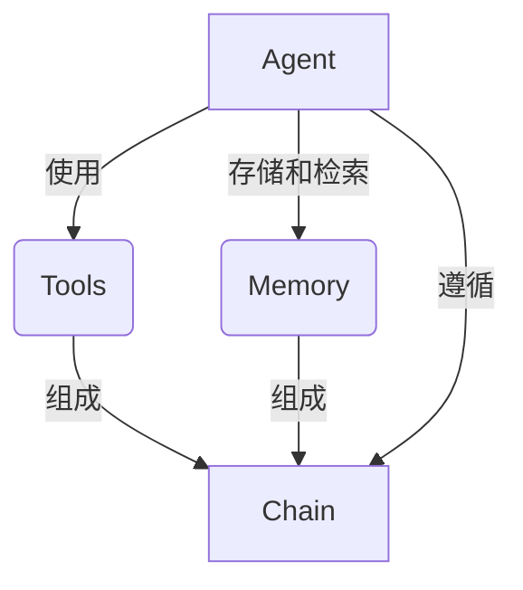
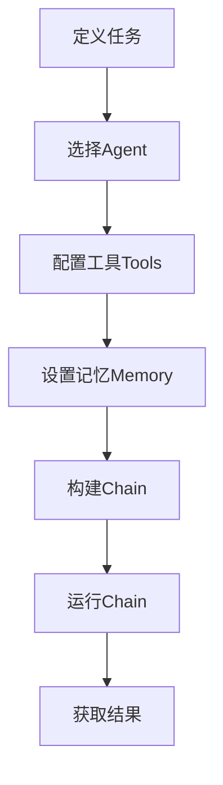
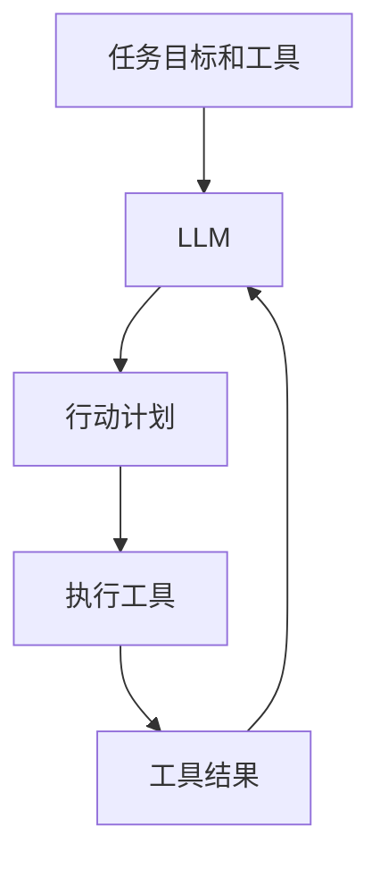

# 【LangChain编程：从入门到实践】LangChain简介

## 1.背景介绍

### 1.1 人工智能的发展历程

人工智能(Artificial Intelligence, AI)是当代科技领域最具革命性和颠覆性的技术之一。自20世纪50年代诞生以来,AI不断发展壮大,已经渗透到我们生活和工作的方方面面。从最初的专家系统到现代的深度学习和强化学习,AI技术的进步催生了无数创新应用,改变了人类的生活方式。

### 1.2 AI系统的局限性

然而,尽管AI取得了长足进步,但仍然面临着诸多挑战和局限性。传统的AI系统往往是封闭的、单一的,缺乏灵活性和可扩展性。这些系统通常专注于解决特定的任务,无法轻松地应对复杂、多变的现实世界场景。此外,构建和维护这些AI系统需要大量的人力和资源投入,效率低下。

### 1.3 LangChain的诞生

正是在这种背景下,LangChain应运而生。LangChain是一个用于构建应用程序的开源框架,旨在简化人工智能和大型语言模型(LLM)的开发和应用过程。它提供了一个模块化的架构,使开发人员能够轻松地组合和扩展各种AI组件,从而构建灵活、强大的AI应用程序。

## 2.核心概念与联系

### 2.1 LangChain的核心概念

LangChain的核心概念包括Agent、Tool、Memory和Chain。这些概念相互关联,共同构建了LangChain的基础架构。

#### 2.1.1 Agent

Agent是LangChain中的核心实体,代表一个具有特定目标和能力的智能体。Agent可以与各种工具(Tools)交互,并利用记忆(Memory)来存储和检索信息,从而完成复杂的任务。

#### 2.1.2 Tool

Tool代表Agent可以使用的各种功能或服务,例如搜索引擎、数据库查询、API调用等。Agent可以根据任务需求选择和组合适当的工具。

#### 2.1.3 Memory

Memory为Agent提供了存储和检索信息的能力。它可以是短期的会话记忆,也可以是长期的持久化存储。Memory使Agent能够跟踪任务状态、记录历史信息,并基于先前的经验做出决策。

#### 2.1.4 Chain

Chain是将Agent、Tool和Memory组合在一起的逻辑单元。它定义了Agent如何与工具交互,如何利用记忆,以及如何完成特定的任务流程。Chain可以是简单的线性流程,也可以是复杂的条件分支和循环结构。



### 2.2 LangChain的优势

LangChain的模块化设计带来了诸多优势:

1. **灵活性和可扩展性**:开发人员可以轻松地组合和扩展各种AI组件,构建满足特定需求的应用程序。
2. **代码复用**:LangChain提供了许多预构建的Agent、Tool和Chain,可以直接使用或进行定制,提高了开发效率。
3. **与LLM无缝集成**:LangChain与主流的大型语言模型(如GPT-3、BERT等)无缝集成,简化了LLM的应用和部署。
4. **开源和社区驱动**:作为一个开源项目,LangChain拥有活跃的社区,持续更新和改进。

## 3.核心算法原理具体操作步骤

### 3.1 LangChain的工作流程

LangChain的工作流程可以概括为以下几个步骤:

1. **定义任务**:首先,需要明确应用程序要解决的任务,并将其分解为一系列子任务。
2. **选择Agent**:根据任务需求,选择合适的Agent作为智能体。
3. **配置工具**:确定Agent需要使用的各种工具(Tools),如搜索引擎、API等。
4. **设置记忆**:为Agent配置合适的Memory,用于存储和检索信息。
5. **构建Chain**:将Agent、Tools和Memory组合成一个或多个Chain,定义任务的执行流程。
6. **运行Chain**:启动Chain,Agent将按照预定义的流程与工具交互,利用记忆完成任务。
7. **获取结果**:从Chain中获取最终的任务结果。



### 3.2 Agent的决策过程

Agent在执行任务时需要做出一系列决策,例如选择使用哪些工具、如何利用记忆等。LangChain提供了多种Agent类型,每种Agent都有自己的决策逻辑。

以`ZeroShotAgent`为例,它的决策过程如下:

1. 将任务目标和可用工具传递给LLM(大型语言模型)。
2. LLM根据任务目标和工具描述,生成一个行动计划,包括要使用的工具序列和相应的输入。
3. Agent执行LLM生成的行动计划,调用相应的工具并获取结果。
4. 将工具执行结果反馈给LLM,LLM根据结果更新行动计划。
5. 重复步骤3和4,直到任务完成或达到最大迭代次数。



其他Agent类型,如`ReActAgent`和`ConversationAgent`,也有类似的决策过程,但具体逻辑可能有所不同。开发人员可以根据需求选择合适的Agent,或者定制自己的Agent决策逻辑。

## 4.数学模型和公式详细讲解举例说明

虽然LangChain主要是一个基于规则和流程的框架,但在某些情况下,它也可以与基于数学模型的AI技术相结合。以下是一些常见的数学模型及其在LangChain中的应用:

### 4.1 概率模型

概率模型广泛应用于自然语言处理、推理和决策等领域。在LangChain中,概率模型可以用于评估Agent的行动计划,或者对工具执行结果进行概率分析。

例如,在对话系统中,可以使用隐马尔可夫模型(HMM)来预测用户的意图,并选择合适的响应策略。HMM的基本思想是将观测序列(用户输入)映射到隐藏状态序列(用户意图),并根据状态转移概率和发射概率来计算最可能的隐藏状态序列。

设观测序列为$O = (o_1, o_2, \ldots, o_T)$,隐藏状态序列为$Q = (q_1, q_2, \ldots, q_T)$,则HMM可以表示为:

$$
P(O|Q) = \prod_{t=1}^T P(o_t|q_t)
$$
$$
P(Q) = \pi_{q_1} \prod_{t=2}^T P(q_t|q_{t-1})
$$

其中,$P(o_t|q_t)$是发射概率,表示在状态$q_t$下观测到$o_t$的概率;$P(q_t|q_{t-1})$是状态转移概率,表示从状态$q_{t-1}$转移到$q_t$的概率;$\pi_{q_1}$是初始状态概率。

通过计算$P(O|Q)P(Q)$的最大值,可以找到最可能的隐藏状态序列,从而确定用户的意图。

### 4.2 向量空间模型

向量空间模型(VSM)是一种常用的文本表示方法,在信息检索、文本聚类等任务中有广泛应用。在LangChain中,VSM可以用于计算文本相似度,从而帮助Agent选择合适的工具或信息源。

VSM将每个文档表示为一个向量,其中每个维度对应一个词项(term)的权重。常用的词项权重计算方法是TF-IDF(Term Frequency-Inverse Document Frequency),定义如下:

$$
\text{tfidf}(t, d, D) = \text{tf}(t, d) \times \text{idf}(t, D)
$$
$$
\text{tf}(t, d) = \frac{\text{count}(t, d)}{\sum_{t' \in d} \text{count}(t', d)}
$$
$$
\text{idf}(t, D) = \log \frac{|D|}{|\{d \in D : t \in d\}|}
$$

其中,$t$是词项,$d$是文档,$D$是文档集合,$\text{count}(t, d)$是词项$t$在文档$d$中出现的次数,$|D|$是文档集合的大小,$|\{d \in D : t \in d\}|$是包含词项$t$的文档数量。

计算两个文档向量$d_1$和$d_2$的相似度可以使用余弦相似度:

$$
\text{sim}(d_1, d_2) = \cos(\theta) = \frac{d_1 \cdot d_2}{||d_1|| ||d_2||}
$$

Agent可以根据文档与任务目标的相似度,选择最相关的信息源作为工具输入。

### 4.3 embedding模型

除了传统的VSM,LangChain也可以利用现代的embedding模型(如BERT、GPT等)来表示和比较文本。这些模型通过预训练的方式学习文本的语义表示,往往比传统方法更加准确和有效。

以BERT为例,它采用了Transformer的编码器结构,通过自注意力机制捕捉文本中的长距离依赖关系。对于一个输入序列$X = (x_1, x_2, \ldots, x_n)$,BERT会输出对应的embedding序列$H = (h_1, h_2, \ldots, h_n)$,其中每个$h_i$是一个向量,表示输入token $x_i$的语义表示。

BERT的自注意力机制可以用以下公式描述:

$$
\begin{aligned}
\text{Attention}(Q, K, V) &= \text{softmax}\left(\frac{QK^T}{\sqrt{d_k}}\right)V \\
\text{MultiHead}(Q, K, V) &= \text{Concat}(\text{head}_1, \ldots, \text{head}_h)W^O \\
\text{where } \text{head}_i &= \text{Attention}(QW_i^Q, KW_i^K, VW_i^V)
\end{aligned}
$$

其中,$Q$、$K$和$V$分别是查询(Query)、键(Key)和值(Value)的线性映射;$W_i^Q$、$W_i^K$和$W_i^V$是每个注意力头的权重矩阵;$W^O$是最终的线性变换。

通过计算文本embedding之间的余弦相似度或其他距离度量,LangChain可以评估文本与任务目标的相关性,从而指导Agent的决策过程。

上述只是LangChain中可能使用的一些数学模型,实际应用中还可以根据需求引入其他模型,如图神经网络、知识图谱embedding等,从而赋予Agent更强大的推理和决策能力。

## 5.项目实践:代码实例和详细解释说明

为了更好地理解LangChain的使用方式,我们来看一个简单的示例项目。在这个项目中,我们将构建一个基于LangChain的问答系统,它可以从维基百科中查找相关信息来回答用户的问题。

### 5.1 安装依赖

首先,我们需要安装LangChain及其依赖项:

```bash
pip install langchain openai wikipedia
```

### 5.2 导入所需模块

接下来,在Python脚本中导入所需的模块:

```python
from langchain.agents import initialize_agent, Tool
from langchain.llms import OpenAI
from langchain.utilities import WikipediaAPIWrapper
```

- `initialize_agent`用于初始化Agent
- `Tool`用于定义工具
- `OpenAI`是一个LLM(大型语言模型)包装器,用于与OpenAI的API进行交互
- `WikipediaAPIWrapper`是一个包装了Wikipedia API的工具

### 5.3 定义工具和Agent

我们将使用Wikipedia作为唯一的工具,并初始化一个`ZeroShotAgent`:

```python
# 定义Wikipedia工具
wiki = WikipediaAPIWrapper()
tools = [
    Tool(
        name="Wikipedia",
        func=wiki.run,
        description="Useful for answering questions about topics covered on Wikipedia"
    )
]

# 初始