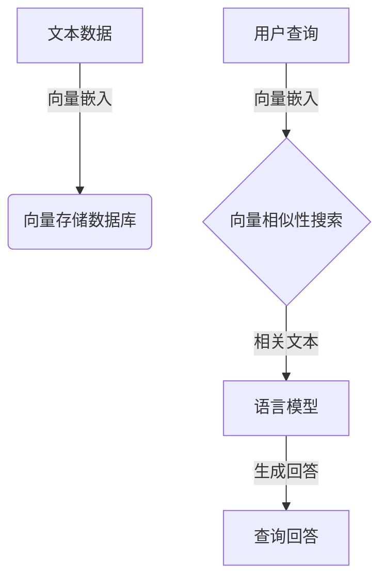

# 【LangChain编程：从入门到实践】VectorStoreRetrieverMemory

## 1.背景介绍

在当今信息时代,数据量呈指数级增长,传统的搜索和检索方式已经无法满足我们对海量数据的高效管理和利用需求。为了解决这一问题,向量搜索(Vector Search)技术应运而生。向量搜索是一种基于语义相似性的搜索方法,它将文本转换为向量表示,然后在向量空间中进行相似性匹配和检索。

LangChain是一个强大的Python库,它提供了一种统一的接口来构建基于大语言模型(LLM)的应用程序。其中,VectorStoreRetrieverMemory是LangChain中一个重要的组件,它将向量搜索技术与LLM相结合,实现了基于语义相似性的高效文本检索和问答系统。

### 1.1 传统搜索方法的局限性

传统的全文搜索方法通常基于关键词匹配,它们无法很好地捕捉文本的语义信息。例如,当我们搜索"苹果公司"时,传统搜索引擎可能会返回与"水果苹果"相关的结果,而忽略了与"苹果公司"相关的内容。这种基于关键词的搜索方式在处理同义词、近义词和隐喻时存在明显的局限性。

### 1.2 向量搜索的优势

与传统搜索方法不同,向量搜索利用了自然语言处理(NLP)技术,将文本转换为向量表示。这种向量表示能够捕捉文本的语义信息,从而使相似的文本在向量空间中彼此靠近。通过在向量空间中进行相似性匹配,向量搜索可以更好地理解查询的语义,并返回与查询语义相关的结果。

## 2.核心概念与联系

### 2.1 向量嵌入(Vector Embedding)

向量嵌入是将文本转换为向量表示的过程。在NLP领域,常用的向量嵌入方法包括Word2Vec、GloVe、BERT等。这些模型通过训练,能够将文本映射到一个高维向量空间,其中相似的文本在向量空间中彼此靠近。

在LangChain中,我们可以使用各种预训练的语言模型来生成文本的向量嵌入,例如OpenAI的GPT模型、Google的BERT模型等。

### 2.2 向量存储(Vector Store)

向量存储是一种专门设计用于存储和检索向量的数据库。与传统的关系型数据库或NoSQL数据库不同,向量存储数据库优化了向量相似性搜索的性能,可以高效地在海量向量数据中进行相似性匹配。

LangChain支持多种流行的向量存储数据库,如Pinecone、Weaviate、Qdrant等。这些数据库不仅提供了高效的向量相似性搜索功能,还具有可扩展性、持久化存储等优势。

### 2.3 VectorStoreRetrieverMemory

VectorStoreRetrieverMemory是LangChain中一个关键组件,它将向量嵌入、向量存储和语言模型结合在一起,实现了基于语义相似性的文本检索和问答系统。

它的工作原理如下:

1. 将文本数据(如文档、网页等)转换为向量嵌入,并存储在向量存储数据库中。
2. 当用户提出查询时,将查询转换为向量嵌入。
3. 在向量存储数据库中,根据向量相似性搜索与查询最相关的文本数据。
4. 将检索到的相关文本数据输入到语言模型中,生成对查询的回答。

通过这种方式,VectorStoreRetrieverMemory能够高效地从海量数据中检索与查询相关的内容,并利用语言模型生成准确、连贯的回答。



## 3.核心算法原理具体操作步骤

VectorStoreRetrieverMemory的核心算法原理可以概括为以下几个步骤:

### 3.1 文本向量化

首先,需要将文本数据(如文档、网页等)转换为向量表示。这一步骤通常利用预训练的语言模型,如BERT、GPT等,将文本映射到一个高维向量空间。

具体操作步骤如下:

1. 导入预训练的语言模型。
2. 对文本数据进行tokenization和编码,得到输入张量。
3. 将输入张量输入语言模型,获取最后一层的隐藏状态作为文本的向量表示。

### 3.2 向量存储

将得到的文本向量存储在向量存储数据库中,以便后续的相似性搜索。LangChain支持多种流行的向量存储数据库,如Pinecone、Weaviate、Qdrant等。

具体操作步骤如下:

1. 初始化向量存储数据库客户端。
2. 遍历文本数据,将每个文本及其对应的向量存储到数据库中。

### 3.3 向量相似性搜索

当用户提出查询时,需要将查询转换为向量表示,然后在向量存储数据库中搜索与之最相似的文本向量及其对应的文本数据。

具体操作步骤如下:

1. 将用户查询转换为向量表示,方法与文本向量化相同。
2. 在向量存储数据库中,根据向量相似性度量(如余弦相似度)搜索与查询向量最相似的Top-K个文本向量。
3. 从数据库中检索出这些文本向量对应的原始文本数据。

### 3.4 语言模型生成回答

将检索到的相关文本数据输入到语言模型中,生成对查询的回答。

具体操作步骤如下:

1. 将相关文本数据拼接成一个字符串。
2. 将拼接后的字符串和用户查询一起输入到语言模型中。
3. 语言模型根据输入生成对查询的回答。

通过上述步骤,VectorStoreRetrieverMemory能够高效地从海量数据中检索与查询相关的内容,并利用语言模型生成准确、连贯的回答。

## 4.数学模型和公式详细讲解举例说明

在向量相似性搜索中,常用的相似度度量方法是余弦相似度(Cosine Similarity)。余弦相似度用于计算两个向量之间的夹角余弦值,范围在[-1, 1]之间。两个向量越相似,它们的夹角越小,余弦值越接近1。

余弦相似度的数学公式如下:

$$\text{sim}(A, B) = \cos(\theta) = \frac{A \cdot B}{\|A\| \|B\|} = \frac{\sum_{i=1}^{n}A_iB_i}{\sqrt{\sum_{i=1}^{n}A_i^2}\sqrt{\sum_{i=1}^{n}B_i^2}}$$

其中:

- $A$和$B$分别表示两个向量
- $\theta$表示两个向量之间的夹角
- $A \cdot B$表示两个向量的点积(内积)
- $\|A\|$和$\|B\|$分别表示向量$A$和$B$的范数(模长)

让我们通过一个简单的例子来计算两个向量的余弦相似度。

假设有两个二维向量$A = (3, 4)$和$B = (4, 3)$,我们计算它们的余弦相似度:

$$A \cdot B = 3 \times 4 + 4 \times 3 = 24$$
$$\|A\| = \sqrt{3^2 + 4^2} = 5$$
$$\|B\| = \sqrt{4^2 + 3^2} = 5$$
$$\text{sim}(A, B) = \frac{24}{5 \times 5} = 0.96$$

可以看到,这两个向量的余弦相似度接近于1,说明它们在向量空间中的方向非常相似。

在实际应用中,向量通常是高维的,余弦相似度能够有效地衡量高维向量之间的相似性。通过在向量存储数据库中搜索与查询向量最相似的Top-K个向量,我们可以检索到与查询最相关的文本数据。

## 5.项目实践:代码实例和详细解释说明

在这一部分,我们将通过一个具体的代码示例,演示如何使用LangChain中的VectorStoreRetrieverMemory实现基于语义相似性的文本检索和问答系统。

### 5.1 准备工作

首先,我们需要安装所需的Python库:

```bash
pip install langchain pinecone-client openai
```

- `langchain`是LangChain的主要库
- `pinecone-client`是用于连接Pinecone向量存储数据库的客户端
- `openai`是用于调用OpenAI语言模型的库

### 5.2 导入必要的模块

```python
from langchain.vectorstores import Pinecone
from langchain.llms import OpenAI
from langchain.chains.question_answering import load_qa_chain
```

- `Pinecone`是LangChain中用于连接Pinecone向量存储数据库的模块
- `OpenAI`是用于调用OpenAI语言模型的模块
- `load_qa_chain`是用于加载问答链的函数

### 5.3 初始化向量存储数据库

```python
import pinecone

# 初始化 Pinecone
pinecone.init(
    api_key="YOUR_PINECONE_API_KEY",
    environment="YOUR_PINECONE_ENVIRONMENT"
)

# 创建或获取一个 Pinecone 索引
index_name = "langchain-demo"
pinecone.create_index(index_name, dimension=1536)
index = pinecone.Index(index_name)
```

在这里,我们初始化了Pinecone向量存储数据库,并创建或获取了一个名为`langchain-demo`的索引。`dimension=1536`表示我们将使用OpenAI的`text-embedding-ada-002`模型进行向量嵌入,它的向量维度为1536。

### 5.4 准备文本数据

为了演示,我们将使用一些示例文本数据。在实际应用中,您可以使用自己的文档、网页等数据。

```python
texts = [
    "LangChain是一个用于构建大型语言模型(LLM)应用程序的Python库。它提供了一个统一的接口,可以轻松地将LLM与其他组件(如知识库、API等)集成。",
    "LangChain支持多种流行的LLM,如OpenAI的GPT模型、Google的PaLM模型等。它还提供了一系列工具和功能,如代理、内存、向量存储等,帮助您构建复杂的LLM应用程序。",
    "向量存储是LangChain中一个重要的组件,它允许您将文本数据转换为向量表示,并存储在向量数据库中。这使得您可以基于语义相似性高效地检索相关文本。",
    "VectorStoreRetrieverMemory是LangChain中一个强大的工具,它将向量存储与LLM结合,实现了基于语义相似性的文本检索和问答系统。"
]
```

### 5.5 向量化文本数据并存储到向量数据库

```python
from langchain.embeddings.openai import OpenAIEmbeddings

# 初始化向量嵌入模型
embeddings = OpenAIEmbeddings()

# 向量化文本数据并存储到 Pinecone 索引中
index.add_texts(texts, embeddings)
```

在这一步骤中,我们使用OpenAI的`text-embedding-ada-002`模型将文本数据转换为向量表示,然后将这些向量存储到Pinecone索引中。

### 5.6 初始化语言模型和向量存储检索器

```python
# 初始化 OpenAI 语言模型
llm = OpenAI(temperature=0)

# 初始化向量存储检索器
vectorstore = Pinecone.from_existing_index(index, embeddings)
retriever = vectorstore.as_retriever()
```

我们初始化了OpenAI语言模型,并从Pinecone索引中创建了一个向量存储检索器`retriever`。

### 5.7 构建问答链并进行查询

```python
# 构建问答链
qa_chain = load_qa_chain(llm, chain_type="stuff", retriever=retriever)

# 进行查询
query = "什么是VectorStoreRetrieverMemory?"
result = qa_chain({"query": query})
print(result["result"])
```

在这里,我们使用`load_qa_chain`函数构建了一个问答链,将语言模型和向量存储检