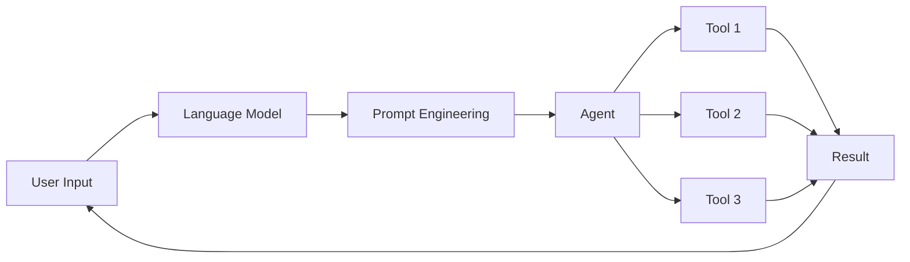

# 【LangChain编程：从入门到实践】代理模块

## 1. 背景介绍
在人工智能和自然语言处理领域，代理（Agent）是一个非常重要和强大的概念。代理可以被看作是一个智能实体，它能够接收输入，根据自身的知识和推理能力做出决策，并采取相应的行动来完成特定的任务。

近年来，随着大语言模型（如GPT-3、BERT等）的快速发展，基于语言模型的代理系统越来越受到研究者和工程师的关注。这些代理系统能够理解自然语言指令，并根据指令自主完成复杂的任务，如信息检索、问答、数据分析等。

而在众多的自然语言处理框架中，LangChain脱颖而出，成为了构建语言模型应用的重要工具。LangChain提供了一套灵活、强大的工具和组件，帮助开发者快速搭建基于语言模型的应用，尤其是代理系统。

本文将重点介绍LangChain中的代理（Agent）模块，探讨其核心概念、工作原理以及实际应用。通过学习和实践LangChain代理模块，读者将能够构建出更加智能、高效的自然语言处理应用。

## 2. 核心概念与联系
在深入探讨LangChain代理模块之前，我们需要了解几个核心概念：

### 2.1 语言模型（Language Model）
语言模型是一种基于概率统计的模型，用于预测一个句子或一段文本的概率分布。常见的语言模型有GPT系列、BERT等。语言模型是代理系统的核心组件，提供了自然语言理解和生成的能力。

### 2.2 提示工程（Prompt Engineering）
提示工程是一种优化语言模型输入的技术，通过精心设计输入的提示（Prompt），可以引导语言模型生成更加符合需求的输出。在代理系统中，提示工程用于构建代理的指令理解和任务执行能力。

### 2.3 工具（Tool）
在LangChain中，工具是一个封装了特定功能的对象，如搜索引擎、计算器、数据库查询等。代理可以调用这些工具来完成任务。

### 2.4 代理（Agent）
代理是一个智能实体，它接收用户的输入，通过语言模型理解输入的意图，并根据意图选择合适的工具执行任务，最后将结果返回给用户。代理的核心是决策和执行能力。

下图展示了这些核心概念之间的关系：



## 3. 核心算法原理与具体操作步骤
LangChain代理模块的核心是一个基于语言模型的决策算法，它根据用户输入和当前的环境状态，选择最优的行动来完成任务。这个过程可以分为以下几个步骤：

### 3.1 接收用户输入
代理首先接收用户的自然语言输入，如"帮我找一下Python的快速排序算法"。

### 3.2 理解输入意图
代理将用户输入传递给语言模型，通过提示工程引导语言模型理解输入的意图。例如，可以将输入转化为如下的提示：

```
User Input: 帮我找一下Python的快速排序算法
Prompt: 根据用户的输入，他/她想要：
1. 搜索Python快速排序算法的信息
2. 学习Python快速排序算法
3. 其他
Answer:
```

语言模型根据这个提示，生成一个数字，表示理解的意图，如"1"。

### 3.3 选择执行工具
根据理解的意图，代理从可用的工具中选择最适合完成任务的工具。例如，对于"搜索Python快速排序算法的信息"这个意图，代理可能会选择搜索引擎工具。

### 3.4 执行任务
代理调用选择的工具，并将用户输入作为参数传递给工具。工具执行任务后，将结果返回给代理。

### 3.5 生成最终输出
代理将工具的执行结果传递给语言模型，通过提示工程引导语言模型生成最终的用户输出。例如：

```
Tool Result: Python快速排序算法的示例代码如下：
def quicksort(arr):
    if len(arr) <= 1:
        return arr
    pivot = arr[len(arr) // 2]
    left = [x for x in arr if x < pivot]
    middle = [x for x in arr if x == pivot]
    right = [x for x in arr if x > pivot]
    return quicksort(left) + middle + quicksort(right)

Prompt: 根据搜索结果，生成一个对用户友好的回复，包含以下内容：
1. 简要介绍快速排序算法
2. 提供Python快速排序算法的示例代码
3. 鼓励用户进一步学习和实践
Answer:
```

语言模型根据提示和搜索结果，生成最终的用户友好的输出。

## 4. 数学模型和公式详细讲解举例说明
LangChain代理模块的决策过程可以用马尔可夫决策过程（Markov Decision Process, MDP）来建模。MDP由以下几个元素组成：

- 状态集合 $S$：表示代理所处的环境状态，如用户输入、当前对话历史等。
- 行动集合 $A$：表示代理可以采取的行动，如选择执行的工具、生成的回复等。
- 转移概率函数 $P(s'|s,a)$：表示在状态 $s$ 下采取行动 $a$ 后，转移到状态 $s'$ 的概率。
- 奖励函数 $R(s,a)$：表示在状态 $s$ 下采取行动 $a$ 获得的即时奖励。

代理的目标是学习一个策略 $\pi(a|s)$，使得在给定状态 $s$ 下，选择行动 $a$ 的概率最大化期望总奖励：

$$
\pi^* = \arg\max_\pi \mathbb{E}\left[\sum_{t=0}^T \gamma^t R(s_t,a_t)\right]
$$

其中，$\gamma$ 是折扣因子，$T$ 是任务的时间步长。

在实践中，我们可以使用深度强化学习算法，如 DQN（Deep Q-Network）或 PPO（Proximal Policy Optimization）来训练代理的策略网络。以 DQN 为例，我们可以使用神经网络来拟合状态-行动值函数 $Q(s,a)$：

$$
Q(s,a) = \mathbb{E}\left[\sum_{t=0}^T \gamma^t R(s_t,a_t)|s_0=s,a_0=a\right]
$$

在训练过程中，我们最小化 TD（Temporal Difference）误差：

$$
L(\theta) = \mathbb{E}_{s,a,r,s'}\left[(r + \gamma \max_{a'} Q(s',a';\theta^-) - Q(s,a;\theta))^2\right]
$$

其中，$\theta$ 是 Q 网络的参数，$\theta^-$ 是目标网络的参数，用于计算 TD 目标值。

通过不断与环境交互，收集经验数据，并更新 Q 网络，代理可以学习到最优的决策策略。

## 5. 项目实践：代码实例和详细解释说明
下面我们通过一个简单的示例来演示如何使用 LangChain 构建一个代理系统。

首先，我们需要安装 LangChain 及其依赖：

```bash
pip install langchain openai google-search-results
```

然后，我们定义代理所需的工具：

```python
from langchain.agents import load_tools

tools = load_tools(["serpapi", "llm-math"], llm=llm)
```

这里我们加载了两个工具：`serpapi` 用于网络搜索，`llm-math` 用于数学计算。

接下来，我们定义代理：

```python
from langchain.agents import initialize_agent

agent = initialize_agent(tools, llm, agent="zero-shot-react-description", verbose=True)
```

我们使用 `zero-shot-react-description` 作为代理类型，它可以根据工具的描述自动选择合适的工具执行任务。

现在，我们可以让代理执行任务了：

```python
user_input = "帮我找一下Python的快速排序算法，并给出一个简单的例子。"
result = agent.run(user_input)
print(result)
```

代理将接收用户输入，自动选择合适的工具（这里可能会选择搜索引擎），搜索相关信息，并生成最终的输出。输出可能如下：

```
快速排序是一种高效的排序算法，其基本思想是分治法。它的步骤如下：
1. 选择一个基准元素（通常选择第一个或最后一个元素）
2. 将数组分为两个子数组：小于基准元素的元素和大于基准元素的元素
3. 递归地对两个子数组进行快速排序
4. 将排序后的子数组和基准元素合并

下面是一个简单的Python快速排序的例子：

def quicksort(arr):
    if len(arr) <= 1:
        return arr
    pivot = arr[len(arr) // 2]
    left = [x for x in arr if x < pivot]
    middle = [x for x in arr if x == pivot]
    right = [x for x in arr if x > pivot]
    return quicksort(left) + middle + quicksort(right)

arr = [3, 6, 8, 10, 1, 2, 1]
print(quicksort(arr))  # 输出: [1, 1, 2, 3, 6, 8, 10]

快速排序的平均时间复杂度为 O(n log n)，在实践中被广泛使用。建议你尝试实现快速排序算法，加深理解。
```

通过这个简单的例子，我们展示了如何使用 LangChain 快速搭建一个代理系统。当然，实际应用中，我们可能需要集成更多的工具，设计更复杂的提示模板，并使用更强大的语言模型。

## 6. 实际应用场景
LangChain 代理模块可以应用于各种自然语言处理任务，包括但不限于：

### 6.1 智能客服
代理可以接收用户的咨询，通过搜索知识库、调用外部 API 等方式获取信息，并生成回复，提供 24/7 的客户服务。

### 6.2 个人助理
代理可以帮助用户完成日常任务，如日程安排、邮件管理、信息查询等，提高工作和生活效率。

### 6.3 教育辅导
代理可以根据学生的提问，搜索教育资源，生成解释和示例，帮助学生更好地理解和掌握知识点。

### 6.4 金融分析
代理可以收集和分析金融数据，生成投资建议和市场预测报告，辅助投资决策。

### 6.5 医疗诊断
代理可以根据患者的症状描述，搜索医学知识库，生成初步的诊断结果和建议，辅助医生的诊断过程。

## 7. 工具和资源推荐
以下是一些有助于学习和实践 LangChain 代理模块的工具和资源：

- [LangChain官方文档](https://docs.langchain.com/)：提供了详细的 API 文档和使用指南。
- [LangChain Github仓库](https://github.com/hwchase17/langchain)：包含了 LangChain 的源代码和示例项目。
- [OpenAI API](https://beta.openai.com/)：提供强大的语言模型，如 GPT-3，可用于构建代理系统。
- [Google Search API](https://serpapi.com/)：提供网络搜索功能，可用于构建搜索工具。
- [Wolfram Alpha API](https://products.wolframalpha.com/api/)：提供各种计算和分析功能，可用于构建数学和科学计算工具。
- [Hugging Face Transformers](https://huggingface.co/transformers/)：提供了大量预训练的语言模型和自然语言处理工具，可与 LangChain 集成。

## 8. 总结：未来发展趋势与挑战
LangChain 代理模块为构建智能对话系统和自然语言处理应用提供了强大的工具和框架。随着语言模型的不断发展和算力的提升，我们有望看到更加智能、高效、全能的代理系统出现。

未来，代理系统可能会更深入地集成知识图谱、因果推理等技术，具备更强的常识推理和决策能力。同时，随着垂直领域数据的积累，我们也会