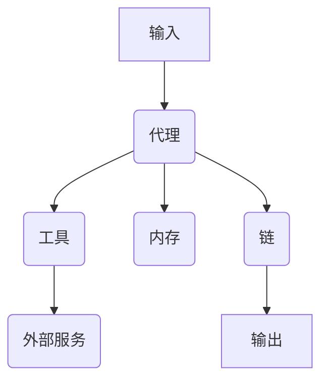

# 【LangChain编程：从入门到实践】利用LangChain开发应用

## 1.背景介绍

### 1.1 人工智能的崛起与挑战

在过去的几十年里，人工智能(AI)技术取得了长足的进步,已经渗透到我们生活的方方面面。从语音助手到自动驾驶汽车,从推荐系统到医疗诊断,AI正在彻底改变着我们的生活和工作方式。然而,随着AI应用的不断扩展,我们也面临着一些新的挑战。

其中一个主要挑战是,如何将不同的AI模型和工具有效地集成到一个统一的系统中。传统的软件开发方法往往难以满足AI系统的复杂需求,例如处理大规模数据、融合多种AI模型、实现模型之间的协作等。因此,我们需要一种新的编程范式来应对这些挑战。

### 1.2 LangChain:AI编程的新范式

LangChain是一个Python库,旨在简化AI应用程序的开发过程。它提供了一种新颖的方式来构建AI应用,将不同的AI模型、工具和数据源无缝集成在一起。LangChain的核心理念是将AI系统视为一系列可组合的"链条"(Chains),每个链条代表一个特定的任务或功能。通过灵活地组合和管理这些链条,开发人员可以快速构建出复杂的AI应用。

LangChain不仅支持主流的大语言模型(如GPT-3、BERT等),还集成了众多其他AI工具,如知识库、文本提取器、数据加载器等。这使得开发人员可以轻松地利用各种AI能力,而无需从头开始构建整个系统。

### 1.3 本文内容概览

本文将全面介绍如何利用LangChain开发AI应用程序。我们将从LangChain的核心概念和架构出发,深入探讨其工作原理和使用方法。接下来,我们将通过实际的代码示例,演示如何使用LangChain构建各种AI应用,包括问答系统、文本摘要、信息提取等。此外,我们还将分享一些实用的技巧和最佳实践,帮助您充分发挥LangChain的潜力。

无论您是AI初学者还是资深开发者,相信通过本文的学习,您都能掌握LangChain的精髓,并将其应用于实际项目中,从而提高开发效率,缩短上手周期。

## 2.核心概念与联系

在深入探讨LangChain的具体功能之前,我们先来了解一些核心概念,这些概念贯穿于整个LangChain框架,是理解和使用LangChain的基础。

### 2.1 代理(Agent)

代理是LangChain中最核心的概念之一。它代表了一个具有特定能力和职责的实体,可以执行各种任务。代理可以是一个语言模型、一个工具或者一个复合代理(由多个子代理组成)。

在LangChain中,代理通过与其他组件(如工具、内存等)交互来完成任务。每个代理都有一个明确定义的职责,例如回答问题、总结文本或执行特定的操作。

代理的行为由代理类型和配置决定。LangChain提供了多种预定义的代理类型,如序列代理(Sequential Agent)、反思代理(Reflective Agent)等,用户也可以自定义代理类型以满足特定需求。

### 2.2 工具(Tool)

工具是LangChain中另一个重要的概念。工具代表了一个具体的功能或服务,可以被代理调用以执行特定的任务。工具可以是一个API接口、一个Python函数或者一个外部程序。

LangChain内置了许多常用的工具,如Wikipedia查询器、Python REPL、文件操作工具等。开发人员也可以轻松地定义自己的自定义工具,并将其集成到LangChain中。

代理与工具之间的交互遵循一定的协议,代理向工具发送指令,工具执行相应的操作并将结果返回给代理。这种松耦合的设计使得代理和工具可以独立开发和维护,提高了系统的灵活性和可扩展性。

### 2.3 内存(Memory)

内存是LangChain中用于存储和管理代理的状态和历史信息的组件。它允许代理在执行任务时记住和利用之前的上下文信息,从而提高任务完成的质量和一致性。

LangChain支持多种内存类型,如简单的缓存内存(Buffer Memory)、基于向量的相似性内存(Vector Memory)等。开发人员可以根据具体需求选择合适的内存类型,或者自定义内存实现。

内存与代理紧密集成,代理可以在执行任务之前从内存中获取相关信息,并在任务完成后将新的信息存储到内存中。这种记忆机制使得代理能够更好地处理复杂的、需要上下文信息的任务。

### 2.4 链(Chain)

链是LangChain中用于组合和管理代理、工具和内存的核心概念。它定义了一系列步骤,描述了代理如何与其他组件交互以完成特定的任务。

LangChain提供了多种预定义的链类型,如序列链(Sequential Chain)、转换链(Transformation Chain)、对话链(Conversation Chain)等。开发人员也可以自定义链的行为,以满足特定的需求。

链的灵活性和可组合性是LangChain的一大优势。通过将多个链组合在一起,开发人员可以构建出复杂的AI应用程序,而无需从头开始编写所有代码。这极大地提高了开发效率和代码的可重用性。

### 2.5 LangChain架构概览

现在,让我们通过一个简单的示意图来总结一下LangChain的整体架构:

1. 用户向代理提供输入,如文本、问题或指令。
2. 代理根据其类型和配置,与工具、内存和其他代理进行交互,以完成任务。
3. 工具代表各种功能或服务,如API调用、数据处理等,可被代理调用。
4. 内存用于存储和管理代理的状态和历史信息,以提高任务完成的质量和一致性。
5. 链定义了代理与其他组件交互的步骤,用于组合和管理复杂的任务流程。
6. 最终,代理通过链将处理结果输出给用户。

通过上述核心概念和架构,我们可以看到LangChain提供了一种模块化和可组合的方式来构建AI应用程序。在接下来的章节中,我们将进一步探讨如何利用这些概念来开发实际的应用。

## 3.核心算法原理具体操作步骤

在上一章节中,我们了解了LangChain的核心概念和架构。现在,让我们深入探讨一下LangChain的核心算法原理和具体操作步骤。

### 3.1 代理-工具交互

代理与工具之间的交互是LangChain中最基本也是最关键的操作。代理通过调用工具来执行特定的任务,工具则执行相应的操作并将结果返回给代理。

这种交互过程遵循以下步骤:

1. **观察(Observation)**: 代理从输入中获取观察信息,例如文本、问题或指令。
2. **工具选择(Tool Selection)**: 代理根据观察信息和任务需求,选择合适的工具来执行任务。
3. **工具调用(Tool Invocation)**: 代理向选定的工具发送指令,并提供必要的输入数据。
4. **工具执行(Tool Execution)**: 工具执行相应的操作,可能涉及API调用、数据处理或其他计算。
5. **结果返回(Result Return)**: 工具将执行结果返回给代理。
6. **结果处理(Result Processing)**: 代理处理工具返回的结果,可能包括进一步的计算、数据转换或与其他工具的交互。
7. **输出(Output)**: 代理将最终结果输出给用户或后续的处理步骤。

这个过程可以重复多次,直到任务完成。代理可以根据需要选择和调用多个工具,并将它们的结果组合在一起。

### 3.2 代理决策算法

代理如何选择合适的工具来执行任务,是LangChain中一个关键的算法问题。LangChain提供了多种代理决策算法,用于指导代理进行工具选择和任务规划。

以下是一些常见的代理决策算法:

1. **贪心搜索(Greedy Search)**: 代理根据当前观察信息,选择最相关的工具来执行任务。这种算法简单高效,但可能无法找到最优解。
2. **启发式搜索(Heuristic Search)**: 代理使用一些启发式规则来评估工具的适用性,并选择最佳工具。这种算法需要手动定义启发式规则,但可以获得更好的结果。
3. **规划算法(Planning Algorithms)**: 代理使用规划算法来生成一系列工具调用序列,以完成任务。这种算法可以找到最优解,但计算开销较大。
4. **强化学习(Reinforcement Learning)**: 代理通过与环境的交互,学习选择最佳工具序列的策略。这种算法需要大量的训练数据,但可以获得更好的泛化能力。

不同的代理决策算法适用于不同的场景和任务类型。LangChain允许开发人员选择和配置合适的算法,以满足特定的需求。

### 3.3 代理内存管理

代理内存是LangChain中另一个重要的算法组件。内存用于存储和管理代理在执行任务过程中的状态和历史信息,以提高任务完成的质量和一致性。

LangChain支持多种内存管理算法,包括:

1. **缓冲内存(Buffer Memory)**: 这是最简单的内存类型,它将代理的观察和行为按顺序存储在一个缓冲区中。缓冲内存适用于简单的任务,但无法处理复杂的上下文信息。
2. **向量内存(Vector Memory)**: 这种内存类型使用向量嵌入技术来表示和存储代理的观察和行为。它可以根据向量相似性来检索相关的历史信息,适用于处理复杂的上下文信息。
3. **知识图谱内存(Knowledge Graph Memory)**: 这种内存类型将代理的观察和行为存储在一个知识图谱中,利用图结构来表示实体之间的关系。它适用于处理高度结构化的数据和知识。
4. **自定义内存**: LangChain还允许开发人员自定义内存实现,以满足特定的需求。

在执行任务时,代理会根据需要从内存中获取相关的历史信息,并在任务完成后将新的信息存储到内存中。内存管理算法决定了如何有效地存储和检索这些信息,对于提高任务完成的质量和一致性至关重要。

### 3.4 链组合算法

链是LangChain中用于组合和管理代理、工具和内存的核心概念。链定义了一系列步骤,描述了代理如何与其他组件交互以完成特定的任务。

LangChain提供了多种链组合算法,用于构建复杂的任务流程。以下是一些常见的链组合算法:

1. **序列链(Sequential Chain)**: 这种链类型按顺序执行一系列代理或工具,每个步骤的输出作为下一步骤的输入。它适用于线性的任务流程。
2. **转换链(Transformation Chain)**: 这种链类型将输入数据传递给一系列代理或工具,每个步骤对数据进行转换或处理。它适用于数据转换和预处理任务。
3. **对话链(Conversation Chain)**: 这种链类型模拟人机对话,将用户输入作为对话历史的一部分,并由代理生成响应。它适用于构建对话式AI助手。
4. **条件链(Conditional Chain)**: 这种链类型根据条件选择执行不同的子链,实现了基本的控制流逻辑。它适用于构建具有分支逻辑的任务流程。
5. **自定义链**: LangChain还允许开发人员自定义链的行为,以满足特定的需求。

通过组合不同类型的链,开发人员可以构建出复杂的AI应用程序。链的灵活性和可组合性是LangChain的一大优势,极大{"msg_type":"generate_answer_finish","data":"","from_module":null,"from_unit":null}