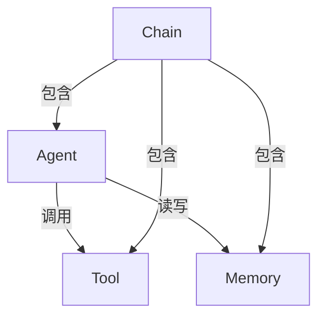

# 【LangChain编程：从入门到实践】应用设计

## 1. 背景介绍

### 1.1 人工智能的崛起

人工智能(AI)技术在过去几年里取得了长足的进步,从计算机视觉、自然语言处理到机器学习等领域,都有了突破性的发展。随着大数据、云计算和高性能计算等技术的不断演进,AI已经逐渐渗透到我们生活的方方面面,成为推动社会进步的重要力量。

### 1.2 AI系统开发的挑战

然而,构建一个高质量的AI系统并不是一件易事。它需要整合多种技术,涉及数据采集、预处理、模型训练、部署等多个环节。传统的开发方式往往需要从头编写大量样板代码,导致开发效率低下,同时也增加了系统的复杂性和维护成本。

### 1.3 LangChain的应运而生

为了解决AI系统开发过程中的痛点,LangChain应运而生。它是一个针对大型语言模型(LLM)应用程序开发的框架,旨在简化和加速AI应用程序的构建过程。LangChain提供了一系列模块化的构建块,使开发人员能够轻松地组合和定制不同的AI组件,从而快速构建出功能强大的AI应用程序。

## 2. 核心概念与联系

### 2.1 LangChain的核心概念

LangChain的核心概念包括Agent、Tool、Memory和Chain。下面将详细介绍每个概念的作用和相互关系。

#### 2.1.1 Agent

Agent是LangChain中的核心抽象概念,它代表了一个具有特定功能的智能体。Agent可以根据输入数据和预设目标,自主地计划和执行一系列操作,从而完成特定的任务。

Agent的行为由其内部的决策逻辑所驱动,这种逻辑可以是基于规则的,也可以是基于机器学习模型的。Agent还可以利用外部资源(如工具和知识库)来辅助决策和执行过程。

#### 2.1.2 Tool

Tool是LangChain中用于表示外部资源的概念。它可以是一个API接口、数据库查询或者任何其他可执行的函数。Agent可以调用这些Tool来获取所需的信息或执行特定的操作。

每个Tool都有一个名称、描述和一个可执行的函数。Agent通过分析输入数据和目标,决定调用哪些Tool以及调用的顺序和参数。

#### 2.1.3 Memory

Memory是LangChain中用于存储中间状态和上下文信息的概念。在执行复杂任务时,Agent可能需要记住之前的操作和结果,以便进行后续的决策和执行。

Memory可以采用不同的形式,如简单的Python数据结构或者基于数据库的持久化存储。Agent可以读取和更新Memory中的内容,从而维护任务执行的上下文信息。

#### 2.1.4 Chain

Chain是LangChain中用于组合多个Agent、Tool和Memory的概念。它定义了一系列步骤,每个步骤可以是调用一个Agent、执行一个Tool或者访问Memory。

Chain提供了一种声明式的方式来描述复杂任务的执行流程。开发人员可以根据需求灵活地构建和组合不同的Chain,从而实现各种功能。

### 2.2 核心概念之间的关系

上述四个核心概念相互关联,共同构成了LangChain的基础架构。它们之间的关系如下所示:



- Agent可以调用Tool来获取所需的信息或执行特定操作。
- Agent可以读写Memory中的数据,以维护任务执行的上下文信息。
- Chain包含了一个或多个Agent、Tool和Memory,并定义了它们之间的交互和执行顺序。

通过灵活地组合这些核心概念,开发人员可以构建出各种复杂的AI应用程序。LangChain为开发人员提供了一种模块化和可扩展的方式,简化了AI系统的开发过程。

## 3. 核心算法原理具体操作步骤

### 3.1 LangChain的工作流程

LangChain的工作流程可以概括为以下几个步骤:

1. **定义任务目标**:开发人员需要明确应用程序需要完成的任务,并将其转化为LangChain可以理解的形式。

2. **构建Agent**:根据任务目标,选择合适的Agent类型和决策逻辑。可以使用LangChain提供的预定义Agent,也可以自定义Agent。

3. **集成Tool**:确定Agent需要调用的外部资源(如API、数据库等),并将它们封装为Tool。

4. **配置Memory**:根据需求选择合适的Memory类型,用于存储任务执行过程中的中间状态和上下文信息。

5. **构建Chain**:将Agent、Tool和Memory组合成一个或多个Chain,定义它们之间的交互和执行顺序。

6. **执行Chain**:运行构建好的Chain,完成任务目标。在执行过程中,Agent会根据决策逻辑调用Tool获取信息,并利用Memory维护上下文。

7. **输出结果**:Chain执行完毕后,将最终结果返回给用户。

下面将详细介绍LangChain中一些核心算法的原理和具体操作步骤。

### 3.2 Agent的决策逻辑

Agent的决策逻辑是其行为的核心驱动力。LangChain提供了多种预定义的Agent类型,每种类型都采用了不同的决策算法。下面介绍两种常见的Agent类型及其决策逻辑。

#### 3.2.1 基于规则的Agent

基于规则的Agent使用预定义的规则来决定下一步的操作。这种Agent适用于任务流程相对固定、决策逻辑较为简单的场景。

例如,一个基于规则的Agent可以按照以下逻辑进行决策:

1. 如果输入数据中包含关键词"天气",则调用天气API获取天气信息。
2. 如果输入数据中包含关键词"新闻",则调用新闻API获取新闻摘要。
3. 如果输入数据中既没有"天气"也没有"新闻"关键词,则返回"无法处理该请求"。

基于规则的Agent的优点是逻辑清晰、可解释性强,但缺点是灵活性较差,难以处理复杂的任务。

#### 3.2.2 基于语言模型的Agent

基于语言模型的Agent利用大型语言模型(如GPT-3)来生成下一步的操作序列。这种Agent适用于任务流程较为复杂、决策逻辑难以用规则表达的场景。

基于语言模型的Agent的工作流程如下:

1. 将当前的输入数据、可用的Tool描述和任务目标作为输入,提供给语言模型。
2. 语言模型根据输入生成一个操作序列,描述了应该调用哪些Tool以及调用的顺序和参数。
3. Agent解析语言模型的输出,并按照指示执行相应的操作。
4. 将执行结果作为新的输入,重复上述过程,直到完成任务目标。

基于语言模型的Agent具有很强的灵活性和泛化能力,但其决策过程是一个黑箱,难以解释和调试。

### 3.3 Tool的集成

Tool是LangChain中用于表示外部资源的概念。开发人员需要将应用程序所需的各种API、数据库查询等封装为Tool,以便Agent可以调用它们。

封装Tool的步骤如下:

1. 定义Tool的名称和描述,用于向Agent解释Tool的功能。
2. 实现一个可执行的函数,该函数封装了对外部资源的访问逻辑。
3. 使用LangChain提供的`Tool`类将名称、描述和可执行函数组合成一个Tool对象。

下面是一个封装天气API的Tool的示例:

```python
import requests

def get_weather(location):
    api_key = "YOUR_API_KEY"
    url = f"https://api.openweathermap.org/data/2.5/weather?q={location}&appid={api_key}"
    response = requests.get(url)
    data = response.json()
    weather = data["weather"][0]["description"]
    return f"The weather in {location} is {weather}."

from langchain.tools import Tool

weather_tool = Tool(
    name="Weather API",
    description="Get the current weather for a given location",
    func=get_weather
)
```

在这个示例中,我们定义了一个名为`get_weather`的函数,用于调用开放天气API并获取指定位置的天气信息。然后,我们使用`Tool`类将这个函数封装为一个Tool对象`weather_tool`。

Agent可以通过调用`weather_tool.run(location)`来获取指定位置的天气信息。

### 3.4 Memory的管理

Memory是LangChain中用于存储中间状态和上下文信息的概念。在执行复杂任务时,Agent需要记住之前的操作和结果,以便进行后续的决策和执行。

LangChain提供了多种Memory实现,包括基于Python数据结构的内存存储和基于数据库的持久化存储。开发人员可以根据需求选择合适的Memory类型。

下面是一个使用Python字典作为Memory的示例:

```python
from langchain.memory import ConversationBufferMemory

memory = ConversationBufferMemory()

# 存储一些初始数据
memory.memory_variables["location"] = "New York"

# Agent可以读取Memory中的数据
location = memory.get("location")
print(f"The current location is {location}")  # 输出: The current location is New York

# Agent也可以更新Memory中的数据
memory.save_context({"weather": "sunny"}, memory_variables)
print(memory.memory_variables)  # 输出: {'location': 'New York', 'weather': 'sunny'}
```

在这个示例中,我们创建了一个`ConversationBufferMemory`对象,并将初始位置信息存储在其中。Agent可以通过`get`方法读取Memory中的数据,也可以通过`save_context`方法更新Memory中的数据。

对于更复杂的场景,LangChain还提供了基于数据库的持久化Memory实现,如`VectorStoreRetrieverMemory`和`ConversationEntityMemory`等。这些Memory类型可以存储更多的上下文信息,并支持高效的查询和检索操作。

## 4. 数学模型和公式详细讲解举例说明

在LangChain中,数学模型和公式主要用于基于语言模型的Agent的决策逻辑。这些Agent利用大型语言模型(如GPT-3)来生成下一步的操作序列。

### 4.1 语言模型的原理

语言模型是一种基于深度学习的模型,旨在学习和预测自然语言序列的概率分布。给定一个文本序列$X = (x_1, x_2, \ldots, x_n)$,语言模型的目标是计算该序列的概率$P(X)$。

根据链式法则,我们可以将$P(X)$分解为:

$$P(X) = P(x_1, x_2, \ldots, x_n) = \prod_{t=1}^n P(x_t | x_1, \ldots, x_{t-1})$$

其中,$P(x_t | x_1, \ldots, x_{t-1})$表示在给定前$t-1$个词的情况下,第$t$个词出现的条件概率。

语言模型的核心任务就是学习这种条件概率分布,以便能够预测下一个词的概率。通过最大化训练数据的似然函数,我们可以得到模型参数的最优估计值。

### 4.2 GPT-3模型

GPT-3是一种基于Transformer架构的大型语言模型,由OpenAI公司开发。它使用了自回归(Autoregressive)的方法来预测序列中的下一个词。

对于一个长度为$n$的序列$X = (x_1, x_2, \ldots, x_n)$,GPT-3模型计算该序列的概率为:

$$P(X) = \prod_{t=1}^n P(x_t | x_1, \ldots, x_{t-1}; \theta)$$

其中,$\theta$表示模型的参数。

GPT-3使用了自注意力(Self-Attention)机制来捕捉序列中词与词之间的长程依赖关系,从而提高了模型的预测能力。同时,它还采用了一些技术来加速训练和推理过程,如并行化、模型剪枝等。

在LangChain中,基于语言模型的Agent利用GPT-3或其他类似的大型语言模型来生成操作序列。这种方法具有很强的灵活性和泛化能力,但