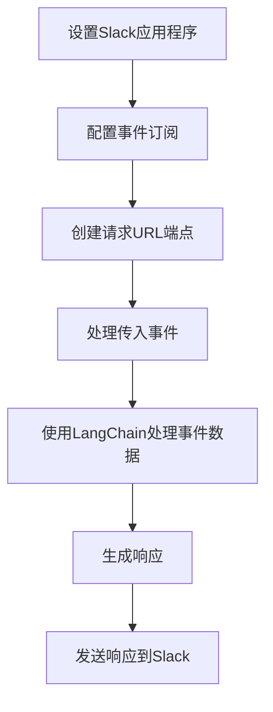

# 【LangChain编程：从入门到实践】构建Slack事件接口

## 1. 背景介绍

### 1.1 什么是LangChain

LangChain是一个用于构建应用程序的框架,这些应用程序利用大型语言模型(LLM)和其他源来协助人类完成各种任务。它旨在成为一种标准化的方式,使开发人员能够轻松地构建基于人工智能的应用程序。

### 1.2 什么是Slack

Slack是一款广受欢迎的团队协作工具,它提供了实时消息传递、文件共享和集成等功能。通过Slack,团队成员可以方便地进行沟通和协作。

### 1.3 为什么要构建Slack事件接口

将LangChain与Slack集成可以为团队带来诸多好处。例如,您可以构建一个聊天机器人,用于回答常见问题、提供技术支持或执行自动化任务。此外,通过Slack事件接口,您可以监听和响应各种事件,如新消息、新成员加入等,从而实现更高级的功能。

## 2. 核心概念与联系

### 2.1 LangChain核心概念

LangChain的核心概念包括:

- **Agents**: 代理是一种高级抽象,可以根据人工智能模型的输出采取行动。
- **Tools**: 工具是可以由代理调用的功能单元,如Google搜索、数据库查询等。
- **Memory**: 内存存储代理与人工交互的历史记录,以保持对话的连贯性。
- **Chains**: 链是一种组合多个较低级别的构建块(如代理、工具、内存等)的方式,以实现更复杂的工作流程。

### 2.2 Slack事件接口概念

Slack事件接口允许您构建应用程序来响应各种事件,如新消息、新成员加入等。其核心概念包括:

- **Events**: 事件是Slack中发生的可观察现象,如新消息、新成员加入等。
- **Event Subscriptions**: 事件订阅允许您指定希望接收哪些事件。
- **Request URLs**: 请求URL是Slack发送事件有效负载的目标URL。

### 2.3 LangChain与Slack事件接口的联系

通过将LangChain与Slack事件接口相结合,我们可以构建智能聊天机器人或自动化工作流程。LangChain提供了处理自然语言输入和输出的能力,而Slack事件接口则允许我们监听和响应各种事件。

例如,我们可以构建一个聊天机器人,当有新消息到达时,它会使用LangChain处理消息内容,并生成相应的响应。或者,我们可以构建一个自动化工作流程,当有新成员加入时,它会使用LangChain生成欢迎消息并发送给新成员。

## 3. 核心算法原理具体操作步骤

构建Slack事件接口与LangChain集成的核心步骤如下:



### 3.1 设置Slack应用程序

首先,您需要在Slack上创建一个新的应用程序。这可以通过访问 https://api.slack.com/ 并单击"创建新应用程序"来完成。

### 3.2 配置事件订阅

接下来,您需要配置应用程序以接收所需的事件。在应用程序设置中,导航到"事件订阅"部分,并启用所需的事件订阅。例如,如果您希望监听新消息事件,请启用"message.channels"事件。

### 3.3 创建请求URL端点

为了接收Slack发送的事件有效负载,您需要创建一个公开可访问的请求URL端点。您可以使用任何Web框架(如Flask、FastAPI等)来创建此端点。

### 3.4 处理传入事件

当Slack发送事件有效负载到您的请求URL端点时,您需要解析并处理该事件。根据事件类型,您可以采取相应的操作。

### 3.5 使用LangChain处理事件数据

对于需要自然语言处理的事件(如新消息),您可以使用LangChain来处理事件数据。例如,您可以使用LangChain的代理和工具来理解消息内容,并生成相应的响应。

### 3.6 生成响应

根据LangChain的输出,您可以生成适当的响应。这可能是一条消息、一个文件或任何其他类型的响应。

### 3.7 发送响应到Slack

最后,您需要将生成的响应发送回Slack。您可以使用Slack Web API来发送消息、上传文件等。

## 4. 数学模型和公式详细讲解举例说明

在构建Slack事件接口与LangChain集成时,可能不需要使用复杂的数学模型或公式。但是,如果您需要在LangChain中使用任何自定义模型或算法,您可以将它们表示为数学公式。

例如,假设您正在构建一个聊天机器人,用于根据用户的消息历史记录预测他们的意图。您可以使用贝叶斯定理来计算每个意图的概率,如下所示:

$$P(I|M) = \frac{P(M|I)P(I)}{P(M)}$$

其中:

- $P(I|M)$ 是给定消息 $M$ 时意图 $I$ 的后验概率
- $P(M|I)$ 是给定意图 $I$ 时观察到消息 $M$ 的似然
- $P(I)$ 是意图 $I$ 的先验概率
- $P(M)$ 是证据因子,用于归一化

您可以使用训练数据来估计 $P(M|I)$ 和 $P(I)$,然后在运行时使用上述公式计算每个意图的后验概率。

或者,如果您正在构建一个自动化工作流程,需要对文本进行情感分析,您可以使用 TF-IDF 算法来计算每个单词的重要性权重:

$$w_{i,j} = tf_{i,j} \times \log\left(\frac{N}{df_i}\right)$$

其中:

- $w_{i,j}$ 是文档 $j$ 中单词 $i$ 的权重
- $tf_{i,j}$ 是单词 $i$ 在文档 $j$ 中出现的频率
- $N$ 是文档总数
- $df_i$ 是包含单词 $i$ 的文档数量

通过计算每个单词的权重,您可以更好地理解文本的情感倾向。

总的来说,虽然构建Slack事件接口与LangChain集成可能不需要复杂的数学模型,但如果您需要自定义算法或模型,可以使用数学公式来表示它们。

## 5. 项目实践: 代码实例和详细解释说明

在本节中,我们将提供一个实际的代码示例,展示如何使用Python和LangChain构建一个简单的Slack事件接口。

### 5.1 安装依赖项

首先,我们需要安装所需的Python包:

```bash
pip install langchain slack_sdk flask
```

### 5.2 创建Flask应用程序

接下来,我们将创建一个Flask应用程序,用于处理Slack事件:

```python
from flask import Flask, request

app = Flask(__name__)

@app.route("/slack/events", methods=["POST"])
def handle_events():
    # 处理传入的Slack事件
    pass

if __name__ == "__main__":
    app.run()
```

### 5.3 处理Slack事件

现在,我们将实现 `handle_events` 函数,以处理传入的Slack事件:

```python
import json
from slack_sdk import WebClient
from langchain import ConversationChain, LLMChain, OpenAI

# 初始化Slack客户端
slack_client = WebClient(token="YOUR_SLACK_BOT_TOKEN")

# 初始化LangChain
llm = OpenAI(temperature=0.9)
conversation = ConversationChain(llm=llm, verbose=True)

@app.route("/slack/events", methods=["POST"])
def handle_events():
    # 解析传入的事件有效负载
    event_data = json.loads(request.data.decode("utf-8"))
    if event_data["type"] == "url_verification":
        # 处理URL验证事件
        return event_data["challenge"]

    # 处理新消息事件
    if event_data["event"]["type"] == "message":
        # 获取消息内容和渠道ID
        message_text = event_data["event"]["text"]
        channel_id = event_data["event"]["channel"]

        # 使用LangChain处理消息
        response = conversation.run(input=message_text)

        # 将响应发送回Slack
        slack_client.chat_postMessage(channel=channel_id, text=response)

    return "OK"
```

在这个示例中,我们首先初始化了Slack客户端和LangChain。然后,在 `handle_events` 函数中,我们解析传入的事件有效负载。如果是URL验证事件,我们返回挑战码。如果是新消息事件,我们获取消息内容和渠道ID,使用LangChain处理消息,并将响应发送回Slack。

请注意,您需要替换 `YOUR_SLACK_BOT_TOKEN` 为您自己的Slack机器人令牌。

### 5.4 运行应用程序

最后,我们可以运行Flask应用程序:

```bash
export FLASK_APP=app.py
flask run
```

现在,您的应用程序应该已经在本地运行,并准备好处理来自Slack的事件。

## 6. 实际应用场景

将LangChain与Slack事件接口集成可以在许多实际场景中发挥作用,例如:

### 6.1 智能聊天机器人

您可以构建一个智能聊天机器人,用于回答团队成员的各种问题。该机器人可以利用LangChain的自然语言处理能力来理解问题,并生成相关的响应。

### 6.2 自动化工作流程

通过监听特定的Slack事件(如新成员加入、新任务创建等),您可以构建自动化工作流程。例如,当有新成员加入时,自动向他们发送欢迎消息;当有新任务创建时,自动分配给相关人员。

### 6.3 知识管理

您可以使用LangChain来构建一个知识管理系统,用于存储和检索团队的知识库。团队成员可以通过Slack与该系统进行交互,查询所需的信息。

### 6.4 情感分析

通过分析Slack消息的情感倾向,您可以了解团队成员的情绪状态。这可以帮助识别潜在的问题,并采取适当的措施来改善团队氛围。

### 6.5 个性化推荐

根据团队成员的兴趣和行为,您可以使用LangChain生成个性化的推荐,如相关资源、工具或培训课程。

## 7. 工具和资源推荐

在构建Slack事件接口与LangChain集成时,以下工具和资源可能会非常有用:

### 7.1 Slack开发者资源

- Slack API 文档: https://api.slack.com/
- Slack事件API参考: https://api.slack.com/events
- Slack Python SDK: https://slack.dev/python-slack-sdk/

### 7.2 LangChain资源

- LangChain官方文档: https://python.langchain.com/en/latest/index.html
- LangChain示例: https://github.com/hwchase17/langchain-examples
- LangChain社区: https://discord.gg/dZcffky3nU

### 7.3 其他有用资源

- Flask Web框架: https://flask.palletsprojects.com/
- OpenAI API文档: https://platform.openai.com/docs/introduction
- Mermaid流程图工具: https://mermaid.js.org/

## 8. 总结: 未来发展趋势与挑战

随着人工智能技术的不断进步,将LangChain与Slack事件接口集成将变得越来越有趣和有价值。未来,我们可能会看到以下发展趋势和挑战:

### 8.1 多模态交互

未来的人工智能系统可能不仅能够处理文本输入,还能够处理图像、语音和视频等多种模态的输入。这将为Slack事件接口带来新的应用场景,如视觉辅助任务、语音命令等。

### 8.2 更智能的代理

LangChain的代理概念将继续发展,代理将变得更加智能和自主。它们可能能够自动选择合适的工具,并根据上下文动态调整行为。

### 8.3 更大规模的语言模型

随着计算能力的提高,我们将能够训练和使用更大规模的语言模型。这将进一步提高自