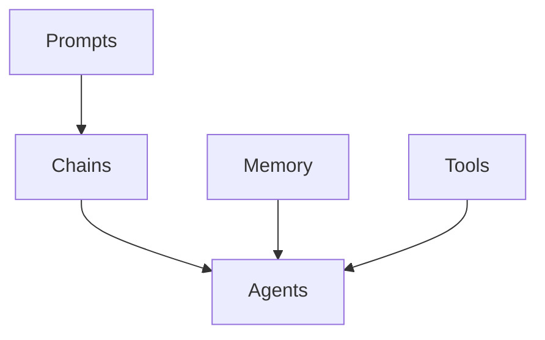

# 【LangChain编程：从入门到实践】资源和工具推荐

## 1. 背景介绍
### 1.1 LangChain简介
LangChain是一个强大的开源框架,旨在帮助开发人员构建由语言模型驱动的应用程序。它提供了一套工具和组件,用于与各种语言模型(如OpenAI GPT系列、Anthropic Claude等)进行交互,并将它们集成到端到端的应用程序中。LangChain的目标是简化语言模型应用的开发过程,使开发人员能够专注于应用逻辑和用户体验。

### 1.2 LangChain的主要特点
- 模块化设计:LangChain采用模块化的架构设计,提供了一系列可组合的组件,如Prompts、Chains、Agents等,开发者可以灵活组合这些组件来构建复杂的应用。
- 多语言模型支持:LangChain支持与多种主流语言模型进行交互,包括OpenAI GPT系列、Anthropic Claude、Cohere等,开发者可以根据需求选择合适的语言模型。
- 丰富的集成选择:LangChain提供了与各种外部数据源和服务的集成,如文档加载器、向量存储、搜索引擎等,方便开发者将语言模型与外部数据和服务结合。
- 可扩展性:LangChain的架构具有很好的可扩展性,开发者可以根据需求自定义组件和扩展功能,以满足特定应用场景的要求。

### 1.3 LangChain的应用场景
LangChain可以应用于各种需要语言理解和生成的场景,例如:
- 聊天机器人:使用LangChain构建智能聊天机器人,实现自然语言交互和对话管理。
- 文本摘要:利用LangChain对长文本进行自动摘要,生成简洁的文本摘要。  
- 问答系统:基于LangChain构建问答系统,根据给定的文本数据回答用户的问题。
- 文本生成:使用LangChain实现各种文本生成任务,如创意写作、内容生成等。
- 知识图谱构建:利用LangChain从非结构化文本中提取实体和关系,辅助构建知识图谱。

## 2. 核心概念与联系
### 2.1 Prompts
Prompts是LangChain中的一个核心概念,它定义了如何与语言模型进行交互。Prompts通过设计特定的输入模板,引导语言模型生成所需的输出。LangChain提供了多种Prompt模板,如FewShotPromptTemplate、PrefixPromptTemplate等,开发者可以根据需求选择合适的Prompt模板或自定义Prompt。

### 2.2 Chains
Chains是LangChain中用于组合多个组件的抽象概念。它允许将多个组件(如Prompts、语言模型、解析器等)链接在一起,形成一个完整的处理流程。常见的Chain类型包括LLMChain、SequentialChain、TransformChain等。Chains可以嵌套组合,构建复杂的应用逻辑。

### 2.3 Agents
Agents是LangChain中的高级抽象,它将Chains与外部工具和服务结合,实现更加智能和自主的行为。Agents可以根据用户输入自动选择和执行适当的Actions,如文档检索、API调用、数据库查询等。LangChain提供了一些预定义的Agent实现,如ZeroShotAgent、ConversationalAgent等。

### 2.4 Memory
Memory是LangChain中用于存储和管理对话状态的组件。在涉及多轮对话的应用中,Memory组件可以跟踪对话的上下文,使得语言模型能够根据之前的对话历史生成更加连贯和相关的响应。LangChain提供了多种Memory实现,如ConversationBufferMemory、ConversationSummaryMemory等。

### 2.5 Tools
Tools是LangChain中与外部数据源和服务交互的组件。它们封装了与特定工具或API的交互逻辑,使得Agents能够方便地访问和操作外部资源。常见的Tools包括搜索引擎、数据库、API接口等。LangChain提供了一些预定义的Tool实现,也支持开发者自定义Tools。

以下是这些核心概念之间的关系图:



## 3. 核心算法原理具体操作步骤
### 3.1 Prompts的使用步骤
1. 选择合适的Prompt模板,如FewShotPromptTemplate、PrefixPromptTemplate等。
2. 定义Prompt模板中的输入变量和格式。
3. 将输入数据传递给Prompt模板,生成最终的Prompt字符串。
4. 将生成的Prompt字符串发送给语言模型进行处理。

### 3.2 Chains的构建步骤
1. 确定Chain的输入和输出格式。
2. 选择合适的组件(如Prompts、语言模型、解析器等)作为Chain的节点。
3. 定义节点之间的数据流和处理逻辑。
4. 按照定义的顺序将组件链接起来,形成完整的Chain。
5. 调用Chain的`run`或`call`方法,传入输入数据,获取处理结果。

### 3.3 Agents的使用步骤
1. 选择合适的Agent类型,如ZeroShotAgent、ConversationalAgent等。
2. 定义Agent可用的Tools,如搜索引擎、数据库查询等。
3. 设置Agent的Prompt模板,定义输入格式和生成指令的模板。
4. 初始化Agent,传入语言模型、Tools和Prompt模板等配置。
5. 调用Agent的`run`方法,传入用户输入,获取Agent的执行结果。

### 3.4 Memory的使用步骤
1. 选择合适的Memory类型,如ConversationBufferMemory、ConversationSummaryMemory等。
2. 初始化Memory对象,设置必要的参数,如最大存储长度、摘要方式等。
3. 在对话过程中,将用户输入和模型生成的响应传递给Memory对象进行存储。
4. 在生成响应时,从Memory对象中获取相关的对话历史,并将其作为上下文传递给语言模型。

### 3.5 Tools的创建步骤
1. 确定Tool的功能和输入输出格式。
2. 实现Tool类,继承自`BaseTool`或`StructuredTool`。
3. 重写`_run`方法,编写Tool的具体逻辑,如API调用、数据库查询等。
4. 设置Tool的名称、描述和参数说明。
5. 将创建的Tool添加到Agent的可用Tools列表中。

## 4. 数学模型和公式详细讲解举例说明
### 4.1 语言模型的数学原理
语言模型的核心是基于概率统计的方法,通过学习大量的文本数据,建立单词或字符之间的概率关系。给定一个单词序列 $w_1, w_2, \dots, w_n$,语言模型的目标是估计该序列的概率:

$$P(w_1, w_2, \dots, w_n) = \prod_{i=1}^n P(w_i | w_1, w_2, \dots, w_{i-1})$$

其中,$P(w_i | w_1, w_2, \dots, w_{i-1})$ 表示在给定前 $i-1$ 个单词的情况下,第 $i$ 个单词为 $w_i$ 的条件概率。

### 4.2 Transformer模型的自注意力机制
Transformer模型引入了自注意力机制,用于捕捉单词之间的长距离依赖关系。自注意力机制的计算过程如下:

1. 将输入的单词向量 $x_1, x_2, \dots, x_n$ 分别乘以三个权重矩阵 $W_Q$、$W_K$、$W_V$,得到查询向量 $Q$、键向量 $K$ 和值向量 $V$:

$$Q = XW_Q, K = XW_K, V = XW_V$$

2. 计算查询向量 $Q$ 与键向量 $K$ 的点积,并除以 $\sqrt{d_k}$ (其中 $d_k$ 是键向量的维度),得到注意力分数:

$$A = \text{softmax}(\frac{QK^T}{\sqrt{d_k}})$$

3. 将注意力分数 $A$ 与值向量 $V$ 相乘,得到加权求和的结果:

$$Z = AV$$

通过自注意力机制,Transformer模型能够有效地捕捉单词之间的依赖关系,提高语言理解和生成的质量。

## 5. 项目实践：代码实例和详细解释说明
以下是一个使用LangChain构建简单问答系统的代码示例:

```python
from langchain.prompts import PromptTemplate
from langchain.llms import OpenAI
from langchain.chains import LLMChain

# 设置OpenAI API密钥
openai_api_key = "your_api_key"

# 定义Prompt模板
template = """
请根据以下背景信息回答问题:

{context}

问题: {question}
"""
prompt = PromptTemplate(
    input_variables=["context", "question"], 
    template=template
)

# 初始化语言模型
llm = OpenAI(openai_api_key=openai_api_key)

# 创建LLMChain
chain = LLMChain(llm=llm, prompt=prompt)

# 设置背景信息和问题
context = "LangChain是一个用于构建由语言模型驱动的应用程序的框架。它提供了一套工具和组件,用于与各种语言模型进行交互,并将它们集成到端到端的应用程序中。"
question = "LangChain的主要功能是什么?"

# 运行Chain获取答案
answer = chain.run(context=context, question=question)
print(answer)
```

代码解释:
1. 首先,我们导入了必要的LangChain组件,包括`PromptTemplate`、`OpenAI`和`LLMChain`。
2. 设置OpenAI API密钥,用于访问OpenAI的语言模型服务。
3. 定义了一个Prompt模板,其中包含了背景信息和问题的占位符。
4. 使用`PromptTemplate`类创建了一个Prompt对象,指定了输入变量和模板。
5. 初始化了一个OpenAI语言模型对象,传入API密钥。
6. 创建了一个`LLMChain`对象,将语言模型和Prompt对象传入。
7. 设置了背景信息和问题的具体内容。
8. 调用`chain.run`方法,传入背景信息和问题,获取语言模型生成的答案。
9. 打印答案。

通过这个示例,我们可以看到使用LangChain构建问答系统的基本流程。LangChain提供了灵活的组件和抽象,使得开发者能够方便地与语言模型交互并构建功能强大的应用。

## 6. 实际应用场景
LangChain在实际应用中有广泛的应用场景,以下是几个具体的例子:

### 6.1 智能客服系统
利用LangChain构建智能客服系统,通过与语言模型的交互,自动理解用户的问题并给出相关的回答。智能客服系统可以处理常见的问题,减轻人工客服的工作量,提高客户服务效率。

### 6.2 文档智能分析
使用LangChain对大量文档进行智能分析和处理。通过文档加载器将文档内容导入,利用语言模型对文档进行分类、摘要、关键信息提取等任务,实现文档的智能化管理和分析。

### 6.3 个性化推荐系统
基于LangChain构建个性化推荐系统,根据用户的历史行为和偏好,利用语言模型生成个性化的推荐内容。通过分析用户的反馈和交互数据,不断优化推荐策略,提供更加准确和有针对性的推荐。

### 6.4 智能写作助手
利用LangChain开发智能写作助手,协助用户进行文章创作。通过提供写作提示、生成文章片段、进行文本纠错和优化等功能,帮助用户提高写作效率和质量。

### 6.5 知识图谱构建
使用LangChain从非结构化文本数据中提取实体和关系,辅助构建知识图谱。通过语言模型的理解能力,识别文本中的关键信息,建立实体之间的语义关联,形成结构化的知识表示。

## 7. 工具和资源推荐
以下是一些有助于学习和使用LangChain的工具和资源:

### 7.1 官方文档
- LangChain官方文档: https://docs.langchain.com/