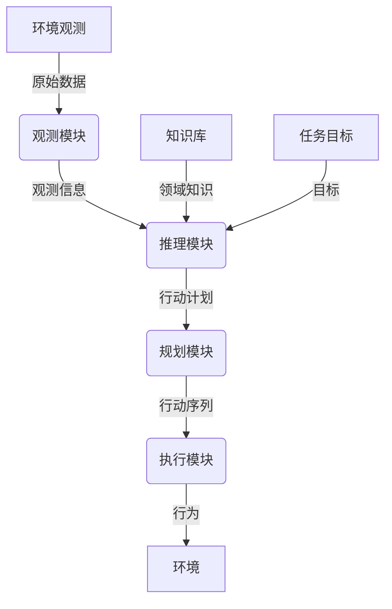

# 【大模型应用开发 动手做AI Agent】Agent的推理引擎：ReAct框架

## 1. 背景介绍

### 1.1 人工智能时代的到来

近年来,人工智能(AI)技术的飞速发展正在推动着各行各业的数字化转型。随着大型语言模型(LLM)和多模态模型的出现,AI系统的能力不断扩展,展现出令人惊叹的认知能力。在这股人工智能浪潮中,智能代理(Agent)无疑成为了备受关注的焦点。

### 1.2 智能代理的作用

智能代理是指能够感知环境、思考决策并采取行动的自主系统。它们可以协助人类完成各种复杂任务,如信息检索、问题解决、决策辅助等,极大地提高了工作效率。随着人工智能技术的不断进步,智能代理的应用场景也在不断扩展,从虚拟助手到自动驾驶汽车,无所不在。

### 1.3 推理引擎的重要性

然而,构建一个真正"智能"的代理并非易事。它需要具备强大的推理能力,能够根据环境信息、知识库和目标,进行逻辑推理、规划决策,并采取相应的行动。因此,推理引擎(Reasoning Engine)作为智能代理的核心组件,其重要性不言而喻。

## 2. 核心概念与联系

### 2.1 推理引擎概述

推理引擎是智能代理系统中负责推理和决策的关键模块。它接收来自环境的观测数据、任务目标以及相关知识,通过逻辑推理和规划算法,生成一系列行动序列,指导代理完成特定任务。

### 2.2 核心模块

一个典型的推理引擎通常包含以下几个核心模块:

1. **观测模块(Perception Module)**: 接收来自环境的原始数据,进行预处理和特征提取,为后续推理提供有价值的观测信息。

2. **知识库(Knowledge Base)**: 存储代理所掌握的领域知识,包括事实、规则、概念等,为推理过程提供必要的背景知识。

3. **推理模块(Reasoning Module)**: 根据观测信息、知识库和任务目标,运行各种推理算法,生成行动计划。

4. **规划模块(Planning Module)**: 将推理模块生成的行动计划进行优化和调度,生成可执行的行动序列。

5. **执行模块(Execution Module)**: 将规划好的行动序列发送给执行器,指导代理与环境进行交互。

这些模块通过有机结合和紧密协作,共同驱动推理引擎的运转,实现智能代理的自主决策和行为控制。



## 3. 核心算法原理具体操作步骤

### 3.1 推理算法

推理模块是推理引擎的核心,它负责根据观测信息、知识库和任务目标,运行各种推理算法,生成行动计划。常见的推理算法包括:

1. **规则推理(Rule-based Reasoning)**: 基于一系列规则,对观测信息进行模式匹配,推导出相应的结论或行动。

2. **案例推理(Case-based Reasoning)**: 根据当前情况与过去储存的案例进行比较,找到最相似的案例,并借鉴其解决方案。

3. **模型推理(Model-based Reasoning)**: 构建环境和任务的形式化模型,通过搜索、约束求解等技术,推导出最优行动序列。

4. **概率推理(Probabilistic Reasoning)**: 利用概率论和统计学方法,根据不确定信息进行推理,得到最可能的结果。

5. **机器学习推理(Machine Learning Reasoning)**: 利用机器学习技术(如深度学习)从大量数据中学习推理模型,进行端到端的推理决策。

不同的推理算法适用于不同的场景和任务,推理引擎需要根据具体需求选择合适的算法或算法组合。

### 3.2 规划算法

规划模块的主要任务是将推理模块生成的行动计划进行优化和调度,生成可执行的行动序列。常见的规划算法包括:

1. **经典规划(Classical Planning)**: 基于环境和任务的形式化模型,利用搜索算法(如A*、IDA*等)找到达成目标的最优行动序列。

2. **启发式规划(Heuristic Planning)**: 通过设计有效的启发式函数,加速经典规划算法的搜索过程。

3. **时序规划(Temporal Planning)**: 考虑行动的时间约束,生成满足时间窗口和并发执行要求的行动序列。

4. **概率规划(Probabilistic Planning)**: 处理不确定环境下的规划问题,生成在概率意义上最优的行动序列。

5. **分层规划(Hierarchical Planning)**: 将复杂任务分解为多个子任务,分层进行规划,提高计算效率。

6. **在线规划(Online Planning)**: 在执行过程中持续感知环境变化,动态调整和重新规划行动序列。

规划算法的选择取决于任务的复杂性、环境的不确定性以及计算资源的限制。合理的算法组合可以提高规划的质量和效率。

## 4. 数学模型和公式详细讲解举例说明

推理引擎中的许多算法都基于数学模型和公式,下面将详细介绍其中的一些核心概念和模型。

### 4.1 马尔可夫决策过程(MDP)

马尔可夫决策过程(Markov Decision Process, MDP)是一种广泛应用于强化学习和规划领域的数学框架。它用于描述一个智能体(Agent)在不确定环境中进行决策序列的过程。

MDP由一个五元组 $(S, A, P, R, \gamma)$ 表示,其中:

- $S$ 是环境的状态集合
- $A$ 是智能体可执行的行动集合
- $P(s'|s,a)$ 是状态转移概率,表示在状态 $s$ 下执行行动 $a$ 后,转移到状态 $s'$ 的概率
- $R(s,a)$ 是即时奖励函数,表示在状态 $s$ 执行行动 $a$ 后获得的即时奖励
- $\gamma \in [0,1)$ 是折现因子,用于权衡即时奖励和未来奖励的重要性

目标是找到一个策略 $\pi: S \rightarrow A$,使得期望的累积折现奖励最大化:

$$
J(\pi) = \mathbb{E}_\pi \left[ \sum_{t=0}^\infty \gamma^t R(s_t, a_t) \right]
$$

其中 $s_t$ 和 $a_t$ 分别表示在时间步 $t$ 的状态和行动。

### 4.2 值函数迭代

值函数迭代(Value Iteration)是一种常用的动态规划算法,用于求解MDP的最优策略。它通过不断更新状态值函数 $V(s)$,逐步逼近最优值函数 $V^*(s)$。

值函数迭代的更新规则为:

$$
V_{k+1}(s) = \max_{a \in A} \left\{ R(s,a) + \gamma \sum_{s' \in S} P(s'|s,a) V_k(s') \right\}
$$

其中 $V_k(s)$ 表示第 $k$ 次迭代时状态 $s$ 的值函数估计。迭代过程会不断改进值函数的估计,直到收敛到最优值函数 $V^*(s)$。

最优策略 $\pi^*(s)$ 可以通过贪婪地选择在每个状态下能够最大化 $Q$ 值的行动来获得:

$$
\pi^*(s) = \arg\max_{a \in A} \left\{ R(s,a) + \gamma \sum_{s' \in S} P(s'|s,a) V^*(s') \right\}
$$

### 4.3 时序规划示例

时序规划(Temporal Planning)是一种考虑行动的时间约束的规划方法。下面以一个简单的机器人导航任务为例,说明时序规划的基本思路。

假设机器人需要从起点 $s_0$ 导航到目标点 $g$,路径上有多个障碍物。机器人的行动包括前进(move)、左转(turn-left)和右转(turn-right)。每个行动都需要一定的时间来执行,并且存在一些时间约束,例如:

- 机器人到达目标点的时间不能超过 $T_{\text{max}}$
- 机器人每执行一次转向行动后,必须在 $\Delta t$ 时间内执行前进行动

我们可以将这个问题建模为一个时序规划问题,其中:

- 状态 $s$ 包括机器人的位置和朝向
- 行动 $a$ 包括前进、左转和右转,每个行动都有相应的持续时间
- 初始状态 $s_0$ 是机器人的起点位置和朝向
- 目标条件是机器人到达目标点 $g$
- 时间约束包括到达目标点的最大时间 $T_{\text{max}}$,以及转向后必须在 $\Delta t$ 时间内前进的约束

通过时序规划算法(如时间网络规划TPN),我们可以找到满足所有时间约束的最优行动序列,指导机器人安全高效地到达目标点。

## 5. 项目实践: 代码实例和详细解释说明

为了更好地理解推理引擎的工作原理,我们将通过一个简单的示例项目来实践上述概念。该项目使用Python和PyTorch实现了一个基于深度Q学习的推理引擎,用于解决一个格子世界(GridWorld)导航问题。

### 5.1 问题描述

在一个 $5 \times 5$ 的格子世界中,智能体(Agent)需要从起点(0,0)导航到终点(4,4)。格子世界中存在一些障碍物格子,智能体不能进入。智能体可以执行四个基本行动:上(0)、下(1)、左(2)、右(3)。每次移动到一个新的格子,智能体会获得相应的即时奖励(可正可负)。目标是找到一条路径,使累积奖励最大化。

### 5.2 环境和代理实现

我们首先定义格子世界环境和智能体代理:

```python
import numpy as np

class GridWorld:
    def __init__(self):
        self.size = 5
        self.obstacles = [(1, 1), (1, 3), (2, 1), (3, 3)]
        self.start = (0, 0)
        self.goal = (4, 4)
        self.rewards = np.zeros((self.size, self.size))
        self.rewards[self.goal] = 10
        for obs in self.obstacles:
            self.rewards[obs] = -10

    def step(self, state, action):
        x, y = state
        if action == 0:  # up
            x = max(x - 1, 0)
        elif action == 1:  # down
            x = min(x + 1, self.size - 1)
        elif action == 2:  # left
            y = max(y - 1, 0)
        elif action == 3:  # right
            y = min(y + 1, self.size - 1)
        new_state = (x, y)
        reward = self.rewards[new_state]
        done = (new_state == self.goal)
        return new_state, reward, done

class Agent:
    def __init__(self, env):
        self.env = env
        self.state = env.start
        self.action_space = [0, 1, 2, 3]  # up, down, left, right

    def reset(self):
        self.state = self.env.start

    def act(self, action):
        new_state, reward, done = self.env.step(self.state, action)
        self.state = new_state
        return new_state, reward, done
```

### 5.3 深度Q网络实现

我们使用深度Q网络(Deep Q-Network, DQN)作为推理引擎的核心,通过强化学习来学习最优策略。DQN使用一个神经网络来近似状态-行动值函数 $Q(s,a)$,并通过经验回放和目标网络等技术来提高训练稳定性。

```python
import torch
import torch.nn as nn
import torch.optim as optim
import random

class DQN(nn.Module):
    def __init__(self, state_size, action_size):
        super(DQN, self).__init__()
        self.fc1 = nn.Linear(state