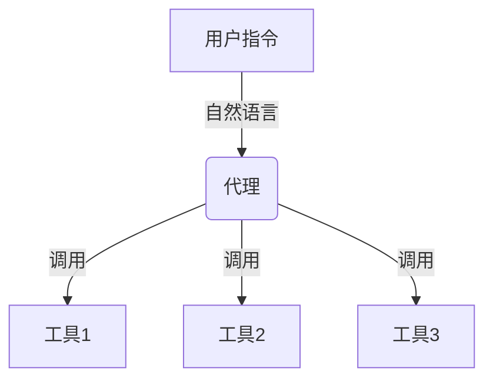
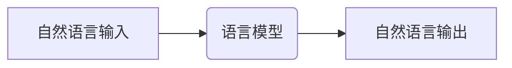
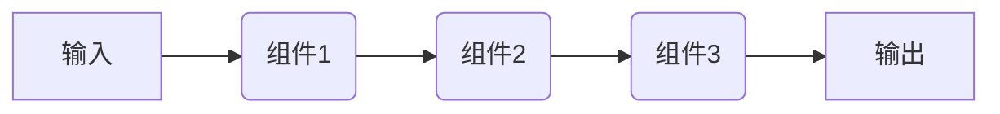
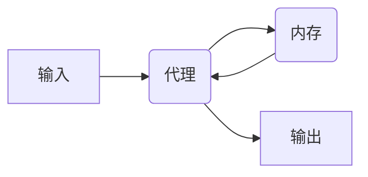
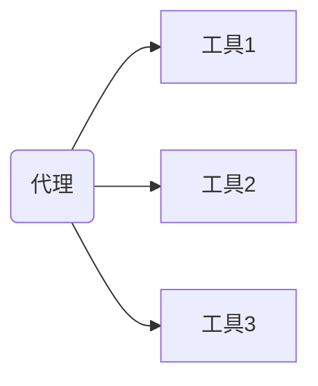
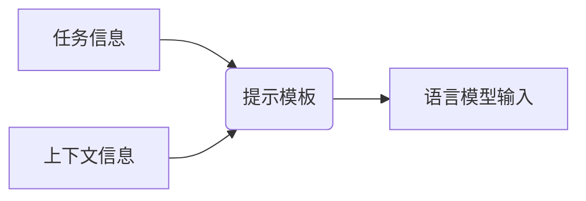

# 【大模型应用开发 动手做AI Agent】LangChain中的六大模块

## 1. 背景介绍

随着人工智能技术的飞速发展,大型语言模型(Large Language Models, LLMs)已经成为当前最炙手可热的技术之一。这些模型通过在海量文本数据上进行训练,展现出令人惊叹的自然语言理解和生成能力,在各个领域都有广泛的应用前景。然而,如何更好地利用这些强大的模型,并将它们集成到实际应用程序中,仍然是一个巨大的挑战。

LangChain 是一个针对大型语言模型应用开发的Python库,旨在简化模型的使用和集成过程。它提供了一系列模块化的构建块,使开发人员能够轻松地构建复杂的应用程序,如问答系统、自动化任务、数据分析等。LangChain 支持多种流行的大型语言模型,如 GPT-3、BLOOM 和 PaLM,并且可以与各种数据源(如文件、API 和数据库)无缝集成。

本文将深入探讨 LangChain 中的六大核心模块,揭示它们的工作原理、使用方法以及实际应用场景。无论您是数据科学家、软件开发人员还是人工智能爱好者,都将从中获益匪浅。让我们一起动手做 AI Agent,发掘大型语言模型的无限潜力!

## 2. 核心概念与联系

在深入探讨 LangChain 的六大模块之前,我们需要先了解一些核心概念和它们之间的关系。这将为您提供一个清晰的大局观,帮助您更好地理解每个模块的作用和集成方式。

### 2.1 代理 (Agent)

代理是 LangChain 中的核心概念,它代表了一个可以执行特定任务的智能实体。代理可以利用各种工具(如搜索引擎、计算器、数据库等)来完成复杂的任务。它们可以被视为一种抽象层,将用户的自然语言指令转化为对底层工具的调用。



### 2.2 语言模型 (Language Model)

语言模型是 LangChain 中另一个关键组件,它提供了自然语言理解和生成的能力。LangChain 支持多种流行的大型语言模型,如 GPT-3、BLOOM 和 PaLM。这些模型可以被用于各种任务,如问答、文本生成、文本摘要等。



### 2.3 链 (Chain)

链是 LangChain 中的另一个重要概念,它将多个组件(如代理、语言模型、工具等)连接在一起,形成一个完整的应用程序流程。链可以被视为一个管道,它接收输入,将其传递给不同的组件进行处理,最终产生所需的输出。



### 2.4 内存 (Memory)

内存是 LangChain 中用于存储和管理上下文信息的组件。它允许代理或其他组件记住之前的对话和操作,从而提供更加连贯和相关的响应。内存可以采用不同的形式,如向量存储、文本存储或自定义存储。



### 2.5 工具 (Tools)

工具是 LangChain 中用于执行特定任务的组件。它们可以是搜索引擎、计算器、数据库查询等。代理可以调用这些工具来完成复杂的任务,而无需直接与底层系统交互。



### 2.6 提示模板 (Prompt Templates)

提示模板是 LangChain 中用于构建语言模型输入的组件。它们定义了如何将任务信息和上下文信息组合成一个完整的提示,以供语言模型处理。提示模板可以是静态的或动态的,并且可以根据需要进行自定义。



通过理解这些核心概念及其关系,您将更好地掌握 LangChain 的工作原理,并能够更有效地构建基于大型语言模型的应用程序。

## 3. 核心算法原理具体操作步骤

在本节中,我们将深入探讨 LangChain 中六大核心模块的算法原理和具体操作步骤。这些模块构成了 LangChain 的基础,为开发人员提供了强大的工具和功能,以便更好地利用大型语言模型。

### 3.1 代理 (Agents)

代理模块是 LangChain 的核心,它允许开发人员构建智能代理,这些代理可以执行复杂的任务,并利用各种工具来完成这些任务。代理的工作原理如下:

1. **任务分解**: 代理首先将复杂的任务分解为一系列较小的子任务。这可以通过语言模型或预定义的规则来实现。
2. **工具选择**: 代理根据当前的子任务,选择最合适的工具来执行该子任务。这可以通过语言模型或预定义的规则来实现。
3. **工具执行**: 代理调用选定的工具,并将工具的输出存储在内存中。
4. **结果合并**: 代理将所有子任务的结果合并,形成对原始任务的最终响应。

以下是使用 LangChain 构建简单代理的示例代码:

```python
from langchain import OpenAI, SerpAPIWrapper, LLMChain
from langchain.agents import initialize_agent, Tool
from langchain.agents import AgentType

# 初始化语言模型
llm = OpenAI(temperature=0)

# 定义工具
tools = [
    Tool(
        name="Search",
        func=SerpAPIWrapper().run,
        description="Useful for searching the internet to answer queries"
    )
]

# 初始化代理
agent = initialize_agent(tools, llm, agent=AgentType.ZERO_SHOT_REACT_DESCRIPTION, verbose=True)

# 运行代理
agent.run("What is the capital of France?")
```

在这个示例中,我们定义了一个搜索引擎工具,并将其与 OpenAI 的语言模型一起初始化为一个代理。代理可以利用搜索引擎来回答有关法国首都的问题。

### 3.2 语言模型 (Language Models)

语言模型模块提供了与各种大型语言模型(如 GPT-3、BLOOM 和 PaLM)的集成。LangChain 支持多种语言模型提供商,如 OpenAI、Anthropic 和 Hugging Face。使用语言模型的一般步骤如下:

1. **初始化**: 首先,需要初始化语言模型对象,并提供必要的凭据(如 API 密钥)。
2. **提示构建**: 使用提示模板或自定义逻辑构建输入提示。
3. **模型调用**: 将提示传递给语言模型,并获取模型的输出。
4. **输出处理**: 根据需要对模型输出进行进一步处理,如格式化、过滤或解析。

以下是使用 OpenAI 的 GPT-3 模型进行文本生成的示例代码:

```python
from langchain import OpenAI, PromptTemplate

# 初始化语言模型
llm = OpenAI(model_name="text-davinci-003")

# 定义提示模板
template = """
You are a highly skilled writer tasked with writing a short story on the topic of {topic}. The story should be engaging, creative, and no more than 500 words long.

Topic: {topic}

Story:
"""
prompt = PromptTemplate(template=template, input_variables=["topic"])

# 生成文本
topic = "A journey through a magical forest"
story = llm(prompt.format(topic=topic))
print(story)
```

在这个示例中,我们使用 PromptTemplate 构建了一个提示模板,并将其与 GPT-3 模型一起使用,生成了一个关于"魔法森林之旅"的短篇小说。

### 3.3 链 (Chains)

链模块允许开发人员将多个组件(如代理、语言模型和工具)连接在一起,形成一个完整的应用程序流程。链的工作原理如下:

1. **组件定义**: 定义要在链中使用的各个组件,如代理、语言模型和工具。
2. **链构建**: 使用 LangChain 提供的各种链类型(如序列链、转换链等)将组件连接在一起。
3. **输入传递**: 将输入数据传递给链的第一个组件。
4. **数据流动**:数据在链中的各个组件之间流动,每个组件对数据进行处理。
5. **输出获取**: 从链的最后一个组件获取最终的输出结果。

以下是使用 LangChain 构建一个简单的问答链的示例代码:

```python
from langchain import OpenAI, PromptTemplate, LLMChain
from langchain.chains import SimpleSequentialChain

# 初始化语言模型
llm = OpenAI(temperature=0)

# 定义问答提示模板
question_template = PromptTemplate(input_variables=["question"], template="{question}")
answer_template = PromptTemplate(input_variables=["question", "answer"], template="Question: {question}\nAnswer: {answer}")

# 构建问答链
question_chain = LLMChain(llm=llm, prompt=question_template)
answer_chain = LLMChain(llm=llm, prompt=answer_template)
qa_chain = SimpleSequentialChain(chains=[question_chain, answer_chain])

# 运行问答链
result = qa_chain.run("What is the capital of France?")
print(result)
```

在这个示例中,我们定义了两个提示模板,分别用于问题和答案。然后,我们使用 SimpleSequentialChain 将这两个提示模板连接在一起,形成一个问答链。当我们运行这个链时,它会首先将问题传递给第一个链,生成一个答案,然后将问题和答案一起传递给第二个链,生成最终的格式化输出。

### 3.4 内存 (Memory)

内存模块允许代理和其他组件存储和检索上下文信息,从而提供更加连贯和相关的响应。内存的工作原理如下:

1. **内存初始化**: 首先,需要初始化一个内存对象,可以选择不同的内存类型,如向量存储、文本存储或自定义存储。
2. **数据存储**: 在交互过程中,代理或其他组件可以将相关信息存储在内存中。
3. **数据检索**: 在需要时,代理或其他组件可以从内存中检索之前存储的信息。
4. **响应生成**: 代理或其他组件可以利用从内存中检索的信息,生成更加连贯和相关的响应。

以下是使用 LangChain 的向量存储内存的示例代码:

```python
from langchain import OpenAI, VectorStoreInfo
from langchain.chains import ConversationChain
from langchain.memory import ConversationBufferMemory

# 初始化语言模型和内存
llm = OpenAI(temperature=0)
memory = ConversationBufferMemory()

# 构建对话链
conversation = ConversationChain(
    llm=llm,
    memory=memory,
    verbose=True
)

# 运行对话链
conversation.predict(input="Hi there!")
conversation.predict(input="What's my name?")
conversation.predict(input="I don't think I've told you my name. My name is John.")
conversation.predict(input="Hi John, nice to meet you! How are you doing today?")
```

在这个示例中,我们使用 ConversationBufferMemory 初始化了一个内存对象,并将其与语言模型一起传递给 ConversationChain。在对话过程中,代理会自动将相关信息存储在内存中,并在生成响应时利用这些信息。这样,代理就可以记住之前的对话内容,并提供更加连贯和相关的响应。

### 3.5 工具 (Tools)

工具模块提供了各种预定义的工具,如搜索引擎、计算器、数据库查询等。代理可以调用这些工具来完成复杂的任务。工具的工作原理如下:

1. **工具定义**: 首先,需要定义一个工具对象,包括工具的名称、描述和执行函数