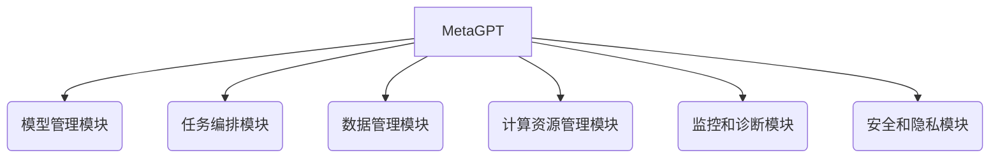

# 【大模型应用开发 动手做AI Agent】MetaGPT简介

## 1.背景介绍

### 1.1 人工智能大模型的兴起

近年来,人工智能领域取得了令人瞩目的进展,尤其是大型语言模型(Large Language Models, LLMs)的出现,引发了广泛关注和热议。这些模型通过消化海量文本数据,学习语言的语义和上下文关系,从而获得了惊人的自然语言理解和生成能力。

代表性的大模型有 GPT-3、PaLM、ChatGPT等,它们不仅能够完成问答、文本续写、文本摘要等传统任务,更展现出跨领域的知识迁移和推理能力,在编程、数学、逻辑推理等复杂任务上也有出色表现。这些大模型被认为是通用人工智能(Artificial General Intelligence, AGI)的重要里程碑。

### 1.2 MetaGPT: 面向大模型应用开发的新范式

虽然现有大模型已经展现出强大的能力,但要将它们应用于实际场景并非易事。每个大模型都有自身的特点和局限性,需要针对具体任务进行微调和优化。此外,大模型的计算资源需求巨大,部署和维护成本高昂。

为了降低大模型应用开发的门槛,MetaGPT应运而生。它是一个面向大模型应用开发的新范式,提供了一套统一的开发框架和工具链,旨在简化大模型应用的开发、部署和管理过程。

## 2.核心概念与联系

### 2.1 MetaGPT架构概览

MetaGPT采用了微服务架构,由多个模块组成,包括:

- **模型管理模块**: 负责管理和维护各种大模型,支持模型的上传、下载、版本控制等功能。
- **任务编排模块**: 提供可视化界面,允许开发者定义和编排任务流程,组合多个模型和算法完成复杂任务。
- **数据管理模块**: 管理训练数据、中间数据和结果数据,支持数据版本控制和跟踪。
- **计算资源管理模块**: 管理和调度计算资源,包括CPU、GPU、TPU等,实现资源的按需分配和弹性扩缩容。
- **监控和诊断模块**: 监控系统运行状态,记录日志,提供性能诊断和优化建议。
- **安全和隐私模块**: 保护模型、数据和计算资源的安全,实现访问控制和隐私保护。



### 2.2 关键技术

MetaGPT的核心技术包括:

- **模型选择和组合**: 根据任务需求,从模型库中选择合适的大模型,并将多个模型组合形成复合模型,以提高性能和准确性。
- **模型微调**: 基于任务数据,对选定的大模型进行微调,使其更加适应特定任务。
- **多模型集成**: 将多个大模型的输出进行集成,提高预测的稳定性和鲁棒性。
- **自动化机器学习(AutoML)**: 自动化模型选择、超参数调优、特征工程等机器学习流程,降低开发难度。
- **模型压缩和加速**: 通过模型剪枝、量化、知识蒸馏等技术,压缩大模型的规模,提高推理速度。

## 3.核心算法原理具体操作步骤 

### 3.1 模型选择和组合算法

MetaGPT采用了一种基于任务描述和模型元数据的模型选择和组合算法。算法的主要步骤如下:

1. **任务描述向量化**: 将任务描述文本转换为向量表示,可以使用预训练的语言模型进行编码。

2. **模型元数据向量化**: 将每个大模型的元数据(如模型描述、训练数据来源等)转换为向量表示。

3. **相似度计算**: 计算任务描述向量与每个模型元数据向量的相似度,可以使用余弦相似度或其他相似度度量。

4. **模型排序和选择**: 根据相似度对模型进行排序,选择前 N 个最相关的模型作为候选模型。

5. **模型组合策略**: 根据任务复杂度和模型能力,采用不同的模型组合策略,如序列组合(各模型依次处理)、并行组合(各模型同时处理)、混合组合等。

6. **组合模型微调(可选)**: 对组合后的复合模型进行进一步的微调,提高其在特定任务上的性能。

该算法的优点是能够自动匹配最合适的模型,并通过组合不同模型的优势,提高任务处理的效果。

### 3.2 模型微调算法

对于选定的大模型,MetaGPT采用了一种基于对比学习(Contrastive Learning)的微调算法,以提高模型在特定任务上的性能。算法步骤如下:

1. **构建对比样本对**: 从任务数据中采样出正样本(与任务相关)和负样本(与任务无关),构建正负样本对。

2. **编码样本对**: 使用大模型对正负样本对进行编码,得到样本对的向量表示。

3. **计算对比损失**: 使用对比损失函数(如NT-Xent损失),最大化正样本对的相似度,最小化负样本对的相似度。

4. **微调模型参数**: 使用对比损失对大模型进行微调,使其在编码时能够更好地区分正负样本,提高任务相关性。

5. **迭代训练(可选)**: 重复上述步骤,直到模型收敛或达到预设的训练轮次。

该算法的优点是能够充分利用任务数据的信息,使大模型的表示更加关注任务相关的特征,从而提高模型在特定任务上的性能。

## 4.数学模型和公式详细讲解举例说明

### 4.1 NT-Xent对比损失函数

在模型微调算法中,我们使用了NT-Xent(Normalized Temperature-scaled Cross Entropy Loss)作为对比损失函数。其数学表达式如下:

$$\ell_{i,j} = -\log\frac{\exp(\mathrm{sim}(z_i, z_j)/\tau)}{\sum_{k=1}^{2N}\mathbb{1}_{[k\neq i]}\exp(\mathrm{sim}(z_i, z_k)/\tau)}$$

其中:

- $z_i$和$z_j$分别是正样本对中的两个样本的编码向量
- $\mathrm{sim}(u, v)$是两个向量的相似度函数,通常使用余弦相似度
- $\tau$是一个温度超参数,用于控制相似度分布的平滑程度
- $N$是一个批次中的样本数量
- $\mathbb{1}_{[k\neq i]}$是指示函数,当$k\neq i$时值为1,否则为0

该损失函数的目标是最大化正样本对的相似度,最小化负样本对的相似度。通过优化该损失函数,模型将学习到能够区分正负样本的表示。

### 4.2 余弦相似度

在NT-Xent损失函数中,我们使用了余弦相似度来衡量两个向量之间的相似程度。余弦相似度的数学表达式如下:

$$\mathrm{sim}(u, v) = \frac{u \cdot v}{\|u\|\|v\|}$$

其中$u$和$v$是两个向量,$\cdot$表示向量点积,$ \|\cdot\| $表示向量的$L_2$范数。

余弦相似度的取值范围是$[-1, 1]$,当两个向量的方向完全相同时,余弦相似度为1;当两个向量的方向完全相反时,余弦相似度为-1;当两个向量正交时,余弦相似度为0。

使用余弦相似度的优点是,它只考虑向量的方向,而不受向量的模长影响,这在一定程度上可以缓解数据的尺度差异问题。

## 5.项目实践:代码实例和详细解释说明

下面是一个使用MetaGPT进行文本分类任务的示例代码,包括模型选择、微调和预测三个步骤。

### 5.1 模型选择

```python
from metagpt import ModelHub, TaskDescription

# 定义任务描述
task_desc = TaskDescription(
    "对给定的新闻文本进行分类,将其划分为政治、经济、体育、娱乐等类别。"
)

# 初始化模型库
model_hub = ModelHub()

# 选择最合适的模型
selected_models = model_hub.select_models(task_desc, top_n=3)
```

在这个示例中,我们首先定义了任务描述,然后初始化了`ModelHub`对象。使用`select_models`方法,我们根据任务描述选择了最相关的三个大模型。

### 5.2 模型微调

```python
from metagpt import ContrastiveTrainer

# 加载训练数据
train_data = load_data("news_classification_train.csv")

# 初始化对比训练器
trainer = ContrastiveTrainer(
    models=selected_models,
    temperature=0.07,
    max_epochs=10,
)

# 进行对比学习微调
finetuned_model = trainer.fit(train_data)
```

在这个步骤中,我们加载了文本分类任务的训练数据,然后初始化了`ContrastiveTrainer`对象。`ContrastiveTrainer`将使用对比学习算法对选定的模型进行微调。我们设置了温度超参数`temperature`为0.07,最大训练轮次`max_epochs`为10。最后,调用`fit`方法进行模型微调,得到微调后的模型`finetuned_model`。

### 5.3 模型预测

```python
# 加载测试数据
test_data = load_data("news_classification_test.csv")

# 进行预测
predictions = finetuned_model.predict(test_data)

# 评估模型性能
evaluate_model(predictions, test_data.labels)
```

在最后一步,我们加载了测试数据,使用微调后的模型`finetuned_model`对测试数据进行预测,得到预测结果`predictions`。然后,我们可以使用`evaluate_model`函数评估模型在测试集上的性能,如准确率、F1分数等指标。

通过这个示例,我们可以看到MetaGPT提供了简单易用的API,能够轻松地进行模型选择、微调和预测,大大降低了大模型应用开发的难度。

## 6.实际应用场景

MetaGPT可以应用于各种需要自然语言处理能力的场景,包括但不限于:

### 6.1 智能问答系统

利用大模型的自然语言理解和生成能力,构建覆盖多个领域的智能问答系统,为用户提供准确、全面的答复。

### 6.2 自动文本摘要

通过对文本进行语义理解和关键信息提取,自动生成高质量的文本摘要,为用户节省时间,提高工作效率。

### 6.3 内容创作辅助

大模型可以根据给定的主题和要求,生成高质量的文本内容,如新闻报道、营销文案、小说故事等,为内容创作者提供有力辅助。

### 6.4 代码生成和解释

利用大模型在编程领域的能力,可以根据需求自动生成代码,或者对现有代码进行解释和优化,提高开发效率。

### 6.5 知识图谱构建

通过对大量非结构化文本进行理解和知识提取,自动构建覆盖多个领域的知识图谱,为智能搜索、问答等应用提供知识支撑。

### 6.6 多模态处理

结合计算机视觉、语音识别等技术,大模型可以实现多模态数据的理解和生成,如图像描述、视频字幕、语音转文本等。

## 7.工具和资源推荐

### 7.1 开源工具

- **Hugging Face Transformers**: 一个提供多种预训练模型和工具的开源库,支持模型微调、推理等功能。
- **OpenAI Triton**: 一个用于优化和部署大模型的开源工具,提供了高效的模型并行化和推理加速功能。
- **AllenNLP**: 一个灵活的自然语言处理开源库,提供了各种任务的数据集和模型实现。

### 7.2 商业云服务

- **AWS Sag