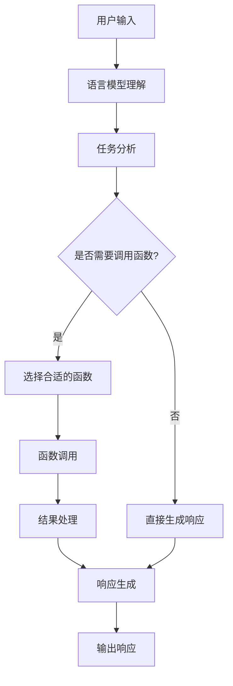

# 【大模型应用开发 动手做AI Agent】什么是Functions

## 1.背景介绍

在人工智能和机器学习的领域中,大型语言模型(Large Language Models, LLMs)已经成为一个重要的研究热点。这些模型能够理解和生成人类语言,为各种自然语言处理任务提供强大的能力。其中,OpenAI推出的GPT-3模型在2020年引起了广泛关注,展现了大型语言模型在生成高质量文本、回答问题、编写代码等任务中的卓越表现。

随着模型规模和计算能力的不断增长,大型语言模型的应用场景也在不断扩展。其中,一个值得关注的领域是将大型语言模型转化为AI Agent,赋予其主动性、目标导向性和持续学习能力,使其能够更好地与人类协作,完成复杂的任务。

在这个背景下,Functions(函数调用)作为一种新兴的人工智能系统范式,为构建AI Agent提供了有力支持。Functions允许AI Agent通过调用预先定义的函数来执行特定任务,从而扩展其能力边界。这种范式将AI Agent的推理能力与外部函数的执行能力相结合,为开发更加智能、更加通用的AI系统提供了新的思路。

## 2.核心概念与联系

### 2.1 大型语言模型(LLMs)

大型语言模型是一种基于深度学习的自然语言处理模型,通过在大量文本数据上进行训练,学习语言的语义和语法规则。这些模型能够理解和生成人类语言,在文本生成、问答、文本摘要、机器翻译等任务中表现出色。

著名的大型语言模型包括GPT-3、BERT、XLNet等。这些模型通过自注意力机制和transformer架构,捕捉语言中的长程依赖关系,从而生成更加连贯、流畅的文本。

### 2.2 AI Agent

AI Agent是一种具有自主性、目标导向性和持续学习能力的智能系统。它能够感知环境,做出决策并采取行动,以实现特定目标。AI Agent通常具有以下特点:

1. 感知能力:能够观察和理解环境信息。
2. 决策能力:根据感知到的信息和内部状态,做出合理的决策。
3. 行动能力:能够执行相应的行动,影响环境状态。
4. 学习能力:通过与环境的交互,不断优化决策策略和知识库。

AI Agent可以应用于各种领域,如游戏AI、机器人控制、智能助理等。

### 2.3 Functions(函数调用)

Functions是一种新兴的人工智能系统范式,它允许AI Agent通过调用预先定义的函数来执行特定任务。这些函数可以是各种类型的操作,如数据查询、API调用、计算任务等。

Functions的核心思想是将AI Agent的推理能力与外部函数的执行能力相结合,扩展AI Agent的能力边界。AI Agent可以根据当前任务和上下文,选择合适的函数进行调用,获取所需的信息或执行特定操作。

Functions为构建更加智能、更加通用的AI系统提供了新的思路,使AI Agent能够利用各种外部资源和能力,完成复杂的任务。

### 2.4 核心概念联系

大型语言模型为构建AI Agent提供了强大的自然语言理解和生成能力,是AI Agent的基础。Functions则为AI Agent提供了一种扩展能力的方式,使其能够通过调用外部函数来执行各种任务。

将大型语言模型与Functions相结合,可以构建出更加智能、更加通用的AI Agent。AI Agent可以利用语言模型进行自然语言交互,理解用户的需求和指令;同时,它可以根据任务需求,选择合适的函数进行调用,获取所需的信息或执行特定操作,从而完成复杂的任务。

这种结合不仅提高了AI Agent的能力,也使其更加灵活和可扩展。随着新的函数不断被添加,AI Agent的功能也会相应扩展,从而适应不断变化的需求。

## 3.核心算法原理具体操作步骤

将大型语言模型与Functions相结合,构建AI Agent的核心算法原理和具体操作步骤如下:



1. **用户输入**:用户通过自然语言(文本或语音)向AI Agent提出需求或指令。

2. **语言模型理解**:大型语言模型对用户输入进行理解,捕捉其中的语义和意图。

3. **任务分析**:AI Agent分析用户输入,确定需要执行的任务类型和所需的信息或操作。

4. **是否需要调用函数**:根据任务需求,AI Agent判断是否需要调用外部函数。

5. **选择合适的函数**:如果需要调用函数,AI Agent从可用的函数集合中选择合适的函数。

6. **函数调用**:AI Agent调用选定的函数,传递必要的参数,并获取函数执行结果。

7. **结果处理**:AI Agent对函数执行结果进行处理和整合,以便生成最终响应。

8. **直接生成响应**:如果不需要调用函数,AI Agent直接基于语言模型和任务分析,生成响应。

9. **响应生成**:AI Agent利用语言模型,根据任务需求和获取的信息,生成自然语言响应。

10. **输出响应**:AI Agent将生成的响应以文本或语音的形式输出给用户。

在这个过程中,大型语言模型负责理解用户输入和生成自然语言响应,而Functions则为AI Agent提供了执行各种任务的能力。通过灵活地选择和调用合适的函数,AI Agent可以完成复杂的任务,实现更强大的功能。

## 4.数学模型和公式详细讲解举例说明

在将大型语言模型与Functions相结合的过程中,涉及到一些重要的数学模型和公式,下面将对它们进行详细讲解和举例说明。

### 4.1 自注意力机制(Self-Attention)

自注意力机制是大型语言模型中的关键技术,它允许模型捕捉输入序列中任意两个位置之间的依赖关系,从而更好地理解语言的上下文信息。

自注意力机制的核心思想是将输入序列中的每个位置都映射为一个向量,然后计算这些向量之间的相似性分数,并根据这些分数对向量进行加权求和,得到该位置的表示向量。

具体来说,对于长度为 $n$ 的输入序列 $X = (x_1, x_2, \ldots, x_n)$,自注意力机制的计算过程如下:

1. 将每个输入向量 $x_i$ 映射为查询向量 $q_i$、键向量 $k_i$ 和值向量 $v_i$:

$$q_i = x_i W^Q, k_i = x_i W^K, v_i = x_i W^V$$

其中 $W^Q$、$W^K$ 和 $W^V$ 分别是可学习的权重矩阵。

2. 计算查询向量和所有键向量之间的相似性分数:

$$e_{ij} = \frac{q_i^T k_j}{\sqrt{d_k}}$$

其中 $d_k$ 是缩放因子,用于防止点积值过大导致梯度消失或爆炸。

3. 对相似性分数进行软最大化操作,得到注意力权重:

$$a_{ij} = \mathrm{softmax}(e_{ij}) = \frac{\exp(e_{ij})}{\sum_{k=1}^n \exp(e_{ik})}$$

4. 根据注意力权重对值向量进行加权求和,得到该位置的表示向量:

$$y_i = \sum_{j=1}^n a_{ij} v_j$$

通过自注意力机制,大型语言模型能够捕捉输入序列中任意两个位置之间的依赖关系,从而更好地理解语言的上下文信息。这种机制在机器翻译、文本生成等任务中发挥了关键作用。

### 4.2 transformer架构

transformer架构是大型语言模型中常用的一种序列到序列(Sequence-to-Sequence)模型架构,它完全基于自注意力机制,不依赖于循环神经网络(RNN)或卷积神经网络(CNN)。

transformer架构主要由编码器(Encoder)和解码器(Decoder)两部分组成。编码器负责将输入序列映射为一系列向量表示,而解码器则根据这些向量表示生成输出序列。

编码器和解码器的具体结构如下:

1. **编码器(Encoder)**:

编码器由多个相同的层组成,每一层包括两个子层:

- 多头自注意力子层(Multi-Head Self-Attention Sublayer):对输入序列进行自注意力计算,捕捉序列中任意两个位置之间的依赖关系。
- 前馈网络子层(Feed-Forward Sublayer):对自注意力的输出进行进一步的非线性变换,提取更高级的特征表示。

2. **解码器(Decoder)**:

解码器也由多个相同的层组成,每一层包括三个子层:

- 掩码多头自注意力子层(Masked Multi-Head Self-Attention Sublayer):对输出序列进行自注意力计算,但只允许关注当前位置及其之前的位置,以保持自回归性质。
- 多头注意力子层(Multi-Head Attention Sublayer):将编码器的输出与解码器的输出进行注意力计算,捕捉输入序列和输出序列之间的依赖关系。
- 前馈网络子层(Feed-Forward Sublayer):对注意力的输出进行进一步的非线性变换,提取更高级的特征表示。

transformer架构的优点在于并行计算能力强、长期依赖建模能力好,能够有效捕捉长距离的依赖关系。它在机器翻译、文本生成等任务中取得了卓越的表现,成为大型语言模型的主流架构之一。

## 5.项目实践:代码实例和详细解释说明

为了更好地理解将大型语言模型与Functions相结合的过程,我们将通过一个具体的代码实例进行演示和说明。在这个示例中,我们将使用Python编程语言和Hugging Face的Transformers库,构建一个简单的AI Agent,它能够根据用户的输入调用相应的函数,并生成自然语言响应。

### 5.1 导入必要的库

```python
import torch
from transformers import GPT2LMHeadModel, GPT2Tokenizer
import openai
import os
```

我们首先导入必要的库,包括PyTorch、Hugging Face的Transformers库和OpenAI的API库。在这个示例中,我们将使用GPT-2作为语言模型,并通过OpenAI的API调用函数。

### 5.2 加载语言模型和tokenizer

```python
model_name = "gpt2"
tokenizer = GPT2Tokenizer.from_pretrained(model_name)
model = GPT2LMHeadModel.from_pretrained(model_name)
```

我们加载GPT-2语言模型和对应的tokenizer。tokenizer用于将文本转换为模型可以理解的数字序列,而模型则负责生成文本。

### 5.3 定义函数调用器

```python
openai.api_key = os.environ["OPENAI_API_KEY"]

def call_function(function_name, args):
    if function_name == "openai":
        response = openai.Completion.create(
            engine="text-davinci-003",
            prompt=args,
            max_tokens=1024,
            n=1,
            stop=None,
            temperature=0.7,
        )
        return response.choices[0].text
    else:
        raise ValueError(f"Unknown function: {function_name}")
```

我们定义了一个`call_function`函数,用于调用外部函数。在这个示例中,我们只实现了调用OpenAI的API,但是您可以根据需要添加更多的函数。

`call_function`函数接受两个参数:函数名称(`function_name`)和函数参数(`args`)。如果函数名称为`"openai"`,它将调用OpenAI的API,生成一段文本作为响应。否则,它将抛出一个`ValueError`异常。

### 5.4 定义AI Agent

```python
def generate_response(input_text):
    input_ids = tokenizer.encode(input_text, return_tensors="pt")
    output = model.generate(
        input_ids,
        max_length=1024,