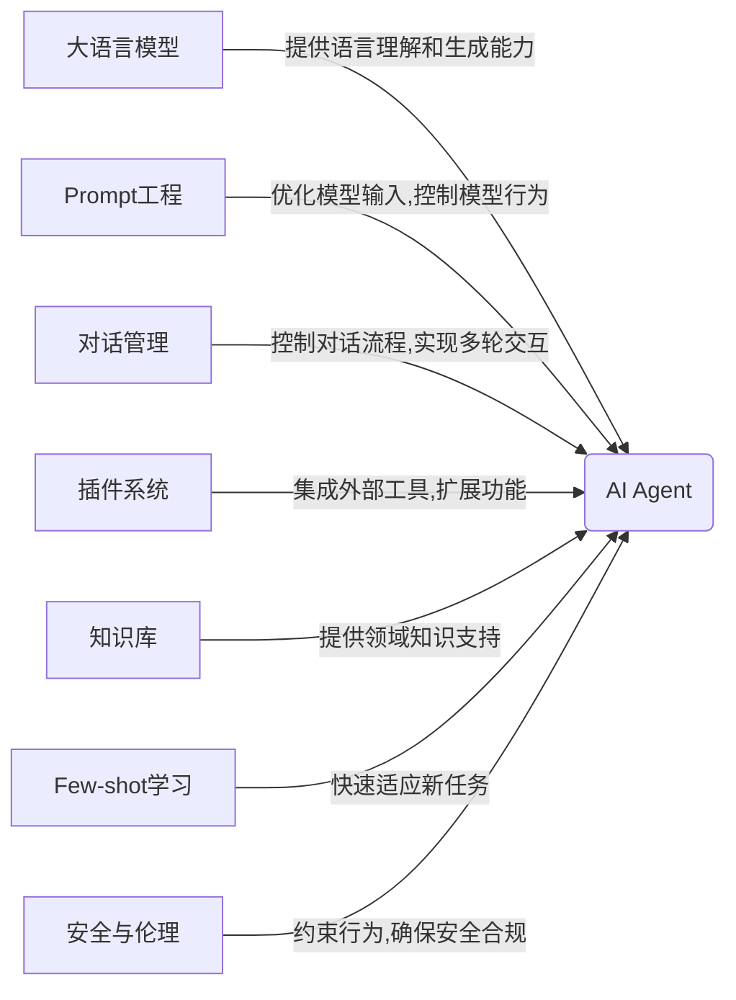

# 【大模型应用开发 动手做AI Agent】初始化对话和定义可用函数

## 1. 背景介绍
### 1.1 大语言模型的兴起
近年来,随着深度学习技术的飞速发展,尤其是Transformer架构的提出,自然语言处理领域取得了突破性的进展。以GPT、BERT等为代表的大语言模型(Large Language Models, LLMs)在各种NLP任务上取得了超越人类的性能,展现出了惊人的语言理解和生成能力。这些大语言模型通过在海量文本数据上进行预训练,学习到了丰富的语言知识和常识,具备了强大的zero-shot和few-shot学习能力。

### 1.2 大模型应用开发面临的挑战
尽管大语言模型展现出了巨大的潜力,但如何将其有效应用到实际场景中,打造智能化的AI应用,仍然面临诸多挑战:
1. 缺乏面向应用开发的工具和框架支持,开发门槛高
2. 对话管理和多轮交互能力有限
3. 难以集成外部知识和工具,泛化能力不足
4. 缺乏安全可控和伦理约束机制

### 1.3 AI Agent的兴起 
为了应对上述挑战,业界和学术界开始探索构建AI Agent的方法。AI Agent是一种基于大语言模型,集成对话管理、外部工具、知识库等模块的智能系统,能够与人进行多轮对话交互,执行任务,回答问题。通过引入Prompt工程、Few-shot Learning、Plugins等技术,AI Agent能够更好地适应特定领域,完成复杂任务。代表性的AI Agent包括Anthropic的Claude、OpenAI的ChatGPT等。

## 2. 核心概念与关联
要开发一个AI Agent,需要理解以下几个核心概念:
### 2.1 大语言模型(Large Language Models)
大语言模型是AI Agent的核心组件,负责自然语言理解和生成。它们通过在大规模语料上预训练,学习语言知识,具备强大的语言理解和生成能力。常见的大语言模型包括GPT系列、BERT、PaLM等。

### 2.2 Prompt工程(Prompt Engineering) 
Prompt工程是一种通过设计输入文本模板(Prompt),引导大语言模型生成期望输出的技术。通过精心设计Prompt模板,可以控制模型的行为,提高特定任务的表现。常见的Prompt技术包括Few-shot Prompting、Chain-of-Thought Prompting等。

### 2.3 对话管理(Dialogue Management)
对话管理负责控制人机对话的流程,记录对话历史,理解用户意图,决策下一步动作。常见的对话管理框架有有限状态机(FSM)、框架型对话管理等。一个好的对话管理模块可以使Agent具备多轮交互能力,引导对话进行。

### 2.4 插件系统(Plugin System)
插件系统允许Agent集成外部工具和API,扩展其功能。例如,Agent可以通过调用搜索引擎API进行网络搜索,通过数据库API查询结构化数据,通过调用Python解释器执行代码等。插件系统使Agent具备调用外部工具的能力,大大增强了其适应不同任务的能力。

### 2.5 知识库(Knowledge Base) 
为了回答问题,执行任务,Agent需要集成领域知识。知识库以结构化或非结构化的形式存储领域知识,供Agent查询和利用。常见的知识库形式包括图谱、文档、数据库等。

### 2.6 few-shot学习(Few-shot Learning)
Few-shot学习使Agent能够通过少量示例快速适应新任务。通过向Prompt中添加任务示例,Agent可以理解任务要求,生成匹配的响应。Few-shot学习提高了Agent应对新任务的灵活性。

### 2.7 安全与伦理(Safety and Ethics)
由于大语言模型强大的生成能力,构建安全、合乎伦理的AI Agent至关重要。需要采取内容过滤、行为约束等措施,防止Agent产生有害、虚假或偏见的内容。同时要遵循隐私保护、公平性等伦理原则。

以上概念之间紧密关联,共同构成了AI Agent的核心要素:


## 3. 核心算法原理与具体操作步骤
构建一个AI Agent涉及多个模块,每个模块都有其核心算法。下面以对话管理模块为例,介绍其核心算法原理和操作步骤。

### 3.1 对话管理核心算法
对话管理的核心是决策对话动作(Dialogue Act),即根据当前对话状态,用户意图,确定下一步系统应采取的行为,比如提问、澄清、回答等。常见的对话管理算法包括:
1. 有限状态机(Finite State Machine, FSM):将对话流程抽象为一系列状态和转移条件,根据当前状态和输入决定下一个状态。
2. 框架型对话管理(Frame-based Dialogue Management):通过填充任务框架的槽位值(slot),收集完成任务所需的信息,再执行相应动作。 
3. 深度强化学习(Deep Reinforcement Learning):将对话管理看作一个序贯决策过程,通过深度强化学习算法(如DQN、PPO)学习最优对话策略。

### 3.2 基于有限状态机的对话管理算法步骤
下面以有限状态机(FSM)为例,介绍其具体操作步骤:
1. 定义对话状态集合S,如:开始状态、提问状态、回答状态、结束状态等。
2. 定义对话动作集合A,如:打招呼、提问、澄清、回答、结束对话等。 
3. 定义状态转移函数$f: S \times A \rightarrow S$,描述在某状态下执行某动作后转移到的下一个状态。
4. 定义动作选择策略$\pi: S \rightarrow A$,即在某状态下应选择的对话动作。可用if-else规则描述。
5. 对话管理过程:
   - 初始化对话状态为$s_0$
   - while 未达到终止状态:
     - 接收用户输入$u_t$
     - 根据当前状态$s_t$和用户输入$u_t$,通过动作选择策略$\pi$选择动作$a_t$
     - 执行动作$a_t$,根据状态转移函数$f$更新状态为$s_{t+1}$
     - $t \leftarrow t+1$
6. 达到终止状态,对话结束。

以上是基于有限状态机的对话管理算法的基本原理和操作步骤。实际应用中,可以扩展状态空间和动作空间,引入自然语言理解(NLU)和语言生成(NLG)模块,实现更加灵活智能的对话管理。

## 4. 数学模型和公式详解
对话管理可以用马尔可夫决策过程(Markov Decision Process, MDP)建模。MDP由以下元素组成:
- 状态空间 $\mathcal{S}$:所有可能的对话状态的集合。
- 动作空间 $\mathcal{A}$:Agent在每个状态下可以采取的对话动作的集合。
- 状态转移概率 $\mathcal{P}(s'|s,a)$:在状态$s$下采取动作$a$后转移到状态$s'$的概率。
- 奖励函数 $\mathcal{R}(s,a)$:Agent在状态$s$下采取动作$a$后获得的即时奖励。 
- 折扣因子 $\gamma \in [0,1]$:未来奖励的折扣系数。

MDP的目标是学习一个最优策略$\pi^*: \mathcal{S} \rightarrow \mathcal{A}$,使得期望总奖励最大化:

$$
\pi^* = \arg\max_{\pi} \mathbb{E}\left[\sum_{t=0}^{\infty} \gamma^t \mathcal{R}(s_t, \pi(s_t)) \right]
$$

其中,$s_t$是第$t$步的对话状态。

常见的求解MDP的算法包括:
- 值迭代(Value Iteration):通过迭代更新状态值函数$V(s)$,得到最优策略:

$$
V(s) \leftarrow \max_{a \in \mathcal{A}} \left[\mathcal{R}(s,a) + \gamma \sum_{s' \in \mathcal{S}} \mathcal{P}(s'|s,a) V(s') \right]
$$

- 策略迭代(Policy Iteration):交替进行策略评估和策略提升,直到策略收敛:

$$
\begin{aligned}
\text{策略评估: } & V^{\pi}(s) = \mathcal{R}(s,\pi(s)) + \gamma \sum_{s' \in \mathcal{S}} \mathcal{P}(s'|s,\pi(s)) V^{\pi}(s') \\
\text{策略提升: } & \pi'(s) = \arg\max_{a \in \mathcal{A}} \left[\mathcal{R}(s,a) + \gamma \sum_{s' \in \mathcal{S}} \mathcal{P}(s'|s,a) V^{\pi}(s') \right]
\end{aligned}
$$

- Q-learning:无需知道状态转移概率,通过更新动作值函数$Q(s,a)$学习最优策略:

$$
Q(s,a) \leftarrow Q(s,a) + \alpha \left[R(s,a) + \gamma \max_{a'} Q(s',a') - Q(s,a)\right]
$$

其中,$\alpha$是学习率。

在实际应用中,由于对话状态和动作空间非常大,上述基于表格的方法难以处理。因此,通常使用深度强化学习,用深度神经网络拟合值函数或策略函数。例如,Deep Q-Network (DQN)使用神经网络$Q_{\theta}(s,a)$拟合Q函数,并使用经验回放和目标网络等技术提高稳定性和样本效率。

## 5. 项目实践:代码实例与详解
下面用Python实现一个简单的基于规则的对话管理模块,展示如何初始化对话和定义可用函数。

```python
class DialogueManager:
    def __init__(self):
        self.state = "start"
        self.slots = {}
        
    def reset(self):
        """重置对话状态和槽位"""
        self.state = "start"
        self.slots = {}
        
    def respond(self, user_input):
        """根据用户输入生成系统回复"""
        # 状态转移逻辑
        if self.state == "start":
            self.state = "ask_name"
            return "你好!我是智能助手,很高兴认识你。请问怎么称呼?"
        
        elif self.state == "ask_name":
            self.slots["name"] = user_input
            self.state = "ask_task"
            return f"{self.slots['name']},很高兴认识你!请问有什么可以帮助你的吗?"
        
        elif self.state == "ask_task":
            self.slots["task"] = user_input
            self.state = "task_completed"
            return f"收到,你需要 {self.slots['task']}。让我看看能为你做些什么。"
        
        else:
            self.state = "end"
            return "很抱歉,我还无法处理该任务。希望未来能够为你提供更好的服务。本次对话就到这里吧,再见!"

    def is_end(self):
        """判断对话是否结束"""
        return self.state == "end"

# 创建对话管理器实例    
dm = DialogueManager()

# 开始对话
print("Agent:", dm.respond(None))

while not dm.is_end():
    user_input = input("User: ")
    print("Agent:", dm.respond(user_input))
```

在这个简单的示例中,我们定义了一个DialogueManager类,实现了基于有限状态机的对话管理逻辑。

- `__init__`方法初始化对话状态为"start",并创建一个空的槽位字典。
- `reset`方法重置对话状态和槽位,用于开始新一轮对话。
- `respond`方法根据当前状态和用户输入,更新状态和槽位,并生成Agent的回复。
- `is_end`方法判断对话是否达到终止状态。

在`respond`方法中,我们定义了几个