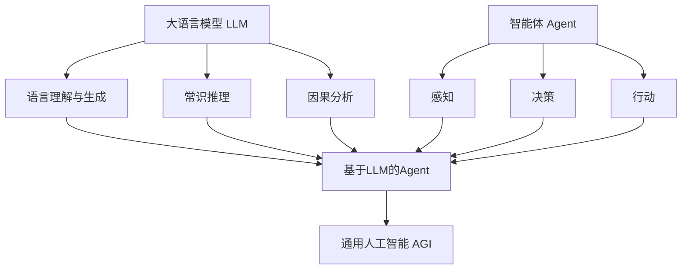

# 【大模型应用开发 动手做AI Agent】基于大模型的Agent技术框架

## 1. 背景介绍

### 1.1 人工智能的发展历程

人工智能(Artificial Intelligence, AI)自1956年达特茅斯会议提出以来，经历了几次起起伏伏的发展历程。近年来，随着深度学习、大数据、计算能力的飞速进步，AI再次迎来了爆发式增长。从图像识别、语音交互到自然语言处理，AI正在深刻改变着我们的生活。

### 1.2 大语言模型的崛起

大语言模型(Large Language Model, LLM)是近年来AI领域最引人注目的突破之一。从2018年的BERT、GPT到最新的GPT-4、PaLM等，LLM在NLP任务上取得了惊人的成绩，展现出类似人类的语言理解和生成能力。LLM强大的few-shot和zero-shot学习能力，使其无需大量标注数据和专门训练，即可应用于各种场景。

### 1.3 智能体(Agent)技术的兴起

随着LLM的日益成熟，业界开始探索如何将其与传统的智能体(Agent)技术相结合，构建更加智能、通用的AI系统。Agent本质上是一个自主实体，能够感知环境、做出决策并采取行动来完成特定目标。将LLM赋予Agent，使其具备更强大的认知、推理和规划能力，有望实现通用人工智能(AGI)的愿景。

## 2. 核心概念与联系

### 2.1 大语言模型(LLM)

LLM是以自然语言为建模对象的深度神经网络模型，通过在海量文本语料上进行自监督学习，掌握了语言的统计规律和隐含语义。LLM一般采用Transformer等注意力机制的架构，参数量动辄上百亿甚至上千亿。代表模型有GPT系列、BERT、PaLM、LaMDA等。

### 2.2 智能体(Agent)

Agent是AI系统的一种抽象，代表一个自主实体，存在于某个环境中，通过感知、决策、行动与环境交互，并朝着特定目标不断优化和进化。传统Agent多基于强化学习，需要大量的环境交互和试错，很难学习到复杂的策略。

### 2.3 基于LLM的Agent

将LLM与Agent结合是AI领域的重要探索方向。LLM为Agent提供了语言理解、常识推理、因果分析等认知能力的基础，Agent则为LLM提供了目标导向、自主决策、持续学习的框架。二者的结合有望突破传统Agent和LLM的局限，实现更加通用、高效的AI系统。

### 2.4 核心概念关系图



## 3. 核心算法原理与操作步骤

### 3.1 基于LLM的Agent的核心算法

基于LLM的Agent的核心是将LLM作为Agent的"大脑"，赋予其语言理解、知识存储、逻辑推理等认知能力。同时Agent框架为LLM提供感知、决策、行动的接口和训练机制。主要算法思路包括：

1. 基于Prompt的任务描述：将Agent需要完成的任务转化为自然语言描述，作为LLM的输入，引导其进行任务求解。
2. 基于LLM的环境感知与信息抽取：Agent通过LLM对环境信息（如视觉、语音、文本等）进行理解和抽象，提取关键信息。
3. 基于LLM的决策与规划：根据当前环境状态和目标，Agent利用LLM的推理能力，生成可能的行动方案并评估优劣。
4. 基于LLM的行动生成与执行：将抽象的行动方案转化为具体的低级指令，控制执行器与环境交互。
5. 基于反馈的持续学习：根据行动的效果与反馈，Agent不断优化策略，提升任务完成质量。

### 3.2 基于LLM的Agent的操作步骤

1. 环境感知：Agent通过传感器接收环境信息（图像、文本、语音等），传递给LLM进行理解。
2. 信息抽取：LLM对输入信息进行处理，提取关键特征和语义表示，更新Agent的内部环境状态表征。
3. 目标设定：根据预定义的宏观目标和当前环境状态，生成阶段性子目标。
4. 决策规划：利用LLM的推理能力，基于环境状态和目标生成可能的行动方案，通过Prompt询问LLM各方案的优劣评估。
5. 行动选择：根据LLM的评估结果，选择最优的行动方案。
6. 行动执行：将抽象行动转化为具体控制指令，驱动执行器与环境交互。
7. 环境反馈：接收环境反馈，判断行动效果，必要时重新进入决策规划阶段进行调整。
8. 策略优化：根据一系列行动的累积效果，通过强化学习等机制对Agent的策略进行优化，提升下一轮决策的质量。

以上步骤循环往复，使Agent能够在环境中自主地感知、思考、行动，并持续学习和进化。

## 4. 数学模型与公式详解

### 4.1 LLM的数学原理

LLM的核心是基于Transformer架构的深度神经网络。Transformer的关键创新是自注意力机制(Self-Attention)，能够捕捉输入序列中任意两个位置之间的相关性。

对于输入序列$X=(x_1,x_2,...,x_n)$，自注意力机制首先通过线性变换得到查询向量$Q$、键向量$K$、值向量$V$：

$$
\begin{aligned}
Q &= XW^Q \\
K &= XW^K \\
V &= XW^V
\end{aligned}
$$

其中$W^Q, W^K, W^V$是可学习的参数矩阵。

然后通过计算$Q$和$K$的点积并归一化，得到注意力权重矩阵$A$：

$$
A = \text{softmax}(\frac{QK^T}{\sqrt{d_k}})
$$

其中$d_k$是$K$的维度，用于缩放点积结果。

最后将$A$与$V$相乘，得到自注意力的输出表示$Z$：

$$
Z = AV
$$

通过堆叠多个Transformer块（每个块包含自注意力和前馈神经网络），LLM能够学习到深层次的语言表示和生成能力。

### 4.2 基于LLM的Agent的数学建模

将LLM集成到Agent框架中，可以将Agent建模为一个部分可观察的马尔可夫决策过程(POMDP)：

$$
M = \langle S, A, T, R, \Omega, O \rangle
$$

其中：
- $S$是状态空间，表示Agent所处的环境状态。
- $A$是行动空间，表示Agent可以采取的行动。
- $T$是状态转移函数，$T(s'|s,a)$表示在状态$s$下采取行动$a$后转移到状态$s'$的概率。
- $R$是奖励函数，$R(s,a)$表示在状态$s$下采取行动$a$获得的即时奖励。
- $\Omega$是观察空间，表示Agent能够感知到的环境信息。
- $O$是观察函数，$O(o|s',a)$表示在采取行动$a$后转移到状态$s'$时，Agent接收到观察$o$的概率。

Agent的目标是学习一个策略$\pi(a|o)$，根据当前观察$o$选择行动$a$，最大化累积奖励的期望：

$$
J(\pi) = \mathbb{E}_{\pi} \left[ \sum_{t=0}^{\infty} \gamma^t R(s_t,a_t) \right]
$$

其中$\gamma \in [0,1]$是折扣因子，用于平衡即时奖励和长期奖励。

LLM在这个过程中扮演了将观察$o$转化为状态表征$s$，以及根据$s$生成行动$a$的角色。通过端到端的训练，可以让LLM学习到从观察到行动的最优映射，实现基于LLM的智能Agent。

## 5. 项目实践：代码实例与详解

下面以一个简单的对话Agent为例，演示如何使用Python和OpenAI的GPT-3.5 API实现一个基于LLM的Agent。

### 5.1 安装依赖库

首先安装必要的依赖库，包括`openai`用于调用GPT-3.5 API，`gradio`用于构建简单的Web UI。

```bash
pip install openai gradio
```

### 5.2 Agent核心逻辑

创建一个`agent.py`文件，编写Agent的核心逻辑。

```python
import openai

class DialogueAgent:
    def __init__(self, api_key, prompt):
        openai.api_key = api_key
        self.prompt = prompt
        self.dialogue_history = []
        
    def generate_response(self, user_input):
        # 将用户输入添加到对话历史
        self.dialogue_history.append(f"User: {user_input}")
        
        # 构建完整的对话上下文
        context = self.prompt + "\n" + "\n".join(self.dialogue_history) + "\nAssistant: "
        
        # 调用GPT-3.5 API生成回复
        response = openai.Completion.create(
            engine="text-davinci-002",
            prompt=context,
            max_tokens=150,
            n=1,
            stop=None,
            temperature=0.7,
        )
        
        # 提取生成的回复文本
        reply = response.choices[0].text.strip()
        
        # 将生成的回复添加到对话历史
        self.dialogue_history.append(f"Assistant: {reply}")
        
        return reply
```

这个`DialogueAgent`类封装了与GPT-3.5 API交互的逻辑。它维护了一个对话历史，每次接收用户输入时，将其添加到历史中，构建完整的对话上下文，然后调用API生成回复。生成的回复也被添加到对话历史中，用于下一轮交互。

### 5.3 创建Gradio Web UI

创建一个`app.py`文件，使用Gradio库快速构建一个简单的Web UI。

```python
import gradio as gr
from agent import DialogueAgent

prompt = "The following is a conversation with an AI assistant. The assistant is helpful, creative, clever, and very friendly."

agent = DialogueAgent(api_key="YOUR_API_KEY", prompt=prompt)

def chat(user_input):
    response = agent.generate_response(user_input)
    return response

iface = gr.Interface(
    fn=chat, 
    inputs=gr.inputs.Textbox(lines=2, placeholder="Enter your message..."),
    outputs="text",
    title="AI Dialogue Agent",
    description="Have a conversation with an AI agent powered by GPT-3.5",
)

iface.launch()
```

这里定义了一个简单的Prompt作为对话的上下文，创建了`DialogueAgent`实例。然后使用Gradio定义了一个`Interface`，将`chat`函数绑定到输入输出组件上。最后调用`launch()`方法启动Web服务。

### 5.4 运行Agent

替换代码中的`YOUR_API_KEY`为你自己的OpenAI API密钥，然后在终端运行：

```bash
python app.py
```

这将启动一个本地Web服务，访问提示的URL，即可与Agent进行对话交互。

通过这个简单的例子，我们展示了如何使用LLM构建一个基础的对话Agent。在实际应用中，可以进一步扩展Agent的功能，如连接外部知识库、执行特定任务、进行多模态交互等，以实现更加智能和通用的AI系统。

## 6. 实际应用场景

基于LLM的Agent技术有广泛的应用前景，下面列举几个具体的场景：

### 6.1 智能客服

传统客服系统往往基于规则或检索，难以处理复杂的客户问询。引入基于LLM的Agent，可以利用其语言理解和生成能力，为客户提供更加自然、人性化的交互体验。Agent可以理解客户的意图，给出恰当的回答，甚至提供个性化的服务建议。

### 6.2 虚拟助手

像Siri、Alexa这样的虚拟助手已经日益普及，但它们的能力还比较有限。基于LLM的Agent可以赋予虚拟