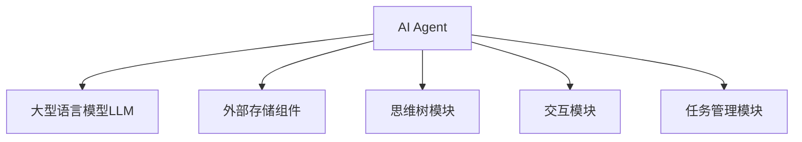
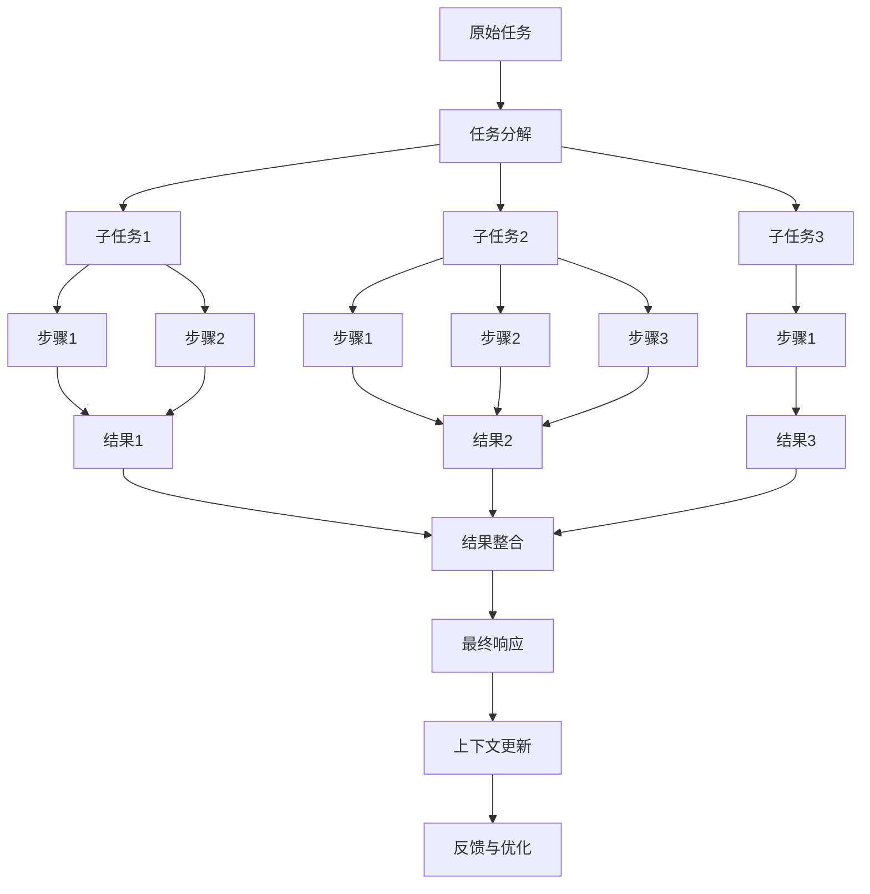

# 【大模型应用开发 动手做AI Agent】思维树

## 1. 背景介绍

随着人工智能技术的飞速发展,大型语言模型(Large Language Models, LLMs)已经成为当前最具影响力的人工智能技术之一。这些模型通过在海量文本数据上进行训练,掌握了丰富的自然语言理解和生成能力,可以应用于多种任务场景,如问答系统、内容创作、代码生成等。

其中,OpenAI推出的GPT-3和其他AI公司推出的大模型,展现出了令人惊叹的语言生成能力,引发了广泛关注。然而,这些大模型存在一些局限性,如缺乏持续的记忆能力、缺乏主动交互能力等,限制了它们在更多复杂场景中的应用。因此,如何充分发挥大模型的潜力,并克服其局限性,成为了当前研究的重点课题。

AI Agent技术应运而生,旨在赋予大模型更强的交互能力、记忆能力和决策能力,使其能够在复杂环境中执行任务。AI Agent通常由一个大型语言模型和一个外部存储组件构成,可以持续地与用户交互,并根据上下文信息做出适当的响应。

本文将深入探讨AI Agent的核心概念、关键技术和实现方法,帮助读者全面了解这一前沿技术,并动手实践开发一个简单的AI Agent系统。

## 2. 核心概念与联系

### 2.1 大型语言模型(LLMs)

大型语言模型是基于自然语言处理(NLP)技术训练而成的巨大神经网络模型。它们通过在海量文本数据上进行无监督预训练,掌握了丰富的语言知识和生成能力。常见的大型语言模型包括GPT-3、BERT、XLNet等。

这些模型可以应用于多种NLP任务,如机器翻译、文本生成、问答系统等,展现出了令人惊叹的性能。然而,它们也存在一些局限性,例如缺乏持续的记忆能力、缺乏主动交互能力等,限制了它们在更复杂的应用场景中的使用。

### 2.2 AI Agent

AI Agent是一种具有持续交互能力和决策能力的智能系统。它通常由一个大型语言模型和一个外部存储组件构成,可以持续地与用户交互,根据上下文信息做出适当的响应。

AI Agent的核心思想是将大型语言模型作为一个"思维引擎",利用其强大的语言理解和生成能力来处理用户输入和生成响应。同时,外部存储组件用于存储上下文信息和知识库,为模型提供必要的记忆和知识支持。

AI Agent可以应用于多种场景,如智能助手、任务规划、决策支持等,展现出了更强的交互能力和决策能力。

### 2.3 思维树(Thought Tree)

思维树是AI Agent中的一种关键技术,用于模拟人类的思维过程,帮助AI Agent更好地理解和处理复杂任务。

思维树的基本思想是将任务分解为一系列子任务或步骤,并通过递归的方式逐步完成每个子任务。在这个过程中,AI Agent会根据当前的上下文信息和知识库,生成一系列思考步骤,并逐步执行这些步骤,直到完成整个任务。

思维树可以帮助AI Agent更好地理解和处理复杂任务,提高其决策能力和交互能力。同时,它也为人类提供了一种可解释性的方式,让我们更好地理解AI Agent的思维过程。

### 2.4 核心概念关系

大型语言模型、AI Agent和思维树三者之间存在着密切的关系。大型语言模型作为AI Agent的"思维引擎",提供了强大的语言理解和生成能力。AI Agent则通过引入外部存储组件和思维树技术,赋予了大型语言模型更强的交互能力、记忆能力和决策能力。

思维树作为AI Agent的关键技术,模拟了人类的思维过程,帮助AI Agent更好地理解和处理复杂任务。同时,思维树也为人类提供了一种可解释性的方式,让我们更好地理解AI Agent的决策过程。

这三者的有机结合,使得AI Agent能够在复杂的应用场景中发挥更大的作用,成为一种强大的智能系统。

## 3. 核心算法原理具体操作步骤

### 3.1 AI Agent的基本架构

AI Agent的基本架构由以下几个核心组件构成:

1. **大型语言模型(LLM)**:作为AI Agent的"思维引擎",负责理解用户输入和生成响应。常见的LLM包括GPT-3、BERT等。

2. **外部存储组件**:用于存储上下文信息、知识库等,为LLM提供必要的记忆和知识支持。常见的实现方式包括键值数据库、向量数据库等。

3. **思维树模块**:实现思维树算法,模拟人类的思维过程,帮助AI Agent更好地理解和处理复杂任务。

4. **交互模块**:负责与用户进行交互,接收用户输入并将AI Agent的响应呈现给用户。

5. **任务管理模块**:负责管理和协调整个AI Agent系统的运行,包括任务分发、上下文管理等。

这些组件通过有机结合,构成了一个完整的AI Agent系统。下面我们将详细介绍思维树算法的具体实现步骤。

### 3.2 思维树算法步骤

思维树算法是AI Agent中的一种关键技术,用于模拟人类的思维过程,帮助AI Agent更好地理解和处理复杂任务。它的具体步骤如下:

1. **任务分解**:将原始任务分解为一系列子任务或步骤。这可以通过提示LLM生成一个初步的任务分解计划来实现。

2. **子任务执行**:对于每个子任务,AI Agent会根据当前的上下文信息和知识库,生成一系列思考步骤,并逐步执行这些步骤。这个过程可以递归地进行,即每个子任务也可以继续分解为更小的子任务。

3. **结果整合**:当所有子任务都完成后,AI Agent会将各个子任务的结果整合起来,形成对原始任务的最终响应。

4. **上下文更新**:在整个过程中,AI Agent会不断更新上下文信息和知识库,以反映任务执行的最新状态。

5. **反馈与优化**:AI Agent可以根据用户的反馈,不断优化自己的思维树模型和决策策略,提高任务处理的效率和准确性。

下面是一个简化的思维树算法流程图:

通过这种递归的方式,AI Agent可以更好地理解和处理复杂任务,提高其决策能力和交互能力。同时,思维树算法也为人类提供了一种可解释性的方式,让我们更好地理解AI Agent的思维过程。

## 4. 数学模型和公式详细讲解举例说明

在AI Agent的实现中,数学模型和公式扮演着重要的角色,尤其是在大型语言模型(LLM)和思维树算法中。下面我们将详细介绍一些常见的数学模型和公式,并给出具体的例子和说明。

### 4.1 自注意力机制(Self-Attention)

自注意力机制是transformer模型中的一种关键技术,它允许模型捕捉输入序列中任意两个位置之间的依赖关系。这种机制在处理长序列时表现出了优异的性能,成为了当前大型语言模型的核心组件之一。

自注意力机制的数学表示如下:

$$
\text{Attention}(Q, K, V) = \text{softmax}\left(\frac{QK^T}{\sqrt{d_k}}\right)V
$$

其中:

- $Q$、$K$、$V$分别表示查询(Query)、键(Key)和值(Value)矩阵,它们是通过线性变换从输入序列中得到的。
- $d_k$是缩放因子,用于防止点积过大导致梯度消失或爆炸。
- $\text{softmax}$函数用于计算注意力权重,确保权重之和为1。

通过计算查询$Q$与所有键$K$的点积,并经过缩放和softmax操作,我们可以得到一个注意力权重向量。然后,将这个权重向量与值矩阵$V$相乘,就可以得到加权求和后的注意力表示。

自注意力机制允许模型在计算每个位置的表示时,都可以关注整个输入序列中的所有位置,从而捕捉长距离依赖关系。这种机制在机器翻译、文本生成等任务中表现出了卓越的性能。

### 4.2 transformer解码器(Transformer Decoder)

transformer解码器是transformer模型中用于序列生成任务的核心组件。它基于自注意力机制和编码器-解码器架构,可以生成高质量的序列输出。

transformer解码器的数学表示如下:

$$
\begin{aligned}
&h_t^{dec} = \text{DecoderLayer}\left(y_{t-1}, h_{t-1}^{dec}, \text{enc\_outputs}\right) \\
&p\left(y_t | y_{<t}, X\right) = \text{softmax}\left(W_o h_t^{dec}\right)
\end{aligned}
$$

其中:

- $y_{t-1}$表示前一时刻的输出token。
- $h_{t-1}^{dec}$表示前一时刻的解码器隐状态。
- $\text{enc\_outputs}$表示编码器的输出序列。
- $\text{DecoderLayer}$是transformer解码器的核心层,包含了自注意力、编码器-解码器注意力和前馈神经网络等组件。
- $W_o$是输出层的权重矩阵。
- $\text{softmax}$函数用于计算下一个token的概率分布。

在每个时刻$t$,transformer解码器会根据前一时刻的输出token $y_{t-1}$、解码器隐状态$h_{t-1}^{dec}$和编码器输出$\text{enc\_outputs}$,计算当前时刻的解码器隐状态$h_t^{dec}$。然后,通过一个线性层和softmax函数,可以得到下一个token的概率分布$p\left(y_t | y_{<t}, X\right)$。

通过这种自回归(auto-regressive)的方式,transformer解码器可以逐步生成序列输出,并在生成过程中利用编码器的输出信息,实现高质量的序列生成。

### 4.3 思维树算法中的数学模型

在思维树算法中,也涉及到一些数学模型和公式。例如,在任务分解和子任务执行过程中,我们可以使用一种基于概率的模型来决定下一步应该执行哪个子任务或步骤。

假设我们有一个任务$T$,已经分解为$n$个子任务$\{S_1, S_2, \ldots, S_n\}$。我们可以定义一个概率模型$P(S_i | C)$,表示在当前上下文$C$下执行子任务$S_i$的概率。这个概率可以基于子任务的重要性、难易程度、先后顺序等因素来计算。

$$
P(S_i | C) = \frac{\exp(f(S_i, C))}{\sum_{j=1}^n \exp(f(S_j, C))}
$$

其中,函数$f(S_i, C)$用于评估子任务$S_i$在上下文$C$下的得分,可以是一个神经网络模型或者基于特征的线性模型。

在每个时刻,AI Agent可以根据这个概率模型,选择概率最{"msg_type":"generate_answer_finish","data":"","from_module":null,"from_unit":null}