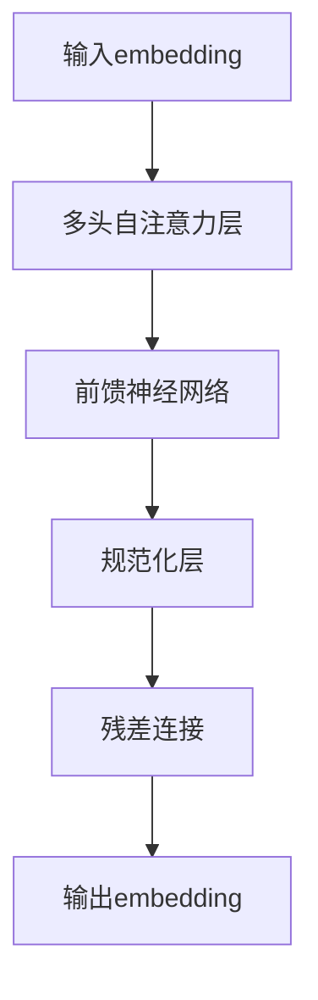
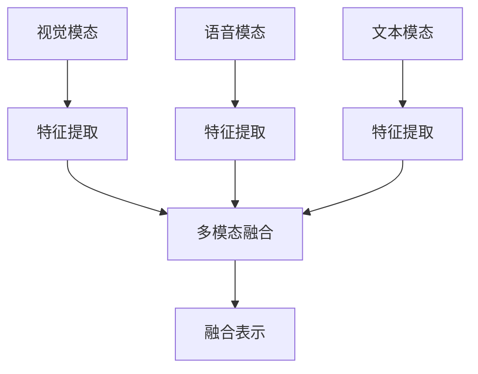
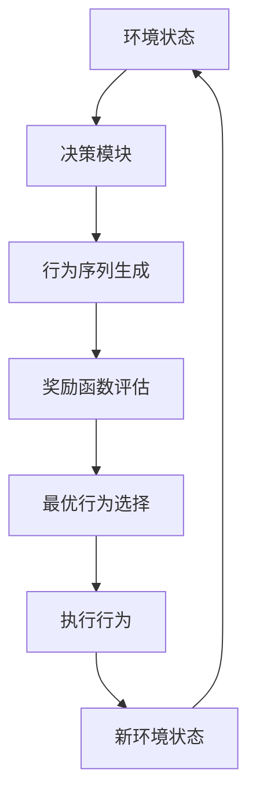

# 【大模型应用开发 动手做AI Agent】第一轮行动：工具执行搜索

## 1. 背景介绍

### 1.1 人工智能发展历程

人工智能(Artificial Intelligence, AI)是当代科技发展的重要领域,它旨在创造出能够模仿人类智能行为的智能系统。自20世纪50年代AI概念被正式提出以来,经历了起起伏伏的发展历程。

早期的AI系统主要采用符号主义方法,通过构建知识库和推理规则来模拟人类思维。但由于知识获取困难、推理效率低下等问题,使得符号主义方法在解决复杂问题时遇到了瓶颈。

21世纪初,机器学习和深度学习技术的兴起,为AI发展注入了新的动力。通过从大量数据中自动学习模式和规律,深度神经网络能够在计算机视觉、自然语言处理等领域取得突破性进展。

### 1.2 大模型兴起

伴随着算力和数据量的不断增长,AI模型规模也在不断扩大。2018年,谷歌发布了Transformer模型,通过自注意力机制有效捕捉长距离依赖关系,在机器翻译等任务上取得了优异表现。2020年,OpenAI发布了1.75万亿参数的GPT-3大模型,展现了大规模语言模型在自然语言理解和生成方面的强大能力。

大模型的出现极大地推动了AI能力的提升,但同时也带来了新的挑战,如模型的可解释性、可控性、安全性等问题亟待解决。此外,大模型的训练和部署也对算力和存储资源提出了更高要求。

### 1.3 AI Agent概念

AI Agent是指能够感知环境、作出决策并采取行动的智能系统。它是人工智能系统与现实世界交互的关键接口。AI Agent需要具备环境感知、知识推理、决策规划、行为执行等多种能力,以实现高效、智能的任务完成。

随着大模型技术的不断发展,基于大模型的AI Agent将成为未来智能系统的重要形式。通过整合多模态感知、推理决策、行为规划等模块,大模型AI Agent有望在诸多复杂场景中发挥作用,如智能助手、自动驾驶、智能制造等。

## 2. 核心概念与联系

### 2.1 大模型架构

大模型通常采用Transformer等自注意力机制作为核心架构,能够有效捕捉输入序列中的长距离依赖关系。典型的大模型架构如下所示:

其中,输入embedding将原始输入(如文本、图像等)映射为模型可理解的向量表示;多头自注意力层捕捉输入的内部依赖关系;前馈神经网络对注意力输出进行非线性变换;规范化层和残差连接用于加速训练收敛和提高模型性能。

通过堆叠多个这样的编码器层,大模型能够学习到丰富的上下文表示,从而支持下游的各种任务,如问答、推理、生成等。

### 2.2 多模态融合

现实世界中的任务往往涉及多种模态的信息,如视觉、语音、文本等。因此,AI Agent需要具备多模态融合的能力,将来自不同模态的信息进行有效整合。

多模态融合的核心思想是学习跨模态的联合表示,捕捉不同模态之间的相关性。常见的融合方法包括:

1. **特征级融合**:将不同模态的特征向量拼接或做元素级运算(如加权求和)得到融合表示。
2. **注意力融合**:通过自注意力机制动态地为不同模态分配注意力权重,强化重要模态的影响。
3. **交互融合**:在模态间构建全连接的交互路径,使不同模态的特征能够相互影响和更新。

通过多模态融合,大模型AI Agent能够整合视觉、语音、文本等多源信息,全面感知和理解复杂环境,为后续的决策和行为提供依据。

### 2.3 决策与规划

决策与规划是AI Agent的核心环节,它需要基于对环境的理解,制定合理的行为策略来完成特定任务。常见的决策方法包括:

1. **强化学习**:通过与环境的交互,学习在给定状态下采取何种行为能获得最大累积奖励。
2. **规划算法**:基于环境模型,通过搜索或优化等方法求解最优行为序列。
3. **基于模型的方法**:利用大模型生成多个可能的行为序列,并基于奖励函数选择最优序列。

决策模块需要与感知模块和执行模块紧密协作,形成闭环的感知-决策-行为循环。通过不断地与环境交互并根据反馈进行调整,AI Agent能够持续优化其决策策略,以适应复杂多变的环境。

## 3. 核心算法原理具体操作步骤

### 3.1 自注意力机制

自注意力机制是大模型的核心算法,它能够有效捕捉输入序列中的长距离依赖关系。具体操作步骤如下:

1. **计算注意力分数**:对于输入序列的每个位置,计算其与所有其他位置的注意力分数,表示该位置对应元素需要从其他位置获取多少信息。

   $$\text{Attention}(Q, K, V) = \text{softmax}(\frac{QK^T}{\sqrt{d_k}})V$$

   其中,$Q$为查询向量(Query),$K$为键向量(Key),$V$为值向量(Value),$d_k$为缩放因子。

2. **多头注意力**:将注意力机制扩展为多个注意力头,每个头捕捉输入的不同子空间表示,最后将所有头的结果拼接起来作为输出。

   $$\text{MultiHead}(Q, K, V) = \text{Concat}(head_1, ..., head_h)W^O$$
   $$\text{where } head_i = \text{Attention}(QW_i^Q, KW_i^K, VW_i^V)$$

3. **残差连接与层归一化**:将注意力输出与输入进行残差连接,并应用层归一化操作,以保持梯度稳定性。

自注意力机制通过软性关联不同位置的输入元素,能够有效建模长距离依赖,是大模型取得卓越表现的关键所在。

### 3.2 Transformer解码器

Transformer解码器是基于自注意力机制的序列生成模型,广泛应用于机器翻译、文本生成等任务。它的操作步骤如下:

1. **掩码自注意力**:在标准的自注意力计算中,每个位置都可以关注所有位置的信息。但在序列生成任务中,模型在生成当前位置的输出时,不应该使用未来位置的信息(因为在实际应用中未来位置的信息是未知的)。因此,需要对未来位置的注意力分数进行掩码,使其不会影响当前位置的计算。

2. **编码器-解码器注意力**:除了自注意力之外,解码器还需要关注输入序列的信息。这是通过将解码器的查询向量与编码器输出的键向量和值向量进行注意力计算来实现的。

3. **前馈神经网络与规范化**:类似编码器,解码器也包含前馈神经网络层和规范化层,以提供非线性变换和梯度稳定性。

4. **生成输出**:对于序列生成任务,解码器会逐个生成输出元素。每次生成时,会根据已生成的元素和输入序列计算出下一个元素的概率分布,并从中采样得到实际输出。

Transformer解码器的创新之处在于引入了掩码自注意力,使其能够处理序列生成任务,同时保留了自注意力机制对长距离依赖的建模能力。

## 4. 数学模型和公式详细讲解举例说明

### 4.1 自注意力计算

自注意力机制的核心是计算注意力分数,用于衡量一个位置对其他位置的关注程度。设输入序列$X = (x_1, x_2, ..., x_n)$,我们将其线性映射为查询向量$Q$、键向量$K$和值向量$V$:

$$Q = XW^Q, K = XW^K, V = XW^V$$

其中,$W^Q, W^K, W^V$为可学习的权重矩阵。然后,对于序列中的第$i$个位置,其注意力分数$a_{i,j}$表示它对第$j$个位置的关注程度,计算方式为:

$$a_{i,j} = \frac{\exp(e_{i,j})}{\sum_{k=1}^n \exp(e_{i,k})}$$
$$e_{i,j} = \frac{q_i^Tk_j}{\sqrt{d_k}}$$

其中,$d_k$为缩放因子,用于防止点积过大导致的梯度不稳定性。注意力分数$a_{i,j}$实际上是对$e_{i,j}$进行softmax归一化得到的。

最后,第$i$个位置的输出向量$o_i$是所有位置值向量$v_j$的加权和,权重即为对应的注意力分数$a_{i,j}$:

$$o_i = \sum_{j=1}^n a_{i,j}v_j$$

通过这种方式,自注意力机制能够自适应地捕捉输入序列中任意两个位置之间的关联关系,从而有效建模长距离依赖。

### 4.2 多头注意力

单一的注意力机制只能从一个子空间获取信息,为了提高模型的表示能力,我们可以采用多头注意力机制。具体来说,我们将查询向量$Q$、键向量$K$和值向量$V$分别线性映射为$h$个子空间,然后在每个子空间内计算注意力,最后将所有子空间的注意力输出进行拼接:

$$\text{head}_i = \text{Attention}(QW_i^Q, KW_i^K, VW_i^V)$$
$$\text{MultiHead}(Q, K, V) = \text{Concat}(\text{head}_1, ..., \text{head}_h)W^O$$

其中,$W_i^Q, W_i^K, W_i^V$为第$i$个子空间的线性映射权重,$W^O$为最终的线性变换权重。多头注意力机制相当于从不同的表示子空间提取不同的信息,然后将这些信息融合起来,从而提高了模型的表示能力。

### 4.3 掩码自注意力

在序列生成任务中,我们需要确保模型在生成当前位置的输出时,不会使用未来位置的信息。这可以通过在自注意力计算中引入掩码机制来实现。

具体来说,对于输入序列$X = (x_1, x_2, ..., x_n)$,我们计算其注意力分数矩阵$A \in \mathbb{R}^{n \times n}$,其中$A_{i,j}$表示第$i$个位置对第$j$个位置的注意力分数。然后,我们构造一个掩码矩阵$M \in \mathbb{R}^{n \times n}$,其中:

$$M_{i,j} = \begin{cases}
0, & \text{if }i < j\\
-\infty, & \text{otherwise}
\end{cases}$$

将掩码矩阵$M$与注意力分数矩阵$A$相加,即可实现掩码操作:

$$\tilde{A} = A + M$$

在$\tilde{A}$中,对于第$i$个位置,所有未来位置$j > i$的注意力分数$\tilde{A}_{i,j}$都被掩码为$-\infty$,经过softmax归一化后,这些位置的注意力权重将接近于0,从而避