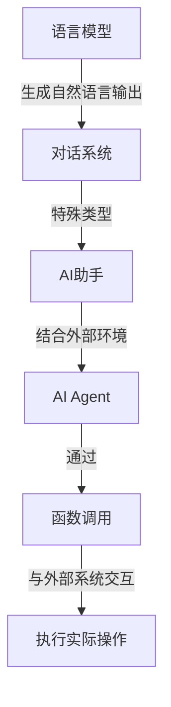
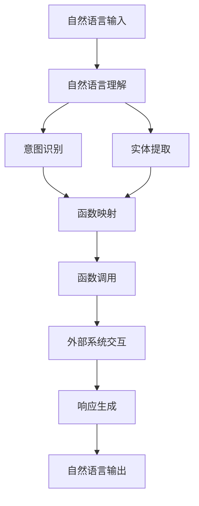

# 【大模型应用开发 动手做AI Agent】通过助手的返回信息调用函数

## 1. 背景介绍

随着人工智能技术的快速发展,大型语言模型(Large Language Models, LLMs)已经成为当前最热门的人工智能应用之一。这些模型通过从海量文本数据中学习,能够生成看似人类写作的自然语言输出。而最近,OpenAI推出的ChatGPT等基于对话的人工智能助手更是引起了广泛关注。

虽然现有的AI助手已经展现出了令人印象深刻的能力,但它们仍然存在诸多局限性。例如,它们无法直接与外部系统或API进行交互,也无法执行任何真正的任务。为了克服这些限制,研究人员提出了AI Agent的概念,旨在将语言模型与外部环境相结合,使其能够根据用户的指令执行实际操作。

本文将探讨如何通过AI助手的返回信息来调用函数,从而实现AI Agent的核心功能。我们将介绍相关的核心概念、算法原理,并通过实际代码示例展示具体的实现过程。最后,我们还将讨论AI Agent的应用场景、发展趋势和挑战。

## 2. 核心概念与联系

在深入探讨如何通过AI助手调用函数之前,我们需要先了解几个核心概念及其相互关系。

### 2.1 语言模型(Language Model)

语言模型是一种基于统计学习的模型,旨在预测序列中下一个元素(通常是单词或字符)的概率。大型语言模型通过从海量文本数据中学习,能够捕捉自然语言的复杂模式和语义关系,从而生成看似人类写作的自然语言输出。

### 2.2 对话系统(Conversational System)

对话系统是一种能够与人类进行自然语言交互的计算机程序。它们通常由语言理解、对话管理和响应生成等模块组成。对话系统可以应用于各种场景,如客户服务、个人助理等。

### 2.3 AI助手(AI Assistant)

AI助手是一种特殊的对话系统,它通过语言模型生成自然语言响应,为用户提供信息或帮助完成特定任务。AI助手可以部署在各种设备上,如智能手机、智能音箱等。

### 2.4 AI Agent

AI Agent是一种能够根据用户指令在外部环境中执行实际操作的智能系统。它通常由一个语言模型和一个执行模块组成。语言模型用于理解用户的指令,而执行模块则负责与外部系统或API交互,完成实际任务。

### 2.5 函数调用(Function Calling)

函数调用是指在程序执行过程中,调用(执行)一个已定义的函数。通过函数调用,我们可以将复杂的任务分解为多个独立的模块,从而提高代码的可读性和可维护性。

这些核心概念之间的关系可以用下图来表示:

简而言之,AI Agent是一种特殊的对话系统,它通过语言模型理解用户指令,并调用相应的函数与外部系统交互,从而执行实际操作。

## 3. 核心算法原理具体操作步骤

要实现通过AI助手的返回信息来调用函数,我们需要一个能够解析自然语言指令并将其映射到相应函数的模块。这个过程可以分为以下几个步骤:

1. **自然语言理解(Natural Language Understanding, NLU)**: 将用户的自然语言输入转换为结构化的语义表示。这通常涉及到词法分析、句法分析和语义分析等自然语言处理技术。

2. **意图识别(Intent Recognition)**: 根据语义表示,确定用户的意图是什么,即用户想要执行什么样的操作。这可以通过机器学习模型(如神经网络或支持向量机)来实现。

3. **实体提取(Entity Extraction)**: 从语义表示中提取与操作相关的实体,如参数、对象等。这也可以使用机器学习模型来完成。

4. **函数映射(Function Mapping)**: 根据识别出的意图和提取的实体,将其映射到相应的函数及其参数。这可以通过一个映射表或规则引擎来实现。

5. **函数调用(Function Calling)**: 使用映射得到的函数及参数,执行实际的函数调用,与外部系统或API交互。

6. **响应生成(Response Generation)**: 根据函数调用的结果,生成自然语言响应,反馈给用户。这可以利用语言模型来完成。

这个过程可以用下图来表示:

需要注意的是,上述步骤并非完全独立,它们之间存在一定的交互和反馈。例如,实体提取的结果可能会影响意图识别,而函数调用的结果也可能需要反馈到语义理解模块进行进一步处理。

## 4. 数学模型和公式详细讲解举例说明

在实现上述算法时,我们可能需要使用一些数学模型和公式。以下是一些常见的模型和公式,以及它们在自然语言处理中的应用。

### 4.1 N-gram语言模型

N-gram语言模型是一种基于统计的语言模型,它根据前面的 N-1 个词来预测下一个词的概率。给定一个长度为 m 的句子 $S = (w_1, w_2, \ldots, w_m)$,其概率可以表示为:

$$P(S) = \prod_{i=1}^m P(w_i | w_{i-N+1}, \ldots, w_{i-1})$$

其中,$ P(w_i | w_{i-N+1}, \ldots, w_{i-1})$ 表示在给定前 N-1 个词的情况下,第 i 个词为 $w_i$ 的条件概率。

N-gram模型在自然语言处理中有广泛应用,例如语言建模、机器翻译、拼写检查等。它的优点是简单且易于计算,但也存在一些局限性,如数据稀疏问题和无法捕捉长距离依赖关系。

### 4.2 神经网络语言模型

与传统的 N-gram 模型不同,神经网络语言模型利用神经网络来建模语言。它们能够自动学习词与词之间的复杂关系,并捕捉长距离依赖关系。

一种常见的神经网络语言模型是基于循环神经网络(Recurrent Neural Network, RNN)的模型。对于一个长度为 m 的句子 $S = (w_1, w_2, \ldots, w_m)$,RNN 模型将每个词 $w_i$ 映射到一个向量表示 $x_i$,然后通过以下递归公式计算隐藏状态 $h_i$:

$$h_i = f(W_hx_i + U_hh_{i-1} + b_h)$$

其中,$ f $ 是一个非线性激活函数(如 tanh 或 ReLU),$ W_h $ 和 $ U_h $ 是可学习的权重矩阵,$ b_h $ 是偏置向量。

基于隐藏状态 $h_i$,我们可以计算下一个词 $w_{i+1}$ 的概率分布:

$$P(w_{i+1}|w_1, \ldots, w_i) = \text{softmax}(W_yh_i + b_y)$$

其中,$ W_y $ 是另一个可学习的权重矩阵,$ b_y $ 是偏置向量。

神经网络语言模型在许多自然语言处理任务中表现出色,如机器翻译、对话系统等。但它们也存在一些缺陷,如计算成本较高、需要大量训练数据等。

### 4.3 注意力机制(Attention Mechanism)

注意力机制是一种用于序列建模的技术,它允许模型在生成每个输出时,动态地关注输入序列的不同部分。这种机制在处理长序列时特别有用,因为它可以有效捕捉长距离依赖关系。

注意力机制的核心思想是,对于每个目标位置 $t$,计算一个注意力权重向量 $\alpha_t$,其中每个元素 $\alpha_{t,i}$ 表示在生成目标位置 $t$ 的输出时,对应于源位置 $i$ 的注意力权重。然后,使用这些权重对源序列进行加权求和,得到一个注意力向量 $c_t$,作为目标位置 $t$ 的额外输入。

具体来说,对于一个长度为 $m$ 的源序列 $X = (x_1, x_2, \ldots, x_m)$ 和一个长度为 $n$ 的目标序列 $Y = (y_1, y_2, \ldots, y_n)$,注意力权重 $\alpha_{t,i}$ 可以通过以下公式计算:

$$\alpha_{t,i} = \frac{\exp(e_{t,i})}{\sum_{j=1}^m \exp(e_{t,j})}$$

其中,$ e_{t,i} $ 是一个与源位置 $i$ 和目标位置 $t$ 相关的分数函数,通常由一个前馈神经网络计算。

然后,注意力向量 $c_t$ 可以计算为:

$$c_t = \sum_{i=1}^m \alpha_{t,i}x_i$$

注意力机制在机器翻译、阅读理解、图像字幕生成等任务中表现出色,它能够有效地捕捉长距离依赖关系,并关注输入序列中的关键部分。

### 4.4 示例:基于注意力机制的神经机器翻译

为了更好地理解注意力机制的应用,我们以基于注意力机制的神经机器翻译(Neural Machine Translation with Attention)为例进行说明。

在机器翻译任务中,我们需要将一个源语言句子 $X = (x_1, x_2, \ldots, x_m)$ 翻译成目标语言句子 $Y = (y_1, y_2, \ldots, y_n)$。我们可以使用一个编码器-解码器(Encoder-Decoder)架构,其中编码器将源句子编码为一个向量表示,而解码器则根据该向量生成目标句子。

在基于注意力机制的神经机器翻译模型中,解码器在生成每个目标词 $y_t$ 时,不仅考虑了编码器的输出,还计算了一个注意力向量 $c_t$,该向量是源句子中所有词的加权和,权重由注意力机制计算得到。具体来说,解码器的隐藏状态 $s_t$ 由以下公式计算:

$$s_t = f(s_{t-1}, y_{t-1}, c_t)$$

其中,$ f $ 是一个递归神经网络(如 LSTM 或 GRU),$ s_{t-1} $ 是前一个隐藏状态,$ y_{t-1} $ 是前一个输出词,$ c_t $ 是注意力向量。

注意力向量 $c_t$ 的计算方式如下:

$$c_t = \sum_{i=1}^m \alpha_{t,i}h_i$$

其中,$ h_i $ 是编码器对源词 $x_i$ 的编码,$ \alpha_{t,i} $ 是注意力权重,表示在生成目标词 $y_t$ 时,对源词 $x_i$ 的注意力程度。注意力权重通过以下公式计算:

$$\alpha_{t,i} = \frac{\exp(e_{t,i})}{\sum_{j=1}^m \exp(e_{t,j})}$$
$$e_{t,i} = \text{score}(s_{t-1}, h_i)$$

其中,$ \text{score} $ 函数通常由一个前馈神经网络实现,它根据解码器的前一个隐藏状态 $s_{t-1}$ 和编码器的输出 $h_i$ 计算一个分数,表示它们之间的相关性。

通过注意力机制,解码器能够动态地关注源句子中与当前目标词相关的部分,从而更好地捕捉长距离依赖关系,提高翻译质量。

## 5. 