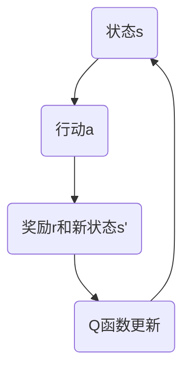

## 1.背景介绍

在人工智能领域，Q-learning是一种强化学习算法，是用于解决马尔科夫决策过程（MDP）问题的一种方法。它的核心思想是通过学习一个行动的价值函数，来优化决策过程。这种方法的优点是不需要环境的完全模型，只需要行动的奖励函数。这使得Q-learning在许多实际问题中都得到了广泛的应用。

## 2.核心概念与联系

Q-learning的核心概念是Q函数，也被称为行动价值函数。它表示在给定状态下采取某一行动的预期奖励。Q函数的更新通过Bellman方程来实现，这是一种递归的更新过程，它反映了当前状态和行动的价值与其后续状态和行动的价值之间的关系。

Mermaid流程图如下：



## 3.核心算法原理具体操作步骤

Q-learning的具体操作步骤如下：

1. 初始化Q函数为任意值。
2. 对每一步进行以下操作：
   - 在当前状态下，选择一个行动。这个行动可以是完全随机的，也可以是根据当前的Q函数值选择的。
   - 执行这个行动，观察奖励和新的状态。
   - 更新Q函数。

Q函数的更新公式为：

$$ Q(s,a) = Q(s,a) + \alpha [r + \gamma \max_{a'} Q(s',a') - Q(s,a)] $$

其中，$\alpha$是学习率，$\gamma$是折扣因子，$r$是奖励，$s'$是新的状态，$a'$是在新的状态下的行动。

## 4.数学模型和公式详细讲解举例说明

在Q-learning的数学模型中，我们使用一个Q表来存储Q函数的值。Q表是一个二维的数组，其中每一行对应一个状态，每一列对应一个行动。Q表的每一个元素就是对应状态和行动的Q函数值。

例如，假设我们有一个简单的格子世界，其中有4个状态（每个格子是一个状态），2个行动（向左和向右）。我们可以用一个4x2的表来表示Q函数。

Q-learning的目标是通过学习找到一个最优的策略，使得从任何状态开始，总能得到最大的累积奖励。这个策略就是对于每一个状态，选择能够使Q函数值最大的行动。

## 5.项目实践：代码实例和详细解释说明

下面是一个使用Python实现的Q-learning的简单示例：

```python
import numpy as np

# 初始化Q表
Q = np.zeros((4, 2))

# 设置学习率和折扣因子
alpha = 0.5
gamma = 0.9

# 对每一步进行以下操作
for _ in range(1000):
    # 在当前状态下，选择一个行动
    s = np.random.randint(4)
    a = np.random.randint(2)

    # 执行这个行动，观察奖励和新的状态
    r = np.random.rand()
    s_prime = (s + a) % 4

    # 更新Q函数
    Q[s, a] = Q[s, a] + alpha * (r + gamma * np.max(Q[s_prime, :]) - Q[s, a])
```

## 6.实际应用场景

Q-learning在许多实际应用场景中都有广泛的应用，例如：

- 自动驾驶：通过学习一个最优的驾驶策略，使得汽车可以自动驾驶，同时保证安全和效率。
- 游戏AI：通过学习一个最优的游戏策略，使得AI可以在游戏中取得优秀的表现。
- 机器人控制：通过学习一个最优的控制策略，使得机器人可以完成复杂的任务。

## 7.工具和资源推荐

- [OpenAI Gym](https://gym.openai.com/): 一个用于开发和比较强化学习算法的工具包。
- [Python强化学习库](https://github.com/openai/baselines): 包含了许多强化学习算法的Python实现。
- [强化学习课程](https://www.coursera.org/specializations/reinforcement-learning): 一个在线的强化学习课程，包含了许多强化学习的基础知识和高级主题。

## 8.总结：未来发展趋势与挑战

Q-learning是一种强大的强化学习算法，它的应用前景广阔。然而，它也面临着一些挑战，例如：

- 训练效率：Q-learning的训练过程往往需要大量的时间和计算资源。
- 稳定性：Q-learning的训练过程可能不稳定，特别是在处理复杂的任务时。
- 泛化能力：Q-learning的泛化能力有限，它可能无法处理那些没有在训练过程中出现过的状态。

未来的研究将会继续探索如何解决这些挑战，以进一步提升Q-learning的性能和应用范围。

## 9.附录：常见问题与解答

Q: Q-learning和深度学习有什么关系？

A: Q-learning可以和深度学习结合，形成深度Q学习（DQN）。在DQN中，我们使用一个深度神经网络来表示Q函数，这使得我们能够处理更复杂的任务，例如图像输入的任务。

Q: Q-learning的训练过程是如何收敛的？

A: Q-learning的训练过程通过不断地更新Q函数来逼近最优的Q函数。在理论上，只要每一个状态和行动都被无限次地访问，Q-learning的训练过程就会收敛到最优的Q函数。

作者：禅与计算机程序设计艺术 / Zen and the Art of Computer Programming