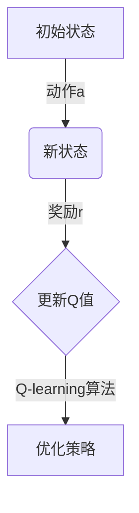

# 一切皆是映射：AI Q-learning在气候预测的应用

## 1. 背景介绍

气候变化已经成为当今世界面临的最紧迫和最具挑战性的问题之一。准确预测气候变化对于制定有效的缓解和适应策略至关重要。然而,气候系统是一个高度复杂和动态的系统,涉及大气、海洋、陆地、冰雪和生物圈等多个子系统之间的相互作用。传统的气候模型通常基于物理定律和经验参数,但难以完全捕捉这种复杂性。

近年来,人工智能(AI)技术在气候预测领域展现出巨大的潜力。其中,强化学习(Reinforcement Learning)作为机器学习的一个重要分支,已经在解决复杂的决策和控制问题方面取得了卓越的成就。Q-learning作为强化学习中的一种经典算法,通过探索和利用环境的反馈,不断优化决策策略,从而达到最大化长期回报的目标。

## 2. 核心概念与联系

### 2.1 Q-learning算法

Q-learning算法是一种无模型的强化学习算法,它不需要事先了解环境的转移概率和奖励函数,而是通过不断的试错和学习来逐步优化决策策略。算法的核心思想是维护一个Q表(Q-table),用于存储每个状态-动作对的预期长期回报值(Q值)。通过不断更新Q表,算法可以逐步找到最优策略。

Q-learning算法的更新规则如下:

$$Q(s_t, a_t) \leftarrow Q(s_t, a_t) + \alpha \left[ r_{t+1} + \gamma \max_a Q(s_{t+1}, a) - Q(s_t, a_t) \right]$$

其中:
- $s_t$表示当前状态
- $a_t$表示当前动作
- $r_{t+1}$表示执行动作$a_t$后获得的即时奖励
- $\alpha$是学习率,控制新信息对Q值的影响程度
- $\gamma$是折现因子,用于权衡即时奖励和未来奖励的重要性

通过不断探索和利用,Q-learning算法可以逐步找到最优策略,使长期累积奖励最大化。

### 2.2 气候预测中的Q-learning

在气候预测中,我们可以将整个气候系统视为一个马尔可夫决策过程(MDP),其中:

- 状态($s_t$)表示气候系统在时刻$t$的状态,包括大气、海洋、陆地等子系统的各种参数。
- 动作($a_t$)表示我们可以采取的一些干预措施,如减排、植树等。
- 奖励($r_t$)表示我们希望最大化的目标,如温室气体浓度、海平面上升等。

通过Q-learning算法,我们可以学习一个最优策略,指导我们在不同的气候状态下采取何种干预措施,以最大程度地减缓气候变化的影响。



## 3. 核心算法原理具体操作步骤

Q-learning算法的具体操作步骤如下:

1. 初始化Q表,所有状态-动作对的Q值设置为0或一个较小的常数。
2. 对于每个episode(一个完整的交互过程):
    a. 初始化起始状态$s_0$。
    b. 对于每个时间步$t$:
        i. 根据当前策略(如$\epsilon$-贪婪策略)选择动作$a_t$。
        ii. 执行动作$a_t$,观察到新状态$s_{t+1}$和即时奖励$r_{t+1}$。
        iii. 根据更新规则更新Q表中$(s_t, a_t)$对应的Q值。
        iv. 将$s_t$更新为$s_{t+1}$。
    c. 直到达到终止条件(如最大步数或目标状态)。
3. 重复步骤2,直到Q值收敛或达到预定的训练次数。

在实际应用中,我们还需要考虑以下几个关键问题:

1. **探索与利用的权衡**:在训练早期,我们需要更多地探索不同的状态-动作对,以获取更多信息;而在训练后期,我们需要更多地利用已学习的知识,以获取更高的回报。$\epsilon$-贪婪策略就是一种常用的探索-利用权衡方法。
2. **状态空间的表示**:气候系统涉及大量的变量,如何高效地表示状态空间是一个挑战。一种常见的做法是使用特征向量或自动编码器等技术来降低状态空间的维度。
3. **奖励函数的设计**:奖励函数的设计直接影响到算法的学习目标。在气候预测中,我们需要权衡多个目标,如温室气体浓度、生态系统健康等,并将它们融合到一个综合奖励函数中。
4. **算法的收敛性和稳定性**:由于气候系统的高度复杂性和非线性,Q-learning算法的收敛性和稳定性可能会受到影响。我们需要采取一些技术,如经验回放(Experience Replay)、目标网络(Target Network)等,来提高算法的性能。

## 4. 数学模型和公式详细讲解举例说明

在Q-learning算法中,我们需要根据贝尔曼最优方程(Bellman Optimality Equation)来更新Q值。贝尔曼方程描述了在给定策略$\pi$下,任意状态$s$的值函数$V^\pi(s)$与其后继状态的值函数之间的关系:

$$V^\pi(s) = \mathbb{E}_\pi \left[ r_t + \gamma V^\pi(s_{t+1}) | s_t = s \right]$$

其中:
- $r_t$是在状态$s_t$下执行动作$a_t$后获得的即时奖励
- $\gamma$是折现因子,用于权衡即时奖励和未来奖励的重要性
- $\mathbb{E}_\pi$表示在策略$\pi$下的期望

对于Q函数,我们有类似的贝尔曼方程:

$$Q^\pi(s, a) = \mathbb{E}_\pi \left[ r_t + \gamma \sum_{s'} P(s' | s, a) V^\pi(s') \right]$$

其中$P(s' | s, a)$表示在状态$s$下执行动作$a$后,转移到状态$s'$的概率。

在Q-learning算法中,我们希望找到一个最优策略$\pi^*$,使得对于任意状态$s$,其值函数$V^{\pi^*}(s)$最大。根据最优值函数和最优Q函数之间的关系:

$$V^*(s) = \max_a Q^*(s, a)$$

我们可以将贝尔曼最优方程重写为:

$$Q^*(s, a) = \mathbb{E} \left[ r_t + \gamma \max_{a'} Q^*(s_{t+1}, a') | s_t = s, a_t = a \right]$$

这就是Q-learning算法的更新规则的数学基础。在实际应用中,由于我们无法获知环境的转移概率,因此需要通过采样的方式来估计期望值。

例如,假设我们在时刻$t$处于状态$s_t$,执行动作$a_t$后,转移到状态$s_{t+1}$,获得即时奖励$r_{t+1}$。根据更新规则,我们可以更新$(s_t, a_t)$对应的Q值:

$$Q(s_t, a_t) \leftarrow Q(s_t, a_t) + \alpha \left[ r_{t+1} + \gamma \max_a Q(s_{t+1}, a) - Q(s_t, a_t) \right]$$

其中$\alpha$是学习率,控制新信息对Q值的影响程度。通过不断更新Q表,算法可以逐步找到最优策略。

## 5. 项目实践:代码实例和详细解释说明

为了更好地理解Q-learning算法在气候预测中的应用,我们将通过一个简化的示例来演示。在这个示例中,我们将模拟一个简单的气候系统,其中包括两个状态变量:温室气体浓度和平均气温。我们的目标是通过采取一些减排措施,来控制温室气体浓度和气温的上升。

### 5.1 环境构建

首先,我们需要构建一个简单的环境,用于模拟气候系统的演化过程。我们将使用Python中的OpenAI Gym库来实现这个环境。

```python
import gym
import numpy as np

class ClimateEnv(gym.Env):
    def __init__(self):
        self.action_space = gym.spaces.Discrete(3)  # 三种可能的减排措施
        self.observation_space = gym.spaces.Box(low=np.array([0, 0]), high=np.array([1000, 50]), dtype=np.float32)  # 温室气体浓度和气温的范围
        self.state = np.array([400.0, 15.0])  # 初始状态

    def step(self, action):
        # 根据不同的减排措施,模拟温室气体浓度和气温的变化
        if action == 0:  # 无减排措施
            self.state[0] += 10  # 温室气体浓度增加
            self.state[1] += 0.5  # 气温上升
        elif action == 1:  # 中等减排措施
            self.state[0] += 5  # 温室气体浓度缓慢增加
            self.state[1] += 0.3  # 气温缓慢上升
        else:  # 严格减排措施
            self.state[0] += 2  # 温室气体浓度缓慢增加
            self.state[1] += 0.1  # 气温缓慢上升

        # 计算即时奖励
        reward = -((self.state[0] - 400) ** 2 + (self.state[1] - 15) ** 2) / 1e6

        # 判断是否达到终止条件
        done = False
        if self.state[0] > 1000 or self.state[1] > 50:
            done = True

        return self.state, reward, done, {}

    def reset(self):
        self.state = np.array([400.0, 15.0])
        return self.state
```

在这个环境中,我们定义了三种可能的减排措施(无减排、中等减排和严格减排),以及温室气体浓度和气温的范围。`step`函数用于模拟气候系统的演化过程,根据当前状态和所采取的减排措施,计算新的状态和即时奖励。我们的目标是最小化温室气体浓度和气温的偏离程度,因此即时奖励被设计为一个负的二次函数。如果温室气体浓度或气温超过了阈值,就会触发终止条件。

### 5.2 Q-learning算法实现

接下来,我们将实现Q-learning算法,用于学习最优的减排策略。

```python
import numpy as np
import random

class QLearningAgent:
    def __init__(self, env, alpha=0.1, gamma=0.99, epsilon=0.1):
        self.env = env
        self.q_table = np.zeros((env.observation_space.high[0] + 1, env.observation_space.high[1] + 1, env.action_space.n))
        self.alpha = alpha  # 学习率
        self.gamma = gamma  # 折现因子
        self.epsilon = epsilon  # 探索率

    def choose_action(self, state):
        if random.uniform(0, 1) < self.epsilon:  # 探索
            action = self.env.action_space.sample()
        else:  # 利用
            action = np.argmax(self.q_table[int(state[0]), int(state[1])])
        return action

    def learn(self, episodes=1000):
        for episode in range(episodes):
            state = self.env.reset()
            done = False
            while not done:
                action = self.choose_action(state)
                next_state, reward, done, _ = self.env.step(action)
                self.q_table[int(state[0]), int(state[1]), action] += self.alpha * (
                        reward + self.gamma * np.max(self.q_table[int(next_state[0]), int(next_state[1])]) -
                        self.q_table[int(state[0]), int(state[1]), action])
                state = next_state

    def get_policy(self, state):
        return np.argmax(self.q_table[int(state[0]), int(state[1])])
```

在这个实现中,我们首先初始化一个Q表,用于存储每个状态-动作对的Q值。`choose_action`函数用于根据当前的$\epsilon$-贪婪策略选择动作。`learn`函数是Q-learning算法的核心部分,它通过不断的试错和更新Q表,来学习最优策略。最后,`get_policy`函数可以根据{"msg_type":"generate_answer_finish","data":"","from_module":null,"from_unit":null}