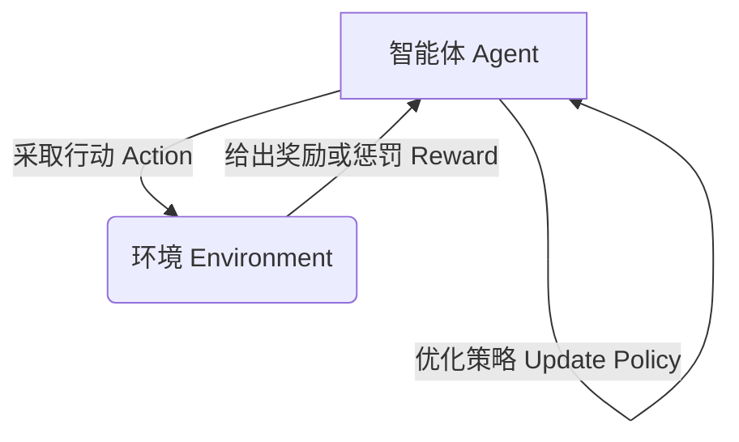
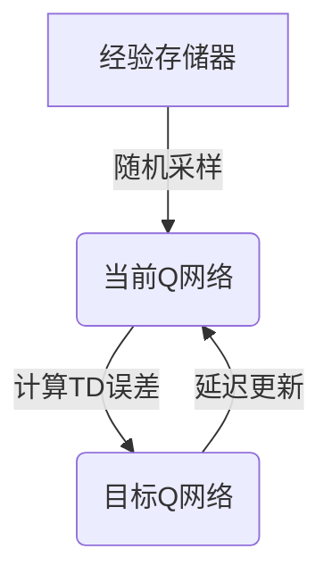

# 一切皆是映射：AI Q-learning在视频处理中的卓越表现

## 1.背景介绍

### 1.1 视频处理的重要性

在当今信息时代,视频数据无处不在。无论是日常生活中的监控录像,还是专业领域的医学影像、航拍视频等,视频都扮演着越来越重要的角色。有效处理和分析视频数据,不仅可以为我们提供宝贵的信息,也为人工智能技术的应用开辟了广阔的空间。

### 1.2 视频处理面临的挑战

然而,视频处理并非一蹴而就。由于视频数据的高维度、动态性和复杂性,传统的处理方法往往效率低下、准确率不高。例如,在视频目标检测和跟踪任务中,目标的形状、大小、位置等在不断变化,给算法的鲁棒性带来了巨大挑战。

### 1.3 AI视频处理的兴起

近年来,人工智能技术的飞速发展为视频处理带来了新的契机。特别是深度学习算法的出现,使得机器能够自主学习视频数据中的丰富特征,从而实现高精度的视频理解和分析。在这一背景下,强化学习(Reinforcement Learning)作为人工智能的一个重要分支,凭借其独特的"试错"学习方式,在视频处理领域展现出了卓越的潜力。

## 2.核心概念与联系

### 2.1 强化学习简介

强化学习是机器学习的一个重要范式,它模拟了人类和动物通过反复试错来学习的过程。在强化学习中,智能体(Agent)通过与环境(Environment)进行交互,获得奖励(Reward)或惩罚,从而不断优化自身的策略(Policy),最终达到预期目标。

强化学习的核心思想是"试错学习",智能体通过不断尝试不同的行为,根据获得的反馈来调整策略,从而逐步找到最优解。这种学习方式具有很强的通用性,不需要事先标注的训练数据,可以应用于各种复杂的决策问题。

### 2.2 Q-learning算法

Q-learning是强化学习中最著名和最成功的算法之一。它的核心思想是估计一个Q函数(Q-function),用于评估在某个状态(State)下采取某个行动(Action)的价值(Value)。通过不断更新Q函数,智能体可以逐步找到在每个状态下的最优行动。

$$
Q(s_t, a_t) \leftarrow Q(s_t, a_t) + \alpha \Big(r_t + \gamma \max_{a} Q(s_{t+1}, a) - Q(s_t, a_t)\Big)
$$

上式是Q-learning算法的核心更新公式,其中:

- $Q(s_t, a_t)$表示在状态$s_t$下采取行动$a_t$的价值估计
- $\alpha$是学习率,控制了新知识的学习速度
- $r_t$是立即奖励
- $\gamma$是折现因子,控制了未来奖励的重要程度
- $\max_a Q(s_{t+1}, a)$是下一个状态下所有可能行动的最大Q值估计

通过不断迭代更新Q函数,智能体最终可以找到一个近似最优的策略,指导其在每个状态下采取最佳行动。

### 2.3 Q-learning在视频处理中的应用

视频处理任务通常可以建模为一个马尔可夫决策过程(Markov Decision Process, MDP),智能体需要根据当前视频帧的状态,选择合适的行动(如目标检测、跟踪、分类等),从而获得最大化的累积奖励。Q-learning算法恰好能够通过试错交互,学习到一个近似最优的策略,指导智能体在每个视频帧状态下采取正确的行动。

例如,在视频目标检测和跟踪任务中,智能体的状态可以是当前视频帧及其特征;行动可以是调整检测框的位置和大小;奖励可以是检测框与真实目标的重合程度。通过Q-learning算法,智能体可以逐步学习到一个近似最优的策略,实现准确的目标检测和稳健的目标跟踪。

Q-learning算法在视频处理中的应用,不仅可以充分利用视频数据的时序特性,还能够通过试错交互的方式,自主发现视频理解和分析的最优策略,从而取得卓越的性能表现。

## 3.核心算法原理具体操作步骤

虽然Q-learning算法的基本思想简单,但在实际应用中仍需要解决一些关键问题,例如状态空间的表示、奖励函数的设计、探索与利用的权衡等。下面将详细介绍Q-learning在视频处理任务中的具体操作步骤。

### 3.1 状态空间表示

合理表示状态空间是Q-learning算法成功的关键之一。在视频处理任务中,状态通常由当前视频帧及其特征构成。具体来说,可以采用如下方式表示状态:

1. **原始像素值**: 将当前视频帧的原始像素值作为状态的一部分输入,这种方式保留了视频帧的所有信息,但计算代价较高。

2. **手工特征**: 提取视频帧的一些手工设计的特征,如颜色直方图、纹理特征、形状特征等,作为状态的表示。这种方式可以降低计算复杂度,但需要人工设计合适的特征。

3. **深度特征**: 使用深度卷积神经网络自动从视频帧中提取特征,作为状态的表示。这种方式可以自动学习到高层次的语义特征,但需要大量的训练数据和计算资源。

4. **时序特征**: 除了当前帧,还可以考虑包括前后若干帧的信息,以捕捉视频的动态变化。这种方式可以提高状态表示的时序特性,但会增加状态空间的维度。

在实际应用中,可以根据具体任务的需求和计算资源,选择合适的状态表示方式,或者将多种方式组合使用。

### 3.2 奖励函数设计

奖励函数的设计直接影响了Q-learning算法的学习目标和最终性能。在视频处理任务中,奖励函数通常与任务的评估指标密切相关,例如:

- **目标检测**: 奖励可以设置为检测框与真实目标的重合程度(如交并比IoU)。

- **目标跟踪**: 奖励可以设置为跟踪框与真实目标的重合程度,以及跟踪的稳定性。

- **行为识别**: 奖励可以设置为正确识别行为的概率或置信度。

- **视频描述**: 奖励可以设置为生成的文本描述与人工标注的相似度。

除了任务相关的奖励,还可以考虑引入一些辅助奖励,如鼓励探索新的状态、惩罚不合理的行为等,以加速算法的收敛和提高策略的鲁棒性。

在实践中,通常需要反复调整奖励函数的设计,使之能够正确引导智能体朝着预期目标优化,从而获得理想的性能表现。

### 3.3 探索与利用的权衡

Q-learning算法需要在探索(Exploration)和利用(Exploitation)之间寻找一个合理的平衡。探索是指智能体尝试新的行动,以发现更优的策略;而利用是指智能体根据当前已学习的策略采取行动,以获得最大化的即时奖励。

过度探索会导致算法收敛缓慢,而过度利用则可能陷入次优的局部最优解。因此,需要设计一个动态的探索策略,在算法的不同阶段调整探索与利用的比例。常用的探索策略包括:

1. **$\epsilon$-贪婪策略**:以一定的概率$\epsilon$随机选择行动(探索),其余时间选择当前最优行动(利用)。$\epsilon$的值通常会随着训练的进行而递减。

2. **软更新策略**:使用Boltzmann分布或其他软更新策略,根据Q值的大小给不同行动以不同的选择概率,这种方式可以更加连续地平衡探索与利用。

3. **计数策略**:记录每个状态-行动对被访问的次数,优先选择访问次数较少的状态-行动对,以鼓励探索。

4. **噪声策略**:在当前最优行动的基础上,添加一定的噪声扰动,以引入一定程度的探索。

除了上述经典策略,还可以结合任务的先验知识和特点,设计更加高效的探索策略。合理的探索策略不仅可以加快算法的收敛速度,还能够提高最终策略的性能和泛化能力。

### 3.4 经验回放与目标网络

在Q-learning算法的实际训练过程中,还需要解决一些关键性的技术问题,如经验回放(Experience Replay)和目标网络(Target Network)。

**经验回放**是一种常用的技术,它通过存储智能体与环境的交互经验,并在训练时随机抽取这些经验进行学习,从而打破了经验数据之间的相关性,提高了数据的利用效率。此外,经验回放还可以平衡探索与利用的比例,使训练过程更加稳定。

**目标网络**则是为了解决Q-learning算法中的非稳定性问题而提出的。在传统的Q-learning算法中,Q网络的目标是不断变化的,这可能会导致训练过程中的振荡和发散。目标网络通过引入一个延迟更新的目标Q网络,使得目标值保持相对稳定,从而提高了算法的收敛性和性能。

通过结合经验回放和目标网络等技术,Q-learning算法在视频处理任务中的训练过程可以更加高效和稳定,从而获得更优的性能表现。

## 4.数学模型和公式详细讲解举例说明

在上一节中,我们介绍了Q-learning算法在视频处理任务中的具体操作步骤。现在,我们将进一步深入探讨其中涉及的数学模型和公式,以加深对算法原理的理解。

### 4.1 马尔可夫决策过程(MDP)

Q-learning算法是基于马尔可夫决策过程(Markov Decision Process, MDP)这一数学模型来描述强化学习问题的。MDP由以下五个要素组成:

- 状态集合 $\mathcal{S}$
- 行动集合 $\mathcal{A}$
- 转移概率 $\mathcal{P}_{ss'}^a = \Pr(s_{t+1}=s'|s_t=s, a_t=a)$
- 奖励函数 $\mathcal{R}_s^a = \mathbb{E}[r_{t+1}|s_t=s, a_t=a]$
- 折现因子 $\gamma \in [0, 1)$

在视频处理任务中,状态集合 $\mathcal{S}$ 可以表示为所有可能的视频帧及其特征;行动集合 $\mathcal{A}$ 可以表示为在当前帧上可执行的各种操作,如目标检测、跟踪、分类等;转移概率 $\mathcal{P}_{ss'}^a$ 描述了在当前帧状态 $s$ 下执行行动 $a$ 后,转移到下一帧状态 $s'$ 的概率;奖励函数 $\mathcal{R}_s^a$ 定义了在状态 $s$ 执行行动 $a$ 后获得的即时奖励;折现因子 $\gamma$ 则控制了未来奖励对当前决策的影响程度。

基于MDP模型,强化学习算法的目标是找到一个最优策略 $\pi^*$,使得在任意初始状态 $s_0$ 下,按照该策略执行行动序列,可以获得最大化的期望累积奖励:

$$
\pi^* = \arg\max_\pi \mathbb{E}_\pi \Big[\sum_{t=0}^\infty \gamma^t r_{t+1} \Big| s_0 \Big]
$$

### 4.2 Q-learning更新公式

Q-learning算法