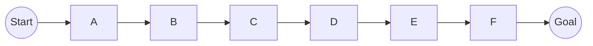

# 一切皆是映射：AI Q-learning奖励机制设计

## 1.背景介绍

在人工智能领域中,强化学习(Reinforcement Learning)是一种基于奖励机制的学习范式,它使智能体(Agent)能够通过与环境的交互来学习如何采取最优行为策略,从而最大化预期的长期累积奖励。Q-learning作为强化学习中的一种重要算法,已被广泛应用于各种场景,如机器人控制、游戏AI、资源优化等。

Q-learning的核心思想是使用一个Q函数来估计在给定状态下采取某个行为所能获得的长期累积奖励。通过不断更新Q函数,智能体可以逐步学习到最优策略。然而,合理设计奖励机制对于Q-learning的性能至关重要。一个好的奖励机制不仅能够加快智能体的学习速度,还能够引导智能体朝着期望的目标行为方向发展。

## 2.核心概念与联系

### 2.1 强化学习基本概念

在强化学习中,我们将智能体与环境之间的交互过程建模为一个马尔可夫决策过程(Markov Decision Process, MDP)。MDP由以下几个核心要素组成:

- 状态集合(State Space) $\mathcal{S}$
- 行为集合(Action Space) $\mathcal{A}$
- 转移概率(Transition Probability) $\mathcal{P}_{ss'}^a = \Pr(s' | s, a)$
- 奖励函数(Reward Function) $\mathcal{R}: \mathcal{S} \times \mathcal{A} \rightarrow \mathbb{R}$
- 折扣因子(Discount Factor) $\gamma \in [0, 1)$

其中,转移概率 $\mathcal{P}_{ss'}^a$ 表示在状态 $s$ 下执行行为 $a$ 后,转移到状态 $s'$ 的概率。奖励函数 $\mathcal{R}(s, a)$ 定义了在状态 $s$ 执行行为 $a$ 后获得的即时奖励。折扣因子 $\gamma$ 用于权衡当前奖励和未来奖励的重要性。

智能体的目标是学习一个策略(Policy) $\pi: \mathcal{S} \rightarrow \mathcal{A}$,使得在该策略下的期望累积奖励最大化:

$$
\max_{\pi} \mathbb{E}_{\pi}\left[\sum_{t=0}^{\infty} \gamma^t r_t\right]
$$

其中, $r_t$ 表示在时间步 $t$ 获得的奖励。

### 2.2 Q-learning算法

Q-learning算法通过估计在给定状态 $s$ 下执行行为 $a$ 后所能获得的期望累积奖励,来逐步学习最优策略。这个期望累积奖励被称为Q值,用 $Q(s, a)$ 表示。

Q-learning算法使用一个Q表(Q-table)来存储每个状态-行为对的Q值估计。在每个时间步,智能体根据当前状态 $s$ 和Q表选择一个行为 $a$,执行该行为后观察到新状态 $s'$ 和获得的即时奖励 $r$。然后,Q-learning算法使用以下更新规则来更新Q表中相应的Q值:

$$
Q(s, a) \leftarrow Q(s, a) + \alpha \left[r + \gamma \max_{a'} Q(s', a') - Q(s, a)\right]
$$

其中, $\alpha$ 是学习率,控制了新信息对Q值估计的影响程度。

通过不断地与环境交互并更新Q表,智能体最终可以学习到一个近似最优的策略。

### 2.3 奖励机制设计

奖励机制的设计对于Q-learning算法的性能至关重要。一个好的奖励机制应该能够:

1. 准确地反映智能体的目标和期望行为
2. 提供足够的学习信号,加快智能体的学习速度
3. 避免不当的奖励信号,防止智能体陷入局部最优或发散

奖励机制设计需要结合具体的应用场景和任务目标,并且通常需要一定的经验和试错。下面我们将介绍一些常见的奖励机制设计技巧和策略。

## 3.核心算法原理具体操作步骤

### 3.1 形状奖励(Shaping Reward)

形状奖励是一种常见的奖励机制设计技术,它通过在原始奖励函数的基础上添加额外的奖励信号,来引导智能体朝着期望的行为方向发展。形状奖励可以帮助智能体更快地学习到期望的策略,但同时也存在潜在的风险,即过度的形状奖励可能会导致智能体陷入局部最优,无法学习到真正的最优策略。

形状奖励的设计需要遵循以下原则:

1. 潜在形状奖励(Potential-Based Shaping)
   - 定义一个潜能函数(Potential Function) $\Phi: \mathcal{S} \rightarrow \mathbb{R}$
   - 形状奖励定义为 $F(s, s') = \gamma \Phi(s') - \Phi(s)$
   - 潜能形状奖励不会改变最优策略,但可以加快学习速度

2. 启发式形状奖励(Heuristic Shaping)
   - 根据领域知识和经验,手动设计形状奖励函数
   - 需要小心谨慎,避免过度的形状奖励导致偏离最优策略

### 3.2 逆奖励建模(Inverse Reward Modeling)

逆奖励建模是一种从示例行为中自动推断奖励函数的技术。它通常包括以下步骤:

1. 收集示例行为数据,包括状态序列和行为序列
2. 假设存在一个未知的奖励函数 $R^*$,使得示例行为在该奖励函数下近似最优
3. 使用最大熵逆强化学习(Maximum Entropy Inverse Reinforcement Learning)等算法,从示例行为中估计出 $R^*$

逆奖励建模的优点是可以自动从专家示例中学习奖励函数,无需手动设计。但它也存在一些挑战,如需要大量的高质量示例数据,并且推断出的奖励函数可能存在一定的模糊性和不确定性。

### 3.3 多目标奖励建模(Multi-Objective Reward Modeling)

在许多实际应用场景中,我们希望智能体能够同时优化多个目标,如最大化效率、最小化成本、保证安全性等。这种情况下,我们可以采用多目标奖励建模的方法,将多个目标合并为一个综合奖励函数。

一种常见的多目标奖励建模方法是线性缩放(Linear Scalarization):

$$
R(s, a) = \sum_{i=1}^n w_i R_i(s, a)
$$

其中, $R_i(s, a)$ 表示第 $i$ 个目标的奖励函数, $w_i$ 是对应的权重系数,反映了每个目标的相对重要性。

另一种方法是基于优先级的词典序优化(Lexicographic Ordering),即按照目标的优先级顺序依次优化每个目标,只有在高优先级目标达到最优时才考虑下一个目标。

多目标奖励建模的关键在于合理地设置目标的权重或优先级,以达成期望的权衡和折中。这通常需要领域知识和大量的试验调优。

## 4.数学模型和公式详细讲解举例说明

### 4.1 Q-learning算法数学模型

Q-learning算法的核心思想是通过估计Q值函数 $Q(s, a)$ 来逼近最优行为策略。Q值函数定义为在状态 $s$ 下执行行为 $a$ 后,能够获得的期望累积奖励:

$$
Q(s, a) = \mathbb{E}_{\pi}\left[\sum_{t=0}^{\infty} \gamma^t r_{t+1} | s_0 = s, a_0 = a, \pi\right]
$$

其中, $\pi$ 表示智能体的行为策略, $r_t$ 是在时间步 $t$ 获得的即时奖励, $\gamma$ 是折扣因子。

在Q-learning算法中,我们使用一个Q表来存储每个状态-行为对的Q值估计,并通过与环境交互不断更新Q表,以逼近真实的Q值函数。具体的更新规则如下:

$$
Q(s, a) \leftarrow Q(s, a) + \alpha \left[r + \gamma \max_{a'} Q(s', a') - Q(s, a)\right]
$$

其中, $\alpha$ 是学习率,控制了新信息对Q值估计的影响程度。 $r$ 是执行行为 $a$ 后获得的即时奖励, $s'$ 是转移到的新状态。 $\max_{a'} Q(s', a')$ 表示在新状态 $s'$ 下,执行最优行为所能获得的期望累积奖励。

通过不断更新Q表,Q-learning算法最终可以逼近真实的Q值函数,从而学习到一个近似最优的策略。

### 4.2 Q-learning算法收敛性证明

Q-learning算法的收敛性是指,在满足一定条件下,Q值估计 $Q(s, a)$ 会逐渐收敛到真实的Q值函数 $Q^*(s, a)$。

首先,我们定义最优Q值函数 $Q^*(s, a)$ 为:

$$
Q^*(s, a) = \mathbb{E}\left[r + \gamma \max_{a'} Q^*(s', a') | s, a\right]
$$

其次,我们定义Bellman操作符 $\mathcal{T}$ 为:

$$
\mathcal{T}Q(s, a) = \mathbb{E}\left[r + \gamma \max_{a'} Q(s', a') | s, a\right]
$$

可以证明,Bellman操作符 $\mathcal{T}$ 是一个收缩映射(Contraction Mapping),即对于任意两个Q值函数 $Q_1$ 和 $Q_2$,都有:

$$
\left\|\mathcal{T}Q_1 - \mathcal{T}Q_2\right\| \leq \gamma \left\|Q_1 - Q_2\right\|
$$

其中, $\|\cdot\|$ 表示最大范数。

根据固定点理论(Fixed Point Theory),对于任意初始的Q值函数 $Q_0$,如果重复应用Bellman操作符 $\mathcal{T}$,则序列 $\{Q_n\}$ 会收敛到最优Q值函数 $Q^*$:

$$
\lim_{n \rightarrow \infty} Q_n = \lim_{n \rightarrow \infty} \mathcal{T}^n Q_0 = Q^*
$$

Q-learning算法的更新规则实际上就是在逼近应用Bellman操作符的结果,因此在满足以下条件时,Q-learning算法能够保证收敛到最优Q值函数:

1. 每个状态-行为对被访问无限次
2. 学习率 $\alpha$ 满足适当的衰减条件,如 $\sum_{t=0}^{\infty} \alpha_t(s, a) = \infty$ 且 $\sum_{t=0}^{\infty} \alpha_t^2(s, a) < \infty$

需要注意的是,上述收敛性证明是建立在环境满足马尔可夫性假设的基础之上的。对于一些特殊的非马尔可夫环境,Q-learning算法的收敛性可能会受到影响。

### 4.3 Q-learning算法实例分析

考虑一个简单的网格世界(Gridworld)环境,如下图所示:

在这个环境中,智能体的目标是从起点 S 到达终点 G,每一步行走都会获得 -1 的奖励。我们使用 Q-learning 算法来训练智能体,看看它是否能够学习到最优策略。

假设我们初始化 Q 表为全 0,折扣因子 $\gamma = 0.9$,学习率 $\alpha = 0.1$。在第一个时间步,智能体在状态 S 随机选择了行为 "向右移动",转移到状态 A,获得即时奖励 -1。根据 Q-learning 更新规则,我们更新 Q 表中相应的 Q 值:

$$
\begin{aligned}
Q(S, \text{右移}) &\leftarrow Q(S, \text{右移}) + \alpha \left[-1 + \gamma \max_{a'} Q(A, a') - Q(S, \text{右移})\right] \\
&= 0 + 0.1 \left[-1 + 0.9 \times 0 - 0\right] \\{"msg_type":"generate_answer_finish","data":"","from_module":null,"from_unit":null}