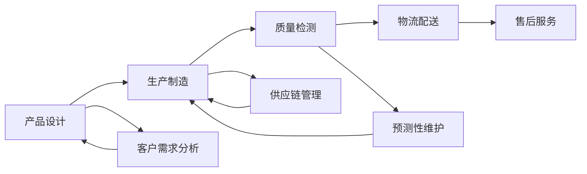

# 一切皆是映射：AI助力下的先进制造业革新

## 1. 背景介绍
### 1.1 制造业现状与挑战
#### 1.1.1 全球制造业格局变化
#### 1.1.2 传统制造业面临的困境
#### 1.1.3 数字化转型的迫切需求

### 1.2 人工智能技术的崛起
#### 1.2.1 人工智能的发展历程
#### 1.2.2 人工智能在各行业的应用
#### 1.2.3 人工智能在制造业中的潜力

### 1.3 先进制造业的内涵与特征 
#### 1.3.1 先进制造业的定义
#### 1.3.2 先进制造业的关键技术
#### 1.3.3 先进制造业的发展趋势

## 2. 核心概念与联系
### 2.1 映射的概念与本质
#### 2.1.1 映射的数学定义
#### 2.1.2 映射在计算机科学中的应用
#### 2.1.3 映射思想在制造业中的体现

### 2.2 人工智能与映射的关系
#### 2.2.1 人工智能中的映射过程
#### 2.2.2 深度学习中的特征映射
#### 2.2.3 强化学习中的状态-动作映射

### 2.3 先进制造业中的映射应用
#### 2.3.1 产品设计中的映射
#### 2.3.2 生产过程中的映射
#### 2.3.3 供应链管理中的映射

## 3. 核心算法原理具体操作步骤
### 3.1 卷积神经网络(CNN)
#### 3.1.1 卷积层的原理与操作
#### 3.1.2 池化层的作用与实现
#### 3.1.3 CNN在制造业中的应用案例

### 3.2 循环神经网络(RNN)
#### 3.2.1 RNN的基本结构与原理 
#### 3.2.2 长短期记忆网络(LSTM)的改进
#### 3.2.3 RNN在制造业中的应用案例

### 3.3 生成对抗网络(GAN)
#### 3.3.1 GAN的基本原理与结构
#### 3.3.2 条件生成对抗网络(CGAN)的扩展
#### 3.3.3 GAN在制造业中的应用案例

## 4. 数学模型和公式详细讲解举例说明
### 4.1 支持向量机(SVM)模型
#### 4.1.1 SVM的数学原理与目标函数
#### 4.1.2 核函数的选择与作用
#### 4.1.3 SVM在制造业质量检测中的应用

### 4.2 马尔可夫决策过程(MDP)模型
#### 4.2.1 MDP的数学定义与组成要素
#### 4.2.2 贝尔曼方程的推导与求解
#### 4.2.3 MDP在制造业生产调度中的应用

### 4.3 高斯过程回归(GPR)模型
#### 4.3.1 高斯过程的数学定义与性质
#### 4.3.2 GPR的推断过程与超参数优化
#### 4.3.3 GPR在制造业预测性维护中的应用

## 5. 项目实践：代码实例和详细解释说明
### 5.1 基于CNN的产品缺陷检测系统
#### 5.1.1 数据集的准备与预处理
#### 5.1.2 CNN模型的构建与训练
#### 5.1.3 缺陷检测结果的评估与优化

### 5.2 基于RNN的设备剩余寿命预测系统
#### 5.2.1 时序数据的采集与处理
#### 5.2.2 LSTM模型的设计与训练
#### 5.2.3 剩余寿命预测结果的分析与应用

### 5.3 基于GAN的产品设计生成系统
#### 5.3.1 设计数据的表示与编码
#### 5.3.2 CGAN模型的构建与训练
#### 5.3.3 新颖设计方案的生成与评估

## 6. 实际应用场景
### 6.1 智能制造车间的构建
#### 6.1.1 设备联网与数据采集
#### 6.1.2 生产过程的实时监控与优化
#### 6.1.3 质量管理与追溯体系的建立

### 6.2 个性化定制的实现
#### 6.2.1 客户需求的智能分析与挖掘
#### 6.2.2 柔性生产线的规划与调度
#### 6.2.3 定制化产品的快速交付与服务

### 6.3 供应链的智能化管理
#### 6.3.1 需求预测与库存优化
#### 6.3.2 物流配送的智能规划与调度
#### 6.3.3 供应商评估与风险管理

## 7. 工具和资源推荐
### 7.1 开源深度学习框架
#### 7.1.1 TensorFlow
#### 7.1.2 PyTorch
#### 7.1.3 Keras

### 7.2 工业大数据平台
#### 7.2.1 西门子 MindSphere
#### 7.2.2 GE Predix
#### 7.2.3 PTC ThingWorx

### 7.3 制造业AI解决方案提供商
#### 7.3.1 英伟达 NVIDIA
#### 7.3.2 埃森哲 Accenture
#### 7.3.3 IBM Watson

## 8. 总结：未来发展趋势与挑战
### 8.1 人工智能与制造业深度融合的趋势
#### 8.1.1 智能化程度不断提升
#### 8.1.2 数据驱动的决策优化
#### 8.1.3 人机协作的新模式

### 8.2 先进制造业发展面临的挑战
#### 8.2.1 数据安全与隐私保护
#### 8.2.2 人才培养与技能转型
#### 8.2.3 标准规范与法律法规完善

### 8.3 展望未来：智能制造的新蓝图
#### 8.3.1 数字孪生与虚拟制造
#### 8.3.2 自主学习与自适应优化
#### 8.3.3 制造业与服务业的融合发展

## 9. 附录：常见问题与解答
### 9.1 中小企业如何开展智能制造转型？
### 9.2 如何选择适合的人工智能技术与应用场景？
### 9.3 智能制造对从业人员的技能要求有哪些变化？
### 9.4 如何平衡智能制造的投入成本与收益？
### 9.5 智能制造时代如何应对数据安全与隐私挑战？

随着人工智能技术的飞速发展，制造业正迎来一场前所未有的变革。传统的生产模式已无法满足日益个性化、多样化的客户需求，先进制造业应运而生。而人工智能在其中扮演着关键的角色，通过对海量数据的分析挖掘，优化产品设计、生产制造、质量检测等各个环节，实现制造过程的智能化、柔性化、高效化。

在这场变革中，"映射"的概念贯穿始终。人工智能本质上就是对现实世界的抽象与映射，通过对数据特征的提取和表示，建立起输入与输出之间的对应关系。卷积神经网络通过层层映射，实现图像的特征提取与分类；循环神经网络通过时序映射，捕捉数据中的时间依赖关系；生成对抗网络通过映射空间的对抗学习，生成逼真的样本数据。

这些人工智能算法在制造业中得到了广泛应用。基于CNN的视觉检测系统可以快速、准确地发现产品缺陷，基于RNN的预测性维护系统可以提前预警设备故障，基于GAN的设计生成系统可以自动探索出新颖、可行的产品方案。通过对设计、生产、检测、物流、服务等各个环节的智能化赋能，人工智能正在重塑制造业的价值链条。

当然，先进制造业的发展也面临诸多挑战。海量工业数据的安全存储与隐私保护、复合型人才的培养与技能转型、相关标准规范的制定与完善等，都需要产业界、学术界、政府部门通力合作，共同推进。展望未来，数字孪生、自主学习、产业融合等新兴技术和理念，将进一步拓展智能制造的边界，开创制造业高质量发展的新蓝图。

人工智能赋能下的先进制造业变革，本质上是对传统制造过程的重新映射。通过用数据驱动决策、用算法优化流程、用智能重塑模式，制造业正在走向更加高效、柔性、个性化的未来。这场变革不仅仅是技术的迭代，更是思维方式的转变。唯有顺应时代潮流，以开放、创新、协作的心态拥抱变革，制造业才能在智能时代焕发新的生机与活力。一切皆是映射，让我们携手共绘智能制造的新画卷。

作者：禅与计算机程序设计艺术 / Zen and the Art of Computer Programming