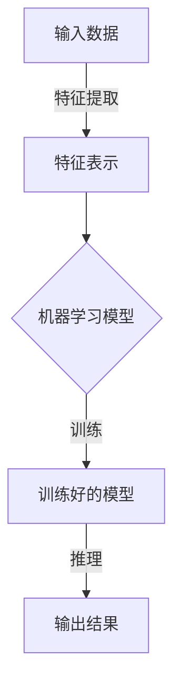
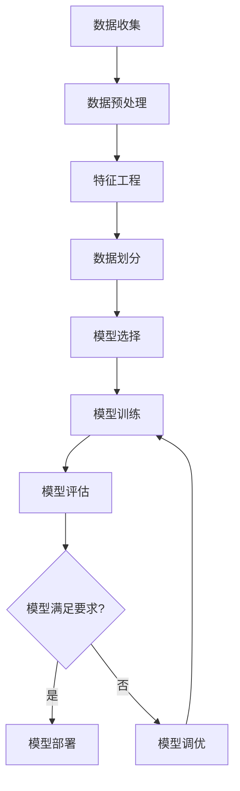

# 一切皆是映射：AI的伦理问题与未来挑战

## 1. 背景介绍

人工智能(AI)技术在过去几十年里取得了长足的进步,并逐渐渗透到我们生活的方方面面。从语音助手到自动驾驶汽车,从医疗诊断到金融决策,AI系统正在改变我们与世界互动的方式。然而,随着AI能力的不断提升,其潜在的伦理风险和挑战也日益凸显。我们需要审视AI系统是否符合人类的价值观和伦理准则,以确保其可持续和负责任的发展。

### 1.1 AI的发展历程

人工智能的概念可以追溯到20世纪40年代,当时一些先驱者提出了"智能机器"的设想。1956年,约翰·麦卡锡在达特茅斯学院举办的一次会议上首次使用了"人工智能"一词。此后,AI经历了几个重要的发展阶段:

- 1960-1970年代:符号主义和专家系统
- 1980-1990年代:机器学习和神经网络
- 2000年代初:大数据和计算能力的提升
- 2010年代:深度学习的突破

如今,AI技术已经渗透到生活的方方面面,成为推动科技创新的核心动力。

### 1.2 AI的伦理挑战

尽管AI为人类社会带来了诸多好处,但它也引发了一系列伦理问题和挑战,例如:

- **算法偏差**:由于训练数据或算法本身的偏差,AI系统可能会产生不公平或歧视性的结果。
- **隐私和安全**:AI系统可能会收集和利用大量个人数据,从而侵犯隐私权。同时,AI系统也面临着被黑客攻击和操纵的风险。
- **透明度和可解释性**:许多AI系统(尤其是深度学习系统)的决策过程是一个"黑箱",缺乏透明度和可解释性。
- **责任归属**:当AI系统出现错误或造成伤害时,谁应该负责?
- **人工智能的发展方向**:我们应该允许AI系统无限制地发展,还是应该设置一些界限?

这些问题都需要我们进行深入的思考和讨论,以确保AI的发展符合人类的价值观和伦理准则。

## 2. 核心概念与联系

为了更好地理解AI的伦理问题,我们需要先了解一些核心概念及其相互联系。

### 2.1 人工智能的定义

人工智能(AI)是一门致力于研究和开发能够模拟人类智能行为的理论、方法、技术及应用系统的学科。它包括以下几个主要领域:

- **机器学习**:从数据中自动分析并获取模式,并利用这些模式进行预测或决策。
- **计算机视觉**:从图像或视频中识别和理解物体、场景和活动。
- **自然语言处理**:使计算机能够理解和生成人类语言。
- **机器人技术**:设计和构建能够感知环境、规划行动并执行任务的机器人系统。
- **专家系统**:利用人类专家的知识和推理规则来解决复杂问题。

### 2.2 AI系统的工作原理

尽管AI系统的具体实现方式可能有所不同,但它们通常都遵循以下基本流程:

1. **输入数据**:AI系统需要大量的数据作为输入,例如图像、文本、声音或传感器数据。
2. **特征提取**:从原始数据中提取有意义的特征或模式,构建特征表示。
3. **机器学习模型**:选择合适的机器学习算法(如深度神经网络、决策树等),并使用训练数据对模型进行训练。
4. **训练好的模型**:经过训练后,模型可以对新的输入数据进行推理和预测。
5. **输出结果**:根据模型的推理,输出相应的结果,例如图像识别、语音转文本、决策建议等。

### 2.3 AI系统的应用领域

AI技术已经广泛应用于各个领域,包括但不限于:

- **计算机视觉**:图像识别、目标检测、视频分析等。
- **自然语言处理**:机器翻译、语音识别、文本生成等。
- **机器人技术**:工业自动化、服务机器人、无人驾驶等。
- **医疗健康**:医学影像分析、疾病诊断、药物发现等。
- **金融服务**:风险评估、欺诈检测、投资决策等。
- **智能安防**:人脸识别、行为分析、威胁检测等。

## 3. 核心算法原理具体操作步骤

虽然不同的AI系统可能采用不同的算法和模型,但它们通常都遵循一些共同的原理和步骤。以下是一个典型的机器学习算法的工作流程:

### 3.1 数据收集

机器学习算法需要大量的高质量数据作为输入。数据可以来自各种来源,如传感器、日志文件、网络爬虫等。确保数据的质量和多样性对于训练出高性能的模型至关重要。

### 3.2 数据预处理

原始数据通常需要进行清洗和转换,以满足算法的输入要求。常见的预处理步骤包括:

- 缺失值处理
- 异常值处理
- 数据标准化或归一化
- 特征编码(如one-hot编码)

### 3.3 特征工程

特征工程是从原始数据中提取有意义的特征,以供机器学习算法使用。这可能涉及特征选择、特征提取和特征构造等步骤。高质量的特征对于模型性能至关重要。

### 3.4 数据划分

为了评估模型的泛化能力,通常需要将数据集划分为训练集、验证集和测试集。训练集用于训练模型,验证集用于调整超参数,测试集用于评估模型在未见数据上的性能。

### 3.5 模型选择

根据问题的性质和数据的特点,选择合适的机器学习算法,如线性回归、决策树、支持向量机、神经网络等。不同的算法适用于不同的场景。

### 3.6 模型训练

使用训练数据对选定的算法进行训练,目标是找到一组最优参数,使模型在训练数据上的性能最佳化。常见的训练方法包括梯度下降、随机梯度下降等。

### 3.7 模型评估

使用验证集或测试集评估模型的性能,常用的评估指标包括准确率、精确率、召回率、F1分数等。根据评估结果,决定是否需要进一步调优模型。

### 3.8 模型调优

如果模型性能不理想,可以尝试调整以下参数:

- 超参数(如学习率、正则化系数等)
- 特征工程策略
- 算法选择
- 训练数据量

经过多次迭代,直到模型性能满足要求。

### 3.9 模型部署

一旦模型通过评估,就可以将其部署到生产环境中,用于实际应用场景。部署过程可能涉及模型优化、API开发、系统集成等步骤。

## 4. 数学模型和公式详细讲解举例说明

在AI领域,数学模型和公式扮演着至关重要的角色。它们为算法提供了理论基础,并指导了模型的设计和优化。以下是一些常见的数学模型和公式,以及它们在AI中的应用。

### 4.1 线性回归

线性回归是一种广泛使用的监督学习算法,用于预测连续值的目标变量。它的数学表达式如下:

$$
y = \theta_0 + \theta_1x_1 + \theta_2x_2 + ... + \theta_nx_n
$$

其中$y$是目标变量,$x_i$是特征变量,$\theta_i$是待估计的参数。目标是找到一组最优参数$\theta$,使得预测值$\hat{y}$与实际值$y$之间的误差最小化。

常用的损失函数是均方误差(MSE):

$$
MSE = \frac{1}{n}\sum_{i=1}^{n}(y_i - \hat{y}_i)^2
$$

可以使用梯度下降等优化算法来最小化损失函数,从而找到最优参数。

线性回归在许多领域都有应用,如金融预测、能源需求预测等。

### 4.2 逻辑回归

逻辑回归是一种用于二分类问题的算法,它将输入映射到0到1之间的概率值。其数学表达式如下:

$$
P(y=1|x) = \sigma(\theta^Tx) = \frac{1}{1 + e^{-\theta^Tx}}
$$

其中$\sigma$是sigmoid函数,用于将线性组合$\theta^Tx$映射到(0,1)范围内。

对于二分类问题,我们可以设置一个阈值(通常为0.5),当$P(y=1|x) > 0.5$时,预测为正类,否则预测为负类。

常用的损失函数是交叉熵损失:

$$
J(\theta) = -\frac{1}{m}\sum_{i=1}^{m}[y^{(i)}\log(h_\theta(x^{(i)})) + (1 - y^{(i)})\log(1 - h_\theta(x^{(i)}))]
$$

其中$m$是样本数量,$y^{(i)}$是第$i$个样本的真实标签,$h_\theta(x^{(i)})$是对第$i$个样本的预测概率。

逻辑回归广泛应用于信用风险评估、疾病诊断等二分类场景。

### 4.3 支持向量机(SVM)

支持向量机是一种有监督学习模型,常用于分类和回归问题。它的基本思想是在高维空间中找到一个超平面,将不同类别的数据点分开,同时使得每类数据点与超平面的距离最大化。

对于线性可分的二分类问题,SVM的目标是找到一个超平面$w^Tx + b = 0$,使得:

$$
\begin{align*}
&\min_{w,b}\frac{1}{2}\|w\|^2\\
&\text{s.t. } y_i(w^Tx_i + b) \geq 1, \quad i=1,2,...,n
\end{align*}
$$

其中$x_i$是输入样本,$y_i \in \{-1, 1\}$是样本标签,$w$和$b$是待求的超平面参数。

对于线性不可分的情况,可以引入核技巧,将数据映射到更高维的特征空间,使其在新空间中线性可分。常用的核函数包括线性核、多项式核和高斯核等。

SVM在文本分类、图像识别等领域有广泛应用。

### 4.4 决策树

决策树是一种基于树形结构的监督学习算法,用于分类和回归任务。它通过递归地划分特征空间,将输入样本划分到不同的叶节点,每个叶节点对应一个预测值或类别。

决策树的构建过程可以使用信息增益或基尼系数等指标来选择最优划分特征和阈值。对于分类问题,信息增益定义为:

$$
\text{Gain}(D, a) = \text{Entropy}(D) - \sum_{v=1}^{V}\frac{|D^v|}{|D|}\text{Entropy}(D^v)
$$

其中$D$是当前数据集,$a$是特征,$V$是特征$a$的取值集合,$D^v$是$D$中特征$a$取值为$v$的子集。$\text{Entropy}(D)$表示数据集$D$的熵,用于度量数据集的纯度。

决策树易于解释,并且可以很好地处理数值型和类别型特征。它在金融风险评估、医疗诊断等领域有广泛应用。

### 4.5 神经网络

神经网