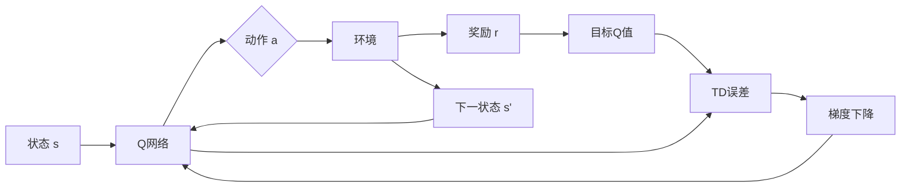

# 一切皆是映射：DQN在复杂环境下的应对策略与改进

## 1. 背景介绍
### 1.1 强化学习的崛起
#### 1.1.1 强化学习的定义与特点
#### 1.1.2 强化学习在人工智能领域的地位
#### 1.1.3 强化学习的发展历程

### 1.2 深度强化学习的诞生  
#### 1.2.1 深度学习与强化学习的结合
#### 1.2.2 DQN的提出及其意义
#### 1.2.3 DQN在Atari游戏中的惊人表现

### 1.3 DQN面临的挑战
#### 1.3.1 复杂环境下的探索困境
#### 1.3.2 样本效率低下
#### 1.3.3 泛化能力不足

## 2. 核心概念与联系
### 2.1 马尔可夫决策过程(MDP)
#### 2.1.1 状态、动作、转移概率和奖励
#### 2.1.2 最优策略与值函数
#### 2.1.3 贝尔曼方程

### 2.2 Q-Learning
#### 2.2.1 Q值的定义
#### 2.2.2 Q-Learning的更新规则
#### 2.2.3 探索与利用的权衡

### 2.3 DQN
#### 2.3.1 神经网络作为Q值函数近似
#### 2.3.2 经验回放(Experience Replay)
#### 2.3.3 目标网络(Target Network)

### 2.4 DQN的局限性
#### 2.4.1 过度估计(Overestimation)问题
#### 2.4.2 探索不足(Insufficient Exploration)问题
#### 2.4.3 样本利用率低(Sample Inefficiency)问题

## 3. 核心算法原理具体操作步骤
### 3.1 DQN算法流程
#### 3.1.1 初始化阶段
#### 3.1.2 与环境交互阶段
#### 3.1.3 经验回放与网络更新阶段

### 3.2 ε-贪婪探索策略
#### 3.2.1 ε的设置与衰减
#### 3.2.2 探索与利用的动态平衡

### 3.3 损失函数与优化器
#### 3.3.1 均方误差损失
#### 3.3.2 Adam优化器

### 3.4 算法伪代码

## 4. 数学模型和公式详细讲解举例说明
### 4.1 Q-Learning的数学模型
#### 4.1.1 Q值更新公式推导
#### 4.1.2 时序差分(TD)误差
#### 4.1.3 Q-Learning的收敛性证明

### 4.2 DQN的数学模型
#### 4.2.1 神经网络拟合Q值函数
#### 4.2.2 损失函数的数学表达
#### 4.2.3 DQN的收敛性分析

### 4.3 贝尔曼方程与最优Q值
#### 4.3.1 贝尔曼最优方程
#### 4.3.2 最优Q值与最优策略的关系
#### 4.3.3 Q-Learning与贝尔曼方程的联系

## 5. 项目实践：代码实例和详细解释说明
### 5.1 环境设置
#### 5.1.1 OpenAI Gym环境介绍
#### 5.1.2 环境封装与预处理

### 5.2 神经网络构建
#### 5.2.1 网络结构设计
#### 5.2.2 激活函数选择
#### 5.2.3 权重初始化方法

### 5.3 DQN代码实现
#### 5.3.1 经验回放缓冲区
#### 5.3.2 ε-贪婪策略
#### 5.3.3 网络更新与损失计算

### 5.4 训练过程与结果分析
#### 5.4.1 超参数设置
#### 5.4.2 训练曲线与评估指标
#### 5.4.3 可视化分析

## 6. 实际应用场景
### 6.1 智能交通
#### 6.1.1 交通信号控制
#### 6.1.2 自动驾驶决策

### 6.2 推荐系统
#### 6.2.1 在线广告投放
#### 6.2.2 个性化推荐

### 6.3 智能电网
#### 6.3.1 负荷预测与调度
#### 6.3.2 新能源并网控制

## 7. 工具和资源推荐
### 7.1 深度强化学习框架
#### 7.1.1 OpenAI Baselines
#### 7.1.2 Stable Baselines
#### 7.1.3 RLlib

### 7.2 环境与数据集
#### 7.2.1 OpenAI Gym
#### 7.2.2 DeepMind Control Suite
#### 7.2.3 MuJoCo

### 7.3 学习资源
#### 7.3.1 教程与书籍
#### 7.3.2 论文与博客
#### 7.3.3 开源项目

## 8. 总结：未来发展趋势与挑战
### 8.1 DQN的改进方向
#### 8.1.1 Double DQN
#### 8.1.2 Dueling DQN
#### 8.1.3 Rainbow

### 8.2 深度强化学习的研究热点
#### 8.2.1 多智能体强化学习
#### 8.2.2 层次化强化学习
#### 8.2.3 迁移学习与元学习

### 8.3 未来挑战与机遇
#### 8.3.1 样本效率与泛化能力
#### 8.3.2 安全性与可解释性
#### 8.3.3 实时决策与部署

## 9. 附录：常见问题与解答
### 9.1 DQN的超参数调优技巧
### 9.2 如何处理连续动作空间
### 9.3 DQN能否应用于部分可观测环境
### 9.4 如何平衡探索与利用
### 9.5 DQN的收敛性与稳定性分析

---

强化学习作为人工智能的重要分支,近年来受到了学术界和工业界的广泛关注。它通过智能体与环境的交互,不断试错和优化,最终学习到最优策略,实现目标导向的序贯决策。深度强化学习更是将深度学习和强化学习巧妙结合,利用深度神经网络强大的表征能力,攻克了传统强化学习面临的维度灾难和泛化不足等难题,在多个领域取得了瞩目的成就。

2015年,DeepMind提出的DQN(Deep Q-Network)可以说是深度强化学习的开山之作。它在Atari 2600游戏平台上,仅基于原始像素输入,就在多个游戏中达到了超越人类的水平,展现了深度强化学习的巨大潜力。DQN利用卷积神经网络来逼近Q值函数,并引入了经验回放和目标网络等创新机制,极大地提升了样本利用效率和训练稳定性,为后续的研究奠定了坚实的基础。

然而,DQN在面对更加复杂的环境时,仍然存在一些局限性。首先是探索不足的问题,尤其在稀疏奖励和欺骗性奖励的情况下,DQN很难有效探索环境,容易陷入次优解。其次是样本效率低下,DQN需要大量的环境交互数据才能学习到较好的策略,这在实际应用中往往代价高昂。此外,DQN学习到的策略泛化能力也有待提高,在面对环境变化时,往往需要重新训练。

为了应对这些挑战,研究者们提出了一系列DQN的改进方法。Double DQN通过解耦动作选择和价值评估,缓解了Q值过估计问题；Dueling DQN将Q值分解为状态值和优势函数,更高效地学习状态的内在价值；Prioritized Experience Replay根据TD误差对经验数据进行优先级排序和采样,提高了样本利用效率；Noisy Net通过在网络权重中引入参数噪声,实现了更高效的探索；Distributional RL从分布的角度刻画随机性,提升了模型的表达能力和鲁棒性。这些改进思路最终集成到Rainbow中,使其在Atari游戏上的表现进一步提升。

尽管DQN及其变体在离散动作空间的控制任务上表现出色,但在面对连续动作空间时却无能为力。为此,研究者们发展出了一系列基于策略梯度的深度强化学习算法,如DDPG、TRPO、PPO等,它们通过直接参数化策略函数,结合确定性策略梯度或约束优化,实现了连续控制领域的突破。

深度强化学习作为一个崭新的研究领域,其发展日新月异。多智能体强化学习、层次化强化学习、元强化学习等前沿方向不断涌现,进一步拓展了其应用边界。深度强化学习在智能交通、推荐系统、智能电网、机器人控制等诸多领域展现出了广阔的应用前景,但同时也面临样本效率、泛化能力、安全性、可解释性等诸多挑战。这需要研究者们在算法设计、工程实现、理论分析等方面持续探索,进一步释放其潜力。

DQN作为深度强化学习的奠基之作,开启了一扇通往智能决策的大门。站在巨人的肩膀上,研究者们正在不断探索和突破,让智能体能够在复杂多变的现实世界中,灵活应对、从容决策。深度强化学习承载着人类对智能的憧憬和想象,也许终有一天,它能够成为我们通往通用人工智能的桥梁。在这个充满挑战和机遇的征程中,每一步都值得期待。

在上面的Mermaid流程图中,我们展示了DQN的核心工作流程。智能体处于某个状态s,将其输入到Q网络中,得到各个动作的Q值估计。根据ε-贪婪策略选择一个动作a,执行后环境返回奖励r和下一状态s'。利用下一状态s'和目标Q网络计算TD目标,并与Q网络的输出计算TD误差,再通过梯度下降算法更新Q网络的参数,最小化TD误差。不断重复这一过程,Q网络就能逐步逼近真实的Q值函数,最终学习到最优策略。

总的来说,DQN及其后续的改进工作,极大地推动了深度强化学习的发展,为解决复杂的智能决策问题提供了新的思路和方法。尽管还有诸多理论和工程上的挑战需要攻克,但深度强化学习正在不断接近人类智能,甚至超越人类智能的目标。未来,深度强化学习有望在更广阔的领域大放异彩,让智能无处不在。让我们拭目以待,见证这场人工智能的盛宴。

作者：禅与计算机程序设计艺术 / Zen and the Art of Computer Programming