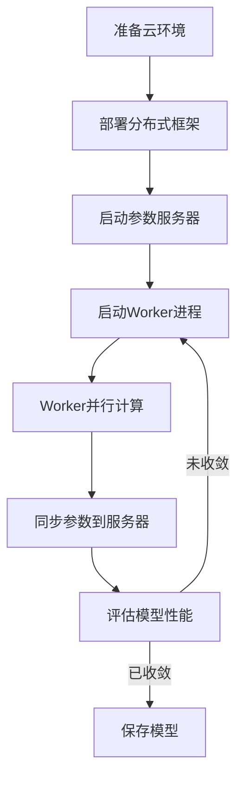

# 一切皆是映射：DQN的云计算与分布式训练方案

## 1. 背景介绍

### 1.1 深度强化学习的兴起

近年来,深度强化学习(Deep Reinforcement Learning, DRL)作为机器学习的一个新兴分支,受到了广泛关注和研究。它结合了深度学习的强大功能和强化学习的决策优化能力,在多个领域取得了令人瞩目的成就,如游戏AI、机器人控制、自动驾驶等。

### 1.2 DQN算法的重要性

在DRL领域,深度Q网络(Deep Q-Network, DQN)是一种开创性的算法,由DeepMind于2015年提出。它将深度神经网络应用于强化学习的Q学习算法中,成功解决了传统Q学习在处理高维观测数据时的局限性,使得智能体可以直接从原始像素数据中学习,而不需要人工设计特征。DQN在多个复杂任务中表现出色,如Atari视频游戏,成为DRL研究的基石。

### 1.3 云计算与分布式训练的需求

尽管取得了重大进展,但DRL算法通常需要大量的计算资源和训练时间。以DQN为例,训练一个Atari游戏智能体可能需要数十亿次试验,耗费数周时间。因此,如何利用云计算和分布式训练技术来加速DRL模型的训练过程,成为一个迫切的需求。

## 2. 核心概念与联系

### 2.1 DQN算法概述

DQN算法的核心思想是使用深度神经网络来近似Q函数,即状态-行为值函数。它通过经验回放池(Experience Replay)和目标网络(Target Network)等技术来解决传统Q学习中的不稳定性问题,使得训练过程更加平滑和收敛。

### 2.2 云计算与分布式系统

云计算是一种按需提供可伸缩的计算资源(如CPU、GPU、内存等)的服务模式。分布式系统则是将一个大型计算任务分解为多个小任务,并行执行在多台计算机上,从而提高计算效率。

### 2.3 DQN与云计算/分布式的联系

将DQN算法部署到云计算环境中,可以充分利用云端的可伸缩计算资源,加速训练过程。同时,通过分布式训练技术,可以将DQN的训练过程并行化,进一步提高计算效率。

## 3. 核心算法原理具体操作步骤 

### 3.1 DQN算法原理

DQN算法的核心步骤如下:

1. 初始化回放池D和Q网络(主网络和目标网络)
2. 对于每一个时间步:
    - 根据当前状态s,使用ε-贪婪策略选择行为a
    - 执行行为a,获得奖励r和新状态s'
    - 将(s,a,r,s')存入回放池D
    - 从D中采样批次数据,计算损失函数
    - 使用优化算法(如RMSProp)更新Q网络参数
    - 每隔一定步数同步目标网络参数
3. 直至智能体达到所需表现

### 3.2 云计算与分布式训练流程

利用云计算和分布式训练加速DQN算法的基本流程如下:



1. 准备云环境:在云平台上创建计算实例集群
2. 部署分布式框架:如TensorFlow、PyTorch等
3. 启动参数服务器:维护全局模型参数  
4. 启动Worker进程:每个Worker加载模型并训练
5. Worker并行计算:每个Worker并行计算梯度
6. 同步参数到服务器:定期将梯度同步到参数服务器
7. 评估模型性能:根据评估指标判断是否收敛
8. 保存模型:训练完成后保存最终模型

## 4. 数学模型和公式详细讲解举例说明

### 4.1 Q-Learning算法

Q-Learning是强化学习中的一种基于价值的算法,其目标是找到一个最优的Q函数,使得在任何状态s下执行行为a,能获得最大的期望回报。Q函数定义如下:

$$Q^*(s, a) = \mathbb{E}\left[r_t + \gamma \max_{a'} Q^*(s_{t+1}, a') | s_t = s, a_t = a\right]$$

其中,$\gamma$是折扣因子,用于平衡即时奖励和长期回报。

在Q-Learning算法中,我们使用一个函数逼近器(如神经网络)来近似Q函数,并通过不断更新参数使其逼近最优Q函数。具体更新规则为:

$$Q(s_t, a_t) \leftarrow Q(s_t, a_t) + \alpha \left(r_t + \gamma \max_{a'} Q(s_{t+1}, a') - Q(s_t, a_t)\right)$$

其中,$\alpha$是学习率。

### 4.2 DQN算法中的技术细节

#### 4.2.1 经验回放池(Experience Replay)

为了解决强化学习中的相关性和非平稳性问题,DQN引入了经验回放池。在训练过程中,智能体与环境交互时产生的(s,a,r,s')转换对被存储在回放池中。在训练时,从回放池中随机采样一个批次的转换对进行训练,打破了数据间的相关性,提高了训练稳定性。

#### 4.2.2 目标网络(Target Network)

为了进一步提高训练稳定性,DQN将Q网络分为两个部分:主Q网络和目标Q网络。目标Q网络的参数是主Q网络参数的拷贝,但只在一定步数后进行更新。这种延迟更新的方式使得目标Q网络相对于主Q网络更加稳定,从而提高了训练的收敛性。

#### 4.2.3 Double DQN

标准DQN算法在估计目标Q值时存在一定偏差,因为它使用相同的Q网络来选择最大行为和评估值函数。Double DQN通过分离这两个过程来减小估计偏差,提高了算法的性能。

具体来说,Double DQN的目标Q值计算公式为:

$$r_t + \gamma Q'\left(s_{t+1}, \arg\max_a Q(s_{t+1}, a)\right)$$

其中,$Q'$是目标Q网络,$Q$是主Q网络。

## 5. 项目实践:代码实例和详细解释说明

以下是使用PyTorch实现DQN算法的简化代码示例:

```python
import torch
import torch.nn as nn
import torch.optim as optim
import random

# 定义Q网络
class QNetwork(nn.Module):
    def __init__(self, state_dim, action_dim):
        super(QNetwork, self).__init__()
        self.fc1 = nn.Linear(state_dim, 128)
        self.fc2 = nn.Linear(128, action_dim)

    def forward(self, x):
        x = torch.relu(self.fc1(x))
        return self.fc2(x)

# 定义DQN Agent
class DQNAgent:
    def __init__(self, state_dim, action_dim):
        self.q_net = QNetwork(state_dim, action_dim)
        self.target_q_net = QNetwork(state_dim, action_dim)
        self.optimizer = optim.Adam(self.q_net.parameters())
        self.replay_buffer = []
        self.gamma = 0.99
        
    def get_action(self, state, epsilon):
        if random.random() < epsilon:
            return random.randint(0, action_dim - 1)
        else:
            state = torch.tensor(state, dtype=torch.float32)
            q_values = self.q_net(state)
            return torch.argmax(q_values).item()
        
    def update(self, batch_size):
        minibatch = random.sample(self.replay_buffer, batch_size)
        
        states = torch.tensor([data[0] for data in minibatch], dtype=torch.float32)
        actions = torch.tensor([data[1] for data in minibatch], dtype=torch.int64)
        rewards = torch.tensor([data[2] for data in minibatch], dtype=torch.float32)
        next_states = torch.tensor([data[3] for data in minibatch], dtype=torch.float32)
        
        q_values = self.q_net(states).gather(1, actions.unsqueeze(1)).squeeze(1)
        next_q_values = self.target_q_net(next_states).max(1)[0]
        expected_q_values = rewards + self.gamma * next_q_values
        
        loss = nn.MSELoss()(q_values, expected_q_values)
        self.optimizer.zero_grad()
        loss.backward()
        self.optimizer.step()
        
        if len(self.replay_buffer) > 10000:
            self.replay_buffer.pop(0)
            
    def sync_target_net(self):
        self.target_q_net.load_state_dict(self.q_net.state_dict())
```

代码解释:

1. 定义Q网络:使用PyTorch构建一个简单的全连接Q网络。
2. 定义DQNAgent:包含Q网络、目标Q网络、优化器、回放池等核心组件。
3. `get_action`函数:根据当前状态和ε-贪婪策略选择行为。
4. `update`函数:从回放池中采样批次数据,计算损失函数并更新Q网络参数。
5. `sync_target_net`函数:将目标Q网络的参数同步到主Q网络。

在实际训练过程中,我们需要循环执行以下步骤:

1. 初始化Agent和环境
2. 对于每个时间步:
    - 根据当前状态选择行为
    - 执行行为,获得奖励和新状态
    - 将(s,a,r,s')存入回放池
    - 每隔一定步数,从回放池采样批次数据并更新Q网络
    - 同步目标Q网络参数
3. 评估并保存模型

## 6. 实际应用场景

DQN算法及其变体已被广泛应用于多个领域,包括但不限于:

1. **游戏AI**: DQN最初就是应用于Atari视频游戏,展现出超人水平的表现。随后在棋类游戏(如围棋、国际象棋)、实时策略游戏等领域也取得了卓越成绩。

2. **机器人控制**: DRL算法可用于控制机器人完成各种复杂任务,如机械臂抓取、行走、跳跃等。DQN作为DRL的基础算法,为机器人控制提供了有力支持。

3. **自动驾驶**: 自动驾驶系统需要根据复杂的环境信息做出合理决策,DRL算法可以为此提供解决方案。DQN等算法可用于训练自动驾驶智能体,实现安全高效的自动驾驶。

4. **推荐系统**: 推荐系统的目标是根据用户历史行为预测用户偏好,可视为一个序列决策问题,适合应用DRL算法。DQN可用于建模用户行为,为推荐系统提供决策支持。

5. **对话系统**: 对话系统需要根据上下文信息选择合适的回复,这也是一个序列决策问题。DQN算法可用于训练对话智能体,提高对话系统的自然语言理解和生成能力。

## 7. 工具和资源推荐

在实现和应用DQN算法时,以下工具和资源可以为您提供帮助:

1. **深度学习框架**:
    - PyTorch: https://pytorch.org/
    - TensorFlow: https://www.tensorflow.org/
    - MXNet: https://mxnet.apache.org/

2. **强化学习库**:
    - Stable Baselines: https://github.com/hill-a/stable-baselines
    - RLlib: https://docs.ray.io/en/latest/rllib.html
    - Dopamine: https://github.com/google/dopamine

3. **开源环境**:
    - OpenAI Gym: https://gym.openai.com/
    - Unity ML-Agents: https://github.com/Unity-Technologies/ml-agents

4. **教程和资源**:
    - Deep Reinforcement Learning Hands-On: https://www.packtpub.com/product/deep-reinforcement-learning-hands-on/9781838826994
    - Deep Reinforcement Learning in Action: https://www.manning.com/books/deep-reinforcement-learning-in-action
    - Berkeley Deep RL Course: http://rail.eecs.berkeley.edu/deeprlcourse/

5. **在线社区**:
    - Reddit /r/reinforcementlearning: https://www.reddit.com/r/reinforcementlearning/
    - Discord AI Adventurers: https://discord.gg/xhxkcXg

## 8. 总结:未来发展趋势与挑战