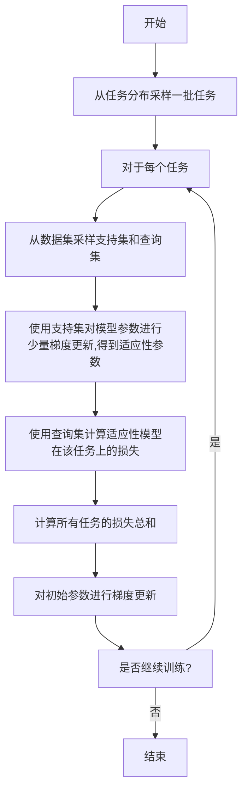

# 一切皆是映射：使用元学习进行有效的特征提取

## 1.背景介绍

在机器学习和深度学习的领域中,特征提取是一个至关重要的步骤。传统的方法通常需要手动设计特征提取器,这种方式需要大量的领域知识和经验,而且往往难以泛化到新的数据集和任务上。近年来,元学习(Meta-Learning)作为一种新兴的范式,为自动学习特征提取器提供了一种有效的解决方案。

元学习的核心思想是利用一系列相关但不同的任务,从中学习一种通用的学习策略,这种策略可以快速适应新的任务。在特征提取的背景下,我们可以将特征提取器视为一个可学习的模型,通过在多个相关任务上进行训练,学习到一个能够快速适应新任务的特征提取器。这种方法不仅可以减少手工设计特征的工作量,而且还能提高特征的质量和泛化能力。

## 2.核心概念与联系

### 2.1 元学习的形式化定义

在形式化定义元学习之前,我们首先需要引入任务(Task)的概念。一个任务 $\mathcal{T}$ 可以表示为一个数据集 $\mathcal{D}_\mathcal{T}$ 和一个相应的损失函数 $\mathcal{L}_\mathcal{T}$,即 $\mathcal{T} = \{\mathcal{D}_\mathcal{T}, \mathcal{L}_\mathcal{T}\}$。元学习的目标是学习一个可以快速适应新任务的模型,这个模型被称为元学习器(Meta-Learner)。

形式上,我们可以将元学习过程表示为以下优化问题:

$$\min_{\phi} \sum_{\mathcal{T}_i \sim p(\mathcal{T})} \mathcal{L}_{\mathcal{T}_i}(f_{\phi'_i})$$

其中:

- $p(\mathcal{T})$ 是任务分布,表示从中采样任务的分布
- $\phi$ 是元学习器的参数
- $\phi'_i$ 是通过某种方式从 $\phi$ 得到的,用于适应任务 $\mathcal{T}_i$ 的模型参数
- $f_{\phi'_i}$ 是参数化的模型,用于解决任务 $\mathcal{T}_i$
- $\mathcal{L}_{\mathcal{T}_i}(f_{\phi'_i})$ 是模型 $f_{\phi'_i}$ 在任务 $\mathcal{T}_i$ 上的损失

可以看出,元学习器的目标是找到一个初始参数 $\phi$,使得从中得到的模型 $f_{\phi'_i}$ 能够在各个任务上表现良好。

### 2.2 元学习在特征提取中的应用

在特征提取的背景下,我们可以将特征提取器视为一个可学习的模型 $f_\phi$,其中 $\phi$ 是模型参数。给定一个新的任务 $\mathcal{T}_i$,我们希望能够快速地从 $\phi$ 得到一个适合该任务的特征提取器参数 $\phi'_i$,从而提取出高质量的特征。

具体来说,我们可以定义以下优化目标:

$$\min_{\phi} \sum_{\mathcal{T}_i \sim p(\mathcal{T})} \mathcal{L}_{\mathcal{T}_i}(g_{\theta_i^*} \circ f_{\phi'_i})$$

其中:

- $f_{\phi'_i}$ 是特征提取器,用于从输入数据中提取特征
- $g_{\theta_i^*}$ 是分类器或回归器,使用提取的特征进行预测,其参数 $\theta_i^*$ 是在任务 $\mathcal{T}_i$ 上通过优化得到的
- $g_{\theta_i^*} \circ f_{\phi'_i}$ 表示将特征提取器和预测模型级联,构成完整的模型
- $\mathcal{L}_{\mathcal{T}_i}(g_{\theta_i^*} \circ f_{\phi'_i})$ 是级联模型在任务 $\mathcal{T}_i$ 上的损失

通过优化上述目标,我们可以获得一个初始的特征提取器参数 $\phi$,使得从中得到的特征提取器 $f_{\phi'_i}$ 能够为各个任务提供高质量的特征,进而提高整体模型的性能。

### 2.3 元学习算法分类

根据如何从初始参数 $\phi$ 得到适应性参数 $\phi'_i$ 的方式不同,元学习算法可以分为以下几种类型:

1. **优化算法元学习(Optimization-Based Meta-Learning)**:在这种方法中,我们通过显式地优化目标函数来获得 $\phi'_i$。一些典型的算法包括 MAML、Reptile 等。

2. **指标元学习(Metric-Based Meta-Learning)**:这种方法通过学习一个合适的距离度量,使得相似的任务具有相似的解。一些典型算法包括 Siamese Network、Matching Network 等。

3. **基于模型元学习(Model-Based Meta-Learning)**:这种方法直接学习一个可以快速适应新任务的生成模型,例如神经过程(Neural Processes)等。

4. **无参数元学习(Non-Parametric Meta-Learning)**:这种方法不显式地学习参数,而是通过设计合适的数据结构和算法来快速适应新任务,例如简单神经算法(Simple Neural AttentIve Learner, SNAIL)等。

在下一节中,我们将重点介绍优化算法元学习,因为它在特征提取中的应用最为广泛。

## 3.核心算法原理具体操作步骤

### 3.1 MAML 算法

MAML(Model-Agnostic Meta-Learning)是一种优化算法元学习的典型代表。它的核心思想是:通过在一系列任务上进行梯度更新,找到一个良好的初始参数 $\phi$,使得在新任务上只需要少量的梯度步骤就能获得一个高性能的模型。

MAML 算法的具体步骤如下:

1. 从任务分布 $p(\mathcal{T})$ 中采样一批任务 $\{\mathcal{T}_i\}$
2. 对于每个任务 $\mathcal{T}_i$:
    - 从 $\mathcal{D}_{\mathcal{T}_i}$ 中采样出支持集(Support Set) $\mathcal{S}_i$ 和查询集(Query Set) $\mathcal{Q}_i$
    - 使用支持集 $\mathcal{S}_i$ 对模型参数 $\phi$ 进行少量梯度更新,得到适应性参数 $\phi'_i$:
        $$\phi'_i = \phi - \alpha \nabla_\phi \mathcal{L}_{\mathcal{T}_i}(f_\phi, \mathcal{S}_i)$$
        其中 $\alpha$ 是学习率
    - 使用查询集 $\mathcal{Q}_i$ 计算适应性模型 $f_{\phi'_i}$ 在该任务上的损失
3. 计算所有任务的损失的总和,并对 $\phi$ 进行梯度更新:
    $$\phi \leftarrow \phi - \beta \nabla_\phi \sum_i \mathcal{L}_{\mathcal{T}_i}(f_{\phi'_i}, \mathcal{Q}_i)$$
    其中 $\beta$ 是元学习率(Meta Learning Rate)

通过上述步骤,MAML 算法可以找到一个良好的初始参数 $\phi$,使得在新任务上只需要少量的梯度更新就能获得高性能的模型。

在特征提取的背景下,我们可以将 $f_\phi$ 视为特征提取器,将 $g_\theta$ 视为分类器或回归器。在内循环中,我们使用支持集更新特征提取器的参数 $\phi'_i$;在外循环中,我们使用查询集的损失对初始参数 $\phi$ 进行更新。通过这种方式,我们可以获得一个能够快速适应新任务的特征提取器。



### 3.2 Reptile 算法

Reptile 算法是另一种优化算法元学习的方法,它比 MAML 更简单高效。Reptile 的核心思想是:在每个任务上进行梯度更新后,将模型参数移动到所有任务的"平均位置"。

Reptile 算法的具体步骤如下:

1. 初始化模型参数 $\phi$
2. 重复以下步骤直到收敛:
    - 从任务分布 $p(\mathcal{T})$ 中采样一批任务 $\{\mathcal{T}_i\}$
    - 对于每个任务 $\mathcal{T}_i$:
        - 从 $\mathcal{D}_{\mathcal{T}_i}$ 中采样出训练集 $\mathcal{D}_{\text{train}}$ 和验证集 $\mathcal{D}_{\text{val}}$
        - 使用训练集 $\mathcal{D}_{\text{train}}$ 对模型参数 $\phi$ 进行多步梯度更新,得到适应性参数 $\phi'_i$:
            $$\phi'_i = \phi - \alpha \nabla_\phi \mathcal{L}_{\mathcal{T}_i}(f_\phi, \mathcal{D}_{\text{train}})$$
        - 计算适应性模型 $f_{\phi'_i}$ 在验证集 $\mathcal{D}_{\text{val}}$ 上的损失
    - 将模型参数 $\phi$ 移动到所有任务的"平均位置":
        $$\phi \leftarrow \phi + \beta \sum_i (\phi'_i - \phi)$$
        其中 $\beta$ 是元学习率(Meta Learning Rate)

通过上述步骤,Reptile 算法可以找到一个良好的初始参数 $\phi$,使得在新任务上只需要少量的梯度更新就能获得高性能的模型。与 MAML 相比,Reptile 算法更加简单高效,不需要计算二阶导数,因此在实践中更容易实现。

在特征提取的背景下,我们同样可以将 $f_\phi$ 视为特征提取器。在内循环中,我们使用训练集更新特征提取器的参数 $\phi'_i$;在外循环中,我们将 $\phi$ 移动到所有任务的"平均位置"。通过这种方式,我们可以获得一个能够快速适应新任务的特征提取器。

```mermaid
graph TD
    A[开始] --> B[初始化模型参数]
    B --> C[从任务分布采样一批任务]
    C --> D[对于每个任务]
    D --> E[从数据集采样训练集和验证集]
    E --> F[使用训练集对模型参数进行多步梯度更新,得到适应性参数]
    F --> G[使用验证集计算适应性模型在该任务上的损失]
    G --> H[将模型参数移动到所有任务的"平均位置"]
    H --> I[是否继续训练?]
    I --是--> C
    I --否--> J[结束]
```

## 4.数学模型和公式详细讲解举例说明

在前面的章节中,我们已经介绍了元学习在特征提取中的应用,以及 MAML 和 Reptile 等优化算法元学习的具体算法步骤。在这一节中,我们将进一步讨论一些与元学习相关的数学模型和公式,并给出详细的解释和示例。

### 4.1 元学习的目标函数

回顾一下元学习的形式化定义,我们的目标是优化以下目标函数:

$$\min_{\phi} \sum_{\mathcal{T}_i \sim p(\mathcal{T})} \mathcal{L}_{\mathcal{T}_i}(f_{\phi'_i})$$

其中:

- $p(\mathcal{T})$ 是任务分布,表示从中采样任务的分布
- $\phi$ 是元学习器的参数
- $\phi'_i$ 是通过某种方式从 $\phi$ 得到的,用于适应任务 $\mathcal{T}_i$ 的模型参数
- $f_{\phi'_i}$ 是参数化的模