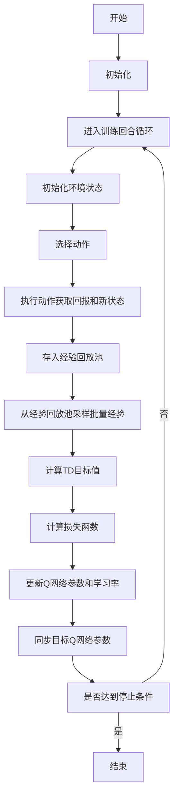

# 一切皆是映射：基于DQN的自适应学习率调整机制探究

## 1.背景介绍

### 1.1 深度强化学习概述

深度强化学习(Deep Reinforcement Learning, DRL)是机器学习领域中一个新兴且具有巨大潜力的研究方向,它将深度学习(Deep Learning)和强化学习(Reinforcement Learning)两种技术相结合。深度学习可以从大量数据中自动学习特征表示,而强化学习则能够基于环境反馈来优化决策序列,从而在复杂的决策过程中取得卓越的表现。

### 1.2 学习率调整的重要性

在深度神经网络的训练过程中,学习率是一个非常关键的超参数。合理的学习率设置能够加快模型的收敛速度,提高训练效率;而不当的学习率则可能导致模型收敛缓慢、发散或陷入次优解。传统的做法是预先设置一个初始学习率,并根据经验在训练过程中手动调整学习率。然而,这种方式存在一些缺陷:

1) 需要大量的人工经验和试错; 
2) 难以适应不同的任务和模型结构;
3) 无法充分挖掘模型的潜力。

因此,设计一种自适应的学习率调整机制就显得尤为重要。

### 1.3 深度Q网络(DQN)及其局限性

Deep Q-Network(DQN)是将深度学习应用于强化学习领域的一个里程碑式的工作。它使用深度神经网络来估计Q值函数,并通过经验回放(Experience Replay)和目标网络(Target Network)等技术来提高训练的稳定性。DQN在许多经典的Atari游戏中展现出了超越人类的表现。

然而,DQN在训练过程中也面临着学习率调整的问题。由于环境的复杂性和不确定性,固定的学习率难以适应不同阶段的训练需求,从而影响了算法的性能。为了解决这一问题,研究人员提出了多种自适应学习率调整机制,本文将重点探讨其中一种基于DQN的自适应学习率调整方法。

## 2.核心概念与联系

### 2.1 Q-Learning算法

Q-Learning是强化学习中一种基于价值的算法,它试图学习一个行为价值函数(Action-Value Function),即在给定状态下执行某个动作所能获得的期望累积回报。具体来说,Q-Learning算法通过不断更新Q值函数来逼近真实的Q值,其更新规则如下:

$$Q(s_t, a_t) \leftarrow Q(s_t, a_t) + \alpha [r_t + \gamma \max_{a} Q(s_{t+1}, a) - Q(s_t, a_t)]$$

其中:

- $Q(s_t, a_t)$是当前状态$s_t$下执行动作$a_t$的估计Q值;
- $\alpha$是学习率,控制了新信息对Q值的影响程度;
- $r_t$是立即回报;
- $\gamma$是折现因子,控制了未来回报的权重;
- $\max_{a} Q(s_{t+1}, a)$是下一个状态$s_{t+1}$下所有可能动作的最大Q值。

通过不断更新Q值函数,Q-Learning算法最终会收敛到最优的Q值函数,从而实现最优策略。

### 2.2 深度Q网络(DQN)

Deep Q-Network(DQN)是将Q-Learning算法与深度神经网络相结合的一种强化学习方法。它使用一个深度神经网络来拟合Q值函数,即$Q(s, a; \theta) \approx Q^*(s, a)$,其中$\theta$是神经网络的参数。在训练过程中,DQN会根据TD误差(时序差分误差)来更新网络参数:

$$L(\theta) = \mathbb{E}_{(s, a, r, s')\sim U(D)}\left[(r + \gamma \max_{a'} Q(s', a'; \theta^-) - Q(s, a; \theta))^2\right]$$

其中:

- $D$是经验回放池(Experience Replay Buffer); 
- $\theta^-$是目标网络(Target Network)的参数,用于估计下一状态的最大Q值,以增加训练稳定性;
- $U(D)$表示从经验回放池中均匀采样过去的经验进行训练。

通过最小化损失函数$L(\theta)$,DQN可以逐步优化Q网络的参数$\theta$,从而学习到近似最优的Q值函数。

### 2.3 自适应学习率调整机制

传统的DQN算法使用固定的学习率进行训练,这可能会导致训练过程遇到一些问题,如收敛缓慢、陷入次优解等。为了解决这个问题,研究人员提出了多种自适应学习率调整机制,旨在根据训练过程中的反馈动态调整学习率。

本文重点探讨的是一种基于DQN的自适应学习率调整方法。该方法的核心思想是将学习率看作是一个可学习的参数,并将其纳入到DQN的优化过程中。具体来说,它定义了一个新的损失函数,将学习率$\alpha$作为一个可训练的变量,同时优化Q网络参数$\theta$和学习率$\alpha$。通过这种方式,算法可以自适应地调整学习率,以加快训练收敛并提高最终性能。

## 3.核心算法原理具体操作步骤

### 3.1 算法框架

该自适应学习率调整算法的核心思想是将学习率$\alpha$看作一个可学习的参数,并将其纳入到DQN的优化过程中。具体来说,算法定义了一个新的损失函数,同时优化Q网络参数$\theta$和学习率$\alpha$。算法的伪代码如下:

```python
初始化Q网络参数θ和学习率α
初始化目标Q网络参数θ−
初始化经验回放池D
for episode in range(max_episodes):
    初始化环境状态s
    while not done:
        使用ε-贪婪策略选择动作a
        执行动作a,获得回报r和新状态s'
        将(s, a, r, s')存入经验回放池D
        从D中采样批量经验(s, a, r, s')
        计算TD目标: y = r + γ * max_a' Q(s', a'; θ−)
        计算损失函数: L(θ, α) = (y - Q(s, a; θ))^2 + β * α^2
        使用优化器更新θ和α,最小化L(θ, α)
        每隔一定步数同步θ− = θ
    end while
end for
```

该算法的主要步骤如下:

1. 初始化Q网络参数$\theta$、学习率$\alpha$、目标Q网络参数$\theta^-$和经验回放池$D$。
2. 对于每个训练回合(episode):
    a) 初始化环境状态$s$。
    b) 在当前状态$s$下,使用$\epsilon$-贪婪策略选择动作$a$。
    c) 执行动作$a$,获得立即回报$r$和新状态$s'$,并将$(s, a, r, s')$存入经验回放池$D$。
    d) 从经验回放池$D$中采样一个批量的经验$(s, a, r, s')$。
    e) 计算TD目标(Target)值: $y = r + \gamma \max_{a'} Q(s', a'; \theta^-)$。
    f) 计算新的损失函数: $L(\theta, \alpha) = (y - Q(s, a; \theta))^2 + \beta \alpha^2$,其中$\beta$是一个正则化系数。
    g) 使用优化器(如Adam)同时更新$\theta$和$\alpha$,以最小化损失函数$L(\theta, \alpha)$。
    h) 每隔一定步数,将Q网络参数$\theta$复制到目标Q网络参数$\theta^-$,以增加训练稳定性。

3. 重复步骤2,直到达到最大训练回合数或其他停止条件。

需要注意的是,在损失函数$L(\theta, \alpha)$中,第一项$(y - Q(s, a; \theta))^2$是传统的TD误差,用于优化Q网络参数$\theta$;而第二项$\beta \alpha^2$是一个正则化项,用于约束学习率$\alpha$的大小,防止其过大或过小。通过同时优化这两个目标,算法可以自适应地调整学习率,以加快训练收敛并提高最终性能。

### 3.2 算法流程图

为了更好地理解算法的执行流程,我们使用Mermaid流程图进行可视化描述:



上图描述了算法的主要执行流程,包括初始化、进入训练回合循环、与环境交互获取经验、从经验回放池采样数据、计算TD目标值和损失函数、更新Q网络参数和学习率、同步目标Q网络参数,以及判断是否达到停止条件。通过这个流程图,我们可以更直观地理解算法的工作原理。

## 4.数学模型和公式详细讲解举例说明

在上一节中,我们介绍了算法的整体框架和执行流程。现在,让我们深入探讨算法中涉及的数学模型和公式。

### 4.1 Q-Learning算法的数学模型

Q-Learning算法的目标是学习一个行为价值函数(Action-Value Function)$Q^*(s, a)$,它表示在状态$s$下执行动作$a$所能获得的最大期望累积回报。具体来说,我们定义$Q^*(s, a)$如下:

$$Q^*(s, a) = \mathbb{E}\left[r_t + \gamma r_{t+1} + \gamma^2 r_{t+2} + \cdots | s_t = s, a_t = a, \pi^*\right]$$

其中:

- $r_t$是在时间步$t$获得的立即回报;
- $\gamma \in [0, 1]$是折现因子,用于控制未来回报的权重;
- $\pi^*$是最优策略,即在每个状态下选择能够最大化期望累积回报的动作。

Q-Learning算法通过不断更新Q值函数$Q(s, a)$来逼近真实的$Q^*(s, a)$,其更新规则如下:

$$Q(s_t, a_t) \leftarrow Q(s_t, a_t) + \alpha \left[r_t + \gamma \max_{a} Q(s_{t+1}, a) - Q(s_t, a_t)\right]$$

其中$\alpha$是学习率,控制了新信息对Q值的影响程度。通过不断更新Q值函数,Q-Learning算法最终会收敛到最优的Q值函数$Q^*(s, a)$,从而实现最优策略$\pi^*$。

### 4.2 深度Q网络(DQN)的数学模型

Deep Q-Network(DQN)是将Q-Learning算法与深度神经网络相结合的一种强化学习方法。它使用一个深度神经网络$Q(s, a; \theta)$来拟合Q值函数,其中$\theta$是网络的参数。在训练过程中,DQN会根据TD误差(时序差分误差)来更新网络参数$\theta$,其损失函数定义如下:

$$L(\theta) = \mathbb{E}_{(s, a, r, s')\sim U(D)}\left[(r + \gamma \max_{a'} Q(s', a'; \theta^-) - Q(s, a; \theta))^2\right]$$

其中:

- $D$是经验回放池(Experience Replay Buffer),用于存储过去的经验$(s, a, r, s')$; 
- $\theta^-$是目标网络(Target Network)的参数,用于估计下一状态的最大Q值$\max_{a'} Q(s', a'; \theta^-)$,以增加训练稳定性;
- $U(D)$表示从经验回放池中均匀采样过去的经验进行训练。

通过最小化损失函数$L(\theta)$,DQN可以逐步优化Q网络的参数$\theta$,从而学习到近似最优的Q值函数$Q(s, a; \theta) \approx Q^*(s, a)$。

### 4.3 自