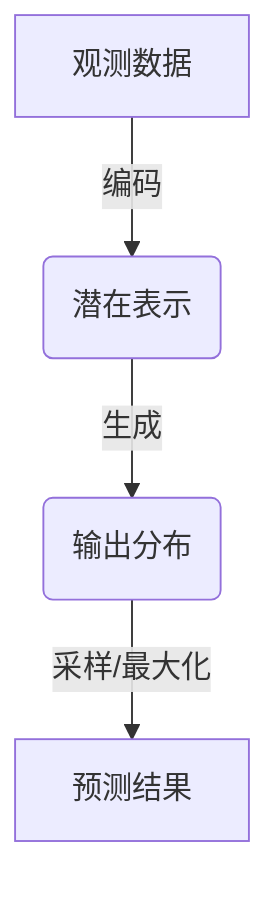

# 一切皆是映射：深入剖析条件神经过程（CNPs）

## 1.背景介绍

### 1.1 神经网络的发展历程

人工神经网络(Artificial Neural Networks, ANNs)是一种受生物神经系统启发而设计的数学模型和计算模型。自20世纪50年代开始发展以来,人工神经网络经历了多个重要阶段:

- 感知器时代(1957-1969):Rosenblatt提出了最早的神经网络模型——感知器(Perceptron),能够解决线性可分问题。
- 连接主义时期(1982-1991):Hopfield网络、Boltzmann机等模型出现,引入了反向传播算法,推动了神经网络的发展。
- 深度学习时代(2006-至今):受益于大数据、算力提升和一些突破性算法,深度神经网络取得了巨大成功,在计算机视觉、自然语言处理等领域表现出色。

### 1.2 神经网络面临的挑战

尽管神经网络取得了令人瞩目的成就,但它们仍然存在一些局限性和挑战:

- **黑盒性质**:神经网络的内部机理往往难以解释,被视为"黑盒"。
- **可解释性差**:神经网络缺乏可解释性,很难说明它是如何得出预测结果的。
- **可靠性问题**:神经网络对噪声和微小扰动敏感,可能产生不可预测的结果。
- **可组合性差**:神经网络难以将已学习的知识有效地迁移和组合到新任务中。

为了解决这些挑战,研究人员提出了一种新型神经网络架构——条件神经过程(Conditional Neural Processes, CNPs)。

## 2.核心概念与联系

### 2.1 什么是条件神经过程(CNPs)

条件神经过程(Conditional Neural Processes, CNPs)是一种新型的神经网络架构,旨在解决传统神经网络的局限性,提高可解释性、可靠性和可组合性。CNPs的核心思想是将神经网络视为一个条件分布,能够学习数据的内在分布,并基于观测数据生成新的输出。

CNPs的基本工作流程如下:

1. 编码器(Encoder)将观测数据(上下文数据)编码为一个潜在表示(latent representation)。
2. 潜在表示被传递到生成器(Generator),生成器根据潜在表示生成新的输出分布。
3. 通过采样或最大化该输出分布,得到最终的预测结果。

CNPs与传统神经网络最大的区别在于,它不是直接学习映射函数,而是学习条件概率分布。这使得CNPs能够更好地捕获数据的不确定性,提高模型的可解释性和可靠性。



### 2.2 CNPs与其他模型的关系

CNPs与其他一些模型有一定的联系,但也有显著的区别:

- **高斯过程(Gaussian Processes, GPs)**:CNPs可以看作是GPs的深度学习版本,但CNPs使用神经网络代替了GPs中的核函数,能够自动学习数据的表示。
- **变分自编码器(Variational Autoencoders, VAEs)**:CNPs与VAEs都使用编码器-解码器架构,但CNPs的目标是生成条件分布,而非重构输入数据。
- **生成对抗网络(Generative Adversarial Networks, GANs)**:CNPs和GANs都旨在生成新的数据,但CNPs是基于条件概率分布,而GANs则通过对抗训练实现。
- **元学习(Meta-Learning)**:CNPs可以视为一种元学习方法,能够从少量数据中快速学习新任务。

总的来说,CNPs融合了多种模型的优点,提供了一种新颖且强大的条件生成模型框架。

## 3.核心算法原理具体操作步骤

### 3.1 CNPs的数学形式化

我们先对CNPs进行数学形式化,以便更好地理解其原理。假设我们有一个数据集 $\mathcal{D} = \{(x_i, y_i)\}_{i=1}^N$,其中 $x_i$ 是输入, $y_i$ 是对应的目标输出。我们将数据集划分为上下文数据 $\mathcal{C} = \{(x_c, y_c)\}$ 和目标数据 $\mathcal{T} = \{(x_t, y_t)\}$。

CNPs的目标是学习一个条件分布 $p(y_t|x_t, \mathcal{C})$,即给定上下文数据 $\mathcal{C}$ 和新的输入 $x_t$,预测对应的输出 $y_t$ 的概率分布。

具体来说,CNPs包含两个主要组件:

1. **编码器(Encoder)** $q_\phi(r|\mathcal{C})$:将上下文数据 $\mathcal{C}$ 编码为一个潜在表示 $r$。
2. **解码器(Decoder)** $p_\theta(y_t|x_t, r)$:根据潜在表示 $r$ 和新的输入 $x_t$,生成目标输出 $y_t$ 的条件分布。

我们的目标是最大化上下文数据 $\mathcal{C}$ 和目标数据 $\mathcal{T}$ 的联合对数似然:

$$\max_{\phi, \theta} \mathbb{E}_{q_\phi(r|\mathcal{C})} \left[ \sum_{(x_t, y_t) \in \mathcal{T}} \log p_\theta(y_t|x_t, r) \right]$$

这个目标函数可以通过变分推断(Variational Inference)和重参数技巧(Reparameterization Trick)来高效优化。

### 3.2 CNPs的具体算法步骤

CNPs的训练和预测过程可以总结为以下步骤:

**训练过程**:

1. 从数据集 $\mathcal{D}$ 中采样一个小批量数据,将其划分为上下文数据 $\mathcal{C}$ 和目标数据 $\mathcal{T}$。
2. 通过编码器 $q_\phi(r|\mathcal{C})$ 将上下文数据 $\mathcal{C}$ 编码为潜在表示 $r$。
3. 对于每个目标数据点 $(x_t, y_t) \in \mathcal{T}$,通过解码器 $p_\theta(y_t|x_t, r)$ 计算目标输出 $y_t$ 的条件概率分布。
4. 计算目标函数(对数似然)的估计值,并通过随机梯度下降法更新编码器和解码器的参数 $\phi$ 和 $\theta$。

**预测过程**:

1. 给定一个新的上下文数据 $\mathcal{C}^*$ 和输入 $x_t^*$。
2. 通过编码器 $q_\phi(r|\mathcal{C}^*)$ 将上下文数据编码为潜在表示 $r^*$。
3. 通过解码器 $p_\theta(y_t^*|x_t^*, r^*)$ 计算目标输出 $y_t^*$ 的条件分布。
4. 从该条件分布中采样或取最大值,得到最终的预测结果 $\hat{y}_t^*$。

需要注意的是,CNPs的编码器和解码器都是通过神经网络来实现的,因此它们能够自动学习数据的表示和条件分布,而无需手动设计特征或核函数。

## 4.数学模型和公式详细讲解举例说明

在上一节中,我们已经对CNPs进行了数学形式化。现在,我们将更深入地探讨CNPs中使用的一些数学模型和公式。

### 4.1 高斯过程作为先验

在CNPs中,我们通常将解码器 $p_\theta(y_t|x_t, r)$ 建模为一个高斯过程(Gaussian Process, GP)。高斯过程是一种非参数概率模型,它能够很好地捕获数据的不确定性和噪声。

具体来说,我们假设目标输出 $y_t$ 服从一个高斯过程:

$$y_t \sim \mathcal{GP}(m(x_t, r), k(x_t, x_t', r))$$

其中:

- $m(x_t, r)$ 是均值函数(mean function),描述了输出的期望值。
- $k(x_t, x_t', r)$ 是核函数(kernel function),描述了输出之间的相关性。

均值函数和核函数都依赖于输入 $x_t$ 和潜在表示 $r$,因此它们能够根据上下文数据 $\mathcal{C}$ 进行适当的调整。

在实践中,我们通常使用一些常见的核函数,如高斯核(Gaussian kernel)、Matern核等。同时,均值函数和核函数也可以通过神经网络来学习,从而提高模型的灵活性。

### 4.2 变分推断

由于我们无法直接对潜在表示 $r$ 进行积分以获得边际对数似然,因此需要使用变分推断(Variational Inference)技术来近似计算。具体来说,我们引入一个变分分布 $q_\phi(r|\mathcal{C})$ 来近似后验分布 $p(r|\mathcal{C}, \mathcal{T})$,并最小化两个分布之间的KL散度:

$$\min_\phi \mathrm{KL}\left(q_\phi(r|\mathcal{C}) \| p(r|\mathcal{C}, \mathcal{T})\right)$$

通过一些数学推导,我们可以将上式等价转化为最大化下面的证据下界(Evidence Lower Bound, ELBO):

$$\max_{\phi, \theta} \mathbb{E}_{q_\phi(r|\mathcal{C})} \left[ \sum_{(x_t, y_t) \in \mathcal{T}} \log p_\theta(y_t|x_t, r) \right] - \mathrm{KL}\left(q_\phi(r|\mathcal{C}) \| p(r)\right)$$

其中第一项是重构项(reconstruction term),第二项是正则化项(regularization term)。这个目标函数可以通过随机梯度下降法进行优化。

在实践中,我们通常假设变分分布 $q_\phi(r|\mathcal{C})$ 服从一个多元高斯分布或其他参数化分布,并使用重参数技巧(Reparameterization Trick)来估计梯度。

### 4.3 条件高斯过程

在某些情况下,我们可以将CNPs视为一种条件高斯过程(Conditional Gaussian Process, CGP)。具体来说,我们将目标输出 $y_t$ 建模为一个条件高斯过程:

$$y_t|\mathcal{C}, x_t \sim \mathcal{GP}(m(x_t), k(x_t, x_t'))$$

其中均值函数 $m(x_t)$ 和核函数 $k(x_t, x_t')$ 都依赖于上下文数据 $\mathcal{C}$。这种建模方式与传统的高斯过程类似,但它能够利用上下文数据来调整预测的均值和方差。

在CNPs中,我们使用编码器 $q_\phi(r|\mathcal{C})$ 来学习上下文数据的表示,然后将这个表示作为条件,输入到均值函数和核函数中。这样,我们就可以将CNPs视为一种端到端的条件高斯过程模型。

需要注意的是,虽然CNPs与条件高斯过程有一定的联系,但CNPs更加灵活和通用,因为它不受高斯过程的假设限制,可以处理更复杂的数据类型和任务。

## 5.项目实践:代码实例和详细解释说明

为了更好地理解CNPs,我们将通过一个具体的代码示例来演示如何实现和训练一个简单的CNPs模型。在这个示例中,我们将使用PyTorch框架,并基于一个简单的回归任务进行说明。

### 5.1 导入必要的库

```python
import torch
import torch.nn as nn
import torch.optim as optim
import numpy as np
import matplotlib.pyplot as plt
```

### 5.2 生成模拟数据

我们首先生成一个简单的一维回归数据集,其中包含多个函数曲线。每个函数曲线由一个高斯过程生成,并添加一些噪声。

```python
def generate_data(num_curves, num_points, x_range=(-4, 4), noise_std=0.1):
    # 生成多个函数曲线
    curves = []
    for _ in range(num_curves):
        # 采样一个高斯过程作为函数曲线
        