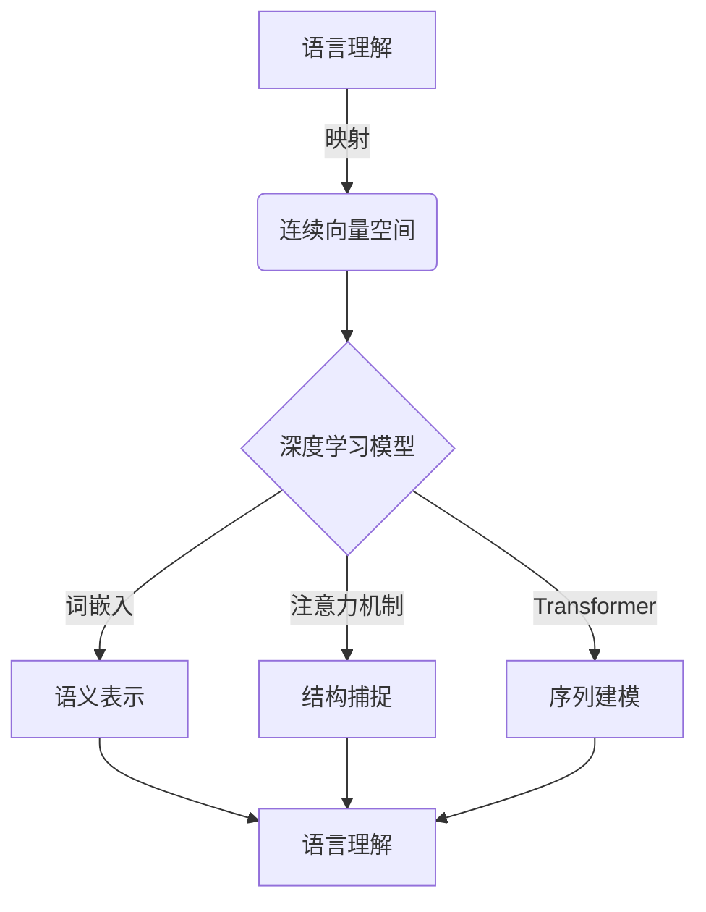
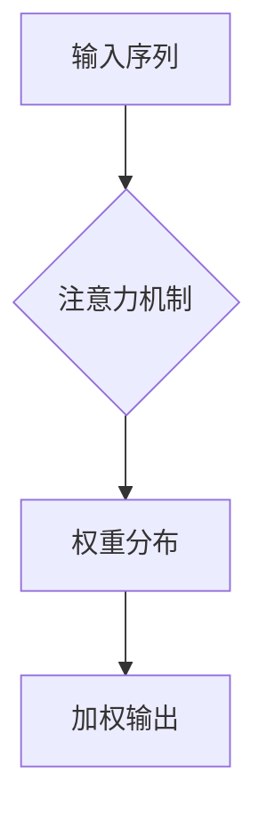
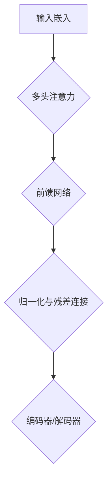

# 一切皆是映射：深度学习与人类语言理解

## 1.背景介绍

在过去的几十年里,人工智能领域取得了长足的进步,尤其是在深度学习和自然语言处理方面。深度学习模型已经展现出令人惊叹的语言理解能力,能够完成机器翻译、问答系统、文本摘要等复杂任务。然而,人类语言理解背后的本质机制仍然是一个未解之谜。

语言是人类与生俱来的能力,孩子们在没有任何正式训练的情况下就能够掌握语言。相比之下,让机器真正理解语言仍然是一个巨大的挑战。传统的自然语言处理方法主要依赖于规则和特征工程,但这种方式往往缺乏泛化能力,难以处理复杂的语义和语境信息。

深度学习为语言理解提供了全新的视角。通过利用大量的数据和强大的计算能力,深度学习模型能够自动学习语言的统计模式和隐藏规律。这种基于数据的方法避免了手工设计规则和特征的繁琐过程,展现出了令人惊叹的性能。然而,深度学习模型内部的工作机制仍然是一个"黑箱",我们对它们如何真正理解语言知之甚少。

本文将探讨深度学习在人类语言理解中的应用,揭示语言理解的本质是一种"映射"过程。我们将深入探讨词嵌入、注意力机制、transformer等核心概念,并分析它们是如何帮助模型捕捉语言的语义和结构信息的。通过数学模型和实例分析,我们将揭示深度学习模型如何将语言映射到连续的向量空间,并在该空间中进行高效的运算和推理。最后,我们将总结深度学习在语言理解中的挑战和未来发展趋势。

## 2.核心概念与联系

### 2.1 词嵌入(Word Embeddings)

词嵌入是将离散的词语映射到连续的向量空间中的技术。在这个向量空间中,语义相似的词语会被映射到相近的位置。词嵌入能够捕捉词与词之间的语义关系,是深度学习模型理解自然语言的基础。

有多种方法可以学习词嵌入,其中最著名的是Word2Vec和GloVe。Word2Vec利用词与上下文之间的关系,通过浅层神经网络对词语进行编码。GloVe则是基于全局词语统计信息,通过矩阵分解获得词嵌入。无论使用何种方法,词嵌入都能够将离散的符号映射到连续的向量空间,为后续的语言建模提供有力支持。

$$\boldsymbol{v}_\text{apple} = \begin{bmatrix} 0.418 \\ 0.24968 \\ -0.41242 \\ \cdots \end{bmatrix}, \quad \boldsymbol{v}_\text{banana} = \begin{bmatrix} 0.44051 \\ 0.22316 \\ -0.3955 \\ \cdots \end{bmatrix}$$

在上面的例子中,苹果(apple)和香蕉(banana)这两个词被映射到了相近的向量,反映了它们在语义上的相似性。

### 2.2 注意力机制(Attention Mechanism)

注意力机制是深度学习模型捕捉输入序列结构信息的关键。在处理序列数据时,注意力机制能够自动学习到不同位置的输入对应的重要性权重,并据此对序列中的信息进行加权组合。

注意力机制最早被应用于机器翻译任务中,用于捕捉源语言和目标语言之间的对应关系。随后,注意力机制也被广泛应用于其他自然语言处理任务,如阅读理解、文本摘要等。注意力机制赋予了深度学习模型"关注"输入的不同部分的能力,极大地提高了模型对序列结构的建模能力。

### 2.3 Transformer

Transformer是一种全新的基于注意力机制的序列建模架构,它完全放弃了循环神经网络(RNN)和卷积神经网络(CNN)的结构,纯粹依赖注意力机制对输入序列进行建模。

Transformer的核心是多头注意力机制,它允许模型同时关注输入序列的不同表示子空间。此外,Transformer还引入了位置编码,用于提供序列的位置信息。自从被提出以来,Transformer已经成为了自然语言处理领域的主流模型,在机器翻译、语言模型等任务上取得了令人瞩目的成绩。

上述三个核心概念密切相关,共同奠定了深度学习在语言理解中的基础。词嵌入将离散的符号映射到连续的向量空间;注意力机制赋予模型捕捉输入序列结构信息的能力;Transformer则是一种全新的序列建模架构,利用自注意力机制直接对序列进行建模。这三者的有机结合,使得深度学习模型能够高效地对语言进行表示和理解。

## 3.核心算法原理具体操作步骤  

### 3.1 词嵌入算法

词嵌入算法的目标是将离散的词语映射到连续的低维向量空间中,使得语义相似的词语在该空间中的位置也相近。最常用的两种词嵌入算法是Word2Vec和GloVe。

**Word2Vec**

Word2Vec算法包含两种模型:连续词袋模型(CBOW)和Skip-Gram模型。这两种模型都是基于词与上下文之间的关系进行训练的。以Skip-Gram模型为例,其训练过程如下:

1. 对于一个中心词 $w_t$,定义上下文窗口大小 $c$,获取其前后 $c$ 个词 $\{w_{t-c}, \ldots, w_{t-1}, w_{t+1}, \ldots, w_{t+c}\}$ 作为上下文词。
2. 将中心词 $w_t$ 和每个上下文词 $w_o$ 分别通过一个映射矩阵映射到向量空间,得到 $\boldsymbol{v}_{w_t}$ 和 $\boldsymbol{v'}_{w_o}$。
3. 计算中心词向量 $\boldsymbol{v}_{w_t}$ 和上下文词向量 $\boldsymbol{v'}_{w_o}$ 的点积,得到分数 $s = \boldsymbol{v}_{w_t}^\top \boldsymbol{v'}_{w_o}$。
4. 将分数 $s$ 通过 softmax 函数转换为概率 $p(w_o | w_t) = \frac{e^s}{\sum_{w=1}^V e^{s_w}}$,其中 $V$ 是词表大小。
5. 最大化目标函数 $\mathcal{L} = \sum_{w_o \in \text{Context}(w_t)} \log p(w_o | w_t)$,使得中心词能够很好地预测上下文词。

通过上述过程,Word2Vec算法能够学习到词语的向量表示,并且保留了词与词之间的语义关系。

**GloVe**

GloVe算法则是基于全局词语统计信息进行训练的。其核心思想是,两个词的共现次数能够反映它们之间的语义关系。算法的具体步骤如下:

1. 构建词语共现矩阵 $\boldsymbol{X}$,其中 $X_{ij}$ 表示词语 $w_i$ 和 $w_j$ 在语料库中的共现次数。
2. 为每个词语 $w_i$ 定义两个向量 $\boldsymbol{w}_i$ 和 $\boldsymbol{\widetilde{w}}_i$,分别对应词语的词向量和上下文向量。
3. 定义损失函数 $\mathcal{L} = \sum_{i,j=1}^V f(X_{ij})(\boldsymbol{w}_i^\top \boldsymbol{\widetilde{w}}_j + b_i + \widetilde{b}_j - \log X_{ij})^2$,其中 $f(x)$ 是一个权重函数,用于放大或减小某些值的重要性。
4. 最小化损失函数 $\mathcal{L}$,使得词向量 $\boldsymbol{w}_i$ 和上下文向量 $\boldsymbol{\widetilde{w}}_j$ 的点积能够很好地拟合词语共现统计信息。

通过以上步骤,GloVe算法能够学习到词语的向量表示,并且能够很好地捕捉词语之间的语义和拓扑关系。

### 3.2 注意力机制算法

注意力机制是一种赋予深度学习模型"关注"输入不同部分的能力,它在序列建模任务中发挥着关键作用。以机器翻译任务为例,注意力机制的计算过程如下:

1. 将源语言句子 $\boldsymbol{x} = (x_1, x_2, \ldots, x_n)$ 输入到编码器中,得到隐藏状态序列 $\boldsymbol{h} = (h_1, h_2, \ldots, h_n)$。
2. 在解码器的每一步,计算查询向量 $q_t$ 和键向量 $\boldsymbol{K} = (k_1, k_2, \ldots, k_n)$ 之间的相似性分数,得到注意力权重 $\boldsymbol{\alpha}_t = (\alpha_{t1}, \alpha_{t2}, \ldots, \alpha_{tn})$:

$$\alpha_{ti} = \frac{\exp(q_t^\top k_i)}{\sum_{j=1}^n \exp(q_t^\top k_j)}$$

3. 使用注意力权重对编码器隐藏状态进行加权求和,得到上下文向量 $c_t$:

$$c_t = \sum_{i=1}^n \alpha_{ti} h_i$$

4. 将上下文向量 $c_t$ 与解码器的隐藏状态 $s_t$ 结合,通过解码器的输出层预测目标语言的下一个词 $y_t$。
5. 重复步骤2-4,直到生成完整的目标语言句子。

通过上述过程,注意力机制能够自动捕捉源语言和目标语言之间的对应关系,大大提高了机器翻译的性能。注意力机制不仅可以应用于机器翻译,还可以广泛用于其他序列建模任务,如阅读理解、文本摘要等。

### 3.3 Transformer 算法

Transformer是一种全新的基于注意力机制的序列建模架构,它完全放弃了循环神经网络和卷积神经网络的结构,纯粹依赖注意力机制对输入序列进行建模。Transformer的核心是多头注意力机制和位置编码。

**多头注意力机制**

多头注意力机制允许模型同时关注输入序列的不同表示子空间,它的计算过程如下:

1. 将查询向量 $Q$、键向量 $K$ 和值向量 $V$ 分别线性映射到 $h$ 个子空间:

$$\begin{aligned}
Q^{(i)} &= QW_Q^{(i)} \\
K^{(i)} &= KW_K^{(i)} \\
V^{(i)} &= VW_V^{(i)}
\end{aligned}$$

2. 在每个子空间中计算缩放点积注意力:

$$\text{Attention}^{(i)}(Q^{(i)}, K^{(i)}, V^{(i)}) = \text{softmax}\left(\frac{Q^{(i)}K^{(i)\top}}{\sqrt{d_k}}\right)V^{(i)}$$

3. 将所有子空间的注意力结果拼接起来,得到多头注意力的输出:

$$\text{MultiHead}(Q, K, V) = \text{Concat}(\text{Attention}^{(1)}, \ldots, \text{Attention}^{(h)})W^O$$

通过多头注意力机制,Transformer能够从不同的表示子空间捕捉输入序列的信息,提高了模{"msg_type":"generate_answer_finish","data":"","from_module":null,"from_unit":null}