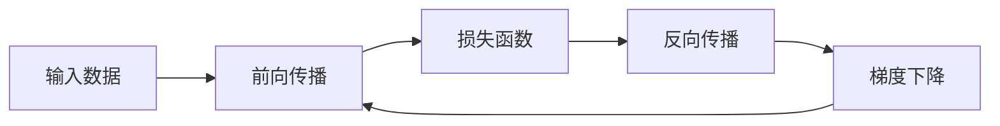

# 一切皆是映射：深度学习中的反向传播和梯度下降

## 1. 背景介绍
### 1.1 深度学习的崛起
近年来,深度学习在计算机视觉、自然语言处理、语音识别等领域取得了突破性进展,成为人工智能领域的研究热点。深度学习模型能够从海量数据中自动学习特征表示,大大减少了对人工特征工程的依赖。
### 1.2 反向传播和梯度下降的重要性
反向传播(Backpropagation)和梯度下降(Gradient Descent)是深度学习模型训练的核心算法。反向传播算法能够高效地计算损失函数对网络参数的梯度,梯度下降算法则利用梯度信息不断更新参数,最小化损失函数。二者相辅相成,共同推动了深度学习的发展。
### 1.3 本文的主要内容
本文将深入探讨反向传播和梯度下降算法的原理,阐述其数学基础,并结合代码实例进行详细说明。同时,本文还将讨论反向传播和梯度下降在实际应用中的优化技巧,以及面临的挑战和未来的发展方向。

## 2. 核心概念与联系
### 2.1 前向传播
前向传播是指将输入数据通过神经网络逐层传递,计算每一层的输出。对于一个L层的前馈神经网络,前向传播可以表示为:

$$a^{[l]} = \sigma(z^{[l]}) = \sigma(W^{[l]}a^{[l-1]} + b^{[l]})$$

其中,$a^{[l]}$表示第$l$层的激活值,$z^{[l]}$表示第$l$层的加权输入,$W^{[l]}$和$b^{[l]}$分别表示第$l$层的权重矩阵和偏置向量,$\sigma$表示激活函数。

### 2.2 损失函数
损失函数用于衡量模型预测值与真实值之间的差距。常见的损失函数包括均方误差(MSE)、交叉熵(Cross-entropy)等。以二分类问题的交叉熵损失为例:

$$J(W,b) = -\frac{1}{m}\sum_{i=1}^{m}[y^{(i)}\log(\hat{y}^{(i)}) + (1-y^{(i)})\log(1-\hat{y}^{(i)})]$$

其中,$m$表示样本数,$y^{(i)}$表示第$i$个样本的真实标签,$\hat{y}^{(i)}$表示模型对第$i$个样本的预测概率。

### 2.3 反向传播
反向传播算法通过递归应用链式法则,计算损失函数对每一层参数的梯度。对于第$l$层的参数$W^{[l]}$和$b^{[l]}$,其梯度可以表示为:

$$\frac{\partial J}{\partial W^{[l]}} = \frac{1}{m}\delta^{[l]}(a^{[l-1]})^T$$
$$\frac{\partial J}{\partial b^{[l]}} = \frac{1}{m}\sum_{i=1}^{m}\delta^{[l](i)}$$

其中,$\delta^{[l]} = \frac{\partial J}{\partial z^{[l]}}$表示第$l$层的误差项。

### 2.4 梯度下降
梯度下降算法利用反向传播计算出的梯度,不断更新模型参数,最小化损失函数。参数更新公式为:

$$W^{[l]} := W^{[l]} - \alpha \frac{\partial J}{\partial W^{[l]}}$$
$$b^{[l]} := b^{[l]} - \alpha \frac{\partial J}{\partial b^{[l]}}$$

其中,$\alpha$表示学习率,控制每次更新的步长。

### 2.5 核心概念之间的联系
下图展示了前向传播、反向传播和梯度下降之间的关系:



前向传播将输入数据传递给神经网络,计算输出和损失函数。反向传播根据损失函数计算梯度,梯度下降利用梯度更新参数。更新后的参数再次参与前向传播,如此循环,直到模型收敛。

## 3. 核心算法原理具体操作步骤
### 3.1 前向传播的具体步骤
1. 输入数据$X$,初始化权重矩阵$W^{[l]}$和偏置向量$b^{[l]}$。
2. 对于每一层$l=1,2,...,L$:
   - 计算加权输入:$z^{[l]} = W^{[l]}a^{[l-1]} + b^{[l]}$
   - 计算激活值:$a^{[l]} = \sigma(z^{[l]})$
3. 计算输出层的预测值$\hat{y} = a^{[L]}$。

### 3.2 反向传播的具体步骤
1. 计算输出层的误差项:$\delta^{[L]} = \frac{\partial J}{\partial a^{[L]}} \odot \sigma'(z^{[L]})$
2. 对于每一层$l=L-1,L-2,...,1$:
   - 计算第$l$层的误差项:$\delta^{[l]} = ((W^{[l+1]})^T\delta^{[l+1]}) \odot \sigma'(z^{[l]})$
   - 计算损失函数对权重和偏置的梯度:
     $\frac{\partial J}{\partial W^{[l]}} = \frac{1}{m}\delta^{[l]}(a^{[l-1]})^T$, 
     $\frac{\partial J}{\partial b^{[l]}} = \frac{1}{m}\sum_{i=1}^{m}\delta^{[l](i)}$

### 3.3 梯度下降的具体步骤
1. 选择学习率$\alpha$和迭代次数$num_iterations$。
2. 对于$iter=1,2,...,num_iterations$:
   - 进行前向传播,计算预测值和损失函数。
   - 进行反向传播,计算梯度。
   - 更新参数:
     $W^{[l]} := W^{[l]} - \alpha \frac{\partial J}{\partial W^{[l]}}$,
     $b^{[l]} := b^{[l]} - \alpha \frac{\partial J}{\partial b^{[l]}}$
3. 返回训练后的参数$W$和$b$。

## 4. 数学模型和公式详细讲解举例说明
### 4.1 前向传播的数学模型
对于一个L层的前馈神经网络,每一层的前向传播可以表示为:

$$a^{[l]} = \sigma(z^{[l]}) = \sigma(W^{[l]}a^{[l-1]} + b^{[l]})$$

其中,$a^{[0]} = X$表示输入数据。常见的激活函数包括:
- Sigmoid函数:$\sigma(z) = \frac{1}{1+e^{-z}}$
- ReLU函数:$\sigma(z) = max(0,z)$
- tanh函数:$\sigma(z) = \frac{e^z - e^{-z}}{e^z + e^{-z}}$

举例说明:假设有一个3层的神经网络,输入维度为2,隐藏层维度为3,输出维度为1。前向传播过程如下:

$$
\begin{aligned}
z^{[1]} &= W^{[1]}x + b^{[1]} \\
a^{[1]} &= \sigma(z^{[1]}) \\
z^{[2]} &= W^{[2]}a^{[1]} + b^{[2]} \\
a^{[2]} &= \sigma(z^{[2]}) \\
\hat{y} &= a^{[2]}
\end{aligned}
$$

### 4.2 反向传播的数学模型
反向传播通过递归应用链式法则,计算损失函数对每一层参数的梯度。对于第$l$层的参数$W^{[l]}$和$b^{[l]}$,其梯度可以表示为:

$$
\begin{aligned}
\frac{\partial J}{\partial W^{[l]}} &= \frac{1}{m}\delta^{[l]}(a^{[l-1]})^T \\
\frac{\partial J}{\partial b^{[l]}} &= \frac{1}{m}\sum_{i=1}^{m}\delta^{[l](i)}
\end{aligned}
$$

其中,$\delta^{[l]} = \frac{\partial J}{\partial z^{[l]}}$表示第$l$层的误差项,可以通过下式递归计算:

$$
\delta^{[l]} = \begin{cases}
\frac{\partial J}{\partial a^{[L]}} \odot \sigma'(z^{[L]}), & l = L \\
((W^{[l+1]})^T\delta^{[l+1]}) \odot \sigma'(z^{[l]}), & l = L-1,L-2,...,1
\end{cases}
$$

举例说明:对于上述3层神经网络,假设损失函数为均方误差:

$$J(W,b) = \frac{1}{2m}\sum_{i=1}^{m}(\hat{y}^{(i)} - y^{(i)})^2$$

则反向传播过程如下:

$$
\begin{aligned}
\delta^{[2]} &= (\hat{y} - y) \odot \sigma'(z^{[2]}) \\
\frac{\partial J}{\partial W^{[2]}} &= \frac{1}{m}\delta^{[2]}(a^{[1]})^T \\
\frac{\partial J}{\partial b^{[2]}} &= \frac{1}{m}\sum_{i=1}^{m}\delta^{[2](i)} \\
\delta^{[1]} &= ((W^{[2]})^T\delta^{[2]}) \odot \sigma'(z^{[1]}) \\
\frac{\partial J}{\partial W^{[1]}} &= \frac{1}{m}\delta^{[1]}x^T \\
\frac{\partial J}{\partial b^{[1]}} &= \frac{1}{m}\sum_{i=1}^{m}\delta^{[1](i)}
\end{aligned}
$$

### 4.3 梯度下降的数学模型
梯度下降算法利用反向传播计算出的梯度,不断更新模型参数,最小化损失函数。参数更新公式为:

$$
\begin{aligned}
W^{[l]} &:= W^{[l]} - \alpha \frac{\partial J}{\partial W^{[l]}} \\
b^{[l]} &:= b^{[l]} - \alpha \frac{\partial J}{\partial b^{[l]}}
\end{aligned}
$$

其中,$\alpha$表示学习率,控制每次更新的步长。常见的梯度下降变体有:
- 批量梯度下降(Batch Gradient Descent):每次使用整个训练集计算梯度。
- 随机梯度下降(Stochastic Gradient Descent):每次使用单个样本计算梯度。
- 小批量梯度下降(Mini-Batch Gradient Descent):每次使用一小批样本计算梯度。

举例说明:对于上述3层神经网络,假设学习率为0.01,使用批量梯度下降进行训练,则参数更新过程如下:

$$
\begin{aligned}
W^{[2]} &:= W^{[2]} - 0.01 \frac{\partial J}{\partial W^{[2]}} \\
b^{[2]} &:= b^{[2]} - 0.01 \frac{\partial J}{\partial b^{[2]}} \\
W^{[1]} &:= W^{[1]} - 0.01 \frac{\partial J}{\partial W^{[1]}} \\
b^{[1]} &:= b^{[1]} - 0.01 \frac{\partial J}{\partial b^{[1]}}
\end{aligned}
$$

## 5. 项目实践：代码实例和详细解释说明
下面以Python和NumPy为例,实现一个简单的3层神经网络,并使用反向传播和梯度下降进行训练。

```python
import numpy as np

def sigmoid(z):
    return 1 / (1 + np.exp(-z))

def sigmoid_derivative(z):
    return sigmoid(z) * (1 - sigmoid(z))

class NeuralNetwork:
    def __init__(self, layer_dims):
        self.layer_dims = layer_dims
        self.parameters = self.initialize_parameters()
    
    def initialize_parameters(self):
        parameters = {}
        L = len(self.layer_dims)
        for l in range(1, L):
            parameters['W' + str(l)] = np.random.randn(self.layer_dims[l], self.layer_dims[l-1]) * 0.01
            parameters['b' + str(l)] = np.zeros((self.layer_dims[l], 1))
        return parameters
    
    def forward_propagation(self, X):
        A = X
        L = len(self.parameters) // 2
        for l in range(1, L+1):
            A_prev = A
            W = self.parameters['W' + str(l)]
            b = self.parameters['b' + str(l)]
            Z = np.dot(W, A_prev) + b
            