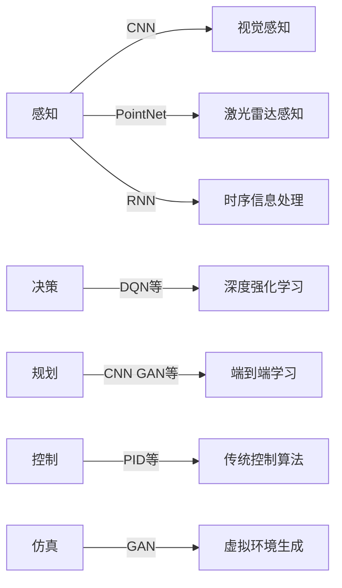

# 一切皆是映射：深度学习在无人驾驶技术中的应用

## 1. 背景介绍

### 1.1 无人驾驶技术的发展历程
无人驾驶技术的发展可以追溯到20世纪80年代，当时美国国防部高级研究计划局（DARPA）启动了自动地面车辆（ALV）项目。此后，随着传感器、计算机视觉、机器学习等技术的不断进步，无人驾驶技术取得了长足的发展。2004年和2005年，DARPA举办了两届大规模的无人车挑战赛，极大地推动了无人驾驶技术的发展。进入21世纪10年代，谷歌、特斯拉、百度等科技巨头纷纷加入无人驾驶的研发大军，使得无人驾驶技术进入快速发展期。

### 1.2 深度学习技术的崛起
深度学习作为人工智能的一个分支，其发展可以追溯到上世纪80年代，但直到2012年，多伦多大学 Hinton 教授及其学生 AlexNet 在 ImageNet 图像识别挑战赛中以超过第二名10%的准确率夺冠，深度学习才引起广泛关注。此后，深度学习以其强大的特征学习能力和出色的性能，在计算机视觉、语音识别、自然语言处理等领域取得了一系列突破，成为人工智能领域的研究热点。

### 1.3 深度学习与无人驾驶技术的结合
无人驾驶系统是一个复杂的系统工程，涉及环境感知、路径规划、决策控制等多个模块，其中环境感知是无人驾驶的核心和基础。传统的无人驾驶环境感知主要依赖于机器视觉算法，如 Haar、HOG、SIFT 等特征提取算法配合 SVM、Adaboost 等机器学习算法。这些方法在特定场景下取得了不错的效果，但面对复杂多变的真实驾驶环境，鲁棒性和泛化能力还有待提高。

深度学习以其强大的特征学习能力和出色的性能，为无人驾驶环境感知提供了新的解决方案。通过海量数据的训练，深度神经网络能够自动学习到道路场景中车辆、行人、交通标志等目标的高层语义特征，从而实现精准的目标检测与识别。此外，将深度学习应用于无人驾驶的决策控制和路径规划，也能够极大地提升系统性能。可以说，深度学习是无人驾驶走向商业化落地的关键推动力。

## 2. 核心概念与联系

### 2.1 深度学习的核心概念
- 人工神经网络（ANN）：一种模拟生物神经网络结构和功能的数学模型，由大量的人工神经元相互连接构成。
- 深度神经网络（DNN）：一种包含多个隐藏层的人工神经网络，能够学习到输入数据的高层特征表示。
- 卷积神经网络（CNN）：一种特殊的深度神经网络，利用卷积、池化等操作提取图像的局部特征，并通过全连接层映射到输出。CNN 在图像识别等领域取得了广泛成功。
- 循环神经网络（RNN）：一种能够处理序列数据的神经网络，通过在网络中引入循环连接，使得网络能够记忆之前的信息。LSTM 和 GRU 是两种常见的 RNN 变体。
- 迁移学习：将一个领域学习到的知识迁移到另一个相关领域，提高模型的泛化能力和训练效率。

### 2.2 无人驾驶的核心技术
- 环境感知：通过激光雷达、摄像头、毫米波雷达等传感器采集车辆周围环境信息，并利用计算机视觉和深度学习算法对路况进行分析和理解。
- 定位与建图：通过 GPS/IMU 等传感器获取车辆的位置和姿态信息，并利用 SLAM 算法构建高精度地图。
- 路径规划：根据感知到的环境信息和自身状态，规划出行驶路径，通常采用 A*、RRT 等搜索算法。  
- 决策控制：根据路径规划的结果，对车辆的油门、刹车、转向等执行机构进行控制，保证车辆平稳、安全行驶。

### 2.3 深度学习与无人驾驶技术的联系
深度学习是无人驾驶技术的核心推动力，主要应用于以下几个方面：

- 视觉感知：利用 CNN 等深度学习模型对摄像头采集的图像进行分析，实现车道线检测、交通标志识别、行人/车辆检测等。
- 点云处理：将深度学习方法应用于激光雷达点云数据处理，实现场景语义分割、目标检测与跟踪等。
- 端到端学习：利用深度强化学习，直接将感知信息映射到控制指令，实现无人车的端到端自动驾驶。
- 仿真环境：利用生成对抗网络（GAN）等深度学习技术构建逼真的虚拟驾驶环境，提供海量的训练数据。

下图展示了深度学习在无人驾驶系统中的主要应用：

## 3. 核心算法原理与操作步骤

### 3.1 CNN在视觉感知中的应用

#### 3.1.1 CNN的基本结构
CNN 主要由以下几个部分组成：

- 卷积层：通过卷积操作提取图像的局部特征。
- 池化层：对卷积层的输出进行下采样，减小特征图尺寸。
- 激活函数：引入非线性，增强网络的表达能力，常用的有 ReLU、sigmoid 等。
- 全连接层：将卷积层提取的特征映射到输出，实现分类或回归。

#### 3.1.2 目标检测算法
目标检测是无人驾驶视觉感知的核心任务，常用的 CNN 目标检测算法包括：

- R-CNN 系列：先利用选择性搜索等方法生成候选区域，再用 CNN 对候选区域进行分类和回归，代表算法有 R-CNN、Fast R-CNN、Faster R-CNN 等。
- YOLO 系列：将图像划分为网格，每个网格预测多个边界框和类别概率，代表算法有 YOLOv1~v5。
- SSD：在不同尺度的特征图上进行目标检测，兼顾了速度和精度。

以 YOLO 算法为例，其主要步骤如下：
1. 将输入图像划分为 S×S 的网格。
2. 每个网格预测 B 个边界框，每个边界框包含 5 个参数：(x, y, w, h, confidence)，分别表示边界框中心坐标、宽高和置信度。
3. 每个网格预测 C 个类别概率，表示该网格包含某个类别目标的概率。
4. 对预测的边界框进行非极大值抑制（NMS），去除重叠的检测结果。
5. 根据置信度和类别概率阈值，输出最终的检测结果。

### 3.2 PointNet在点云处理中的应用

#### 3.2.1 PointNet的基本结构
PointNet 是一种直接处理点云数据的深度学习模型，主要由以下几个部分组成：

- 输入变换网络（T-Net）：通过学习一个仿射变换矩阵，对输入点云进行旋转等变换，增强模型的鲁棒性。
- 点云特征提取：通过多层感知机（MLP）对每个点的特征进行编码。
- 最大池化层：对所有点的特征进行最大池化操作，提取点云的全局特征。
- 分类/分割网络：将全局特征和每个点的局部特征拼接，输入到分类或分割网络中。

#### 3.2.2 点云分割算法
点云分割是无人驾驶激光雷达感知的重要任务，常用的点云分割算法包括：

- PointNet：直接将点云输入到网络中进行分割，对点云的顺序变化具有鲁棒性。
- PointNet++：在 PointNet 的基础上引入了分层采样和局部特征聚合，提高了分割精度。
- SqueezeSegV3：利用球形投影和 CRF 后处理，在 SemanticKITTI 数据集上取得了最先进的性能。

以 PointNet 语义分割为例，其主要步骤如下：
1. 将点云输入到 T-Net 中，学习一个仿射变换矩阵，对点云进行变换。
2. 将变换后的点云输入到特征提取网络（MLP）中，提取每个点的局部特征。
3. 对所有点的局部特征进行最大池化，得到点云的全局特征。
4. 将全局特征和每个点的局部特征拼接，输入到分割网络（MLP）中，预测每个点的类别。
5. 对预测结果进行后处理（如 CRF），得到最终的分割结果。

### 3.3 深度强化学习在自动驾驶决策中的应用

#### 3.3.1 深度强化学习的基本概念
- Agent：智能体，即自动驾驶汽车。
- State：环境状态，如车辆位置、速度、周围物体信息等。
- Action：智能体的动作，如加速、减速、转向等。
- Reward：环境对智能体动作的奖励，如行驶平稳度、到目标点的距离等。
- Policy：智能体的决策策略，即状态到动作的映射。

深度强化学习通过深度神经网络来逼近最优策略，常用的算法包括 DQN、DDPG、PPO 等。

#### 3.3.2 DQN算法
DQN（Deep Q-Network）是一种基于值函数的深度强化学习算法，其主要思想是用深度神经网络来逼近最优 Q 函数。DQN 的主要步骤如下：

1. 初始化 Q 网络和目标网络，目标网络的参数定期从 Q 网络复制。
2. 与环境交互，根据 ε-greedy 策略选择动作，并存储转移样本 (s, a, r, s') 到经验回放缓冲区中。
3. 从经验回放缓冲区中随机采样一批转移样本，计算 Q 网络的目标值：
$$y_i = r_i + γ \max_{a'} Q(s'_i, a'; θ^-)$$
其中 $θ^-$ 为目标网络的参数。
4. 最小化 Q 网络的损失函数：
$$L(θ) = \frac{1}{N} \sum_i (y_i - Q(s_i, a_i; θ))^2$$
5. 定期将 Q 网络的参数复制给目标网络。
6. 重复步骤 2-5，直到收敛。

在自动驾驶决策中，可以将车辆状态（如位置、速度、加速度等）和环境信息（如车道线、障碍物等）作为状态输入，将油门、刹车、转向等作为动作输出，通过 DQN 算法学习最优的驾驶策略。

## 4. 数学模型与公式详解

### 4.1 卷积神经网络（CNN）

#### 4.1.1 卷积层
卷积层通过卷积操作提取输入特征图的局部特征，其数学表达式为：
$$x^l_{j} = f(\sum_{i \in M^{l-1}} x^{l-1}_i * k^l_{ij} + b^l_j)$$

其中，$x^l_j$ 表示第 $l$ 层第 $j$ 个特征图，$M^{l-1}$ 表示第 $l-1$ 层的特征图集合，$k^l_{ij}$ 表示第 $l$ 层第 $i$ 个特征图与第 $j$ 个特征图之间的卷积核，$b^l_j$ 表示第 $l$ 层第 $j$ 个特征图的偏置项，$f$ 表示激活函数，$*$ 表