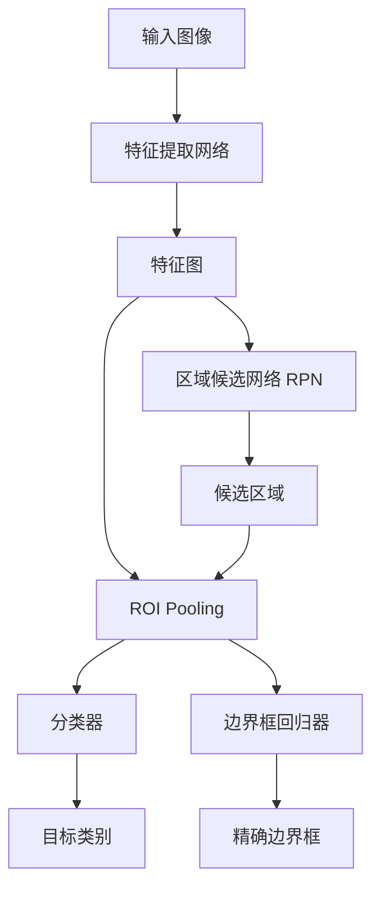
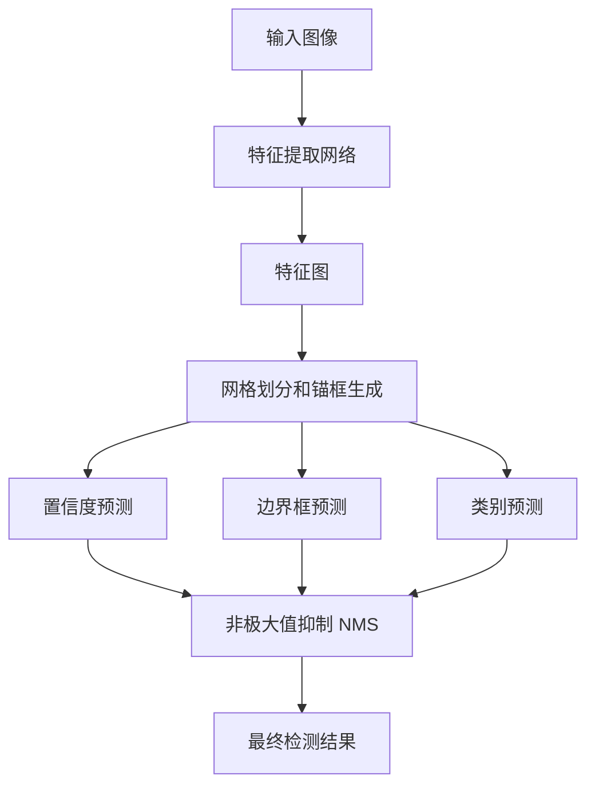
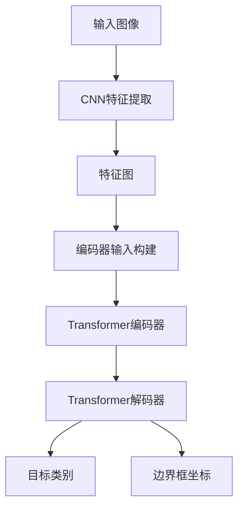

# 一切皆是映射：物体检测与识别：AI的视觉能力

## 1.背景介绍

### 1.1 视觉能力的重要性

在人工智能领域中,赋予机器以视觉能力一直是研究的重点和挑战。视觉能力使机器能够从图像或视频中感知和理解周围环境,这对于诸多应用场景都至关重要,如自动驾驶汽车、机器人导航、安防监控等。随着深度学习技术的不断发展,计算机视觉已经取得了长足的进步,物体检测和识别作为其核心任务之一,吸引了广泛的关注和研究。

### 1.2 物体检测与识别的定义

物体检测(Object Detection)是指在给定的图像或视频中,定位并绘制出感兴趣对象的边界框(Bounding Box)的过程。而物体识别(Object Recognition)则是进一步确定边界框内对象的类别。这两个任务往往是相互关联和依赖的,物体检测为识别提供了对象的位置信息,而识别则赋予了检测结果以语义含义。

### 1.3 应用场景

物体检测与识别技术在现实生活中有着广泛的应用,例如:

- **自动驾驶**: 实时检测并识别道路上的车辆、行人、交通标志等,以确保行车安全。
- **机器人视觉**: 帮助机器人识别和定位周围物体,实现精准操作。
- **视频监控**: 自动检测和识别可疑活动或物体,提高安防效率。
- **图像检索**: 根据图像内容自动标注和检索相关图像。
- **医疗影像分析**: 辅助医生检测和识别病灶、肿瘤等异常情况。

## 2.核心概念与联系

### 2.1 特征提取

在物体检测与识别任务中,提取有效的特征是关键的第一步。特征(Feature)是指图像中对象的某些可量化的视觉属性,如边缘、角点、颜色、纹理等。良好的特征应当具有独特性和鲁棒性,能够有效地区分不同对象。

传统的特征提取方法包括:

- **HOG(Histogram of Oriented Gradients)**: 计算并统计图像局部区域的梯度方向直方图作为特征。
- **SIFT(Scale-Invariant Feature Transform)**: 检测并描述图像中的局部不变特征,对旋转、尺度和亮度变化保持稳健。
- **LBP(Local Binary Patterns)**: 通过计算像素邻域内灰度值的模式直方图来编码纹理特征。

随着深度学习的兴起,基于卷积神经网络(CNN)的特征提取方法逐渐占据主导地位。CNN能够自动从原始图像数据中学习到多层次的特征表示,显著提高了特征的判别能力。

### 2.2 候选区域生成

在进行物体检测时,我们需要从图像中生成一组可能包含目标对象的候选区域(Region Proposal),以缩小搜索范围并提高效率。常见的候选区域生成方法有:

- **滑动窗口(Sliding Window)**: 在图像上以固定步长滑动一个矩形窗口,将每个窗口视为一个候选区域。
- **选择性搜索(Selective Search)**: 基于图像的分割结果,利用底层视觉信息(如颜色、纹理等)合并相似的区域,生成候选区域。
- **区域候选网络(Region Proposal Network, RPN)**: 利用深度卷积网络直接从图像中预测候选区域,是当前主流的生成方式。

### 2.3 分类与检测

在获得候选区域后,我们需要对每个区域进行分类,判断其是否包含目标对象,以及属于何种类别。同时,还需要对目标对象的位置进行精确定位,通常是通过预测其边界框的坐标。

常见的分类与检测方法包括:

- **滑动窗口分类器(Sliding Window Classifier)**: 在每个候选窗口上应用分类器(如SVM、随机森林等)进行分类和定位。
- **R-CNN系列算法**: 利用CNN进行特征提取,再结合区域建议和分类回归模型实现检测。
- **单阶段检测器(One-Stage Detector)**: 如YOLO、SSD等,直接在密集采样的先验框上进行分类和回归,速度更快但精度略低。
- **基于Transformer的检测器**: 利用Transformer的自注意力机制来建模图像中对象之间的关系,提高检测性能。

这些方法在精度和速度之间需要权衡,根据具体应用场景选择合适的算法。

## 3.核心算法原理具体操作步骤

### 3.1 R-CNN系列算法

R-CNN(Region-based Convolutional Neural Networks)系列算法是物体检测领域的经典方法,它将检测任务分为两个阶段:候选区域生成和目标检测。该系列算法的核心思想是利用CNN提取区域特征,再结合分类器和边界框回归器进行物体检测和识别。

#### 3.1.1 R-CNN

R-CNN是该系列算法的起源,其主要步骤如下:

1. **候选区域生成**: 使用选择性搜索算法从图像中提取约2000个候选区域。
2. **特征提取**: 将每个候选区域扭曲成固定大小,输入预训练的CNN(如AlexNet)提取特征。
3. **分类**: 将CNN提取的特征输入SVM分类器,判断候选区域是否包含目标对象及其类别。
4. **边界框回归**: 使用线性回归模型对候选区域的边界框进行微调,得到最终的目标位置。

R-CNN虽然取得了不错的检测精度,但存在几个明显缺陷:速度慢、训练复杂、存储开销大等。

#### 3.1.2 Fast R-CNN

为了解决R-CNN的缺陷,Fast R-CNN提出了一些改进:

1. **特征共享**: 整个图像只需通过CNN一次即可提取特征图,然后在特征图上对每个候选区域进行ROI Pooling操作提取特征,避免了重复计算。
2. **端到端训练**: 将CNN、分类器和边界框回归器整合为一个统一的网络,可以进行端到端的训练,简化了训练过程。

Fast R-CNN在保持较高精度的同时,大幅提升了速度。但它仍需要先生成候选区域,效率上还有提升空间。

#### 3.1.3 Faster R-CNN

Faster R-CNN在Fast R-CNN的基础上,引入了区域候选网络(RPN),实现了端到端的目标检测:

1. **特征提取**: 输入图像经过卷积网络提取特征图。
2. **区域候选网络(RPN)**: 在特征图上滑动窗口,为每个锚点预测是否包含目标对象,并调整锚框大小获得候选区域。
3. **ROI Pooling**: 对候选区域进行ROI Pooling操作,提取固定长度的特征向量。
4. **分类和回归**: 将ROI特征输入两个全连接层,分别预测目标类别和精确的边界框。

Faster R-CNN将候选区域生成和目标检测统一在一个网络中完成,大幅提高了检测速度,被广泛应用于实际系统中。

### 3.2 单阶段检测器

与R-CNN系列的两阶段方法不同,单阶段检测器(One-Stage Detector)将候选区域生成和目标检测合并为一个统一的网络,直接在密集采样的先验框上进行分类和回归,因此速度更快,但精度通常略低于两阶段方法。

#### 3.2.1 YOLO

YOLO(You Only Look Once)是单阶段检测器的代表性算法,其核心思想是将输入图像分割成SxS个网格,每个网格负责预测其中的目标对象。具体步骤如下:

1. **网格划分和锚框生成**: 将输入图像分割成SxS个网格,每个网格设置多个预设的锚框(Anchor Box)。
2. **特征提取**: 输入图像经过一系列卷积层和池化层,提取出特征图。
3. **预测**: 对于每个网格,根据特征图预测:
   - 置信度(Confidence Score):当前网格中是否存在目标对象。
   - 边界框坐标(Bounding Box):目标对象的位置和大小。
   - 条件类别概率(Conditional Class Probabilities):目标对象的类别。
4. **非极大值抑制(NMS)**: 对预测结果进行NMS操作,去除重叠的冗余检测框。

YOLO的优点是速度极快,能够实时处理视频流,但精度相对较低。后续的YOLOv2、YOLOv3等版本通过改进网络结构和训练策略,在一定程度上提高了检测精度。

#### 3.2.2 SSD

SSD(Single Shot MultiBox Detector)是另一种流行的单阶段检测器,它在基础特征图上的多个尺度上进行检测,以获得更好的检测效果。主要步骤如下:

1. **特征提取**: 输入图像经过一系列卷积层提取出不同尺度的特征图。
2. **锚框生成**: 在每个特征图上生成一系列锚框,用于检测不同尺寸的目标对象。
3. **预测**: 对于每个锚框,根据对应的特征图预测:
   - 置信度(Confidence Score):当前锚框中是否存在目标对象。
   - 边界框坐标(Bounding Box):目标对象的位置和大小。
   - 条件类别概率(Conditional Class Probabilities):目标对象的类别。
4. **非极大值抑制(NMS)**: 对预测结果进行NMS操作,去除重叠的冗余检测框。

SSD相比YOLO在小目标检测上表现更好,但速度略慢。

### 3.3 基于Transformer的检测器

近年来,基于Transformer的检测器逐渐成为研究热点。Transformer最初是用于自然语言处理任务,后来被引入到计算机视觉领域,利用其强大的自注意力机制来建模图像中对象之间的关系,提高检测性能。

#### 3.3.1 DETR

DETR(DEtection TRansformer)是第一个将Transformer应用于物体检测的模型,它完全抛弃了传统的手工设计的组件(如锚框生成、NMS等),将检测任务建模为一个简单的序列到序列的预测问题。

DETR的工作流程如下:

1. **特征提取**: 输入图像经过CNN backbone提取特征图。
2. **编码**: 将特征图平铺并加入位置编码,作为Transformer的输入。
3. **Transformer编码器**: 利用自注意力机制对输入特征进行编码,捕获全局信息。
4. **Transformer解码器**: 将一个可学习的对象查询(Object Query)输入解码器,根据编码器的输出,预测一系列对象的类别和边界框。

DETR具有简洁优雅的设计,但在训练和推理速度上存在一些缺陷,难以满足实时应用的需求。

#### 3.3.2 Deformable DETR

Deformable DETR在DETR的基础上引入了可变形卷积(Deformable Convolution)和空间注意力模块,显著提升了检测精度和推理速度。

其核心思想是:

1. **多尺度特征融合**: 利用可变形卷积从不同尺度的特征图中提取丰富的语