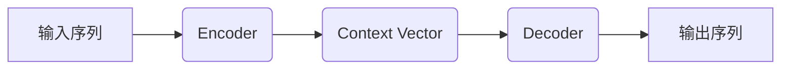
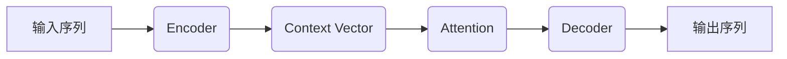
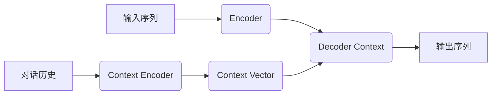
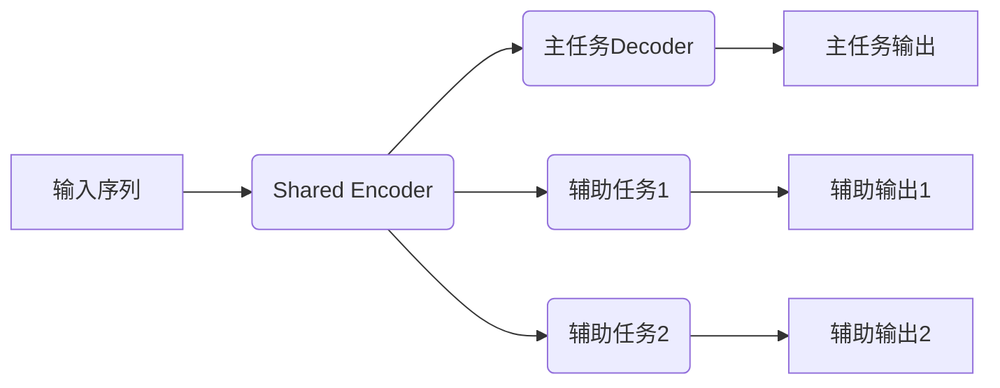
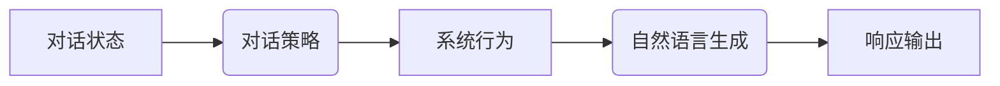

# 一切皆是映射：结合深度学习的智能聊天机器人开发

## 1.背景介绍

### 1.1 人工智能时代的到来

近年来,人工智能(AI)技术的飞速发展正在重塑着我们的生活和工作方式。作为人工智能的一个重要分支,自然语言处理(NLP)技术已经渗透到了各个领域,其中智能聊天机器人便是一个典型的应用场景。

### 1.2 聊天机器人的重要性

智能聊天机器人可以模拟人类的对话方式,为用户提供个性化的交互体验。它们可以应用于客户服务、教育辅导、心理咨询等多个领域,帮助企业降低运营成本,提高工作效率。因此,构建一个高质量的聊天机器人系统,对于提升用户体验和企业竞争力至关重要。

### 1.3 深度学习在聊天机器人中的作用

传统的基于规则的聊天机器人存在一些局限性,如知识库维护困难、响应生硬等。而深度学习技术的引入,使得聊天机器人能够从海量数据中自主学习,生成更加自然流畅的对话响应。因此,结合深度学习的智能聊天机器人成为了研究的热点方向。

## 2.核心概念与联系

### 2.1 序列到序列(Seq2Seq)模型

Seq2Seq模型是聊天机器人的核心,它将对话问题建模为一个序列到序列的转换过程。输入序列表示用户的utterance,输出序列则是机器人的response。

### 2.2 注意力机制(Attention Mechanism)

注意力机制赋予了模型对输入序列中不同部分赋予不同权重的能力,使得模型能够更好地捕捉输入和输出之间的长距离依赖关系,提高了生成响应的质量和相关性。

### 2.3 上下文表征(Context Representation)

聊天机器人需要掌握对话的上下文信息,才能生成恰当的响应。上下文表征模块将之前的对话历史编码为一个向量,作为额外的输入,赋予模型对话理解的能力。

### 2.4 多任务学习(Multi-Task Learning)

引入辅助任务(如情感分类、主题检测等)进行多任务学习,可以增强模型的泛化能力,提高对话质量。相关的知识可以在不同任务之间共享和传递。

### 2.5 对话策略(Dialogue Policy)

对话策略模块根据当前对话状态,决定机器人的下一步行为,如提供响应、请求澄清或是结束对话等。它使得对话更加自然流畅,避免出现死锁状态。

## 3.核心算法原理具体操作步骤

### 3.1 Seq2Seq模型

Seq2Seq模型的核心思想是将输入序列先编码为一个向量表示,再由解码器从该向量生成输出序列。具体操作步骤如下:

1. **输入编码(Encoder)**: 将输入序列 $X=(x_1, x_2, ..., x_n)$ 通过递归神经网络(如LSTM或GRU)编码为一系列隐藏状态 $\vec{h}=(\vec{h}_1, \vec{h}_2, ..., \vec{h}_n)$。最后一个隐藏状态 $\vec{h}_n$ 作为上下文向量 $c$,代表了整个输入序列的语义信息。

$$h_t = \text{LSTM}(x_t, h_{t-1})$$

2. **输出解码(Decoder)**: 初始化解码器的隐藏状态 $s_0$ 为上下文向量 $c$。在每一个时间步 $t$,解码器根据当前隐藏状态 $s_t$ 和上一步输出 $y_{t-1}$ 预测当前时间步的输出 $y_t$。

$$s_t = \text{LSTM}(y_{t-1}, s_{t-1}, c)$$
$$P(y_t|y_1,...,y_{t-1},X) = \text{softmax}(W_s s_t + b)$$

3. **模型训练**: 给定训练数据 $(X, Y)$,最小化输入序列 $X$ 与目标序列 $Y$ 之间的负对数似然损失函数:

$$\mathcal{L}(\theta) = -\sum_{t=1}^{T}\log P(y_t|y_1,...,y_{t-1},X;\theta)$$

其中 $\theta$ 为模型参数。使用反向传播算法和优化器(如Adam)迭代更新模型参数,直至收敛。

4. **响应生成(Inference)**: 给定新的输入序列 $X$,将其编码为上下文向量 $c$,然后对解码器进行贪婪搜索或束搜索,生成最可能的输出序列作为响应。

### 3.2 注意力机制(Attention)

传统的Seq2Seq模型在编码长序列时,很难完全捕捉到所有相关信息。注意力机制通过对输入序列的不同部分赋予不同权重,有效缓解了这一问题。具体步骤如下:

1. **计算注意力权重**: 在每一个解码时间步 $t$,计算当前解码器隐藏状态 $s_t$ 与每个编码器隐藏状态 $\vec{h}_i$ 的相关性得分 $e_{t,i}$:

$$e_{t,i} = \text{score}(s_t, \vec{h}_i)$$

常用的计算方法有加性注意力(additive attention)、缩放点积注意力(scaled dot-product attention)等。

2. **归一化注意力权重**: 使用softmax函数对注意力得分进行归一化,得到当前时间步的注意力权重分布 $\alpha_t$:

$$\alpha_{t,i} = \frac{\exp(e_{t,i})}{\sum_{j=1}^{n}\exp(e_{t,j})}$$

3. **计算上下文向量**: 将编码器隐藏状态 $\vec{h}_i$ 根据注意力权重 $\alpha_{t,i}$ 加权求和,得到当前时间步的上下文向量 $c_t$:  

$$c_t = \sum_{i=1}^{n}\alpha_{t,i}\vec{h}_i$$

4. **解码输出**: 解码器在预测输出时,将上下文向量 $c_t$ 与当前隐藏状态 $s_t$ 进行组合,捕捉输入与输出之间的对应关系:

$$P(y_t|y_1,...,y_{t-1},X) = \text{softmax}(W_s [s_t;c_t] + b)$$

### 3.3 上下文表征

对话系统需要掌握对话历史,才能生成与上下文相关的恰当响应。常见的上下文表征方法有:

1. **简单串联**: 将当前输入序列与对话历史序列简单地串联起来,作为Seq2Seq模型的输入。
2. **分层编码**: 使用分层编码器分别编码当前输入和对话历史,生成两个独立的上下文向量,再将它们拼接作为解码器的输入。
3. **上下文注意力**: 在注意力机制的基础上,引入对话历史的注意力权重,赋予模型选择性地关注对话上下文的能力。

### 3.4 多任务学习

在聊天机器人的训练过程中,除了主任务(生成响应)外,还可以同时优化一些辅助任务,如情感分类、主题检测等。多任务学习的目标是最小化主任务损失与辅助任务损失的加权和:

$$\mathcal{L} = \mathcal{L}_\text{main} + \sum_{i=1}^{n}\lambda_i\mathcal{L}_\text{aux}^i$$

其中 $\lambda_i$ 为辅助任务 $i$ 的损失权重。在训练过程中,不同任务之间的知识可以相互传递和共享,从而提高了模型的泛化能力。

### 3.5 对话策略

对话策略模块根据当前对话状态,决定系统的下一步行为。主流的对话策略有:

1. **基于规则的策略**: 根据预定义的规则映射状态到行为,简单但缺乏灵活性。
2. **基于机器学习的策略**: 利用强化学习等技术从数据中学习状态到行为的映射,更加灵活和健壮。
3. **层次化策略**: 将对话过程分解为多个层次,每个层次由一个策略控制,增强了策略的表达能力。

对话策略与自然语言理解和生成模块相结合,可以构建出完整的任务导向型对话系统。

## 4.数学模型和公式详细讲解举例说明

在聊天机器人系统中,涉及到了多种数学模型和公式,下面我们对其中的几个核心部分进行详细讲解。

### 4.1 Seq2Seq模型

Seq2Seq模型的核心思想是将输入序列 $X$ 编码为一个上下文向量 $c$,再由解码器从该向量生成输出序列 $Y$。编码器和解码器通常使用循环神经网络(如LSTM或GRU)来实现。

#### 4.1.1 LSTM单元

LSTM(Long Short-Term Memory)是一种特殊的循环神经网络单元,具有记忆能力,可以有效捕捉长期依赖关系。LSTM单元的核心是细胞状态 $c_t$,它像一条传输带一样,只做少量线性运算,从而保持了信息的完整性。

LSTM的计算过程如下:

$$
\begin{align}
f_t &= \sigma(W_f[h_{t-1}, x_t] + b_f) & \text{(遗忘门)} \\
i_t &= \sigma(W_i[h_{t-1}, x_t] + b_i) & \text{(输入门)} \\
\tilde{c}_t &= \tanh(W_c[h_{t-1}, x_t] + b_c) & \text{(候选细胞状态)} \\
c_t &= f_t \odot c_{t-1} + i_t \odot \tilde{c}_t & \text{(细胞状态)} \\
o_t &= \sigma(W_o[h_{t-1}, x_t] + b_o) & \text{(输出门)} \\
h_t &= o_t \odot \tanh(c_t) & \text{(隐藏状态)}
\end{align}
$$

其中 $\sigma$ 为sigmoid激活函数, $\odot$ 为元素级别的向量乘积。通过精心设计的门控机制,LSTM能够很好地控制信息的流动,从而捕捉长期依赖关系。

#### 4.1.2 编码器(Encoder)

编码器的目标是将输入序列 $X=(x_1, x_2, ..., x_n)$ 编码为一系列隐藏状态 $\vec{h}=(\vec{h}_1, \vec{h}_2, ..., \vec{h}_n)$,其中最后一个隐藏状态 $\vec{h}_n$ 作为上下文向量 $c$,代表了整个输入序列的语义信息。编码器通常使用LSTM或GRU来实现:

$$\vec{h}_t = \text{LSTM}(x_t, \vec{h}_{t-1})$$

#### 4.1.3 解码器(Decoder)

解码器的目标是根据上下文向量 $c$ 生成输出序列 $Y=(y_1, y_2, ..., y_m)$。在每一个时间步 $t$,解码器根据当前隐藏状态 $s_t$、上一步输出 $y_{t-1}$ 和上下文向量 $c$ 预测当前时间步的输出 $y_t$:

$$s_t = \text{LSTM}(y_{t-1