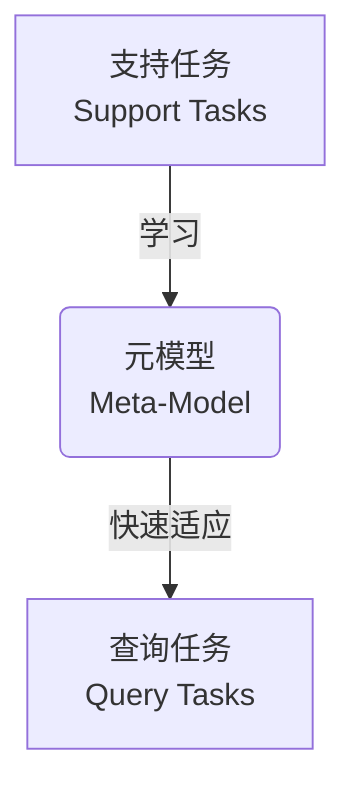
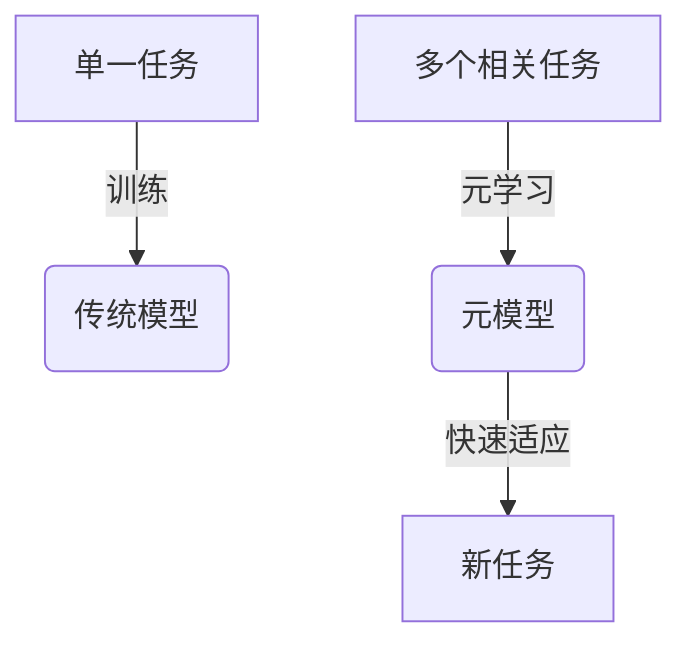
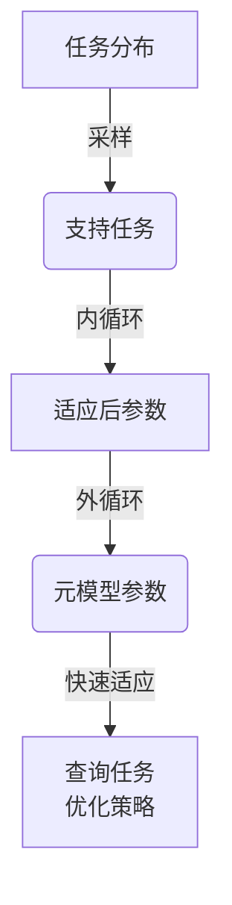
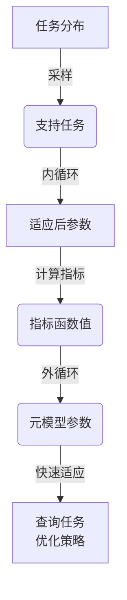
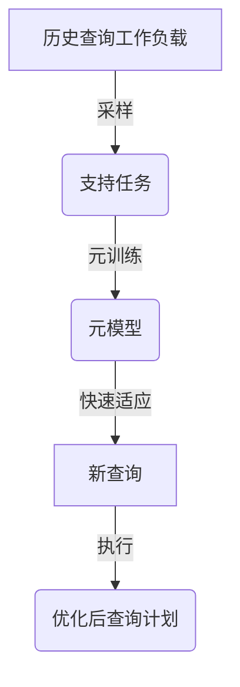

# 一切皆是映射：面向复杂查询的数据库优化通过元学习

## 1.背景介绍

### 1.1 数据库优化的重要性

在当今数据爆炸式增长的时代,数据库系统面临着巨大的挑战。随着数据量的不断增加,传统的数据库优化方法已经无法满足复杂查询的需求。因此,如何高效地处理大规模数据和复杂查询成为了数据库优化领域的一个关键问题。

### 1.2 传统数据库优化方法的局限性

传统的数据库优化方法主要依赖于人工设计的规则和启发式算法。这些方法虽然在一定程度上提高了查询性能,但是存在以下几个主要局限性:

1. 规则和启发式算法的设计需要大量的人工经验,难以涵盖所有可能的查询场景。
2. 优化策略的选择往往是静态的,无法动态适应查询工作负载的变化。
3. 传统方法难以处理复杂的查询模式,例如涉及多个表连接、嵌套子查询等情况。

### 1.3 元学习在数据库优化中的应用前景

元学习(Meta-Learning)是机器学习领域的一个新兴研究方向,旨在通过学习不同任务之间的共性知识,从而加速新任务的学习过程。近年来,元学习在计算机视觉、自然语言处理等领域取得了令人瞩目的成绩。

将元学习应用于数据库优化具有巨大的潜力。通过学习不同查询模式之间的共性知识,元学习可以自动发现优化策略,并动态调整优化参数以适应复杂的查询工作负载。与传统方法相比,基于元学习的数据库优化具有以下优势:

1. 自动化程度高,无需人工设计复杂的规则和启发式算法。
2. 具有很强的泛化能力,可以处理各种复杂的查询模式。
3. 能够动态调整优化策略,适应查询工作负载的变化。

## 2.核心概念与联系

### 2.1 元学习的核心思想

元学习的核心思想是通过学习不同任务之间的共性知识,从而加速新任务的学习过程。具体来说,元学习算法会在一组支持任务(Support Tasks)上学习一个元模型(Meta-Model),然后利用这个元模型在新的查询任务(Query Tasks)上快速适应和优化。

在数据库优化的场景中,支持任务可以是一组具有代表性的查询工作负载,而查询任务则是需要优化的新查询。元模型的作用是捕获不同查询模式之间的共性知识,从而加速新查询的优化过程。



### 2.2 元学习与传统机器学习的区别

与传统的机器学习方法不同,元学习算法不是直接在单一任务上进行训练,而是在多个不同但相关的任务上学习一个共性模型。这种方式可以提高模型的泛化能力,使其能够更好地适应新的任务。

在数据库优化中,传统的机器学习方法通常是针对特定的查询模式进行训练,难以处理复杂的查询场景。而基于元学习的方法可以从多种查询模式中学习共性知识,从而更好地适应各种复杂的查询工作负载。



### 2.3 元学习在数据库优化中的应用

在数据库优化中,元学习可以应用于以下几个方面:

1. **查询优化器**: 利用元学习自动发现优化策略,动态调整优化参数以适应复杂的查询工作负载。
2. **索引选择**: 通过元学习自动选择合适的索引,提高查询性能。
3. **物化视图选择**: 利用元学习确定应该物化哪些视图,以加速查询执行。
4. **数据分区**: 基于元学习自动选择合适的数据分区策略,提高查询并行性。
5. **资源管理**: 使用元学习动态调整资源分配,优化数据库系统的整体性能。

## 3.核心算法原理具体操作步骤

### 3.1 基于模型的元学习

基于模型的元学习(Model-Based Meta-Learning)是一种常见的元学习范式。它的核心思想是通过一个可微分的模型来表示元学习过程,并利用梯度下降等优化算法来学习该模型的参数。

具体来说,基于模型的元学习算法包括以下几个主要步骤:

1. **支持任务采样**: 从任务分布中采样一批支持任务。
2. **内循环**: 在每个支持任务上,利用梯度下降等优化算法更新模型参数,得到针对该任务的适应后参数。
3. **外循环**: 通过一个元优化器(如梯度下降),在所有支持任务的适应后参数上进行优化,得到元模型的参数。
4. **元测试**: 在新的查询任务上,利用元模型的参数进行快速适应,得到针对该任务的优化策略。



以下是一个基于模型的元学习算法的伪代码:

```python
# 元训练阶段
for iter in num_iterations:
    # 采样一批支持任务
    support_tasks = sample_tasks(task_distribution)
    
    # 内循环: 在每个支持任务上进行适应
    for task in support_tasks:
        # 计算任务损失并通过梯度下降更新参数
        task_loss = compute_loss(model, task)
        adapted_params = model.parameters - alpha * grad(task_loss, model.parameters)
        
    # 外循环: 在适应后参数上进行元更新
    meta_loss = compute_meta_loss(adapted_params)
    model.parameters = model.parameters - beta * grad(meta_loss, model.parameters)

# 元测试阶段
for query_task in new_query_tasks:
    # 在查询任务上进行快速适应
    adapted_params = adapt(model, query_task)
    # 利用适应后参数执行查询优化
    optimized_query = execute_query(adapted_params, query_task)
```

### 3.2 基于指标的元学习

除了基于模型的方法,另一种常见的元学习范式是基于指标的元学习(Metric-Based Meta-Learning)。这种方法的核心思想是直接学习一个可微分的指标函数,该函数可以衡量模型在新任务上的性能。

在数据库优化场景中,指标函数可以是查询执行时间、资源利用率等性能指标。通过优化这个指标函数,元学习算法可以自动发现最优的优化策略。

基于指标的元学习算法包括以下几个主要步骤:

1. **支持任务采样**: 从任务分布中采样一批支持任务。
2. **内循环**: 在每个支持任务上,利用梯度下降等优化算法更新模型参数,得到针对该任务的适应后参数。
3. **指标函数计算**: 利用适应后参数在查询任务上计算指标函数的值。
4. **外循环**: 通过一个元优化器(如梯度下降),优化指标函数,得到元模型的参数。
5. **元测试**: 在新的查询任务上,利用元模型的参数进行快速适应,得到针对该任务的优化策略。



以下是一个基于指标的元学习算法的伪代码:

```python
# 元训练阶段
for iter in num_iterations:
    # 采样一批支持任务
    support_tasks = sample_tasks(task_distribution)
    
    # 内循环: 在每个支持任务上进行适应
    for task in support_tasks:
        adapted_params = adapt(model, task)
        
    # 计算指标函数值
    metric_values = compute_metric(adapted_params, query_tasks)
    
    # 外循环: 优化指标函数
    meta_loss = compute_meta_loss(metric_values)
    model.parameters = model.parameters - beta * grad(meta_loss, model.parameters)

# 元测试阶段
for query_task in new_query_tasks:
    # 在查询任务上进行快速适应
    adapted_params = adapt(model, query_task)
    # 利用适应后参数执行查询优化
    optimized_query = execute_query(adapted_params, query_task)
```

### 3.3 元学习在数据库查询优化器中的应用

在数据库查询优化器中,我们可以将查询优化视为一个元学习问题。具体来说,支持任务可以是一组具有代表性的查询工作负载,而查询任务则是需要优化的新查询。

元模型的作用是捕获不同查询模式之间的共性知识,从而加速新查询的优化过程。在元训练阶段,元模型会在支持任务上进行训练,学习如何快速适应不同的查询模式。在元测试阶段,元模型可以在新的查询任务上进行快速适应,从而生成针对该查询的优化策略。

以下是一个基于元学习的查询优化器的工作流程:



在实际应用中,我们可以将元学习与传统的查询优化技术(如基于规则的优化、基于代价模型的优化等)相结合,形成一个混合的优化框架。这种混合方法可以充分利用元学习的优势,同时也能够借鉴传统方法的经验和启发式知识。

## 4.数学模型和公式详细讲解举例说明

在元学习算法中,通常需要定义一个目标函数来衡量模型在不同任务上的性能。在数据库优化场景中,这个目标函数可以是查询执行时间、资源利用率等指标。

### 4.1 基于执行时间的目标函数

假设我们有一个查询任务集合 $\mathcal{T} = \{T_1, T_2, \ldots, T_N\}$,其中每个任务 $T_i$ 都是一个查询。我们的目标是找到一个优化策略 $\theta$,使得在所有任务上的平均执行时间最小化。

我们可以定义以下目标函数:

$$J(\theta) = \frac{1}{N} \sum_{i=1}^N t_i(\theta)$$

其中 $t_i(\theta)$ 表示在优化策略 $\theta$ 下,查询 $T_i$ 的执行时间。

在元学习算法中,我们需要在支持任务上优化这个目标函数,从而得到一个元模型。然后,在新的查询任务上,我们可以利用这个元模型快速适应,得到针对该任务的优化策略。

### 4.2 基于资源利用率的目标函数

除了执行时间,我们也可以考虑资源利用率作为优化目标。假设我们有一个资源利用率函数 $u(\theta)$,表示在优化策略 $\theta$ 下的资源利用率。我们可以定义以下目标函数:

$$J(\theta) = \alpha \cdot \frac{1}{N} \sum_{i=1}^N t_i(\theta) + (1 - \alpha) \cdot u(\theta)$$

其中 $\alpha \in [0, 1]$ 是一个权重参数,用于平衡执行时间和资源利用率两个目标。

在实际应用中,我们可以根据具体场景调整 $\alpha$ 的值,来满足不同的优化需求。例如,在对延迟敏感的场景下,我们可以增大 $\alpha$ 的值,更多地关注执行时间;而在对资源利用率敏感的场景下,我们可以减小 $\alpha$ 的值,更多地关注资源利用率。

### 4.3