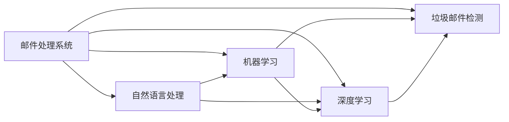

# 个人邮件处理系统详细设计与具体代码实现

## 1. 背景介绍

在当今信息时代,电子邮件已成为人们日常工作和生活中不可或缺的通信工具。然而,随着邮件数量的急剧增加,有效地管理和处理个人邮件变得越来越具有挑战性。为了提高个人邮件管理的效率和便捷性,开发一个智能化的个人邮件处理系统变得尤为重要。

本文将详细介绍一个基于人工智能技术的个人邮件处理系统的设计与实现。该系统旨在自动化处理个人邮件,包括邮件分类、优先级划分、自动回复、垃圾邮件过滤等功能,从而大大减轻用户管理邮件的负担,提高邮件处理效率。

### 1.1 个人邮件管理面临的挑战

- 邮件数量激增,手动管理效率低下
- 邮件分类困难,重要邮件易被遗漏
- 垃圾邮件泛滥,过滤机制不完善 
- 邮件回复耗时,缺乏自动化处理

### 1.2 智能邮件处理系统的必要性

- 提高邮件管理效率,节省时间成本
- 智能分类与优先级划分,保证重要邮件及时处理
- 高效过滤垃圾邮件,提升邮箱使用体验
- 自动化回复常见问题,减轻用户负担

## 2. 核心概念与联系

### 2.1 自然语言处理(NLP)

- 文本预处理:分词、词性标注、命名实体识别等
- 文本表示:词向量、句向量、文档向量
- 文本分类:基于机器学习和深度学习的分类算法

### 2.2 机器学习(Machine Learning)

- 监督学习:分类和回归任务
- 无监督学习:聚类和降维
- 半监督学习:利用少量标注数据和大量未标注数据

### 2.3 深度学习(Deep Learning) 

- 卷积神经网络(CNN):适用于文本分类任务
- 循环神经网络(RNN):适用于序列建模任务
- 注意力机制(Attention Mechanism):提高模型对关键信息的关注度

### 2.4 垃圾邮件检测(Spam Detection)

- 基于规则的过滤:关键词匹配、黑白名单等
- 基于内容的过滤:利用机器学习算法进行分类
- 协同过滤:基于用户反馈的群体智慧

### 2.5 概念之间的联系



## 3. 核心算法原理具体操作步骤

### 3.1 邮件分类算法

#### 3.1.1 朴素贝叶斯分类器

1. 计算先验概率P(c)和条件概率P(x|c)
2. 对于给定的邮件特征x,计算后验概率P(c|x)
3. 选择后验概率最大的类别作为预测结果

#### 3.1.2 支持向量机(SVM)

1. 将邮件特征向量映射到高维空间
2. 在高维空间中寻找最优分割超平面
3. 使用核函数处理非线性可分问题
4. 对新邮件进行分类预测

#### 3.1.3 卷积神经网络(CNN)

1. 将邮件转化为词向量矩阵
2. 使用卷积层提取局部特征
3. 使用池化层降低特征维度
4. 全连接层进行分类预测

### 3.2 垃圾邮件过滤算法

#### 3.2.1 基于关键词匹配的过滤

1. 建立垃圾关键词库
2. 对邮件内容进行分词和词频统计
3. 计算邮件与关键词库的匹配度
4. 根据匹配度判断是否为垃圾邮件

#### 3.2.2 基于贝叶斯分类的过滤

1. 收集垃圾邮件和正常邮件样本
2. 提取邮件特征并进行预处理
3. 训练贝叶斯分类器
4. 对新邮件进行垃圾判断

### 3.3 邮件自动回复算法

#### 3.3.1 基于规则的自动回复

1. 设定关键词触发规则
2. 匹配邮件内容与关键词
3. 根据匹配结果选择对应的回复模板
4. 自动生成回复邮件

#### 3.3.2 基于深度学习的自动回复

1. 收集问答对语料库
2. 对问答对进行预处理和向量化
3. 使用Seq2Seq模型进行训练
4. 对新邮件生成自动回复

## 4. 数学模型和公式详细讲解举例说明

### 4.1 朴素贝叶斯分类器

朴素贝叶斯分类器基于贝叶斯定理和特征独立性假设。对于给定的邮件特征向量$x=(x_1,x_2,...,x_n)$和类别$c$,根据贝叶斯定理有:

$$P(c|x)=\frac{P(x|c)P(c)}{P(x)}$$

假设特征之间相互独立,则有:

$$P(x|c)=\prod_{i=1}^{n}P(x_i|c)$$

最终,选择后验概率最大的类别作为预测结果:

$$\hat{c}=\arg\max_{c}P(c)\prod_{i=1}^{n}P(x_i|c)$$

举例说明:假设有两个类别"正常邮件"和"垃圾邮件",特征向量$x=(x_1,x_2)$表示邮件中是否包含某些关键词。已知:

- $P(正常邮件)=0.7,P(垃圾邮件)=0.3$
- $P(x_1|正常邮件)=0.2,P(x_1|垃圾邮件)=0.8$
- $P(x_2|正常邮件)=0.6,P(x_2|垃圾邮件)=0.4$

对于一封新邮件,特征向量为$x=(1,0)$,计算后验概率:

$$P(正常邮件|x)=\frac{0.2\times0.4\times0.7}{P(x)}=0.056/P(x)$$
$$P(垃圾邮件|x)=\frac{0.8\times0.6\times0.3}{P(x)}=0.144/P(x)$$

因为$P(垃圾邮件|x)>P(正常邮件|x)$,所以预测该邮件为垃圾邮件。

### 4.2 支持向量机(SVM)

支持向量机旨在寻找一个最优超平面,使得不同类别的样本能够被超平面正确分割,并且距离超平面最近的样本点(支持向量)到超平面的距离(间隔)最大化。

对于线性可分的情况,超平面可以表示为:

$$w^Tx+b=0$$

其中$w$为法向量,$b$为偏置项。最优化问题可以表示为:

$$\min_{w,b}\frac{1}{2}||w||^2$$
$$s.t.\quad y_i(w^Tx_i+b)\geq1,i=1,2,...,m$$

对于非线性可分的情况,可以引入松弛变量$\xi_i$和惩罚因子$C$,优化问题变为:

$$\min_{w,b,\xi}\frac{1}{2}||w||^2+C\sum_{i=1}^{m}\xi_i$$
$$s.t.\quad y_i(w^Tx_i+b)\geq1-\xi_i,\xi_i\geq0,i=1,2,...,m$$

通过求解对偶问题,可以得到最优超平面的参数$w$和$b$。

举例说明:假设有两类样本点,正例用圆圈表示,负例用三角形表示。SVM的目标是找到一个最优超平面,使得两类样本能够被正确分割,并且间隔最大化。

```
    ○
  ○   ○
○      ○
  ○   ○  
    ○    △
        △ △
       △   △
      △     △
```

通过求解优化问题,可以得到最优超平面(实线)和支持向量(虚线圈住的点)。新样本点根据其在超平面的哪一侧来判断其类别。

## 5. 项目实践：代码实例和详细解释说明

下面以Python为例,给出个人邮件处理系统的部分代码实现。

### 5.1 邮件分类模块

```python
import numpy as np
from sklearn.naive_bayes import MultinomialNB
from sklearn.svm import SVC
from sklearn.feature_extraction.text import TfidfVectorizer

# 加载邮件数据集
def load_data(file_path):
    """
    加载邮件数据集
    :param file_path: 数据集文件路径
    :return: 邮件内容列表和对应的标签列表
    """
    with open(file_path, 'r', encoding='utf-8') as f:
        data = f.readlines()
    emails = [line.split('\t')[0] for line in data]
    labels = [int(line.split('\t')[1]) for line in data]
    return emails, labels

# 邮件分类器训练
def train_classifier(emails, labels):
    """
    训练邮件分类器
    :param emails: 邮件内容列表
    :param labels: 邮件标签列表
    :return: 训练好的分类器模型
    """
    vectorizer = TfidfVectorizer()
    X = vectorizer.fit_transform(emails)
    clf = MultinomialNB()  # 使用朴素贝叶斯分类器
    # clf = SVC()  # 使用支持向量机分类器
    clf.fit(X, labels)
    return clf, vectorizer

# 邮件分类预测
def predict_email(clf, vectorizer, email):
    """
    对新邮件进行分类预测
    :param clf: 训练好的分类器模型
    :param vectorizer: 特征向量化器
    :param email: 待预测的邮件内容
    :return: 预测的邮件类别
    """
    X = vectorizer.transform([email])
    label = clf.predict(X)[0]
    return label
```

代码解释:

1. `load_data`函数用于加载邮件数据集,从文件中读取邮件内容和对应的标签。
2. `train_classifier`函数用于训练邮件分类器。首先使用`TfidfVectorizer`对邮件内容进行特征向量化,然后选择合适的分类算法(如朴素贝叶斯或支持向量机)进行训练。
3. `predict_email`函数用于对新邮件进行分类预测。将新邮件内容转化为特征向量,然后使用训练好的分类器模型进行预测,返回预测的邮件类别。

### 5.2 垃圾邮件过滤模块

```python
import re

# 垃圾邮件关键词库
spam_keywords = ['广告', '免费', '赠送', '恭喜发财', '中奖']

# 基于关键词匹配的垃圾邮件过滤
def is_spam_by_keyword(email):
    """
    基于关键词匹配的垃圾邮件过滤
    :param email: 邮件内容
    :return: 是否为垃圾邮件
    """
    for keyword in spam_keywords:
        if re.search(keyword, email):
            return True
    return False

# 基于贝叶斯分类的垃圾邮件过滤
def is_spam_by_bayes(clf, vectorizer, email):
    """
    基于贝叶斯分类的垃圾邮件过滤
    :param clf: 训练好的贝叶斯分类器
    :param vectorizer: 特征向量化器
    :param email: 邮件内容
    :return: 是否为垃圾邮件
    """
    X = vectorizer.transform([email])
    label = clf.predict(X)[0]
    return label == 1  # 假设标签1表示垃圾邮件
```

代码解释:

1. `spam_keywords`列表定义了一些常见的垃圾邮件关键词。
2. `is_spam_by_keyword`函数基于关键词匹配实现垃圾邮件过滤。遍历关键词列表,使用正则表达式在邮件内容中搜索关键词,如果匹配到任意一个关键词,则判定为垃圾邮件。
3. `is_spam_by_bayes`函数基于贝叶斯分类实现垃圾邮件过滤。将邮件内容转化为特征向量,然后使用训练好的贝叶斯分类器进行预