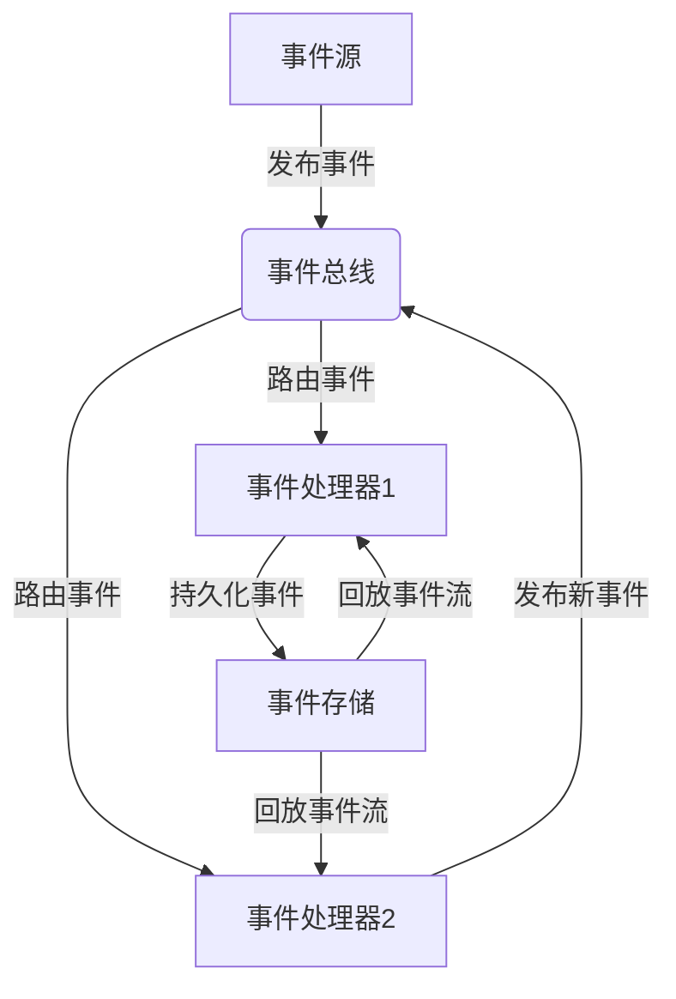

# 事件驱动架构：发布订阅模式的应用与实践

## 1.背景介绍

### 1.1 软件系统复杂性的增长

随着业务需求的不断变化和系统规模的扩大,软件系统变得越来越复杂。传统的单体架构已经无法满足现代分布式系统的需求,如高可用性、可扩展性和灵活性等。因此,事件驱动架构(Event-Driven Architecture, EDA)应运而生,作为解决这些挑战的有效方案之一。

### 1.2 事件驱动架构的概念

事件驱动架构是一种软件架构模式,它将应用程序分解为一组松散耦合的服务或组件。这些服务或组件通过生产、检测、消费和响应事件来相互通信和协作。事件可以是任何重要的状态变化,如数据库更新、用户交互或外部系统的通知等。

### 1.3 发布订阅模式

发布订阅模式(Publish-Subscribe Pattern)是事件驱动架构中的核心模式。在这种模式中,发布者(Publisher)发布事件,而订阅者(Subscriber)则订阅感兴趣的事件。一个中介组件(如消息代理或事件总线)负责将事件从发布者路由到相关的订阅者。这种模式实现了发布者和订阅者之间的解耦,使得它们可以独立演化,从而提高了系统的可维护性和扩展性。

## 2.核心概念与联系

### 2.1 事件(Event)

事件是事件驱动架构的核心概念。它表示系统中发生的一个重要状态变化或者操作。事件通常包含一些元数据,如事件类型、时间戳、payload等,用于描述该事件的详细信息。

### 2.2 事件流(Event Stream)

事件流是一系列有序的事件序列,它描述了系统状态随时间的变化。事件流可以被持久化存储,以支持事件回放、重新处理等场景。

### 2.3 事件源(Event Source)

事件源是产生事件的来源,可以是应用程序、外部系统或设备等。事件源负责将事件发布到事件总线或消息代理中。

### 2.4 事件处理器(Event Processor)

事件处理器是消费和响应事件的组件。它订阅感兴趣的事件,并根据事件执行相应的业务逻辑。事件处理器可以是独立的微服务、函数或其他类型的组件。

### 2.5 事件总线(Event Bus)

事件总线是一种中介基础设施,负责在事件源和事件处理器之间路由事件。它提供了事件的发布、订阅和分发功能。常见的事件总线实现包括Apache Kafka、RabbitMQ等。

## 3.核心算法原理具体操作步骤

发布订阅模式的核心算法原理可以概括为以下几个步骤:

1. **事件发布**

   - 事件源生成事件对象,包含事件类型、时间戳、payload等元数据信息。
   - 事件源将事件发布到事件总线或消息代理。

2. **事件路由**

   - 事件总线或消息代理根据事件类型或其他路由规则,将事件路由到相关的事件处理器。

3. **事件订阅**

   - 事件处理器订阅感兴趣的事件类型。
   - 事件总线或消息代理将匹配的事件分发给相应的事件处理器。

4. **事件消费**

   - 事件处理器接收到事件后,根据事件类型和payload执行相应的业务逻辑。
   - 事件处理器可以选择持久化事件、发布新事件或触发其他操作。

5. **事件持久化(可选)**

   - 为了支持事件回放、重新处理等场景,事件可以被持久化存储,形成事件流。
   - 事件流可以被重新消费,用于数据分析、审计跟踪等目的。

这个过程可以用以下 Mermaid 流程图来描述:



## 4.数学模型和公式详细讲解举例说明

在事件驱动架构中,常常需要对事件流进行处理和分析。这里介绍一些常用的数学模型和公式:

### 4.1 事件流建模

事件流可以被建模为一个无限序列 $E = \{e_1, e_2, e_3, \ldots\}$,其中 $e_i$ 表示第 $i$ 个事件。每个事件 $e_i$ 都包含一个时间戳 $t_i$,因此事件流可以表示为一个时间序列:

$$E = \{(e_1, t_1), (e_2, t_2), (e_3, t_3), \ldots\}$$

### 4.2 窗口操作

对于无限的事件流,我们通常需要在一个有限的时间窗口内进行处理和分析。常见的窗口操作包括:

1. **滚动窗口(Tumbling Window)**: 将事件流划分为不重叠的固定大小窗口。

   $$W_i = \{e_j | (i-1)w < t_j \le iw\}$$

   其中 $W_i$ 表示第 $i$ 个窗口, $w$ 是窗口大小。

2. **滑动窗口(Sliding Window)**: 将事件流划分为重叠的固定大小窗口。

   $$W_i = \{e_j | (i-1)s < t_j \le (i-1)s + w\}$$

   其中 $W_i$ 表示第 $i$ 个窗口, $w$ 是窗口大小, $s$ 是滑动步长。

3. **会话窗口(Session Window)**: 根据事件之间的时间间隔将事件流划分为会话窗口。

   $$W_i = \{e_j | t_j - t_{j-1} \le g\}$$

   其中 $W_i$ 表示第 $i$ 个会话窗口, $g$ 是会话间隔阈值。

### 4.3 窗口函数

在窗口内,我们可以应用各种函数来处理和分析事件流,例如:

1. **计数(Count)**: 计算窗口内事件的数量。

   $$\text{count}(W_i) = |W_i|$$

2. **求和(Sum)**: 计算窗口内事件的某个数值属性之和。

   $$\text{sum}(W_i, x) = \sum_{e_j \in W_i} x(e_j)$$

   其中 $x(e_j)$ 表示事件 $e_j$ 的某个数值属性。

3. **平均值(Average)**: 计算窗口内事件的某个数值属性的平均值。

   $$\text{avg}(W_i, x) = \frac{1}{|W_i|} \sum_{e_j \in W_i} x(e_j)$$

这些窗口操作和函数在事件流处理中非常有用,可以用于各种场景,如监控、报警、实时分析等。

## 5.项目实践:代码实例和详细解释说明

为了更好地理解事件驱动架构和发布订阅模式,我们来看一个使用 Python 和 RabbitMQ 的实践案例。

### 5.1 安装依赖

首先,我们需要安装 `pika` 库,它是 Python 中的 RabbitMQ 客户端。

```bash
pip install pika
```

### 5.2 发布者代码

下面是一个简单的发布者示例,它每隔 1 秒向 RabbitMQ 发送一条消息。

```python
import pika
import time

# 连接到 RabbitMQ 服务器
connection = pika.BlockingConnection(pika.ConnectionParameters('localhost'))
channel = connection.channel()

# 声明一个队列
channel.queue_declare(queue='hello')

# 发送消息
counter = 0
while True:
    message = f'Hello World! {counter}'
    channel.basic_publish(exchange='',
                          routing_key='hello',
                          body=message)
    print(f'[x] Sent {message}')
    counter += 1
    time.sleep(1)

# 关闭连接
connection.close()
```

解释:

1. 首先,我们连接到本地的 RabbitMQ 服务器,并获取一个通道对象 `channel`。
2. 使用 `channel.queue_declare` 声明一个名为 `hello` 的队列。
3. 在无限循环中,我们构造一条消息,并使用 `channel.basic_publish` 将消息发送到 `hello` 队列。
4. 最后,关闭连接。

### 5.3 订阅者代码

下面是一个简单的订阅者示例,它从 RabbitMQ 接收消息并打印出来。

```python
import pika

# 连接到 RabbitMQ 服务器
connection = pika.BlockingConnection(pika.ConnectionParameters('localhost'))
channel = connection.channel()

# 声明一个队列
channel.queue_declare(queue='hello')

# 定义回调函数
def callback(ch, method, properties, body):
    print(f'[x] Received {body.decode()}')

# 开始消费
channel.basic_consume(queue='hello',
                      auto_ack=True,
                      on_message_callback=callback)

print(' [*] Waiting for messages. To exit press CTRL+C')
channel.start_consuming()
```

解释:

1. 首先,我们连接到本地的 RabbitMQ 服务器,并获取一个通道对象 `channel`。
2. 使用 `channel.queue_declare` 声明一个名为 `hello` 的队列。
3. 定义一个回调函数 `callback`,它将在收到消息时被调用。
4. 使用 `channel.basic_consume` 开始从 `hello` 队列消费消息,并指定回调函数。
5. 最后,调用 `channel.start_consuming` 开始消费消息,直到手动中断。

运行发布者和订阅者,你将看到发布者每秒发送一条消息,而订阅者接收并打印出这些消息。

## 6.实际应用场景

事件驱动架构和发布订阅模式在许多领域都有广泛的应用,包括但不限于:

### 6.1 微服务架构

在微服务架构中,各个微服务通过发布和订阅事件来进行通信和协作。这种松散耦合的方式提高了系统的可维护性和扩展性。

### 6.2 物联网(IoT)

在物联网系统中,各种传感器和设备会产生大量的事件数据。事件驱动架构可以有效地收集、处理和响应这些事件,实现实时监控、预测维护等功能。

### 6.3 实时数据处理

事件驱动架构非常适合实时数据处理场景,如股票交易、网络流量分析等。事件流可以被实时处理和分析,以支持快速决策和响应。

### 6.4 业务流程管理(BPM)

在业务流程管理系统中,各种业务活动和状态变化可以被建模为事件。事件驱动架构可以用于协调和监控复杂的业务流程。

### 6.5 电子商务

在电子商务系统中,用户行为、订单状态变化等都可以被视为事件。事件驱动架构可以用于实现实时推荐、库存管理等功能。

## 7.工具和资源推荐

### 7.1 消息队列和事件流平台

- Apache Kafka: 一个分布式流处理平台,被广泛用于构建事件驱动架构。
- RabbitMQ: 一个流行的开源消息代理,支持多种消息传递协议。
- Apache Pulsar: 一个云原生的流处理平台,具有高度的可扩展性和容错性。
- AWS Kinesis: Amazon Web Services 提供的流处理服务。
- Google Cloud Dataflow: Google Cloud 的流处理和批处理服务。

### 7.2 流处理框架

- Apache Flink: 一个分布式流处理框架,支持有状态计算和高吞吐量。
- Apache Spark Streaming: Spark 的流处理模块,支持微批处理和有状态计算。
- Apache Samza: 一个分布式流处理框架,专注于无状态实时处理。
- Apache Storm: 一个分布式实时计算系统,适用于处理大量实时事件流。

### 7.3 事件源和事件处理器框架

- Akka: 一个基于Actor模型的事件驱动应用程序框架,支持多种编程语言。
- Axon: 一个基于事件源的应用程序开发框架,专注于领域驱动设计。
- Eventuate: 一{"msg_type":"generate_answer_finish","data":"","from_module":null,"from_unit":null}