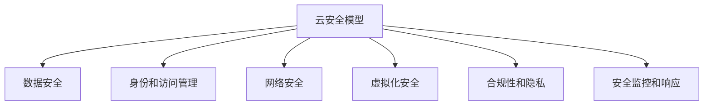
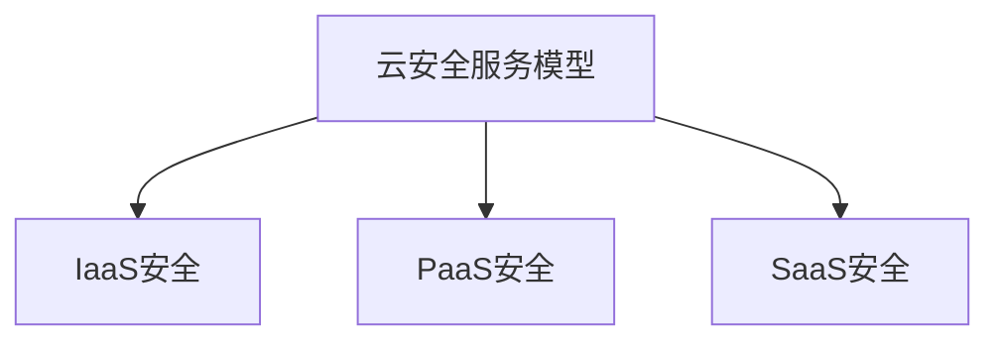
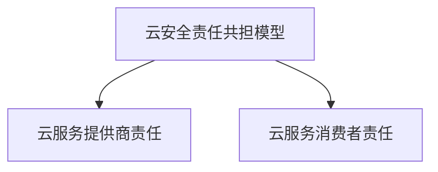
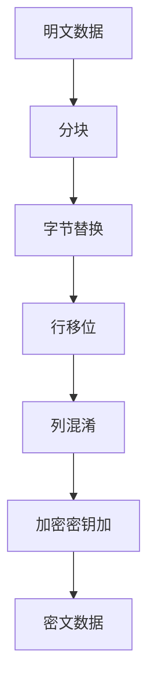
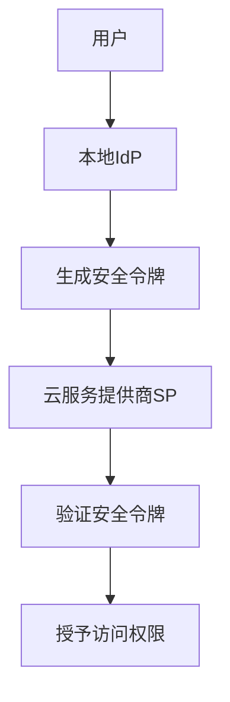
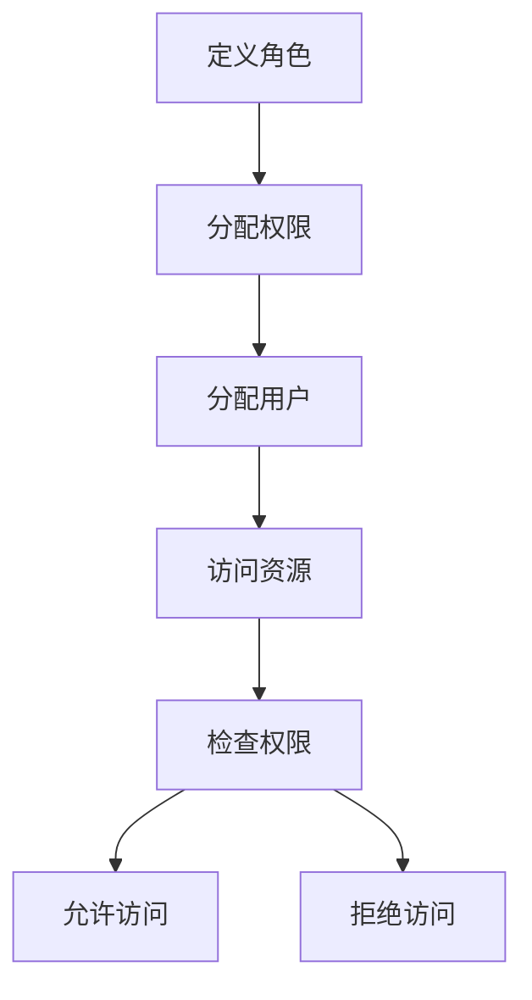
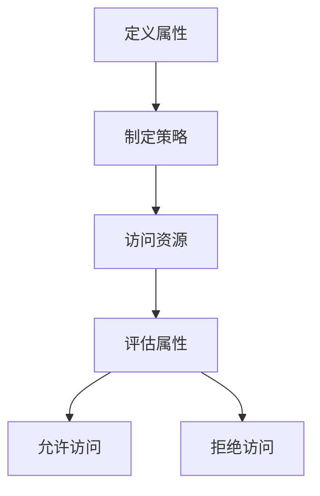
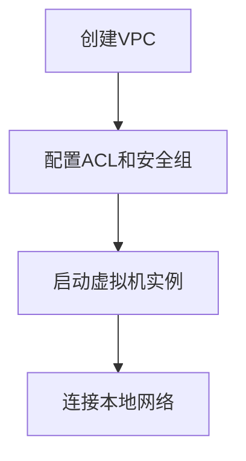
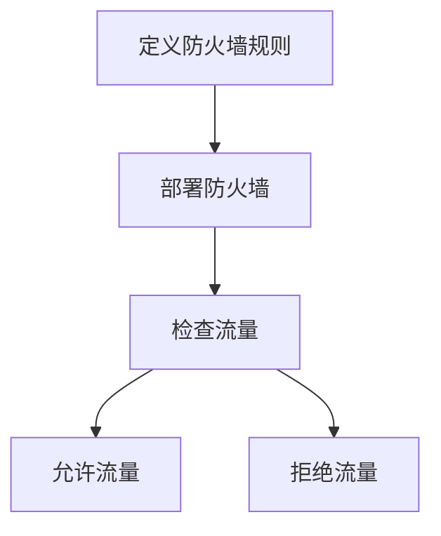

# 云安全：构建安全可靠的云环境

## 1.背景介绍

### 1.1 云计算的兴起

近年来，云计算作为一种新兴的计算模式，正在改变着传统的IT基础设施和服务交付方式。云计算通过提供按需使用、快速部署、资源共享和弹性扩展等优势,为企业带来了前所未有的灵活性和成本节约。越来越多的企业和组织开始将其核心业务系统和数据迁移到云端,以获取云计算带来的诸多好处。

### 1.2 云安全的重要性

然而,随着云计算的广泛应用,安全问题也日益凸显。由于云环境的开放性和共享性,传统的安全防护措施并不能完全适用于云计算场景。云安全成为了确保云计算可靠性和可信度的关键因素。数据泄露、系统入侵、服务中断等安全威胁不仅会给企业带来巨大的经济损失,还可能造成不可挽回的声誉损害。因此,构建安全可靠的云环境对于企业来说至关重要。

### 1.3 云安全挑战

云安全面临着诸多挑战,包括数据保护、身份认证和访问控制、虚拟化安全、合规性和隐私等。这些挑战需要通过全面的安全策略、先进的技术手段和完善的管理机制来加以解决。只有这样,企业才能真正享受到云计算带来的便利,同时确保数据和系统的安全性。

## 2.核心概念与联系

### 2.1 云安全模型

为了有效地管理和保护云环境中的资源,需要建立一个全面的云安全模型。这个模型应该包括以下几个核心概念:

1. **数据安全**:保护云端存储和传输的数据免受未经授权的访问、修改或破坏。
2. **身份和访问管理(IAM)**:确保只有经过身份验证和授权的用户和实体才能访问云资源。
3. **网络安全**:保护云环境中的网络基础设施,防止未经授权的访问和攻击。
4. **虚拟化安全**:确保虚拟化技术的安全性,防止虚拟机之间的资源泄露和攻击。
5. **合规性和隐私**:确保云环境符合相关的法律法规和隐私保护要求。
6. **安全监控和响应**:持续监控云环境中的安全事件,并及时采取响应措施。

这些概念相互关联,共同构成了一个完整的云安全解决方案。



### 2.2 云安全服务模型

根据服务模型的不同,云安全也可以分为以下几个层面:

1. **基础设施即服务(IaaS)安全**:保护云基础设施,如计算、存储和网络资源的安全。
2. **平台即服务(PaaS)安全**:保护云平台及其上运行的应用程序和服务的安全。
3. **软件即服务(SaaS)安全**:保护云端交付的软件应用程序和数据的安全。

不同的服务模型面临着不同的安全挑战,需要采取相应的安全措施。



### 2.3 云安全责任共担模型

在云环境中,安全责任通常由云服务提供商和云服务消费者共同承担。这种共担模型被称为"共享责任模型"。

1. **云服务提供商的责任**:确保云基础设施和平台的安全性,包括物理安全、虚拟化安全、网络安全等。
2. **云服务消费者的责任**:确保在云上运行的应用程序、数据和操作系统的安全性,包括身份和访问管理、数据加密、合规性等。

只有双方通力合作,共同承担责任,才能构建一个真正安全可靠的云环境。



## 3.核心算法原理具体操作步骤

### 3.1 数据加密

数据加密是保护云端数据安全的关键手段之一。常用的数据加密算法包括对称加密算法(如AES、DES)和非对称加密算法(如RSA、ECC)。

#### 3.1.1 对称加密算法

对称加密算法使用相同的密钥进行加密和解密。其优点是运算速度快,适合大量数据的加密,但密钥管理和分发是一个挑战。

以AES(Advanced Encryption Standard)算法为例,其具体操作步骤如下:

1. 生成128位、192位或256位的密钥。
2. 将明文数据分成固定长度的块(128位)。
3. 对每个数据块执行多轮的字节替换、行移位、列混淆和加密密钥加操作。
4. 最后一轮只执行字节替换、行移位和加密密钥加操作。
5. 得到密文数据块。



#### 3.1.2 非对称加密算法

非对称加密算法使用一对公钥和私钥,公钥用于加密,私钥用于解密。其优点是密钥管理相对简单,但运算速度较慢,通常用于小数据量的加密或密钥交换。

以RSA算法为例,其具体操作步骤如下:

1. 选择两个大质数p和q,计算n=p*q。
2. 计算欧拉函数φ(n)=(p-1)*(q-1)。
3. 选择一个与φ(n)互质的整数e,作为公钥指数。
4. 计算d,使得(d*e)%φ(n)=1,d作为私钥指数。
5. 公钥为(e,n),私钥为(d,n)。
6. 加密:将明文m转换为代表整数的字符c,计算密文c=m^e%n。
7. 解密:计算明文m=c^d%n。

```mermaid
graph TD
    A[选择质数p和q] --> B[计算n和φ(n)]
    B --> C[选择e]
    C --> D[计算d]
    D --> E[生成公钥和私钥]
    E --> F[加密]
    F --> G[密文]
    G --> H[解密]
    H --> I[明文]
```

### 3.2 身份和访问管理

身份和访问管理(IAM)是确保只有经过身份验证和授权的用户和实体才能访问云资源的关键机制。常用的IAM技术包括身份federation、基于角色的访问控制(RBAC)和基于属性的访问控制(ABAC)等。

#### 3.2.1 身份federation

身份federation允许用户使用本地身份凭证访问云资源,而无需在云端维护单独的身份账户。它通过建立信任关系,将本地身份映射到云端身份,实现单点登录(SSO)和身份管理的集中化。

具体操作步骤如下:

1. 用户向本地身份提供商(IdP)进行身份验证。
2. IdP生成安全令牌(如SAML断言),包含用户身份信息。
3. 用户将安全令牌发送给云服务提供商(SP)。
4. SP验证安全令牌的有效性和完整性。
5. 如果验证通过,SP将授予用户对应的访问权限。



#### 3.2.2 基于角色的访问控制(RBAC)

RBAC通过将用户与角色相关联,并将角色与权限相关联,来控制对资源的访问。它简化了权限管理,并提高了安全性和灵活性。

具体操作步骤如下:

1. 定义角色,并为每个角色分配适当的权限。
2. 将用户分配给一个或多个角色。
3. 当用户尝试访问资源时,系统会检查用户所属的角色是否具有相应的权限。
4. 如果有权限,则允许访问;否则,拒绝访问。



#### 3.2.3 基于属性的访问控制(ABAC)

ABAC根据用户、资源和环境属性来决定是否授予访问权限。它比RBAC更加灵活和细粒度,能够满足更复杂的访问控制需求。

具体操作步骤如下:

1. 定义用户属性(如部门、职位等)、资源属性(如敏感级别、位置等)和环境属性(如时间、IP地址等)。
2. 制定访问控制策略,规定在满足特定属性条件时允许或拒绝访问。
3. 当用户尝试访问资源时,系统会评估用户、资源和环境属性是否满足策略条件。
4. 如果满足,则允许访问;否则,拒绝访问。



### 3.3 网络安全

网络安全是保护云环境中网络基础设施免受未经授权的访问和攻击的关键。常用的网络安全技术包括虚拟私有云(VPC)、防火墙、入侵检测和预防系统(IDS/IPS)等。

#### 3.3.1 虚拟私有云(VPC)

VPC是在云服务提供商的基础设施上构建的逻辑隔离的私有网络环境。它提供了类似于传统数据中心的网络控制和安全性,同时具有云计算的灵活性和可扩展性。

具体操作步骤如下:

1. 在云平台上创建VPC,定义IP地址范围和子网。
2. 配置网络访问控制列表(ACL)和安全组,控制进出VPC的流量。
3. 启动虚拟机实例,并将其连接到VPC的子网。
4. 根据需要,可以通过VPN或直接连接将VPC与本地数据中心网络连接。



#### 3.3.2 防火墙

防火墙是网络安全的重要防线,用于监控和控制进出网络的流量。在云环境中,可以使用虚拟防火墙或基于主机的防火墙来保护云资源。

具体操作步骤如下:

1. 定义防火墙规则,指定允许或拒绝哪些流量。
2. 将防火墙部署在网络边界或主机上。
3. 所有进出流量都需要通过防火墙进行检查和过滤。
4. 根据规则,允许或拒绝特定的流量。



#### 3.3.3 入侵检测和预防系统(IDS/IPS)

IDS/IPS是用于检测和防御网络攻击的安全系统。IDS主要用于监控和报告可疑活动,而IPS则能够主动阻止检测到的攻击。

具体操作步骤如下:

1. 部署IDS/IPS设备或软件,监控网络流量。
2. 定义攻击签名和规则,用于识别已知的攻击模式。
3. IDS/IPS分析网络流量,并与已知攻击模式进行匹配。
4. 如果检测到{"msg_type":"generate_answer_finish","data":"","from_module":null,"from_unit":null}