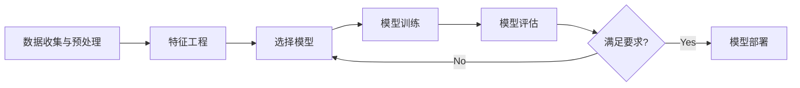
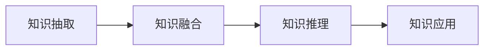

# 人工智能 原理与代码实例讲解

## 1. 背景介绍
### 1.1 人工智能的定义与发展历程
#### 1.1.1 人工智能的定义
人工智能(Artificial Intelligence, AI)是研究、开发用于模拟、延伸和扩展人的智能的理论、方法、技术及应用系统的一门新的技术科学。它企图了解智能的实质，并生产出一种新的能以人类智能相似的方式做出反应的智能机器，该领域的研究包括机器人、语言识别、图像识别、自然语言处理和专家系统等。

#### 1.1.2 人工智能的发展历程
人工智能作为一门学科，起源于20世纪50年代。1956年，在达特茅斯学院召开的一次会议上，"人工智能"这一名词被正式提出。此后，人工智能经历了从繁荣到低谷再到复兴的几个阶段：

- 1956年-20世纪60年代中期：人工智能的形成时期
- 20世纪60年代中期-70年代中期：人工智能的繁荣时期  
- 20世纪70年代中期-80年代中期：人工智能的低谷时期
- 20世纪80年代中期至今：人工智能的复兴和发展时期

近年来，随着大数据、云计算、深度学习等技术的发展，人工智能进入了一个新的黄金时期。

### 1.2 人工智能的主要分支
人工智能主要包括以下几个分支：

- 机器学习：使计算机系统具有自主学习和改进性能的能力，是实现人工智能的核心方法。
- 计算机视觉：使计算机具备类似人眼的图像识别和理解能力，如目标检测、人脸识别等。
- 自然语言处理：让计算机理解、生成和处理人类语言，如语音识别、机器翻译等。  
- 知识表示与推理：将人类知识转化为计算机可以处理的形式，并进行推理和决策。
- 机器人学：研究机器人的感知、规划、控制等，使其具备自主行动的能力。

### 1.3 人工智能的应用领域
人工智能已广泛应用于各行各业，主要包括：

- 智能制造：工业机器人、智能排产、预测性维护等
- 智慧医疗：医学影像分析、辅助诊断、药物研发等  
- 智能金融：风控模型、量化交易、反欺诈等
- 智慧城市：智能交通、智慧安防、智慧能源等
- 智能教育：智能助教、个性化学习、教育评估等

未来，人工智能将进一步渗透到社会生活的方方面面。

## 2. 核心概念与联系
### 2.1 机器学习
#### 2.1.1 机器学习的定义
机器学习是人工智能的核心，它是使计算机系统具有自主学习和改进性能的能力，无需明确编程。通过学习数据中的模式，机器可以对未知数据做出预测。

#### 2.1.2 机器学习的分类
机器学习主要分为以下三类：

- 监督学习：从标注数据中学习，如分类和回归任务。
- 无监督学习：从无标注数据中学习，如聚类和降维。  
- 强化学习：通过与环境的交互来学习，如AlphaGo。

#### 2.1.3 机器学习的基本流程
机器学习的基本流程如下：

### 2.2 深度学习
#### 2.2.1 深度学习的定义 
深度学习是机器学习的一个分支，它模仿人脑的结构和功能，使用类似神经网络的多层结构，从大量数据中自动学习多层次的特征表示。

#### 2.2.2 深度学习的主要模型
深度学习的主要模型包括：

- 卷积神经网络(CNN)：主要用于图像识别等场景
- 循环神经网络(RNN)：主要用于序列数据如自然语言处理
- 生成对抗网络(GAN)：用于生成逼真的图像、视频等

#### 2.2.3 深度学习的优势
与传统机器学习相比，深度学习具有以下优势：

- 自动学习特征表示，减少了特征工程
- 性能更优，在图像、语音等领域取得了突破性进展
- 可以处理非结构化数据如图像、文本等

### 2.3 知识图谱
#### 2.3.1 知识图谱的定义
知识图谱是将现实世界的实体、概念及其关系，以结构化的形式表示出来，形成互联的知识网络。它是知识表示与推理的重要工具。

#### 2.3.2 知识图谱的构建流程
知识图谱的构建流程如下：

- 知识抽取：从非结构化数据中抽取实体、关系等
- 知识融合：消歧、链接等，构建知识库
- 知识推理：利用知识库进行推理、问答等
- 知识应用：将知识服务于下游任务

#### 2.3.3 知识图谱的应用
知识图谱在以下场景有广泛应用：

- 智能搜索与问答：理解用户意图，提供精准信息
- 个性化推荐：根据用户画像，推荐内容、商品等
- 金融风控：构建企业、个人知识图谱，评估风险

### 2.4 自然语言处理
#### 2.4.1 自然语言处理的定义
自然语言处理(Natural Language Processing, NLP)是人工智能的一个重要分支，旨在让计算机理解、生成和处理人类语言。它包括语音识别、自然语言理解、机器翻译等任务。

#### 2.4.2 自然语言处理的关键技术
自然语言处理的关键技术包括：

- 分词与词性标注：将文本划分为词，并标注词性
- 句法分析：分析句子的语法结构
- 语义分析：理解语句的意思，如情感分析、文本分类等
- 文本生成：自动生成文本，如对话生成、摘要生成等

#### 2.4.3 预训练语言模型
近年来，预训练语言模型如BERT、GPT等取得了巨大成功。它们通过自监督学习，在大规模无标注语料上预训练，再用少量标注数据微调，可以在多个NLP任务上取得很好的效果。预训练语言模型极大地推动了NLP的发展。

### 2.5 计算机视觉
#### 2.5.1 计算机视觉的定义
计算机视觉(Computer Vision, CV)是人工智能的另一个重要分支，它使计算机具备类似人眼的图像识别和理解能力。计算机视觉的任务包括图像分类、目标检测、语义分割等。

#### 2.5.2 计算机视觉的关键技术
计算机视觉的关键技术包括：

- 图像分类：判断图像所属的类别，如猫、狗等
- 目标检测：检测图像中的目标及其位置，如行人、车辆等
- 语义分割：对图像的每个像素进行分类，标注出属于不同物体的区域
- 人脸识别：检测和识别图像中的人脸

#### 2.5.3 卷积神经网络
卷积神经网络(Convolutional Neural Network, CNN)是计算机视觉的主力模型。它通过卷积、池化等操作，提取图像的层次化特征，再进行分类、检测等任务。一些经典的CNN模型如AlexNet、VGGNet、ResNet等，极大地推动了计算机视觉的发展。

## 3. 核心算法原理具体操作步骤
本节将详细介绍几个人工智能的核心算法，包括它们的原理和具体操作步骤。

### 3.1 反向传播算法
反向传播(Backpropagation)是训练神经网络的核心算法，它通过梯度下降来更新网络的参数，使网络的预测结果与真实值尽可能接近。

反向传播的具体步骤如下：

1. 前向传播：输入数据，计算每一层的输出，直到得到输出层的预测结果。
2. 计算损失：比较预测结果与真实值，计算损失函数。
3. 反向传播：从输出层开始，反向计算每一层的梯度，直到输入层。
   - 计算输出层的梯度：$\frac{\partial Loss}{\partial z^{(L)}}=\frac{\partial Loss}{\partial a^{(L)}}\cdot\frac{\partial a^{(L)}}{\partial z^{(L)}}$
   - 计算隐藏层的梯度：$\frac{\partial Loss}{\partial z^{(l)}}=\frac{\partial Loss}{\partial z^{(l+1)}}\cdot\frac{\partial z^{(l+1)}}{\partial a^{(l)}}\cdot\frac{\partial a^{(l)}}{\partial z^{(l)}}$
4. 更新参数：根据梯度下降公式更新每一层的参数。
   - 权重更新：$w^{(l)}:=w^{(l)}-\alpha\frac{\partial Loss}{\partial w^{(l)}}$
   - 偏置更新：$b^{(l)}:=b^{(l)}-\alpha\frac{\partial Loss}{\partial b^{(l)}}$
5. 重复步骤1-4，直到网络收敛或达到预设的迭代次数。

其中，$z^{(l)}$表示第$l$层的加权输入，$a^{(l)}$表示第$l$层的激活值，$\alpha$表示学习率。

### 3.2 卷积神经网络
卷积神经网络(CNN)常用于图像识别任务，它通过卷积、池化等操作提取图像特征。

CNN的具体步骤如下：

1. 卷积层：对输入图像进行卷积操作，提取局部特征。
   - 卷积操作：$z^{(l)}=a^{(l-1)}*W^{(l)}+b^{(l)}$
   - 激活函数：$a^{(l)}=\sigma(z^{(l)})$
2. 池化层：对卷积层的输出进行下采样，减小特征图的尺寸。
   - 最大池化：$a^{(l)}=\max\limits_{i,j\in R}a^{(l-1)}_{i,j}$
   - 平均池化：$a^{(l)}=\frac{1}{|R|}\sum\limits_{i,j\in R}a^{(l-1)}_{i,j}$
3. 全连接层：将池化层的输出拉平，送入全连接层进行分类。
   - 矩阵乘法：$z^{(l)}=W^{(l)}a^{(l-1)}+b^{(l)}$
   - 激活函数：$a^{(l)}=\sigma(z^{(l)})$
4. 输出层：通过softmax函数将全连接层的输出转化为概率分布。
   - Softmax函数：$a_i^{(L)}=\frac{e^{z_i^{(L)}}}{\sum_je^{z_j^{(L)}}}$

其中，$*$表示卷积操作，$R$表示池化窗口，$\sigma$表示激活函数如ReLU。

### 3.3 循环神经网络
循环神经网络(RNN)常用于处理序列数据如自然语言，它可以处理任意长度的序列，具有记忆能力。

RNN的具体步骤如下：

1. 输入层：将输入序列$\{x^{(1)},\cdots,x^{(T)}\}$逐个送入RNN。
2. 隐藏层：根据当前输入和上一时刻的隐藏状态，更新当前时刻的隐藏状态。
   - 更新公式：$h^{(t)}=\sigma(W_{hh}h^{(t-1)}+W_{xh}x^{(t)}+b_h)$
3. 输出层：根据当前的隐藏状态，计算当前时刻的输出。
   - 计算公式：$o^{(t)}=W_{ho}h^{(t)}+b_o$
4. 重复步骤1-3，直到处理完整个序列。

其中，$h^{(t)}$表示第$t$个时刻的隐藏状态，$x^{(t