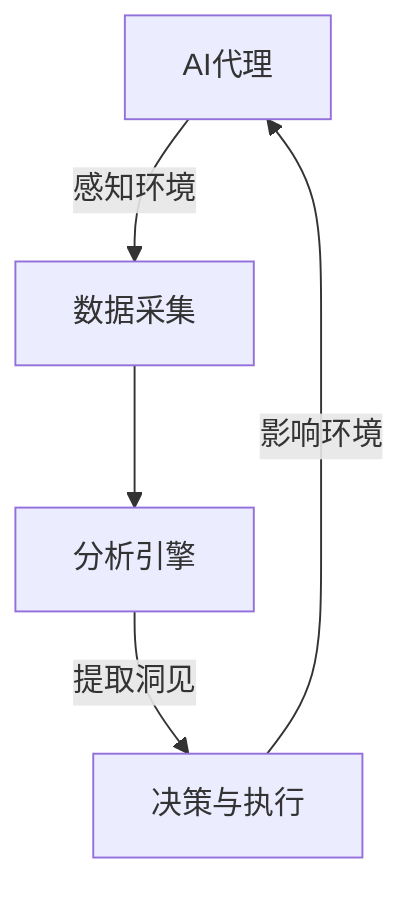

# 从数据到洞察：AI代理工作流中的分析引擎

## 1. 背景介绍

### 1.1 数据时代的到来

在当今时代，数据已经成为了推动科技创新和商业发展的关键驱动力。无论是互联网公司、制造业企业还是政府机构,都在产生和收集大量的数据。这些数据蕴含着宝贵的洞见和价值,但要从海量的原始数据中提取有价值的信息并非易事。

### 1.2 人工智能(AI)的崛起

随着计算能力的不断提高和算法的快速发展,人工智能技术逐渐成熟并广泛应用于各个领域。AI系统能够从大量数据中发现隐藏的模式和关联,从而为决策提供有力支持。

### 1.3 AI代理工作流的需求

在实际应用中,AI系统往往需要与其他系统和人类用户进行交互,形成一个完整的工作流程。其中,分析引擎作为关键环节,负责对数据进行处理和分析,为AI代理提供所需的洞见和建议。

## 2. 核心概念与联系

### 2.1 AI代理

AI代理是指能够感知环境、作出决策并采取行动的智能系统。它可以是一个软件程序、机器人或其他具有一定自主性的实体。AI代理通常需要与人类用户或其他系统进行交互,以完成特定的任务。

### 2.2 工作流

工作流是指为了完成某项任务而设计的一系列有序活动。在AI代理的应用场景中,工作流通常涉及多个步骤,如数据采集、处理、分析、决策和执行等。

### 2.3 分析引擎

分析引擎是AI代理工作流中的关键组件,负责对收集到的数据进行处理和分析,提取有价值的信息和洞见。它通常包括数据预处理、特征提取、模型构建和模型评估等步骤。



上图展示了AI代理、工作流和分析引擎之间的关系。AI代理通过感知环境采集数据,分析引擎对数据进行处理和分析,提取有价值的洞见,然后AI代理基于这些洞见作出决策并执行相应的行动,进而影响环境。

## 3. 核心算法原理具体操作步骤

分析引擎的核心算法原理包括以下几个主要步骤:

### 3.1 数据预处理

- 数据清洗:处理缺失值、异常值和重复数据等问题。
- 数据转换:对数据进行规范化、标准化或其他转换,以满足模型的输入要求。
- 数据集成:从多个异构数据源合并数据,构建统一的数据视图。

### 3.2 特征工程

- 特征提取:从原始数据中提取有意义的特征,这些特征对于模型的训练和预测至关重要。
- 特征选择:从提取的特征中选择最相关的一部分,以提高模型的性能和效率。
- 特征构造:基于现有特征构造新的特征,以捕捉更复杂的模式和关系。

### 3.3 模型构建

- 算法选择:根据问题的性质和数据的特点,选择合适的机器学习算法,如回归、分类、聚类等。
- 模型训练:使用训练数据集训练选定的机器学习模型,优化模型参数。
- 模型评估:在测试数据集上评估模型的性能,通过各种指标(如准确率、精确率、召回率等)判断模型的好坏。

### 3.4 模型优化

- 超参数调优:通过网格搜索、随机搜索等方法,寻找最优的超参数组合,提高模型性能。
- 模型集成:将多个基础模型结合起来,形成更强大的集成模型,提高预测的准确性和鲁棒性。
- 在线学习:在模型部署后,持续地从新的数据中学习,不断优化和更新模型。

## 4. 数学模型和公式详细讲解举例说明

在分析引擎中,常见的数学模型和公式包括:

### 4.1 线性回归

线性回归是一种常用的监督学习算法,用于预测连续型目标变量。它的数学模型可以表示为:

$$y = \theta_0 + \theta_1x_1 + \theta_2x_2 + ... + \theta_nx_n$$

其中,$y$是目标变量,$x_i$是特征变量,$\theta_i$是模型参数。模型的目标是找到最优的参数$\theta$,使得预测值$\hat{y}$与实际值$y$之间的差异最小化。

通常使用最小二乘法来估计参数$\theta$,其目标函数为:

$$J(\theta) = \frac{1}{2m}\sum_{i=1}^m(h_\theta(x^{(i)}) - y^{(i)})^2$$

其中,$m$是训练样本数量,$h_\theta(x^{(i)})$是对第$i$个样本的预测值。

### 4.2 逻辑回归

逻辑回归是一种用于分类问题的算法,它将输入映射到0到1之间的概率值,表示样本属于某个类别的可能性。

对于二分类问题,逻辑回归模型可以表示为:

$$h_\theta(x) = \frac{1}{1 + e^{-\theta^Tx}}$$

其中,$\theta$是模型参数向量,$x$是特征向量。

模型的目标是找到最优的参数$\theta$,使得训练数据的对数似然函数最大化:

$$J(\theta) = \frac{1}{m}\sum_{i=1}^m\left[y^{(i)}\log(h_\theta(x^{(i)})) + (1 - y^{(i)})\log(1 - h_\theta(x^{(i)}))\right]$$

这里,$m$是训练样本数量,$y^{(i)}$是第$i$个样本的真实标签(0或1)。

### 4.3 决策树

决策树是一种常用的监督学习算法,可以用于分类和回归问题。它通过递归地构建决策规则,将特征空间划分为若干个区域,每个区域对应一个预测值。

决策树的构建过程可以用信息增益或基尼系数等指标来评估每个特征的重要性,选择最优特征进行分裂。具体来说,对于一个节点$t$,其信息增益可以定义为:

$$\text{Gain}(t) = \text{Entropy}(t) - \sum_{i=1}^n\frac{|t_i|}{|t|}\text{Entropy}(t_i)$$

其中,$\text{Entropy}(t)$表示节点$t$的熵值,$t_i$是基于某个特征对$t$进行分裂得到的子节点,$\frac{|t_i|}{|t|}$是该子节点占$t$的比例。

通过递归地选择最大化信息增益的特征进行分裂,直到满足停止条件(如最大深度、最小样本数等),从而构建出完整的决策树模型。

## 5. 项目实践:代码实例和详细解释说明

为了更好地理解分析引擎的工作原理,我们将通过一个实际项目案例来进行说明。假设我们需要构建一个推荐系统,根据用户的历史浏览记录和购买行为,预测用户对某个商品的购买意向。

### 5.1 数据预处理

```python
import pandas as pd

# 加载数据
data = pd.read_csv('user_data.csv')

# 处理缺失值
data = data.dropna()

# 对类别特征进行编码
from sklearn.preprocessing import LabelEncoder
le = LabelEncoder()
data['gender'] = le.fit_transform(data['gender'])

# 划分训练集和测试集
from sklearn.model_selection import train_test_split
X = data.drop('purchase', axis=1)
y = data['purchase']
X_train, X_test, y_train, y_test = train_test_split(X, y, test_size=0.2, random_state=42)
```

在这个例子中,我们首先加载了一个包含用户浏览记录和购买行为的数据集。然后,我们处理了缺失值,并对类别特征(如性别)进行了编码。最后,我们将数据集划分为训练集和测试集,以便后续的模型训练和评估。

### 5.2 特征工程

```python
from sklearn.feature_extraction.text import TfidfVectorizer

# 对商品描述进行特征提取
tfidf = TfidfVectorizer()
X_train_tfidf = tfidf.fit_transform(X_train['product_desc'])
X_test_tfidf = tfidf.transform(X_test['product_desc'])

# 合并其他特征
X_train_combined = pd.concat([X_train.drop('product_desc', axis=1), pd.DataFrame(X_train_tfidf.toarray())], axis=1)
X_test_combined = pd.concat([X_test.drop('product_desc', axis=1), pd.DataFrame(X_test_tfidf.toarray())], axis=1)
```

在这个步骤中,我们对商品描述进行了特征提取,使用TF-IDF方法将文本数据转换为向量表示。然后,我们将提取的文本特征与其他数值特征(如用户年龄、浏览时长等)合并,构建出完整的特征矩阵。

### 5.3 模型构建和评估

```python
from sklearn.linear_model import LogisticRegression
from sklearn.metrics import accuracy_score, precision_score, recall_score, f1_score

# 构建逻辑回归模型
model = LogisticRegression()
model.fit(X_train_combined, y_train)

# 在测试集上评估模型
y_pred = model.predict(X_test_combined)
accuracy = accuracy_score(y_test, y_pred)
precision = precision_score(y_test, y_pred)
recall = recall_score(y_test, y_pred)
f1 = f1_score(y_test, y_pred)

print(f'Accuracy: {accuracy:.4f}')
print(f'Precision: {precision:.4f}')
print(f'Recall: {recall:.4f}')
print(f'F1-score: {f1:.4f}')
```

在这个例子中,我们构建了一个逻辑回归模型,并使用训练数据集对模型进行了训练。然后,我们在测试数据集上评估了模型的性能,计算了准确率、精确率、召回率和F1分数等指标。

根据评估结果,我们可以进一步优化模型,如调整超参数、尝试其他算法或集成多个模型等。

## 6. 实际应用场景

分析引擎在各个领域都有广泛的应用场景,包括但不限于:

### 6.1 推荐系统

推荐系统是分析引擎的典型应用之一。通过分析用户的历史行为数据,推荐系统可以预测用户的偏好,并推荐感兴趣的商品、内容或服务。这种系统广泛应用于电子商务、在线视频、音乐流媒体等领域。

### 6.2 金融风险管理

在金融领域,分析引擎可以用于评估贷款申请人的信用风险、检测欺诈行为、预测市场趋势等。通过建立精准的风险模型,金融机构能够做出更明智的决策,降低潜在损失。

### 6.3 预测性维护

在制造业和设备运维领域,分析引擎可以利用传感器数据和历史故障记录,预测设备的故障概率和剩余使用寿命。这种预测性维护策略有助于提高设备的可靠性,降低维护成本。

### 6.4 医疗诊断

在医疗领域,分析引擎可以通过分析患者的症状、检查结果和病史数据,辅助医生进行疾病诊断和治疗方案制定。这种智能辅助系统有望提高诊断的准确性,降低医疗风险。

### 6.5 其他应用

除了上述场景外,分析引擎还可以应用于网络安全、交通管理、环境监测等多个领域,发挥着越来越重要的作用。

## 7. 工具和资源推荐

在构建和优化分析引擎时,可以利用以下工具和资源:

### 7.1 Python生态系统

Python是数据科学和机器学习领域的主流编程语言,拥有丰富的库和工具。常用的库包括NumPy、Pandas、Scikit-learn、TensorFlow、Keras等。

### 7.2 可视化工具

数据可视化对于理解数据和模型至关重要。常用的可视化工具包括Matplotlib、Seaborn