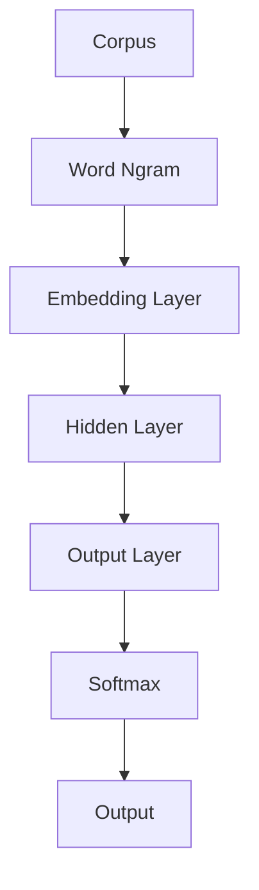

# 从零开始大模型开发与微调：FastText的原理与基础算法

## 1.背景介绍

随着深度学习技术的不断发展,自然语言处理(NLP)领域取得了令人瞩目的进展。其中,词向量(Word Embedding)作为一种将词语映射到连续向量空间的技术,为语言模型、机器翻译、文本分类等任务提供了强大的语义表示能力。FastText 作为一种高效的词向量训练工具,凭借其简单、高效和可扩展性,在工业界和学术界广受欢迎。

### 1.1 词向量的重要性

在自然语言处理任务中,计算机需要能够理解和处理人类语言的语义信息。然而,传统的基于规则的方法往往效果有限,难以捕捉语言的复杂性和多义性。词向量技术的出现为解决这一问题提供了一种新的思路。

词向量将每个词映射到一个固定长度的密集向量,这些向量能够捕捉词与词之间的语义关系和上下文信息。相似的词在向量空间中彼此靠近,而不相关的词则相距较远。这种分布式表示方式不仅能够有效地捕捉语义信息,而且还具有很好的泛化能力,可以应用于各种自然语言处理任务。

### 1.2 FastText 的优势

尽管有许多词向量训练工具可供选择,但 FastText 凭借其独特的优势脱颖而出:

1. **高效训练**:FastText 采用了基于层次 Softmax 的训练方法,大大加快了训练速度,能够在较短时间内训练出高质量的词向量。

2. **支持子词向量**:除了学习完整词的向量表示,FastText 还能够学习子词(如词根和词缀)的向量表示,从而更好地处理稀有词和构词规律。

3. **多语种支持**:FastText 支持 157 种语言,可以方便地训练和应用于多种语言的任务。

4. **开源且易于使用**:FastText 是一个开源工具,提供了简单易用的命令行界面和 API,方便集成到各种应用程序中。

凭借这些优势,FastText 已经在多个领域得到了广泛应用,包括情感分析、文本分类、语言识别等,展现出了卓越的性能表现。

## 2.核心概念与联系

在深入探讨 FastText 的算法细节之前,我们需要先了解一些核心概念,这些概念将贯穿整个 FastText 模型。

### 2.1 词向量(Word Embedding)

词向量是将词语映射到一个固定长度的密集向量空间中的技术。每个词都被表示为一个实值向量,向量的维度通常在几十到几百之间。这些向量不仅能够捕捉词与词之间的语义关系,还可以用于各种自然语言处理任务,如文本分类、机器翻译等。

### 2.2 Word2Vec 模型

Word2Vec 是一种广为人知的词向量训练模型,由 Google 提出。它包含两种不同的模型架构:连续词袋模型(CBOW)和 Skip-Gram 模型。这两种模型都是基于神经网络的浅层模型,通过最大化目标词与其上下文词之间的条件概率来学习词向量。

### 2.3 FastText 与 Word2Vec 的关系

FastText 可以看作是 Word2Vec 的扩展和改进。它不仅能够学习完整词的向量表示,还能够学习子词(如词根和词缀)的向量表示。这种子词向量的引入使得 FastText 能够更好地处理稀有词和构词规律,从而提高了模型的泛化能力。

此外,FastText 还采用了基于层次 Softmax 的训练方法,大大加快了训练速度,使得它能够在较短时间内训练出高质量的词向量。

### 2.4 FastText 的应用场景

由于其高效性和良好的泛化能力,FastText 已经在多个领域得到了广泛应用,包括但不限于:

- **文本分类**: 将文本分配到预定义的类别中,如情感分析、新闻分类等。
- **语言识别**: 识别给定文本所属的语言。
- **词性标注**: 为每个词分配相应的词性标记。
- **命名实体识别**: 识别文本中的人名、地名、组织机构名等实体。
- **机器翻译**: 作为编码器或解码器的一部分,为神经机器翻译系统提供词向量表示。

## 3.核心算法原理具体操作步骤 

### 3.1 FastText 模型架构

FastText 模型的架构如下图所示:

该架构由以下几个主要组成部分:

1. **Word Ngram**: 将输入文本切分为 n-gram 序列,包括完整词和子词。
2. **Embedding Layer**: 将每个 n-gram 映射到对应的向量表示。
3. **Hidden Layer**: 对 n-gram 向量进行加权求和,得到句子或文档的向量表示。
4. **Output Layer**: 将隐藏层的输出与预定义的类别向量进行点积运算。
5. **Softmax**: 将点积结果转换为概率分布,用于预测类别标签。

### 3.2 训练过程

FastText 的训练过程可以概括为以下步骤:

1. **语料预处理**: 对原始语料进行标记化、去除停用词等预处理操作。
2. **构建 n-gram 集合**: 从预处理后的语料中提取出所有的 n-gram,包括完整词和子词。
3. **初始化向量表**: 为每个 n-gram 随机初始化一个向量表示。
4. **前向传播**: 对于每个训练样本,将其 n-gram 向量求和,得到句子或文档的向量表示,并通过输出层和 Softmax 层计算预测概率。
5. **反向传播**: 根据预测结果和真实标签,计算损失函数,并利用反向传播算法更新 n-gram 向量和模型参数。
6. **迭代训练**: 重复执行步骤 4 和 5,直到模型收敛或达到最大迭代次数。

在训练过程中,FastText 采用了基于层次 Softmax 的训练方法,大大加快了训练速度。此外,通过共享子词向量,FastText 还能够更好地处理稀有词和构词规律,提高了模型的泛化能力。

### 3.3 预测过程

在训练完成后,FastText 可以用于各种自然语言处理任务的预测。预测过程如下:

1. **语料预处理**: 对输入文本进行与训练时相同的预处理操作。
2. **构建 n-gram 集合**: 从预处理后的文本中提取出所有的 n-gram。
3. **向量求和**: 将每个 n-gram 的向量表示求和,得到句子或文档的向量表示。
4. **计算输出**: 将向量表示输入到输出层,通过 Softmax 层计算预测概率或得分。
5. **结果解析**: 根据具体任务,解析输出结果,如选取概率最大的类别作为预测标签。

通过上述步骤,FastText 可以高效地对新的文本进行预测,并将其应用于各种自然语言处理任务中。

## 4.数学模型和公式详细讲解举例说明

在探讨 FastText 的数学模型之前,我们先介绍一些基本概念和符号:

- $V$: 词汇表,包含所有唯一的 n-gram。
- $D$: embedding 向量的维度。
- $W \in \mathbb{R}^{|V| \times D}$: embedding 矩阵,每行对应一个 n-gram 的向量表示。
- $C$: 预定义的类别数量。
- $\theta \in \mathbb{R}^{C \times D}$: 输出层的权重矩阵。

### 4.1 Skip-Gram 模型

FastText 的核心思想源自 Word2Vec 中的 Skip-Gram 模型。Skip-Gram 模型的目标是最大化给定中心词 $w_c$ 时,上下文词 $w_o$ 的条件概率:

$$\max_{\theta} \prod_{w_c \in C} \prod_{-m \leq j \leq m, j \neq 0} P(w_{c+j} | w_c; \theta)$$

其中, $C$ 是语料库, $m$ 是上下文窗口大小。

条件概率 $P(w_o | w_c; \theta)$ 可以通过 Softmax 函数计算:

$$P(w_o | w_c; \theta) = \frac{e^{v_{w_o}^{\top} v_{w_c}}}{\sum_{w \in V} e^{v_w^{\top} v_{w_c}}}$$

其中, $v_w$ 和 $v_{w_c}$ 分别是 $w$ 和 $w_c$ 在 embedding 矩阵 $W$ 中对应的向量表示。

### 4.2 FastText 模型

FastText 模型在 Skip-Gram 模型的基础上进行了扩展,不仅考虑了完整词的向量表示,还引入了子词向量的概念。对于一个词 $w$,它的向量表示 $v_w$ 由该词的所有子词向量的求和得到:

$$v_w = \frac{1}{|G_w|} \sum_{g \in G_w} v_g$$

其中, $G_w$ 是词 $w$ 的所有子词的集合, $v_g$ 是子词 $g$ 在 embedding 矩阵 $W$ 中对应的向量表示。

在 FastText 模型中,条件概率 $P(w_o | w_c; \theta)$ 的计算方式与 Skip-Gram 模型类似,只是将完整词的向量表示替换为子词向量的求和:

$$P(w_o | w_c; \theta) = \frac{e^{v_{w_o}^{\top} \sum_{g \in G_{w_c}} v_g}}{\sum_{w \in V} e^{v_w^{\top} \sum_{g \in G_{w_c}} v_g}}$$

通过引入子词向量,FastText 模型能够更好地处理稀有词和构词规律,提高了模型的泛化能力。

### 4.3 层次 Softmax

为了加快训练速度,FastText 采用了基于层次 Softmax 的训练方法。传统的 Softmax 计算复杂度为 $O(|V|)$,当词汇表 $V$ 很大时,计算代价非常高昂。

层次 Softmax 的思想是将词汇表 $V$ 组织成一个二叉树结构,每个叶节点代表一个词。在计算条件概率时,只需要计算从根节点到目标词的路径上的节点,而不需要计算整个词汇表。这种方式将计算复杂度降低到 $O(\log|V|)$,大大加快了训练速度。

具体来说,条件概率 $P(w_o | w_c; \theta)$ 可以表示为:

$$P(w_o | w_c; \theta) = \prod_{j=1}^{\ell(w_o)} \sigma\left(d(n(w_o, j)) \cdot v_{w_c}\right)$$

其中, $\ell(w_o)$ 是从根节点到词 $w_o$ 的路径长度, $n(w_o, j)$ 是该路径上的第 $j$ 个节点, $d(n)$ 是节点 $n$ 的向量表示, $\sigma$ 是 Sigmoid 函数。

通过层次 Softmax,FastText 能够在保持良好性能的同时,大幅提高训练效率。

### 4.4 负采样

除了层次 Softmax,FastText 还采用了负采样(Negative Sampling)技术来进一步加快训练速度。负采样的思想是在每次迭代中,不仅要最大化正样本的条件概率,还要最小化一些随机选择的负样本的条件概率。

具体来说,对于每个正样本 $(w_c, w_o)$,FastText 会随机采样 $k$ 个负样本 $w_i$ $(i=1, 2, \ldots, k)$,并最大化以下目标函数:

$$\max_{\theta} \log \sigma\left(v_{w_o}^{\top} v_{w_c}\right) + \sum_{i=1}^k \mathbb{E}_{w_i \sim P_n(w)} \log \sigma\left(-v_{w_i}^{\top} v_{w_c}\right)$$

其中, $P_n(w)$ 是负样本的采样分布,通常采用一些简单的分