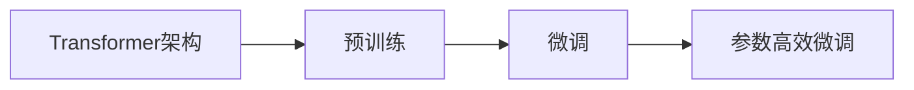

# 从零开始大模型开发与微调：PyTorch 2.0中的模块工具

## 1.背景介绍

随着人工智能技术的不断发展,大规模语言模型(Large Language Models, LLMs)已成为自然语言处理(NLP)领域的研究热点。这些大模型在各种NLP任务上取得了显著的性能提升,如机器翻译、文本摘要、问答系统等。然而,训练和部署这些大模型仍面临着诸多挑战,包括计算资源的限制、模型的可解释性和泛化能力等。

PyTorch作为一个灵活且功能强大的深度学习框架,为大模型的开发和微调提供了丰富的工具和模块。特别是在最新发布的PyTorch 2.0版本中,引入了一系列新特性和改进,使得大模型的训练和部署更加高效和便捷。本文将深入探讨如何利用PyTorch 2.0中的模块工具,从零开始进行大模型的开发与微调。

## 2.核心概念与联系

在开始探讨大模型开发与微调的具体步骤之前,我们首先需要了解一些核心概念:

### 2.1 Transformer架构

Transformer是一种基于自注意力机制(Self-Attention)的神经网络架构,已成为大规模语言模型的主流架构。与传统的循环神经网络(RNN)和卷积神经网络(CNN)不同,Transformer完全依赖于注意力机制来捕捉输入序列之间的依赖关系,从而实现并行计算和长距离依赖建模。

### 2.2 预训练与微调

预训练(Pre-training)是指在大规模无标注数据上训练语言模型,使其学习到丰富的语言知识和表征。常见的预训练方法包括语言模型预训练(如GPT系列)和掩码语言模型预训练(如BERT)。微调(Fine-tuning)则是在预训练模型的基础上,针对特定的下游任务(如文本分类、命名实体识别等)进行进一步的训练,使模型适应任务的特点。

### 2.3 参数高效微调

由于大模型通常包含数亿甚至数十亿的参数,直接对整个模型进行微调会面临计算资源和过拟合的问题。参数高效微调(Parameter-Efficient Fine-tuning)旨在通过一些技巧(如参数冻结、Adapter等)来减少需要微调的参数量,从而提高微调的效率和泛化能力。

下图展示了这些核心概念之间的联系:



## 3.核心算法原理具体操作步骤

### 3.1 Transformer的自注意力机制

Transformer的核心是自注意力机制,它允许模型在处理输入序列时关注序列中的任意位置。具体来说,自注意力机制的计算步骤如下:

1. 将输入序列X通过三个线性变换得到查询矩阵Q、键矩阵K和值矩阵V。
2. 计算Q和K的点积并除以 $\sqrt{d_k}$ (其中 $d_k$ 是键向量的维度),得到注意力权重矩阵。
3. 对注意力权重矩阵应用Softmax函数,得到归一化的注意力权重。
4. 将注意力权重与值矩阵V相乘,得到输出序列。

数学表达式如下:

$$
\text{Attention}(Q, K, V) = \text{softmax}(\frac{QK^T}{\sqrt{d_k}})V
$$

### 3.2 预训练的具体步骤

以BERT为例,预训练的具体步骤如下:

1. 构建大规模无标注语料库,进行文本清洗和预处理。
2. 对输入序列进行随机掩码(Masking),即以一定概率将部分词元替换为特殊的[MASK]标记。
3. 将掩码后的序列输入到Transformer编码器中,得到每个位置的隐藏状态。
4. 使用隐藏状态预测被掩码的词元,计算掩码语言模型损失(MLM Loss)。
5. 同时,对输入序列进行下一句预测(Next Sentence Prediction, NSP),即判断两个句子是否前后相邻,计算二分类损失。
6. 将MLM Loss和NSP Loss相加作为总损失,使用优化器(如Adam)进行梯度下降,更新模型参数。

### 3.3 微调的具体步骤

以文本分类任务为例,微调的具体步骤如下:

1. 加载预训练的语言模型(如BERT),并根据任务需要调整模型结构(如添加分类头)。
2. 准备文本分类数据集,对输入文本进行预处理(如分词、截断等)。
3. 将预处理后的文本输入到微调后的模型中,得到分类概率。
4. 计算交叉熵损失(Cross Entropy Loss),使用优化器进行梯度下降,更新模型参数。
5. 在验证集上评估模型性能,根据需要调整超参数(如学习率、批量大小等)。
6. 重复步骤3-5,直到模型性能达到满意的水平。

## 4.数学模型和公式详细讲解举例说明

### 4.1 Transformer的多头自注意力机制

Transformer引入了多头自注意力机制(Multi-Head Attention),即将自注意力计算多次,每次使用不同的参数,然后将结果拼接起来。这样可以让模型在不同的子空间中捕捉不同的依赖关系,提高模型的表达能力。

假设我们有 $h$ 个注意力头,每个头的维度为 $d_h=d_\text{model}/h$,其中 $d_\text{model}$ 是模型的隐藏状态维度。对于第 $i$ 个注意力头,计算公式如下:

$$
\text{head}_i = \text{Attention}(QW_i^Q, KW_i^K, VW_i^V)
$$

其中 $W_i^Q \in \mathbb{R}^{d_\text{model} \times d_h}, W_i^K \in \mathbb{R}^{d_\text{model} \times d_h}, W_i^V \in \mathbb{R}^{d_\text{model} \times d_h}$ 是可学习的参数矩阵。

最后,将所有注意力头的结果拼接起来,并通过一个线性变换得到输出:

$$
\text{MultiHead}(Q, K, V) = \text{Concat}(\text{head}_1, ..., \text{head}_h)W^O
$$

其中 $W^O \in \mathbb{R}^{hd_h \times d_\text{model}}$ 是可学习的参数矩阵。

### 4.2 BERT的掩码语言模型

BERT使用掩码语言模型(Masked Language Model, MLM)作为预训练任务之一。给定一个输入序列 $\mathbf{x} = (x_1, ..., x_n)$,我们随机选择其中的一部分位置进行掩码,得到掩码后的序列 $\mathbf{\hat{x}} = (\hat{x}_1, ..., \hat{x}_n)$。对于被掩码的位置 $i$,我们将其替换为特殊的[MASK]标记,即 $\hat{x}_i = \text{[MASK]}$。

然后,我们将掩码后的序列输入到BERT中,得到每个位置的隐藏状态 $\mathbf{h} = (h_1, ..., h_n)$。对于被掩码的位置 $i$,我们使用其隐藏状态 $h_i$ 预测原始的词元 $x_i$。具体来说,我们将 $h_i$ 通过一个线性变换和Softmax函数,得到词表上每个词元的概率分布:

$$
p(x_i|\hat{x}_i) = \text{softmax}(h_iW_\text{MLM} + b_\text{MLM})
$$

其中 $W_\text{MLM} \in \mathbb{R}^{d_\text{model} \times |\mathcal{V}|}, b_\text{MLM} \in \mathbb{R}^{|\mathcal{V}|}$ 是可学习的参数,$|\mathcal{V}|$ 是词表的大小。

最后,我们计算被掩码位置上的交叉熵损失:

$$
\mathcal{L}_\text{MLM} = -\sum_{i \in \mathcal{M}} \log p(x_i|\hat{x}_i)
$$

其中 $\mathcal{M}$ 是被掩码的位置集合。

通过最小化MLM损失,BERT可以学习到丰富的语言知识和上下文表征。

## 5.项目实践：代码实例和详细解释说明

下面我们使用PyTorch 2.0来实现一个简单的Transformer编码器,并在IMDB情感分类数据集上进行微调。

### 5.1 定义Transformer编码器

```python
import torch
import torch.nn as nn

class TransformerEncoder(nn.Module):
    def __init__(self, vocab_size, d_model, nhead, num_layers, dim_feedforward, dropout=0.1):
        super(TransformerEncoder, self).__init__()
        self.embedding = nn.Embedding(vocab_size, d_model)
        self.pos_encoder = PositionalEncoding(d_model, dropout)
        encoder_layer = nn.TransformerEncoderLayer(d_model, nhead, dim_feedforward, dropout)
        self.transformer_encoder = nn.TransformerEncoder(encoder_layer, num_layers)
        
    def forward(self, src):
        src = self.embedding(src) * math.sqrt(self.d_model)
        src = self.pos_encoder(src)
        output = self.transformer_encoder(src)
        return output
```

这里我们定义了一个简单的Transformer编码器,包含词嵌入层、位置编码器和多层Transformer编码器层。其中,`vocab_size`是词表大小,`d_model`是隐藏状态维度,`nhead`是注意力头数,`num_layers`是编码器层数,`dim_feedforward`是前馈网络的隐藏层维度,`dropout`是dropout概率。

在前向传播中,我们首先将输入序列通过词嵌入层和位置编码器,然后输入到Transformer编码器中,得到最后一层的隐藏状态作为输出。

### 5.2 微调情感分类模型

```python
class SentimentClassifier(nn.Module):
    def __init__(self, encoder, hidden_size, num_classes, dropout=0.1):
        super(SentimentClassifier, self).__init__()
        self.encoder = encoder
        self.dropout = nn.Dropout(dropout)
        self.fc = nn.Linear(hidden_size, num_classes)
        
    def forward(self, src):
        output = self.encoder(src)
        output = output.mean(dim=1)
        output = self.dropout(output)
        output = self.fc(output)
        return output
```

这里我们定义了一个情感分类模型,它包含一个Transformer编码器和一个分类头。在前向传播中,我们将输入序列输入到编码器中,然后对编码器的输出取平均,经过dropout和线性层得到最终的分类概率。

接下来,我们加载IMDB数据集,并将其转换为PyTorch的Dataset和DataLoader:

```python
from torchtext.datasets import IMDB
from torchtext.data.utils import get_tokenizer
from torchtext.vocab import build_vocab_from_iterator

train_iter = IMDB(split='train')
tokenizer = get_tokenizer('basic_english')

def yield_tokens(data_iter):
    for _, text in data_iter:
        yield tokenizer(text)

vocab = build_vocab_from_iterator(yield_tokens(train_iter), specials=["<unk>"])
vocab.set_default_index(vocab["<unk>"])

def collate_batch(batch):
    label_list, text_list = [], []
    for (_label, _text) in batch:
        label_list.append(label_pipeline(_label))
        processed_text = torch.tensor(text_pipeline(_text), dtype=torch.int64)
        text_list.append(processed_text)
    label_list = torch.tensor(label_list, dtype=torch.int64)
    text_list = torch.nn.utils.rnn.pad_sequence(text_list, batch_first=True)
    return label_list, text_list

train_iter, test_iter = IMDB()
train_dataloader = DataLoader(train_iter, batch_size=8, shuffle=True, collate_fn=collate_batch)
test_dataloader = DataLoader(test_iter, batch_size=8, shuffle=False, collate_fn=collate_batch)
```

这里我们使用torchtext库来加载IMDB数据集,并构建词表和数据迭代器。我们定义了一个`collate_batch`函数来对一个批次的数据进行处理,包括将文本转换为词表索引,以及对文本进行填充。

最后,我们定义训练和评估函数,并开始训练模型:

```python
def train(model, dataloader, criterion, optimizer, device):
    model.train()
    total_acc, total_loss = 0, 0
    for labels, texts in dataloader:
        labels, texts = labels.to(device