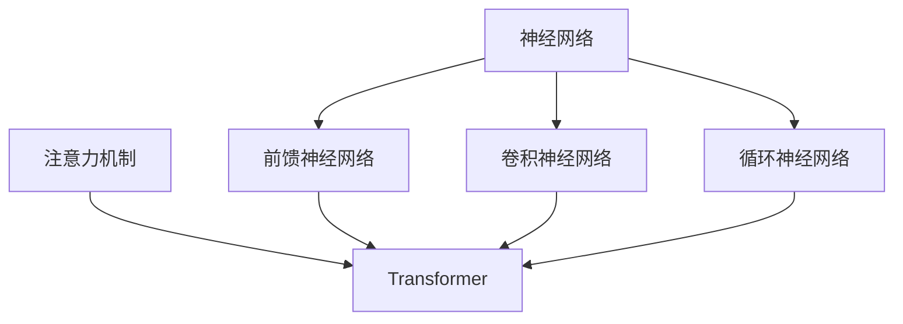

# 从零开始大模型开发与微调：一学就会的深度学习基础算法详解

## 1. 背景介绍

### 1.1 人工智能的崛起

人工智能(AI)是当代科技发展的重要引擎,其影响力已经渗透到我们生活的方方面面。从语音助手到自动驾驶汽车,从推荐系统到医疗诊断,AI无处不在。而深度学习作为AI的核心技术,正在推动着这一革命性变革。

### 1.2 深度学习的重要性

深度学习是一种基于人工神经网络的机器学习算法,它能够从海量数据中自动学习特征表示,并对复杂模式进行建模。凭借其强大的表现力和泛化能力,深度学习已广泛应用于计算机视觉、自然语言处理、语音识别等诸多领域,取得了令人瞩目的成就。

### 1.3 大模型时代的到来

近年来,随着算力和数据的飞速增长,深度学习模型也在不断变大。大模型(Large Model)凭借其庞大的参数量和训练数据规模,展现出了前所未有的性能表现。以GPT-3、DALL-E、AlphaFold等为代表的大模型,正在重塑着人工智能的格局。

## 2. 核心概念与联系

### 2.1 深度学习基础概念

#### 2.1.1 神经网络

神经网络是深度学习的核心,它是一种受生物神经系统启发而设计的数学模型。神经网络由多层节点(神经元)组成,每层节点通过加权连接与上下层相连,并通过激活函数进行非线性变换。

#### 2.1.2 前馈神经网络

前馈神经网络(Feedforward Neural Network)是最基础的神经网络结构,信息只能单向传播,从输入层经过隐藏层到达输出层。

#### 2.1.3 卷积神经网络

卷积神经网络(Convolutional Neural Network, CNN)是一种专门用于处理网格数据(如图像)的神经网络结构。它通过卷积和池化操作来提取局部特征,具有平移不变性和参数共享的优势。

#### 2.1.4 循环神经网络

循环神经网络(Recurrent Neural Network, RNN)是一种专门用于处理序列数据(如文本、语音)的神经网络结构。它通过内部状态的循环传递,能够捕捉序列中的长期依赖关系。

#### 2.1.5 注意力机制

注意力机制(Attention Mechanism)是一种用于加权输入特征的技术,它允许模型动态地关注输入的不同部分,从而提高模型的性能和解释能力。

#### 2.1.6 Transformer

Transformer是一种基于注意力机制的全新神经网络架构,它完全放弃了循环和卷积结构,使用自注意力(Self-Attention)机制来捕捉输入序列中的长期依赖关系。Transformer在自然语言处理、计算机视觉等领域表现出色。

### 2.2 核心概念之间的联系

上述核心概念相互关联、相互影响,共同构建了深度学习的理论基础。例如,卷积神经网络和循环神经网络分别针对图像和序列数据进行了特殊设计,而Transformer则提出了一种全新的注意力机制来处理各种类型的数据。这些概念和架构的不断演进,推动着深度学习技术的发展和应用。

## 3. 核心算法原理具体操作步骤

### 3.1 前馈神经网络

前馈神经网络是深度学习中最基础的网络结构,它的工作原理如下:

1. **输入层**: 接收原始输入数据,如图像像素值或文本的词向量表示。
2. **隐藏层**: 由多层神经元组成,每层神经元对上一层输出进行加权求和,并通过非线性激活函数(如ReLU、Sigmoid等)进行变换。
3. **输出层**: 根据任务目标,输出相应的结果,如分类标签或回归值。
4. **前向传播**: 输入数据从输入层开始,依次经过隐藏层,计算每层神经元的加权输入和激活值,最终到达输出层。
5. **损失函数**: 计算模型输出与真实标签之间的误差,如交叉熵损失(分类任务)或均方误差(回归任务)。
6. **反向传播**: 根据损失函数的梯度,通过链式法则计算每层权重的梯度,并使用优化算法(如梯度下降)更新网络参数。
7. **迭代训练**: 重复前向传播和反向传播的过程,不断调整网络参数,直到模型在验证集上达到理想的性能。

### 3.2 卷积神经网络

卷积神经网络专门用于处理网格数据,如图像、视频等。它的核心操作包括卷积和池化:

1. **卷积层**: 使用一个或多个卷积核(小矩阵)在输入数据上滑动,对每个局部区域进行加权求和,提取局部特征。
2. **激活函数**: 对卷积层的输出应用非线性激活函数,如ReLU。
3. **池化层**: 对卷积层的输出进行下采样,减小特征图的尺寸,提高模型的鲁棒性和不变性。
4. **全连接层**: 将卷积层和池化层的输出展平,并连接到一个或多个全连接层,用于进行高层次的特征组合和任务预测。

卷积神经网络的训练过程与前馈神经网络类似,通过前向传播、损失计算和反向传播来优化网络参数。

### 3.3 循环神经网络

循环神经网络专门用于处理序列数据,如文本、语音等。它的核心思想是引入状态向量,捕捉序列中的长期依赖关系:

1. **输入层**: 将序列数据(如词向量)逐个输入到网络中。
2. **隐藏层**: 由循环单元(如LSTM、GRU)组成,每个时间步长的隐藏状态不仅取决于当前输入,还取决于前一时间步的隐藏状态。
3. **输出层**: 根据任务目标,输出相应的结果,如序列标注或序列生成。
4. **前向传播**: 在每个时间步长,循环单元根据当前输入和前一状态计算新的隐藏状态和输出。
5. **反向传播**: 通过反向传播算法,计算每个时间步长的梯度,并更新网络参数。

循环神经网络能够有效地捕捉长期依赖关系,但在实际应用中仍存在梯度消失/爆炸等问题。

### 3.4 Transformer

Transformer是一种全新的基于注意力机制的神经网络架构,它完全放弃了循环和卷积结构,使用自注意力机制来捕捉输入序列中的长期依赖关系。Transformer的工作原理如下:

1. **输入嵌入**: 将输入序列(如文本)转换为嵌入向量表示。
2. **位置编码**: 为每个位置添加位置信息,使模型能够捕捉序列的顺序信息。
3. **多头自注意力**: 计算每个位置的注意力权重,捕捉输入序列中的长期依赖关系。
4. **前馈网络**: 对注意力输出进行非线性变换,提取高层次特征。
5. **规范化和残差连接**: 使用层归一化和残差连接,提高模型的训练稳定性和收敛速度。
6. **解码器(可选)**: 对于序列生成任务,需要使用解码器模块来生成输出序列。

Transformer架构通过自注意力机制直接建模序列中任意两个位置之间的依赖关系,避免了循环神经网络中的梯度消失/爆炸问题,并展现出了卓越的性能表现。

## 4. 数学模型和公式详细讲解举例说明

### 4.1 神经网络基本运算

神经网络的核心运算包括加权求和、激活函数和损失函数计算。

#### 4.1.1 加权求和

给定输入向量 $\boldsymbol{x} = (x_1, x_2, \ldots, x_n)$ 和权重向量 $\boldsymbol{w} = (w_1, w_2, \ldots, w_n)$,加权求和运算定义为:

$$
z = \sum_{i=1}^{n} w_i x_i + b
$$

其中 $b$ 是偏置项(bias)。

#### 4.1.2 激活函数

激活函数引入非线性,使神经网络能够拟合复杂的函数。常用的激活函数包括:

- ReLU (Rectified Linear Unit):
  $$
  f(z) = \max(0, z)
  $$

- Sigmoid:
  $$
  f(z) = \frac{1}{1 + e^{-z}}
  $$

- Tanh:
  $$
  f(z) = \frac{e^z - e^{-z}}{e^z + e^{-z}}
  $$

#### 4.1.3 损失函数

损失函数用于衡量模型输出与真实标签之间的差异,常用的损失函数包括:

- 均方误差(Mean Squared Error, MSE):
  $$
  \mathcal{L}(\boldsymbol{y}, \hat{\boldsymbol{y}}) = \frac{1}{n} \sum_{i=1}^{n} (y_i - \hat{y}_i)^2
  $$

- 交叉熵损失(Cross-Entropy Loss):
  $$
  \mathcal{L}(\boldsymbol{y}, \hat{\boldsymbol{y}}) = -\frac{1}{n} \sum_{i=1}^{n} y_i \log \hat{y}_i
  $$

其中 $\boldsymbol{y}$ 是真实标签, $\hat{\boldsymbol{y}}$ 是模型输出。

### 4.2 卷积神经网络

卷积神经网络中的卷积操作和池化操作是核心运算。

#### 4.2.1 卷积操作

给定输入特征图 $\boldsymbol{X}$ 和卷积核 $\boldsymbol{K}$,卷积操作可以表示为:

$$
\boldsymbol{Y}_{i,j} = \sum_{m=1}^{M} \sum_{n=1}^{N} \boldsymbol{X}_{i+m-1, j+n-1} \cdot \boldsymbol{K}_{m,n}
$$

其中 $\boldsymbol{Y}$ 是输出特征图, $M$ 和 $N$ 分别是卷积核的高度和宽度。

#### 4.2.2 池化操作

池化操作用于下采样特征图,常用的池化方式包括最大池化(Max Pooling)和平均池化(Average Pooling)。以 $2 \times 2$ 最大池化为例:

$$
\boldsymbol{Y}_{i,j} = \max_{m=1,2} \max_{n=1,2} \boldsymbol{X}_{i+m-1, j+n-1}
$$

### 4.3 注意力机制

注意力机制是一种加权输入特征的技术,它允许模型动态地关注输入的不同部分。

#### 4.3.1 缩放点积注意力

缩放点积注意力(Scaled Dot-Product Attention)是Transformer中使用的注意力机制,它的计算过程如下:

1. 计算查询(Query)、键(Key)和值(Value)的表示:
   $$
   \boldsymbol{Q} = \boldsymbol{X} \boldsymbol{W}^Q, \quad \boldsymbol{K} = \boldsymbol{X} \boldsymbol{W}^K, \quad \boldsymbol{V} = \boldsymbol{X} \boldsymbol{W}^V
   $$

2. 计算注意力权重:
   $$
   \text{Attention}(\boldsymbol{Q}, \boldsymbol{K}, \boldsymbol{V}) = \text{softmax}\left(\frac{\boldsymbol{Q}\boldsymbol{K}^\top}{\sqrt{d_k}}\right)\boldsymbol{V}
   $$

   其中 $d_k$ 是缩放因子,用于避免内积过大导致的梯度饱和问题。

3. 多头注意力机制通过并行计算多个注意力头,再将它们的结果拼接起来,从而捕捉不同的子空间信息。

注意力机制赋予了模型动态关注输入不同部分的