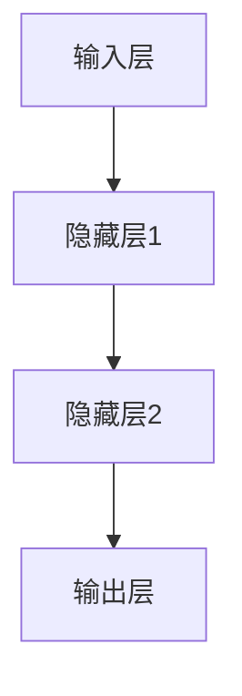

# 从零开始大模型开发与微调：反向传播神经网络两个基础算法详解

## 1. 背景介绍

### 1.1 人工智能的崛起

人工智能(Artificial Intelligence, AI)已经成为当今科技领域最热门的话题之一。从语音助手到自动驾驶汽车,从医疗诊断到金融分析,AI 技术正在改变着我们的生活方式。在这场技术革命的核心,是一种被称为"深度学习"(Deep Learning)的机器学习技术。

### 1.2 深度学习的核心:神经网络

深度学习的核心是一种被称为"神经网络"(Neural Network)的算法模型。神经网络是一种受生物神经系统启发而设计的计算模型,它由大量互相连接的节点(称为"神经元")组成。这些神经元通过数学运算来处理输入数据,并产生输出结果。

### 1.3 反向传播算法的重要性

神经网络的训练过程是通过一种称为"反向传播"(Backpropagation)的算法来实现的。反向传播算法是一种用于计算神经网络中每个权重的梯度的技术,它使得神经网络能够通过调整权重来最小化损失函数,从而逐步提高模型的准确性。反向传播算法是深度学习领域最关键的算法之一,也是本文的重点探讨对象。

## 2. 核心概念与联系

### 2.1 神经网络的基本结构



神经网络通常由三种类型的层组成:输入层、隐藏层和输出层。输入层接收原始数据,隐藏层执行数学运算和特征提取,输出层产生最终结果。每一层由多个神经元组成,神经元之间通过加权连接进行信息传递。

### 2.2 前向传播

前向传播(Forward Propagation)是神经网络的基本工作原理。在这个过程中,输入数据经过一系列线性和非线性变换,最终产生输出结果。每个神经元接收来自上一层的加权输入,应用激活函数(如 ReLU、Sigmoid 等),并将结果传递给下一层。

### 2.3 损失函数

损失函数(Loss Function)是用于衡量神经网络输出与期望输出之间差异的指标。常见的损失函数包括均方误差(Mean Squared Error, MSE)和交叉熵损失(Cross-Entropy Loss)等。损失函数的值越小,表示模型的预测结果越接近期望值。

### 2.4 反向传播算法

反向传播算法是一种用于计算神经网络中每个权重的梯度的技术。它通过反向传播误差信号,计算出每个权重对损失函数的梯度,从而指导权重的调整方向。反向传播算法包括两个关键步骤:误差反向传播和权重更新。

## 3. 核心算法原理具体操作步骤

### 3.1 误差反向传播

误差反向传播(Backpropagation of Error)是反向传播算法的第一步,它计算出每个权重对损失函数的梯度。具体步骤如下:

1. 计算输出层的误差:将输出层的实际输出与期望输出进行比较,计算出误差项。
2. 反向传播误差:将输出层的误差项反向传播到隐藏层,计算出隐藏层每个神经元的误差项。
3. 递归计算:重复步骤 2,直到计算出输入层的误差项。
4. 计算梯度:利用链式法则,计算出每个权重对损失函数的梯度。

### 3.2 权重更新

权重更新(Weight Update)是反向传播算法的第二步,它根据计算出的梯度来调整每个权重的值,以减小损失函数。具体步骤如下:

1. 选择优化算法:常见的优化算法包括梯度下降(Gradient Descent)、动量优化(Momentum Optimization)、RMSProp 等。
2. 计算更新值:根据选择的优化算法,计算出每个权重的更新值。
3. 更新权重:将计算出的更新值应用到每个权重上,完成权重的调整。

### 3.3 迭代训练

反向传播算法是一个迭代过程,需要重复执行误差反向传播和权重更新,直到模型收敛或达到预设的停止条件。每次迭代都会使模型的预测结果更接近期望值,从而提高模型的准确性。

## 4. 数学模型和公式详细讲解举例说明

### 4.1 前向传播公式

前向传播的数学表达式如下:

$$
a^{(l+1)} = g\left(z^{(l+1)}\right) \\
z^{(l+1)} = W^{(l+1)}a^{(l)} + b^{(l+1)}
$$

其中:
- $a^{(l)}$ 表示第 $l$ 层的激活值向量
- $z^{(l+1)}$ 表示第 $l+1$ 层的加权输入向量
- $W^{(l+1)}$ 表示第 $l+1$ 层的权重矩阵
- $b^{(l+1)}$ 表示第 $l+1$ 层的偏置向量
- $g(\cdot)$ 表示激活函数,如 ReLU、Sigmoid 等

### 4.2 反向传播公式

反向传播的核心公式是计算每个权重对损失函数的梯度。对于第 $l$ 层的权重 $W^{(l)}$,梯度计算公式如下:

$$
\frac{\partial L}{\partial W^{(l)}} = \frac{\partial L}{\partial z^{(l+1)}} \frac{\partial z^{(l+1)}}{\partial W^{(l)}} = \delta^{(l+1)} (a^{(l)})^T
$$

其中:
- $L$ 表示损失函数
- $\delta^{(l+1)}$ 表示第 $l+1$ 层的误差项,计算方式为:
  - 对于输出层: $\delta^{(n_l)} = \nabla_a L \odot g'(z^{(n_l)})$
  - 对于隐藏层: $\delta^{(l)} = (W^{(l+1)})^T \delta^{(l+1)} \odot g'(z^{(l)})$
- $\odot$ 表示元素wise乘积
- $g'(\cdot)$ 表示激活函数的导数

### 4.3 权重更新公式

权重更新通常采用梯度下降优化算法,公式如下:

$$
W^{(l)} \leftarrow W^{(l)} - \eta \frac{\partial L}{\partial W^{(l)}}
$$

其中:
- $\eta$ 表示学习率(Learning Rate),控制权重更新的步长
- $\frac{\partial L}{\partial W^{(l)}}$ 表示第 $l$ 层权重对损失函数的梯度

### 4.4 示例:手写数字识别

让我们以手写数字识别为例,说明反向传播算法的工作原理。假设我们有一个简单的神经网络,包含一个输入层(784 个神经元,对应 28x28 像素的手写数字图像)、一个隐藏层(16 个神经元)和一个输出层(10 个神经元,对应 0-9 十个数字)。

1. 前向传播:将手写数字图像输入到输入层,经过隐藏层的加权求和和激活函数计算,得到输出层的预测结果(一个长度为 10 的向量,表示该图像属于每个数字的概率)。
2. 计算损失:将预测结果与期望输出(实际数字标签)进行比较,计算出损失函数值(如交叉熵损失)。
3. 误差反向传播:从输出层开始,计算每个神经元的误差项,并反向传播到隐藏层和输入层,得到每个权重对损失函数的梯度。
4. 权重更新:根据计算出的梯度,使用梯度下降优化算法更新每个权重的值。
5. 迭代训练:重复执行步骤 1-4,直到模型收敛或达到预设的停止条件。

通过反向传播算法,神经网络可以不断调整权重,使预测结果逐渐接近期望输出,从而提高手写数字识别的准确性。

## 5. 项目实践:代码实例和详细解释说明

为了更好地理解反向传播算法,我们将使用 Python 和 NumPy 库实现一个简单的神经网络,并应用于手写数字识别任务。

### 5.1 导入所需库

```python
import numpy as np
from sklearn.datasets import load_digits
from sklearn.model_selection import train_test_split
from sklearn.utils import shuffle
```

### 5.2 加载数据集

```python
# 加载手写数字数据集
digits = load_digits()
X, y = digits.data, digits.target

# 将数据集划分为训练集和测试集
X_train, X_test, y_train, y_test = train_test_split(X, y, test_size=0.2, random_state=42)

# 将数据归一化到 [0, 1] 范围内
X_train = X_train / 255.0
X_test = X_test / 255.0
```

### 5.3 定义神经网络结构和激活函数

```python
# 定义神经网络结构
input_size = 64  # 输入层神经元数量
hidden_size = 16  # 隐藏层神经元数量
output_size = 10  # 输出层神经元数量

# 定义激活函数及其导数
def sigmoid(x):
    return 1 / (1 + np.exp(-x))

def sigmoid_derivative(x):
    return x * (1 - x)
```

### 5.4 初始化权重和偏置

```python
# 初始化权重和偏置
np.random.seed(42)
W1 = np.random.randn(input_size, hidden_size)
b1 = np.zeros((1, hidden_size))
W2 = np.random.randn(hidden_size, output_size)
b2 = np.zeros((1, output_size))
```

### 5.5 前向传播函数

```python
def forward_propagation(X):
    # 输入层到隐藏层
    z1 = np.dot(X, W1) + b1
    a1 = sigmoid(z1)

    # 隐藏层到输出层
    z2 = np.dot(a1, W2) + b2
    y_hat = sigmoid(z2)

    return y_hat, a1
```

### 5.6 反向传播函数

```python
def backward_propagation(X, y, y_hat, a1):
    # 计算输出层误差
    delta2 = y_hat - y

    # 计算隐藏层误差
    delta1 = np.dot(delta2, W2.T) * sigmoid_derivative(a1)

    # 计算梯度
    dW2 = np.dot(a1.T, delta2)
    db2 = np.sum(delta2, axis=0, keepdims=True)
    dW1 = np.dot(X.T, delta1)
    db1 = np.sum(delta1, axis=0, keepdims=True)

    return dW1, db1, dW2, db2
```

### 5.7 训练函数

```python
def train(X, y, epochs, learning_rate):
    for epoch in range(epochs):
        # 前向传播
        y_hat, a1 = forward_propagation(X)

        # 反向传播
        dW1, db1, dW2, db2 = backward_propagation(X, y, y_hat, a1)

        # 更新权重和偏置
        W1 -= learning_rate * dW1
        b1 -= learning_rate * db1
        W2 -= learning_rate * dW2
        b2 -= learning_rate * db2

        # 计算准确率
        y_pred = np.argmax(y_hat, axis=1)
        accuracy = np.mean(y_pred == y)
        print(f"Epoch {epoch + 1}/{epochs}, Accuracy: {accuracy:.4f}")

    return W1, b1, W2, b2
```

### 5.8 测试函数

```python
def test(X, y, W1, b1, W2, b2):
    y_hat, _ = forward_propagation(X)
    y_pred = np.argmax(y_hat, axis=1)
    accuracy = np.mean(y_pred == y)
    print(f"Test Accuracy: {accuracy:.4f}")
```

### 5.9 训练和测试

```python
# 训练模型
W1, b1, W2, b2 = train(X_train, y_train, epochs=100, learning_rate=0.1)

# 测试模型
test(X_test, y_test, W1, b1, W2, b2)
```

在这个示例中,我们实现了一个简单的神经网络,包括前向传播、反向传播和权重更新等核心功能。通过训练和测试,我们可以观察到模型在手写数字识别任务上的性能表现。

需要注意的是,这只是一个简