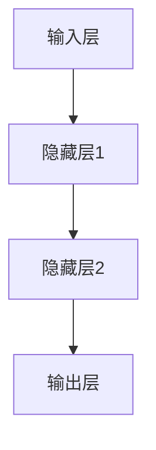

# 从零开始大模型开发与微调：反馈神经网络反向传播算法介绍

## 1.背景介绍

### 1.1 人工智能的兴起

人工智能(Artificial Intelligence, AI)是当代科技发展的重要领域之一,已经广泛应用于各个行业。随着数据量的激增和计算能力的提高,深度学习(Deep Learning)作为AI的核心技术,正在推动着人工智能的飞速发展。

### 1.2 深度学习的重要性

深度学习是机器学习的一种技术,它通过对数据的特征进行自动提取和模式识别,从而实现对复杂问题的高效处理。深度神经网络能够模拟人脑的运作方式,从大量数据中自主学习,并对输入数据进行分类、预测等任务。

### 1.3 反向传播算法的作用

在深度学习中,反向传播(Backpropagation)算法是训练人工神经网络最关键和最常用的算法之一。它通过计算误差函数对网络权重的梯度,并沿着该梯度的反方向对权重进行调整,从而使网络逐步优化,达到最小化误差的目的。

## 2.核心概念与联系

### 2.1 神经网络基本结构

神经网络是一种模拟生物神经网络的数学模型,主要由输入层、隐藏层和输出层组成。每一层由若干个神经元组成,相邻层的神经元通过带权重的连接相互连接。



### 2.2 前向传播与反向传播

- **前向传播(Forward Propagation)**:输入数据通过输入层传递到隐藏层,经过加权求和和激活函数的处理,最终到达输出层,得到网络的输出结果。
- **反向传播(Backpropagation)**:将网络输出与期望输出的误差反向传播回输入层,根据误差梯度调整每层神经元的权重和偏置,使网络输出逐渐逼近期望输出。

### 2.3 损失函数与优化

在训练过程中,需要定义一个损失函数(Loss Function)来衡量网络输出与期望输出之间的差异。常用的损失函数包括均方误差(MSE)、交叉熵损失(Cross-Entropy Loss)等。通过优化算法(如梯度下降)最小化损失函数,从而优化网络参数。

## 3.核心算法原理具体操作步骤 

反向传播算法的核心思想是利用链式法则计算损失函数对每个权重的梯度,并沿梯度的反方向更新权重,从而最小化损失函数。算法具体步骤如下:

1. **前向传播**:输入样本数据,通过加权求和和激活函数,计算出每一层的输出。
2. **计算损失**:将输出层的输出与真实标签进行比较,计算损失函数的值。
3. **反向传播**:从输出层开始,利用链式法则计算损失函数对每个权重的梯度。
4. **权重更新**:根据梯度下降法则,沿梯度的反方向更新每个权重和偏置。
5. **迭代训练**:重复上述步骤,直到损失函数收敛或达到预设的迭代次数。

以下是一个简单的三层神经网络反向传播算法的伪代码:

```python
# 前向传播
for each layer:
    inputs = outputs from previous layer
    weights = weights of current layer
    outputs = activate(dot(inputs, weights))

# 计算损失
loss = loss_function(outputs, labels)

# 反向传播
gradients = []
for each layer in reverse(layers):
    gradients.append(loss.backward(layer.outputs, layer.weights))

# 权重更新
for layer, grad in zip(layers, gradients):
    layer.weights -= learning_rate * grad
```

## 4.数学模型和公式详细讲解举例说明

### 4.1 前向传播

对于单个神经元,其输出可表示为:

$$o_j = \sigma\left(\sum_{i}w_{ij}x_i + b_j\right)$$

其中:
- $o_j$是第j个神经元的输出
- $x_i$是第i个输入
- $w_{ij}$是连接第i个输入和第j个神经元的权重
- $b_j$是第j个神经元的偏置
- $\sigma$是激活函数,如Sigmoid、ReLU等

对于整个神经网络,前向传播可以表示为一系列的矩阵运算:

$$\boldsymbol{h}^{(l)} = \sigma\left(\boldsymbol{W}^{(l)}\boldsymbol{h}^{(l-1)} + \boldsymbol{b}^{(l)}\right)$$

其中:
- $\boldsymbol{h}^{(l)}$是第l层的输出
- $\boldsymbol{W}^{(l)}$是第l层的权重矩阵
- $\boldsymbol{b}^{(l)}$是第l层的偏置向量
- $\sigma$是激活函数,对向量进行元素wise操作

### 4.2 反向传播

反向传播的核心是计算损失函数对每个权重的梯度。根据链式法则,我们有:

$$\frac{\partial L}{\partial w_{ij}} = \frac{\partial L}{\partial o_j}\frac{\partial o_j}{\partial \text{net}_j}\frac{\partial \text{net}_j}{\partial w_{ij}}$$

其中:
- $L$是损失函数
- $o_j$是第j个神经元的输出
- $\text{net}_j = \sum_{i}w_{ij}x_i + b_j$是第j个神经元的加权输入

对于每一层,我们可以计算出一个误差项$\delta^{(l)}$,它表示该层神经元输出对损失函数的梯度:

$$\delta^{(l)} = \nabla_{\boldsymbol{h}^{(l)}}L \odot \sigma'\left(\boldsymbol{z}^{(l)}\right)$$

其中:
- $\nabla_{\boldsymbol{h}^{(l)}}L$是损失函数对该层输出的梯度
- $\sigma'$是激活函数的导数
- $\boldsymbol{z}^{(l)} = \boldsymbol{W}^{(l)}\boldsymbol{h}^{(l-1)} + \boldsymbol{b}^{(l)}$是该层的加权输入
- $\odot$表示元素wise乘积

利用$\delta^{(l)}$,我们可以计算出该层权重矩阵$\boldsymbol{W}^{(l)}$的梯度:

$$\nabla_{\boldsymbol{W}^{(l)}}L = \delta^{(l)}\left(\boldsymbol{h}^{(l-1)}\right)^{\top}$$

通过梯度下降法则,我们可以更新权重矩阵:

$$\boldsymbol{W}^{(l)} \leftarrow \boldsymbol{W}^{(l)} - \eta \nabla_{\boldsymbol{W}^{(l)}}L$$

其中$\eta$是学习率。同理,我们也可以更新偏置向量$\boldsymbol{b}^{(l)}$。

### 4.3 实例说明

假设我们有一个二分类问题,输入数据$\boldsymbol{x} = (x_1, x_2)$,标签$y \in \{0, 1\}$。我们构建一个单隐藏层的神经网络,隐藏层有2个神经元,输出层有1个神经元。

输入层到隐藏层的权重矩阵为:

$$\boldsymbol{W}^{(1)} = \begin{pmatrix}
w_{11}^{(1)} & w_{12}^{(1)}\\
w_{21}^{(1)} & w_{22}^{(1)}
\end{pmatrix}$$

隐藏层到输出层的权重向量为:

$$\boldsymbol{w}^{(2)} = \begin{pmatrix}
w_1^{(2)}\\
w_2^{(2)}
\end{pmatrix}$$

我们使用Sigmoid函数作为激活函数:

$$\sigma(x) = \frac{1}{1 + e^{-x}}$$

其导数为:

$$\sigma'(x) = \sigma(x)(1 - \sigma(x))$$

假设输入数据为$\boldsymbol{x} = (0.5, 0.1)$,标签为$y = 1$。我们计算前向传播的结果:

$$\begin{align*}
\boldsymbol{h}^{(1)} &= \sigma\left(\boldsymbol{W}^{(1)}\boldsymbol{x} + \boldsymbol{b}^{(1)}\right)\\
\boldsymbol{o} &= \sigma\left(\boldsymbol{w}^{(2)\top}\boldsymbol{h}^{(1)} + b^{(2)}\right)
\end{align*}$$

假设输出为$\boldsymbol{o} = 0.3$,我们使用二元交叉熵损失函数:

$$L = -\left[y\log(\boldsymbol{o}) + (1 - y)\log(1 - \boldsymbol{o})\right]$$

计算损失函数对输出层输出的梯度:

$$\frac{\partial L}{\partial \boldsymbol{o}} = \frac{1 - y}{\boldsymbol{o} - 1} - \frac{y}{\boldsymbol{o}}$$

计算输出层的误差项:

$$\delta^{(2)} = \frac{\partial L}{\partial \boldsymbol{o}} \odot \sigma'\left(\boldsymbol{z}^{(2)}\right)$$

其中$\boldsymbol{z}^{(2)} = \boldsymbol{w}^{(2)\top}\boldsymbol{h}^{(1)} + b^{(2)}$。

计算输出层权重的梯度:

$$\nabla_{\boldsymbol{w}^{(2)}}L = \delta^{(2)}\boldsymbol{h}^{(1)}$$

计算隐藏层的误差项:

$$\delta^{(1)} = \left(\boldsymbol{w}^{(2)}\right)^{\top}\delta^{(2)} \odot \sigma'\left(\boldsymbol{z}^{(1)}\right)$$

其中$\boldsymbol{z}^{(1)} = \boldsymbol{W}^{(1)}\boldsymbol{x} + \boldsymbol{b}^{(1)}$。

计算隐藏层权重矩阵的梯度:

$$\nabla_{\boldsymbol{W}^{(1)}}L = \delta^{(1)}\boldsymbol{x}^{\top}$$

通过梯度下降法则,我们可以更新权重和偏置:

$$\begin{align*}
\boldsymbol{w}^{(2)} &\leftarrow \boldsymbol{w}^{(2)} - \eta \nabla_{\boldsymbol{w}^{(2)}}L\\
\boldsymbol{W}^{(1)} &\leftarrow \boldsymbol{W}^{(1)} - \eta \nabla_{\boldsymbol{W}^{(1)}}L\\
\boldsymbol{b}^{(2)} &\leftarrow \boldsymbol{b}^{(2)} - \eta \delta^{(2)}\\
\boldsymbol{b}^{(1)} &\leftarrow \boldsymbol{b}^{(1)} - \eta \delta^{(1)}
\end{align*}$$

通过多次迭代,我们可以使网络输出逐渐逼近期望输出,从而完成模型的训练。

## 5.项目实践:代码实例和详细解释说明

以下是一个使用PyTorch实现的简单反向传播示例:

```python
import torch
import torch.nn as nn

# 定义网络结构
class Net(nn.Module):
    def __init__(self):
        super(Net, self).__init__()
        self.fc1 = nn.Linear(2, 4)  # 输入层到隐藏层
        self.fc2 = nn.Linear(4, 1)  # 隐藏层到输出层
        
    def forward(self, x):
        x = torch.relu(self.fc1(x))  # 隐藏层使用ReLU激活函数
        x = torch.sigmoid(self.fc2(x))  # 输出层使用Sigmoid激活函数
        return x

# 创建网络实例
net = Net()

# 定义损失函数和优化器
criterion = nn.BCELoss()  # 使用二元交叉熵损失函数
optimizer = torch.optim.SGD(net.parameters(), lr=0.01)  # 使用随机梯度下降优化器

# 训练数据
inputs = torch.tensor([[0.5, 0.1], [0.3, 0.2], [0.9, 0.8], [0.2, 0.7]])
labels = torch.tensor([[1.0], [0.0], [1.0], [0.0]])

# 训练循环
for epoch in range(1000):
    # 前向传播
    outputs = net(inputs)
    loss = criterion(outputs, labels)
    
    # 反向传播
    optimizer.zero_grad()
    loss.backward()
    optimizer.step()
    
    # 打印损失
    if epoch % 100 == 0:
        print(f{"msg_type":"generate_answer_finish","data":"","from_module":null,"from_unit":null}