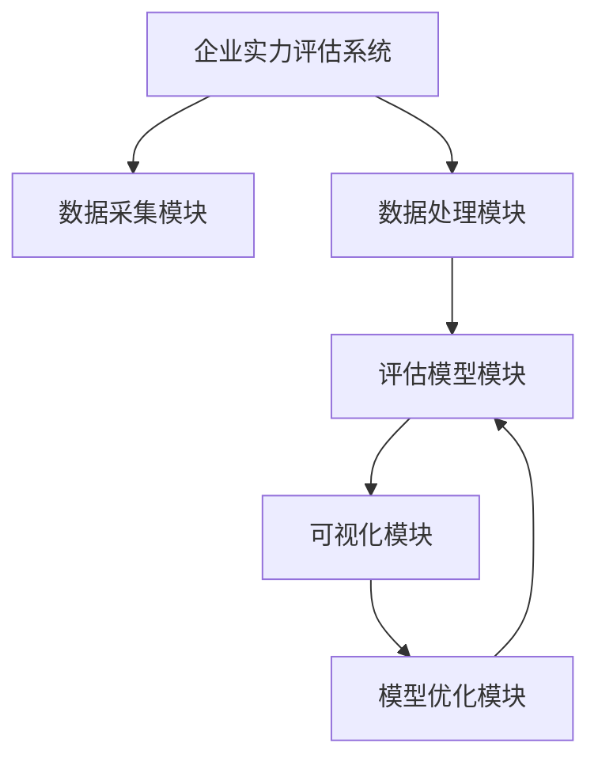

# 企业实力评估系统详细设计与具体代码实现

## 1.背景介绍

在当今商业环境中,企业实力评估系统扮演着至关重要的角色。它为企业提供了一种科学、客观的方式来衡量和评估自身的实力,从而制定更加明智的发展战略。随着市场竞争的日益加剧,企业需要及时了解自身的优势和劣势,以便做出正确的决策。传统的评估方式往往依赖于人工经验,存在着主观性和低效率的问题。因此,构建一个基于数据驱动的企业实力评估系统变得势在必行。

### 1.1 系统目标

企业实力评估系统的主要目标是:

1. 建立一个标准化的评估模型,客观地衡量企业在多个维度的表现。
2. 利用大数据和人工智能技术,实现自动化的数据采集、处理和分析。
3. 为企业提供可视化的报告和洞察,支持决策制定。
4. 持续优化和完善评估模型,提高评估结果的准确性和可靠性。

### 1.2 系统架构概览

企业实力评估系统采用模块化设计,主要包括以下几个模块:

1. **数据采集模块**: 从各种数据源(如财务报表、新闻媒体、社交媒体等)自动采集相关数据。
2. **数据处理模块**: 对采集到的原始数据进行清洗、转换和标准化处理。
3. **评估模型模块**: 基于机器学习算法构建评估模型,对企业实力进行综合评分。
4. **可视化模块**: 将评估结果以图表、报告等形式呈现,方便用户理解和分析。
5. **模型优化模块**: 根据实际评估结果和反馈,持续优化和完善评估模型。

## 2.核心概念与联系

在企业实力评估系统中,有几个核心概念需要理解:

### 2.1 评估指标

评估指标是衡量企业实力的关键因素,通常包括财务指标、运营指标、市场指标等多个维度。每个指标都对应一个具体的计算方法,用于量化企业在该维度的表现。例如,财务指标可能包括净利润、资产负债率等;运营指标可能包括产品交付周期、客户满意度等。

### 2.2 评估模型

评估模型是将各个评估指标综合起来,对企业实力进行打分的算法模型。常见的评估模型包括:

- **线性加权模型**: 对各个指标赋予不同的权重,然后线性相加得到总分。
- **逻辑回归模型**: 将企业实力看作一个二元分类问题(强/弱),利用逻辑回归算法进行建模。
- **决策树模型**: 根据各个指标的值,按照决策树的规则进行评分。
- **神经网络模型**: 利用神经网络自动学习各个指标与企业实力之间的复杂关系。

不同的模型有不同的优缺点,需要根据具体情况进行选择和调优。

### 2.3 数据采集

数据采集是构建评估模型的基础。企业实力评估系统需要从各种渠道(如财务报表、新闻媒体、社交媒体等)自动采集相关数据,以计算各个评估指标的值。数据采集过程需要解决数据源的异构性、数据质量等问题。

### 2.4 数据处理

原始采集到的数据通常是非结构化的、噪声较大的,需要进行数据清洗、转换和标准化处理,以满足评估模型的输入要求。数据处理阶段包括缺失值处理、异常值处理、特征提取、特征编码等步骤。

### 2.5 模型评估

构建好评估模型后,需要对模型进行评估,检验其准确性和泛化能力。常见的评估指标包括准确率、精确率、召回率、F1分数等。同时,也需要对模型进行解释性分析,了解各个指标对最终评估结果的影响程度。

### 2.6 模型优化

根据模型评估的结果,可以对评估模型进行持续优化,提高其准确性和泛化能力。优化方法包括特征工程、模型调参、集成学习等。同时,也需要根据实际应用场景和反馈,不断完善评估指标体系。

## 3.核心算法原理具体操作步骤

在企业实力评估系统中,核心算法主要包括评估模型算法和数据处理算法。下面分别介绍它们的原理和具体操作步骤。

### 3.1 评估模型算法

#### 3.1.1 线性加权模型

线性加权模型是最简单的评估模型,其原理是对各个评估指标赋予不同的权重,然后线性相加得到总分。具体步骤如下:

1. 确定评估指标集合 $X = \{x_1, x_2, \ldots, x_n\}$,其中 $x_i$ 表示第 i 个指标的值。
2. 为每个指标分配权重 $w_i$,满足 $\sum_{i=1}^{n} w_i = 1$。
3. 计算加权和作为企业实力评分:

$$
\text{Score} = \sum_{i=1}^{n} w_i x_i
$$

权重 $w_i$ 可以根据专家经验或历史数据进行设置。

#### 3.1.2 逻辑回归模型

逻辑回归模型将企业实力看作一个二元分类问题(强/弱),利用逻辑回归算法进行建模。具体步骤如下:

1. 将企业实力标记为二元标签 $y \in \{0, 1\}$,其中 0 表示实力较弱,1 表示实力较强。
2. 构建特征向量 $X = (x_1, x_2, \ldots, x_n)$,其中 $x_i$ 表示第 i 个评估指标的值。
3. 使用逻辑回归模型学习参数 $\theta$,使得给定特征 $X$ 时,模型输出的概率 $P(y=1|X; \theta)$ 最大化。
4. 对新的企业,计算 $P(y=1|X; \theta)$ 作为企业实力评分。

逻辑回归模型的优点是可以直接输出企业实力的概率值,并且具有一定的解释性。但是它假设各个指标之间是线性无关的,无法捕捉复杂的非线性关系。

#### 3.1.3 决策树模型

决策树模型根据各个指标的值,按照决策树的规则进行评分。具体步骤如下:

1. 构建特征向量 $X = (x_1, x_2, \ldots, x_n)$,其中 $x_i$ 表示第 i 个评估指标的值。
2. 使用决策树算法(如 ID3、C4.5 等)在训练数据上生成决策树模型。
3. 对新的企业,根据决策树的规则,从根节点开始逐步判断,直到到达叶子节点,将叶子节点的值作为企业实力评分。

决策树模型的优点是可解释性强,决策过程清晰透明。缺点是容易过拟合,并且对数据的噪声敏感。

#### 3.1.4 神经网络模型

神经网络模型利用神经网络自动学习各个指标与企业实力之间的复杂关系。具体步骤如下:

1. 构建特征向量 $X = (x_1, x_2, \ldots, x_n)$,其中 $x_i$ 表示第 i 个评估指标的值。
2. 设计神经网络结构,包括输入层、隐藏层和输出层。
3. 使用反向传播算法在训练数据上训练神经网络模型,调整网络权重。
4. 对新的企业,将其特征向量 $X$ 输入到训练好的神经网络中,得到输出层的值作为企业实力评分。

神经网络模型的优点是可以自动捕捉非线性关系,并且具有很强的拟合能力。缺点是模型的解释性较差,需要大量的训练数据。

### 3.2 数据处理算法

#### 3.2.1 缺失值处理

在原始数据中,常常存在缺失值的情况。处理缺失值的常见方法包括:

- **删除缺失值**: 直接删除包含缺失值的样本或特征。这种方法简单,但可能会导致信息损失。
- **均值/中位数/众数插补**: 用该特征的均值、中位数或众数来填充缺失值。这种方法适用于缺失值较少的情况。
- **K 近邻插补**: 使用 K 近邻算法,根据与缺失值样本相似的其他样本,估计缺失值。
- **模型插补**: 构建缺失值预测模型(如回归模型),根据其他特征预测缺失值。

#### 3.2.2 异常值处理

异常值是指偏离正常数据分布的极端值,它们可能是噪声或异常情况。处理异常值的常见方法包括:

- **3σ 原则**: 将超出均值 $\pm 3\sigma$ 范围的值视为异常值,进行删除或替换。
- **基于分位数的方法**: 将低于下四分位数 $Q_1 - 1.5 \times IQR$ 或高于上四分位数 $Q_3 + 1.5 \times IQR$ 的值视为异常值,其中 $IQR = Q_3 - Q_1$ 是四分位数距离。
- **基于聚类的方法**: 使用聚类算法(如 K-Means)将数据划分为多个簇,离簇心较远的点视为异常值。
- **基于隔离森林的方法**: 使用隔离森林算法,根据样本被隔离的难易程度判断是否为异常值。

#### 3.2.3 特征提取

特征提取旨在从原始数据中提取出对建模有用的特征。常见的特征提取方法包括:

- **统计特征**: 计算数值型特征的统计量,如均值、方差、最大值、最小值等。
- **文本特征**: 对文本数据进行分词、词袋模型、TF-IDF 等处理,提取文本特征。
- **时间特征**: 从时间戳中提取年、月、日、小时等时间特征。
- **组合特征**: 将多个原始特征进行组合,构造新的特征。

#### 3.2.4 特征编码

对于类别型特征,需要进行特征编码,将其转换为数值型特征,以满足机器学习算法的输入要求。常见的特征编码方法包括:

- **One-Hot 编码**: 将每个类别映射为一个独热向量。
- **标签编码**: 将每个类别映射为一个整数值。
- **目标编码**: 根据该特征值对应的目标值的均值或比例进行编码。
- **嵌入编码**: 将每个类别映射为一个低维稠密向量,通常与神经网络模型结合使用。

## 4.数学模型和公式详细讲解举例说明

在企业实力评估系统中,数学模型和公式主要用于构建评估模型和进行数据处理。下面将详细讲解一些常见的数学模型和公式,并给出具体的例子说明。

### 4.1 线性回归模型

线性回归模型是一种常见的监督学习模型,它试图学习出一个最佳拟合的线性函数,将输入特征映射到目标值。在企业实力评估系统中,线性回归模型可以用于建立评估指标与企业实力之间的线性关系。

设有 $n$ 个评估指标 $X = (x_1, x_2, \ldots, x_n)$,企业实力评分为 $y$,线性回归模型可表示为:

$$
y = \theta_0 + \theta_1 x_1 + \theta_2 x_2 + \ldots + \theta_n x_n
$$

其中 $\theta_0, \theta_1, \ldots, \theta_n$ 是模型参数,需要通过训练数据来估计。

通常使用最小二乘法来估计模型参数,即最小化以下目标函数:

$$
J(\theta) = \frac{1}{2m} \sum_{i=1}^{m} (h_\theta(x^{(i)}) - y^{"msg_type":"generate_answer_finish","data":"","from_module":null,"from_unit":null}