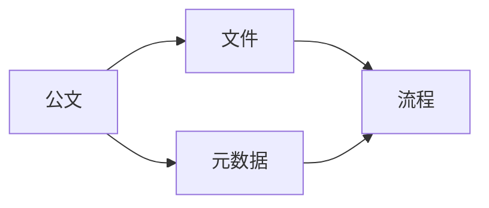

# 公文管理系统详细设计与具体代码实现

## 1. 背景介绍

在现代化办公环境中,高效的公文管理是保证组织运转顺畅的关键。传统的纸质公文管理方式存在诸多弊端,如查找困难、易丢失、存储空间大等。为了解决这些问题,开发一套功能完善、易于使用的公文管理系统势在必行。本文将详细阐述公文管理系统的设计思路和具体代码实现。

### 1.1 公文管理现状与问题

目前,很多单位的公文管理还处于比较原始的阶段,主要存在以下问题:

- 纸质文件容易丢失、损毁,保管不便
- 文件查找困难,效率低下
- 文件传递流程复杂,易出错
- 缺乏安全的访问控制机制
- 无法实现远程异地办公

### 1.2 公文管理系统的必要性

开发一套现代化的公文管理系统,可以有效解决上述问题,具体优势如下:

- 电子化存储,节省空间,方便检索
- 流程自动化,提高传递效率,减少错误
- 严格的权限控制,保障信息安全
- 支持异地远程办公,提升协同能力
- 提供丰富的统计报表功能,为领导决策提供数据支持

## 2. 核心概念与联系

在公文管理系统中,有几个核心概念需要理解:

### 2.1 公文(Document)

公文是指政府机关、企事业单位等组织在进行公务活动时形成的具有一定格式和法律效力的文书。公文具有传递信息、指导工作、证明事实、保障权益等作用。

### 2.2 文件(File)

文件是公文的载体形式,可以是纸质文件,也可以是电子文件。在公文管理系统中,我们主要处理电子文件。

### 2.3 流程(Workflow)

公文从产生到归档,要经历一系列环节,如拟稿、审核、批准、印发、接收、传阅等,这个过程就是公文流程。流程管理是公文管理系统的核心功能之一。

### 2.4 元数据(Metadata)

元数据是用于描述公文属性的数据,如公文标题、文号、密级、紧急程度、拟稿人、主送单位等。通过元数据,可以方便地对公文进行分类、检索和统计。

以上几个核心概念的关系如下图所示:



## 3. 核心算法原理具体操作步骤

公文管理系统涉及到几个核心算法,下面分别进行介绍。

### 3.1 全文检索算法

全文检索是指根据用户输入的关键词,快速查找出所有包含该关键词的公文。常用的全文检索算法有:

- 倒排索引:将文档中的词语抽取出来,建立词语到文档的映射关系。搜索时,根据关键词快速定位到包含它的文档。
- 布尔模型:用AND、OR、NOT等逻辑运算符将多个关键词组合成复杂的查询表达式,找出同时满足这些条件的文档。
- 向量空间模型:将文档和查询都表示成向量,通过计算向量之间的相似度来判断文档与查询的相关性。

以倒排索引为例,其基本步骤如下:

1. 文档预处理:对文档进行分词、去停用词、提取词干等操作,得到规范化的词语序列。
2. 建立词典:将所有文档的词语合并,去重,生成一个完整的词语列表,即词典。
3. 建立倒排表:对每个词语,记录下它出现过的所有文档,形成一个倒排列表。
4. 查询处理:用户输入查询词,在倒排表中查找相应的文档,将结果返回给用户。

### 3.2 文档相似度算法

在公文管理中,我们经常需要比较两个文档的相似程度,如检测重复公文、聚类分析等。常见的文档相似度算法包括:

- Jaccard相似度:用两个文档共有的词语数除以它们所有词语数之和,得到一个0到1之间的相似度值。
- 余弦相似度:将文档表示成词频向量,计算两个向量夹角的余弦值作为相似度。
- Simhash:给每个词语一个随机的哈希值,文档的Simhash值就是所有词语哈希值的加权和。然后比较两个文档Simhash值的海明距离来衡量它们的相似度。

以Jaccard相似度为例,其计算公式为:

$$
J(A,B) = \frac{|A \cap B|}{|A \cup B|}
$$

其中,$A$和$B$分别为两个文档的词语集合。

具体步骤:

1. 对两个文档分别进行分词,得到词语集合$A$和$B$。
2. 求$A$和$B$的交集,得到$|A \cap B|$。
3. 求$A$和$B$的并集,得到$|A \cup B|$。  
4. 代入公式,计算Jaccard相似度。

### 3.3 文档分类算法

为了方便管理和检索,我们通常需要将公文分成若干类别。常用的文档分类算法有:

- 朴素贝叶斯:基于贝叶斯定理和特征条件独立性假设,通过先验概率和条件概率来预测文档的类别。
- 支持向量机(SVM):将文档映射到高维空间,找到一个最大间隔超平面将不同类别的文档分开。
- 卷积神经网络(CNN):利用卷积和池化操作提取文本的局部特征,再通过全连接层完成分类。

以朴素贝叶斯为例,其基本原理为:

$$
P(c|d) = \frac{P(c)P(d|c)}{P(d)}
$$

其中,$c$为类别,$d$为文档。$P(c|d)$为在给定文档$d$的条件下,类别为$c$的后验概率。$P(c)$为类别$c$的先验概率。$P(d|c)$为在给定类别$c$的条件下,文档$d$出现的似然概率。$P(d)$为文档$d$出现的概率。

实际应用中,我们通常用训练集估计$P(c)$和$P(d|c)$,然后对新文档$d$,计算各个类别的后验概率,取最大者作为分类结果。

## 4. 数学模型和公式详细讲解举例说明

在公文管理系统中,我们经常需要用到一些数学模型和公式,下面以 TF-IDF 为例进行详细讲解。

TF-IDF 是一种用于评估词语在文档中重要性的统计方法。它由两部分组成:

- TF(Term Frequency):词频,表示词语 $t$ 在文档 $d$ 中出现的频率。
- IDF(Inverse Document Frequency):逆文档频率,表示词语 $t$ 在整个文档集合中的稀有程度。

TF 的计算公式为:

$$
TF(t,d) = \frac{f_{t,d}}{\sum_{t' \in d} f_{t',d}}
$$

其中,$f_{t,d}$为词语$t$在文档$d$中的出现次数,$\sum_{t' \in d} f_{t',d}$为文档$d$的总词数。

IDF 的计算公式为:

$$
IDF(t) = \log \frac{N}{n_t}
$$

其中,$N$为文档总数,$n_t$为包含词语$t$的文档数。

TF-IDF 的计算公式为:

$$
TFIDF(t,d) = TF(t,d) \cdot IDF(t)
$$

举个例子,假设我们有以下三个文档:

- $d_1$: "This is a sample"
- $d_2$: "This is another example"
- $d_3$: "One more sample"

对于词语"sample",我们可以计算:

- $TF("sample",d_1) = \frac{1}{4} = 0.25$
- $TF("sample",d_3) = \frac{1}{3} = 0.33$
- $IDF("sample") = \log \frac{3}{2} = 0.176$
- $TFIDF("sample",d_1) = 0.25 \times 0.176 = 0.044$
- $TFIDF("sample",d_3) = 0.33 \times 0.176 = 0.058$

可以看出,"sample"在$d_3$中的重要性高于$d_1$。这是因为尽管它在$d_1$中出现的频率较高,但在整个文档集合中比较常见,区分度不高。而在$d_3$中虽然频率较低,但在其他文档中很少出现,因此更能体现$d_3$的特点。

在公文管理系统中,我们可以用 TF-IDF 来表示公文,然后进行相似度计算、聚类、分类等操作。

## 5. 项目实践:代码实例和详细解释说明

下面我们通过一个简单的代码实例,演示如何用 Python 实现公文管理系统的部分功能。

### 5.1 环境准备

首先,我们需要安装一些必要的第三方库:

```bash
pip install jieba gensim numpy
```

其中:

- jieba:中文分词工具
- gensim:主题模型和文档相似度计算工具
- numpy:数值计算库

### 5.2 数据准备

我们准备了一些示例公文,存放在 data 目录下,每个文件代表一篇公文。

### 5.3 代码实现

```python
import os
import jieba
from gensim import corpora, models, similarities

# 1. 读取数据
def load_data(data_dir):
    documents = []
    for file in os.listdir(data_dir):
        with open(os.path.join(data_dir, file), 'r', encoding='utf-8') as f:
            documents.append(f.read())
    return documents

# 2. 分词
def tokenize(documents):
    return [jieba.lcut(doc) for doc in documents]

# 3. 创建词典
def create_dictionary(tokens):
    dictionary = corpora.Dictionary(tokens)
    return dictionary

# 4. 创建语料库
def create_corpus(tokens, dictionary):
    corpus = [dictionary.doc2bow(token) for token in tokens]
    return corpus

# 5. 训练 TF-IDF 模型
def train_tfidf(corpus):
    tfidf = models.TfidfModel(corpus)
    return tfidf

# 6. 创建相似度矩阵
def create_similarity_matrix(corpus, tfidf):
    index = similarities.SparseMatrixSimilarity(tfidf[corpus], num_features=len(dictionary))
    return index

# 7. 查询相似文档
def query_similar_documents(query, dictionary, index):
    query_bow = dictionary.doc2bow(jieba.lcut(query))
    query_tfidf = tfidf[query_bow]
    sims = index[query_tfidf]
    return list(enumerate(sims))

if __name__ == '__main__':
    data_dir = 'data'
    documents = load_data(data_dir)
    tokens = tokenize(documents)
    dictionary = create_dictionary(tokens)
    corpus = create_corpus(tokens, dictionary)
    tfidf = train_tfidf(corpus)
    index = create_similarity_matrix(corpus, tfidf)

    query = '关于加强公文管理工作的通知'
    results = query_similar_documents(query, dictionary, index)
    print(f'与"{query}"最相似的文档为:')
    for doc_id, sim in sorted(results, key=lambda x: x[1], reverse=True):
        print(f'文档{doc_id}, 相似度{sim:.4f}')
```

代码说明:

1. load_data 函数读取指定目录下的所有文件,返回文档列表。
2. tokenize 函数对文档列表进行分词,返回词语列表的列表。
3. create_dictionary 函数根据词语列表创建词典,词典中包含了所有唯一的词语及其编号。
4. create_corpus 函数根据词语列表和词典创建语料库,语料库是一个稀疏向量的列表,每个稀疏向量代表一篇文档。
5. train_tfidf 函数在语料库上训练 TF-IDF 模型。
6. create_similarity_matrix 函数根据语料库和 TF-IDF 模型创建相似度矩阵,用于后续的相似度查询。
7. query_similar_documents 函数接受一个查询字符串,返回与之最相似的文档列表及其相似度。

运行该程序,我们可以得到与查询最相似的文档排序结果,为后续的公文检索和推荐提供支持。

## 6. 实际应用场景

公文管理系统可以应用于以下场景:

### 6.1 政府